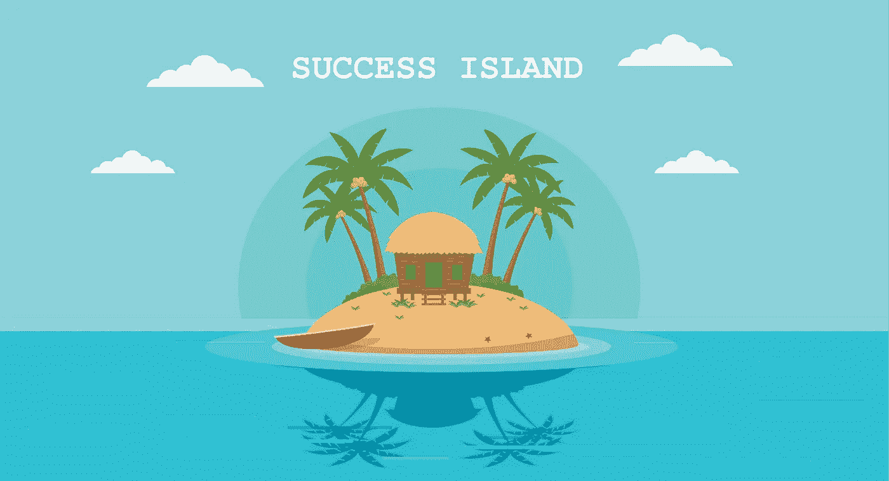

# 一个关于创业失败的童话故事(以及失败的原因)

> 原文：<https://medium.com/swlh/a-fairy-tale-about-startups-that-failed-and-why-a014585441c8>

闭上眼睛，画一幅浩瀚大海中的孤岛的图画。想象一下热带水果植物像天篷一样覆盖了半个岛屿，平静的亚麻金色海滩，海浪轻轻地淋湿了沙滩，大海点燃了自己的交响乐，蔚蓝的天空点缀着小小的棉花云。这个岛叫做**成功**。

海那边的生活很有趣。你可以看到许多人聚集在海边。血液在他们的血管中沸腾，他们的肌肉准备战斗。你可以感觉到他们聚集在那里是有原因的。那些人是*创业公司*，他们有一个目标:**到达这个岛。**

一些人开始学习游泳。他们读书，向他人寻求建议，研究奥运冠军的成功故事，购买泳衣和浮潜。他们从不接触水。但是当他们跳进海里，他们淹死了。

另一些是职业游泳运动员，他们迅速跳入水中。当他们快要到达小岛时，一只巨大的鲨鱼出现并吃掉了他们。

另一组开始造船。有些人砍树，有些人砍柴，有些人给它一个形状，有些人管理工作。为了有效和快速地到达目的地，团队中的每个人都得到了一只桨。当船准备好了，每个人都上了船，船驶向小岛。但是船几乎没有前进，因为每个人都在朝不同的方向划桨，船被卡住了。

看到前面的失败，一群人开始建造一艘船。他们花了很多时间来完成这项工程，但是他们确信无论是风还是鲨鱼都不会阻挡他们成功的脚步。他们还没走完一半的路程，船就耗尽了燃料，被困在了海中央。

第五组想出了一个不同寻常的解决方案:制作一个气球。首先，团队得到适当的培训，有资格建立气球，并在他们得到所有必要的材料。最后，他们在空中飞着，离目的地越来越近。突然，一阵强风袭来，气球改变了方向，再也没有到达小岛。

现在让我们分析每组失败背后的原因:

1.  这些初创公司在产品开发上投入了大量的时间。他们对这个过程如此着迷，以至于他们不会停下来评估。这是遵循瀑布模型的创业公司的典型场景。他们最后得到的是一个人们不想要的产品。
2.  职业游泳运动员是那些已经开发出每个人都想要的伟大产品的创业公司。但是你猜怎么着，他们创造了市场上已经存在的东西，没有创新。然后他们被对手击倒，退出比赛。
3.  造船初创公司经验丰富，提供独特的解决方案。然而，他们面临一个共同的错误:管理不善。
4.  造船初创企业是那些有相当大机会到达这个岛屿的企业:他们具有良好的管理技能，善于创新，他们计划并衡量风险，最重要的是，他们提供独特的产品。然而，他们耗尽了燃料。燃料可以是财务资源，因为他们将大部分资金投入到产品开发中，也可以是缺乏持续创新。
5.  第五组的情况与造船厂非常相似:独特的产品，有组织和训练有素的团队，足够的资源用于进一步开发和创新。但是他们的解决方案并不好。因为它们不灵活。这是失败的另一个常见原因，因为当一个产品推出后，客户不认可它，创业公司不够灵活，无法拿出更好的版本。

你可能已经猜到了，这是一些原因，但肯定还有很多原因。与其他类型的企业不同，初创企业风险很大，通常只有十分之一的企业会登陆成功岛。但是这不应该阻止你前进。请记住灯泡发明者的这句激励人心的话:

> “我没有失败。我刚刚发现了 10000 种行不通的方法”——托马斯·爱迪生

## 这个故事发表在 [The Startup](https://medium.com/swlh) 上，这是 Medium 最大的企业家出版物，拥有 289，682+人。

## 订阅接收[我们的头条](http://growthsupply.com/the-startup-newsletter/)。

