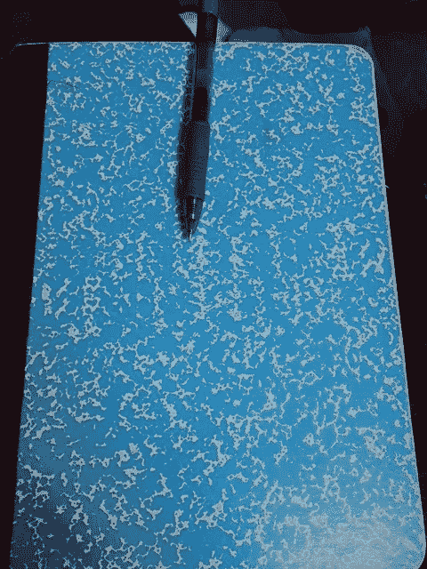
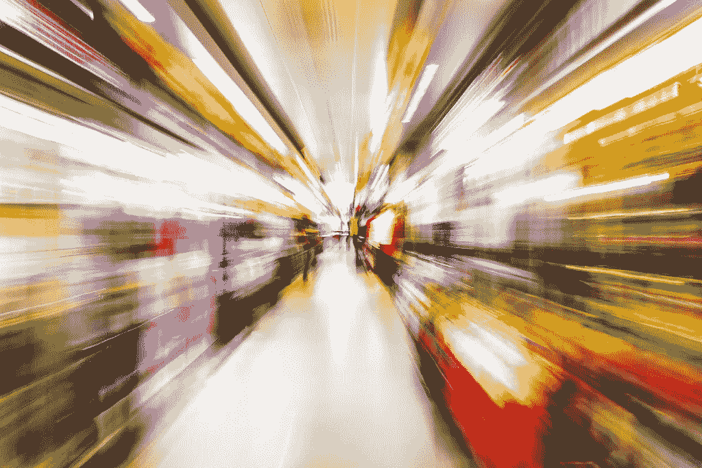
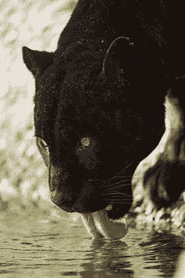
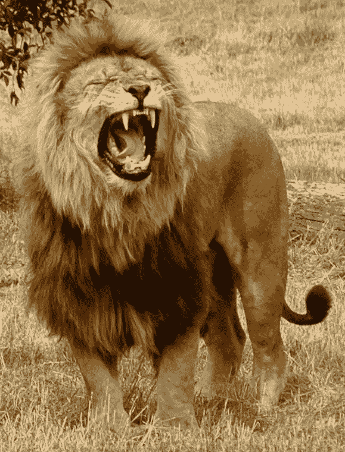
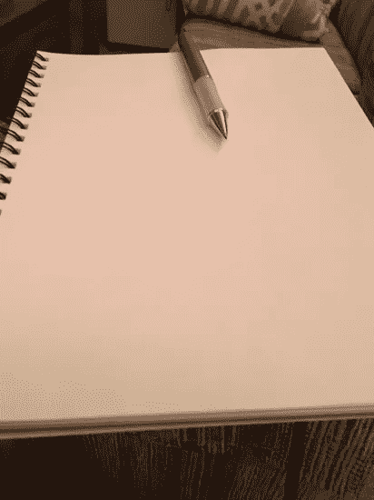
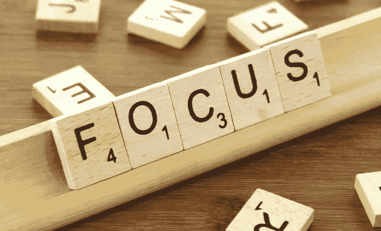
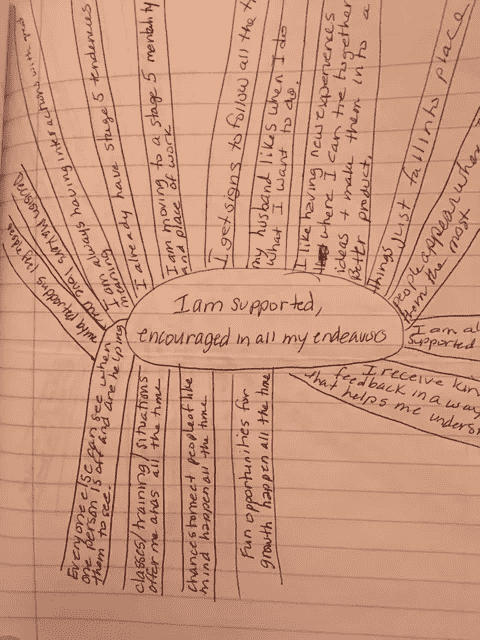
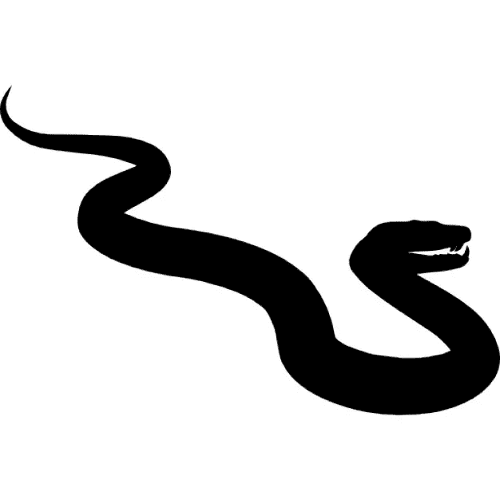

# 几周前，我发表了我的一个更受欢迎的故事，“我一直在凌晨 3:05 醒来”，…

> 原文：<https://medium.com/swlh/a-few-weeks-ago-i-published-one-of-my-more-popular-stories-ive-been-waking-at-3-05-am-feb0ee5f209>

Any notebook works.

# 显然，写日志有很多追随者——我以前并不知道。

我报名参加了 2018 年本杰明·p·哈迪(Benjamin p . Hardy)的 52 周动量课程，我们需要立即开始早晚的例行活动，写日志对我来说就是这样。

我发现了*的直接利益*，而且它们还在继续。我的一些读者要求更新，所以这是我的继续故事。

【2018 年 1 月日志——摘自 32 条真知灼见中的一些。

如果你是第一次读这篇文章，想看看这一切是从哪里开始的，请看我的第一篇日志故事[这里](/swlh/ive-been-waking-up-at-3-05-a-m-almost-every-morning-now-for-more-than-two-weeks-5fe3a53fe89a)。

每天晚上，我都把我的日记本放在身边，并附上我的笔，等待着。

对我来说，我晚上的例行公事为我早上做准备，我早上的例行公事为我新的一天做准备。我做的事情之一是在睡觉前写下一个问题，等待灵感/源能量/我的潜意识报告进来。

> 一月份，我收到了 32 条不同的信息。(有几次我醒来两次，都是一条信息。有几次因为睡眠不足，我收不到任何信息。)

现在，当我睡觉的时候，我会很兴奋，想着我会在清晨收到什么信息。

(自我提醒——这对睡眠困难的孩子有用吗？让他们提出一个问题，让他们写下来，或者在醒来时告诉妈妈或爸爸。)

**洞察#13 续…**

Insight 13

在我的上一个故事中，我被留在《洞察》(insight)中摇摆不定，我推着我的病床向前，穿过一片田野，走向一个看不见的目的地。我们很多人都这样做。我们正走向未知的未来。我右边稍微靠后的地方有动静，这让我很焦虑。我们存放床的谷仓正在被拆除。

几周前我还不知道这种顿悟是什么意思。从那以后我就想通了。

我认为床代表了我们的生活。(在美国，我们大多数人出生在医院的病床上，在医院的病床上离开这个世界。)我们推着床往前走的线条代表了人性，代表了我们对生活的体验。巨大的谷仓(在轮子上)代表了我开始这个课程之前的遮蔽。看到谷仓被移动，有点不协调。我们知道搬运它的人；所以我们知道它没有被偷。他们有工作要做，并按照指示行事。我们没有料到会发生这种事。

[http://maxpixel.freegreatpicture.com/Together-Romantic-Shelter-England-Rain-Couple-2353879](http://maxpixel.freegreatpicture.com/Together-Romantic-Shelter-England-Rain-Couple-2353879)

生活充满了惊喜。当我们开始新的冒险，当我们挑战自己；可能会不和谐。当我们试图做出改进时，起初我们会感到不舒服，感觉暴露了，就好像我们的避难所消失了一样。

拆除谷仓是一个警钟，一旦我们开始了旅程，我们就再也不会回到那个地方。有趣的是，避难所的移动方向与我们相同，但速度要快得多，因为有一整个团队在移动它。

我想这意味着我们一路得到了帮助。

**本月晚些时候的重要消息-**

自从开始写日记以来，我发现，见解、想法和可能性的暗示正快速而猛烈地向我袭来。

[https://c1.staticflickr.com/3/2811/10142836294_f5d561717b_b.jpg](https://c1.staticflickr.com/3/2811/10142836294_f5d561717b_b.jpg)

平衡对我来说是个大问题。有这么多机会，很难决定我把时间花在哪里。**我对《洞察》杂志第 14 期的问题是，*我如何在这么多我想完成的事情中找到平衡？***

跟我走一会儿。

几年前，我在佛蒙特州伍斯特的高地健康与康复中心参加了一个打鼓课程。苏·杰米森是一位出色的老师。打鼓有一种感觉，可以让一个人进入大脑中用其他方式可能无法进入的区域。我认为这是人们冥想时进入的同一个地方。甚至在我第一次打鼓的时候，我就能够“旅行”到另一个地方。

(当我写这篇文章时，我觉得 journal 这个词中包含了 journal 这个词，这很有趣。当我们走出日常生活时，有很多方法可以获取信息。)

第一次旅行时，使用萨满的鼓声，他们必须用一点想象力来开始，但在旅程中的某个时刻，真正的信息和经历出现了。在这一点上，个人意识到这种体验是真实的，因为这是他们无法想象的。

就我而言，我发现自己正走在丛林中的一条路上，一辆黑豹出现在我面前。

[https://1234wayanad.wordpress.com/2015/08/20/the-black-panther-of-sivanipalli-tracing-the-steps/](https://1234wayanad.wordpress.com/2015/08/20/the-black-panther-of-sivanipalli-tracing-the-steps/)

我从来没有想过。

当然，我有逃跑或恐惧的时刻，但他的行为是这样的，我直觉地说，*来吧，让我们越过这个*，我立即平静下来。

黑豹转过头，回头看着我，好像在说*跟我来，*我照做了。

我们沿着小路一直走到一个泻湖。黑豹游过去，爬上一些岩石，等我。我必须告诉你，特别是因为我不知道我在哪里，想到要下水让我有点紧张。我喜欢游泳，所以那不是问题。

我年轻的时候看过一个国家地理类型的节目，我亲眼目睹了食人鱼对一只过河的水牛做了什么。食人鱼栖息在湖泊、支流、湿地、小溪和被洪水淹没的森林中。我害怕水里的食人鱼。

自从通过了游泳课，我就知道要和一个伙伴一起游泳，并且知道一个人将要游泳的地方的情况。

我对这片水域一无所知。据我所知，如果食人鱼不在这个地方栖息，那么大型水蛇或鳄鱼可能会在这里栖息。

你明白我的意思了吗？我的想象力永远不会让我陷入失控的境地。

所以，我现在是在鼓声的背景下旅行。这是黑豹和我。他终于站了起来，好像在说:“我必须过来接你吗?”我对自己说，他没有被食人鱼吃掉，也没有被蛇缠住，我不知道我在哪里，他似乎有一个计划，所以我决定以最快的速度游到对岸。

我跟着他爬上岩石，他消失在瀑布后面。好吧，酷。我明白了。我内心的孩子喜欢秘密的藏身之处。在瀑布后面的一个火坑的内部，有一圈石头。我有一种感觉，他们像是在开一个长老会议。黑豹坐在一块石头上。当我环顾四周，并进一步深入这个洞穴时，有一个细长的椭圆形开口，从这里可以看到远处的大草原和山脉。

我没多想，但注意到了我刚穿过的丛林和另一边的大草原之间的区别。我觉得这很奇怪。我对它没有真正的兴趣。那时，黑豹是我关注的焦点。他坐在岩石上看着我。他似乎是一个顾问或向导。我的旅程就这样结束了。我们被召回了。

快进几年。我参加了一个最大输家的比赛。我每天消耗大约 750 卡路里，每天锻炼三个小时。我中断了练习，早上做了一个半小时，下班后又做了一个半小时。当时是下午晚些时候。我一下班就去了健身房。我的教练希望我从跑步机上的快走改为慢跑。我筋疲力尽。我在比赛中途。我只能步行。

每次教练走开，我都会降低跑步机的速度和倾斜度。不是我想，而是我不得不。在我的头脑和心里，我一直祈祷有人能帮助我。我需要能量。我拼命想减肥，我想赢得比赛。几乎到了绝望的地步，快要流泪的时候，一个声音把我从绝望中摇了出来。我以为它来自跑步者正在观看的众多电视中的一台。我无法缩小范围。毫无疑问，这是狮子的吼声。

Roar of a Lion

你要知道；声音如此之大，以至于我从疲惫中惊醒。被巨大的轰鸣声惊呆了，我抬起头环顾四周，看看是否还有其他人听到了声音。每个人都在自己的空间里做自己的事。我想知道它是从哪里来的。我到处在找。突然，那个强大的野兽走到我面前，坐在我的跑步机前面。他是黄褐色的，有着浓密的鬃毛和一张大嘴。当他再次咆哮，然后消失时，我可以看到他的牙齿。让我告诉你。我突然有了能量，我想在那台跑步机上跑步！

所以，让我们回到**洞察号 14** 。在我的闪光场景中，我发现自己漫步在动物中间的大草原上。他们一边看着我走，一边盯着我。就好像我是丛林之王。然后我突然想到。**我是狮子。**我全都想起来了——我多年前的第一次打鼓经历，在那里我遇见了黑豹，洞穴后面的巢穴，大草原，我知道那个巢穴是我的。

我想到了潮湿的丛林和瀑布，我想到了干旱的草原。我想到了黑豹和狮子的二元性。黑豹在晚上捕猎，它们融入黑暗之中；狮子在白天猎食，与青草融为一体。我考虑了昼夜、水和大地的二元性。

我既是黑豹又是狮子。

快进到 2004 年。Rosemary Altea，灵媒推出了一款名为[灵魂迹象的传呼机:你精神命运的基本指南](http://www.lulu.com/shop/rosemary-altea/soul-signs/paperback/product-23214133.html)。我读了这本书，和罗斯玛丽一起上课，我发现我是一个猎人灵魂。

黑豹和狮子是强大、敏捷的猎手，也是家族的保护者。

Always have something ready to write on and with.

写日记把你生活中不同的事情联系在一起。它描绘了一条道路，它提供了确认，并用新的机会诱惑你。

**回到第 14 条真知灼见**——我想起了刚刚听的一个关于亚伯拉罕-希克斯的 YouTube 视频。亚伯拉罕讲述了以斯帖希望已故的杰里在她上台前移动窗帘的故事。(换句话说——给我证明你在这里。)在思考《洞察#14》中向我展示的所有组件时，YouTube 视频提醒了我——我们得到了支持，我们得到了帮助，而且“幕后”发生的事情比我们知道的要多得多。

还记得我的问题吗？我如何在这么多我想完成的事情中找到平衡？我得到了“专注”这个词，作为我关于平衡我被给予的所有事物的问题的答案。

**洞察 19** —信息中说专注是我的力量。对一个主题的关注会给我想要的东西。

我今天早上写道，也许一月初出现在我面前的化身应该在她背上的斗篷上印上“聚焦”这个词。

洞察 17 让我做了三个[对焦轮](https://youtu.be/zTtnrHee3HA)作为我早上例行工作的一部分。我感到有力量和活力来开始我的一天。

正如我之前提到的，自从写日志以来，我经历了太多的消息。

**一月份的 31 天里，我收到了 32 条短信。**

另外四个观点非常有趣，对其他人也有好处。

洞察力 27——梦想——我有一个孩子，当他蹒跚学步时，我有一个婴儿送礼会。

我认为这意味着婴儿代表着新生，(新的想法，新的创造)，但婴儿送礼会表明我可能在几年内不会被他们认出来。这种特定的闪光洞察力类似于我在之前的帖子中谈到的一个梦——关于驾驶单引擎或双引擎飞机的梦。

Insight 30 在凌晨 4 点 14 分进入。前一天，我收到了一封电子邮件，说有人被我非常想要的工作选中了。我知道我会在这方面表现出色，但有时人们已经被安排到不同的位置上，机构知道他们心中有人选就走过场。其他时候，时机不对。我必须相信宇宙在帮助我实现我想要的一切。这仍然没有减少失望。

Source gives answers in metaphors too.

**这个信息就像又大又肥又多汁的蓝莓，从长满苔藓的绿色植物中长出来，从岩石上长出来。我认为这意味着好事可以在看似不可能的情况下成长。丰满的蓝莓感觉很丰富。有很多蓝莓。我感觉到一个乘数效应在起作用。绿色的苔藓如此生机勃勃。我想到了肥沃的土地和营养。我想我正在为许多好事的到来打下基础。**

我要分享的最后一条信息是这样说的:

**洞察力 25 —“这不是自助，而是联系。”**

接下来是比利·周的歌——告诉她。那首稍有变奏的歌是唱给我听的。

告诉她这件事

告诉她你所有疯狂的梦

给他们一些关注，这样你就知道他们是认真的。

*时不时你会变得令人担忧，*

因为你太久没有去拜访他们了。

虽然你可能什么也没做

当他们离开的时候，那会是你的安慰吗？

这个梦对我来说意味着，我的梦想并不疯狂，但我必须关注它们并采取行动，否则它们就会消失。也许机会会消失。

洞察力 32 带来了一个警告。它以蛇的形式出现。

Control, clarity and focus will save you from a life that is strangled.

一条又大又粗的蟒蛇闯进了大楼，当时我们一群人正在舞池里庆祝。在房间的黑暗角落里，它悄悄地溜进来，音乐淹没了任何有人可能听到的噪音。没有人注意到椅子在动。它几乎绕了我们一圈，把我们赶到了中间。它打算把自己包裹在我们周围；窒息我们的生命。

我在生活中培养了控制力、清晰度和专注度。这些属性让我在我的环境中有了更强的意识——它们让我抓住机会，或者看到墙上写的需要我注意的东西。房间里的大多数其他人只是在经历人生的运动。如果他们在外面呆得很晚，或者喝得太多，都没有关系，因为明天将和前一天一样，他们可以睡得很晚。

虽然我没有看到椅子移动，但我感到一种不安。我知道是时候离开了。我有一个计划好的生活。我的就寝时间快到了；我有第二天的计划，我一直在说再见。不像其他熬夜的人，我的时间表在我的控制之下；我没有喝太多，我知道。正因为如此，我才得以逃脱，而其他人就没那么幸运了。

# 重点、控制和清晰是关键。

所以，你看，信息和洞察力以各种方式出现。相信它。作为接收者，我也是密码破译者。有些信息相当清楚，而其他的，比如医院的病床，则需要更多的洞察力。

如果你从来没有尝试过写日记，那就帮你自己一个忙，今晚试试吧。把那张纸放在你的床边。问一个问题，看看答案和你的生活有什么联系。

答案可能并不简单。这可能是一个比喻。

我很想听听你的经历。

*如果这个故事引起了你的共鸣，请分享它，并疯狂地、毫无保留地拍起手按钮，这样别人也能看到它。*

## 这篇文章发表在[《创业](https://medium.com/swlh)》上，这是 Medium 最大的创业刊物，有 293，189+人关注。

## 在这里订阅接收[我们的头条新闻](http://growthsupply.com/the-startup-newsletter/)。

