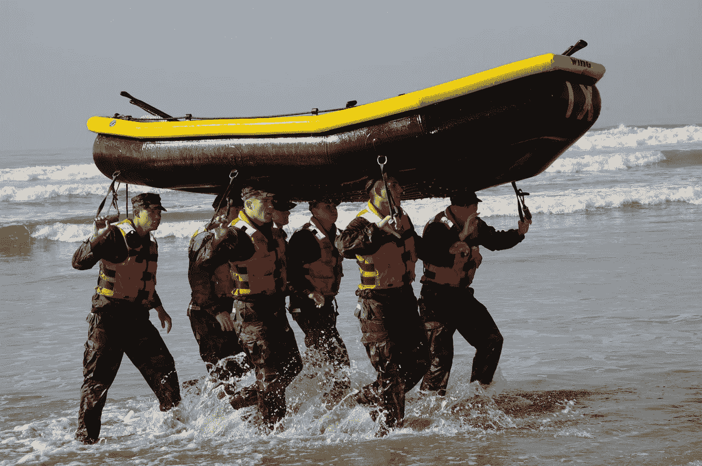

# 前海军海豹突击队在控制恐惧

> 原文：<https://medium.com/swlh/a-former-navy-seal-on-mastering-fear-76436f4ced81>

2018 年，媒体继续用粗线条描绘创业。很容易浏览[《快公司》](https://medium.com/u/ada2289350de?source=post_page-----76436f4ced81--------------------------------)、[杂志](https://medium.com/u/46743f60507f?source=post_page-----76436f4ced81--------------------------------)或[福布斯](https://medium.com/u/3126f7dd42c1?source=post_page-----76436f4ced81--------------------------------)的封面，就能看到所有那些凭借自己的公司“大获成功”的企业家。

话虽如此，但对创业的普遍认知往往是不准确的。

> 众所周知，创办和运营一家公司非常困难。

无论您是试图说服明星开发人员为您工作，还是处理几个客户的严格要求，您都在不断地尝试灭火。

然而，尽管创业面临实际挑战，但心理挑战可能同样难以应对(甚至更加难以应对)。

> 在这里，我具体说一下**恐惧**。

恐惧会让你放弃行动，即使是在仔细评估了风险和回报之后。

恐惧会让你选择“安全”的道路，而不是“危险”的道路，即使你意识到“危险”的道路会让你成长——无论是个人成长还是职业成长。

恐惧会让你想"*为什么是我？*“而不是”*为什么不是我？*

所以作为企业家，当我们着手建立自己的企业时，我们怎么能想到恐惧呢？

为了最新一集的[*，*](http://www.thepowerofbold.com)*我采访了布兰登·韦伯，他是前海军海豹突击队，[飓风小组](https://hurricane.media/)的创始人，也是一本名为 [*驾驭恐惧*](https://www.amazon.com/dp/B078GCNNWX/) 的优秀新书的作者。*

> *你可以在 [iTunes](https://itunes.apple.com/us/podcast/episode-30-former-navy-seal-brandon-webb-on-mastering-fear/id1240586023?i=1000420326537&mt=2) 、 [Google Play](https://play.google.com/music/m/Dau5odhtqbyjr7gg4dq5pgtfbyi?t=Episode_30_Former_Navy_SEAL_Brandon_Webb_on_Mastering_Fear-The_Power_of_Bold) 、 [Spotify](https://open.spotify.com/episode/1NHduUaEuR7kgtgqFGDJIJ?si=ZXbaSYujSsSmk8u_pgdq0g) 或 [Stitcher](http://www.stitcher.com/s?eid=56392010) 上找到我和布兰登的完整对话。*

> *在他的职业生涯中，布兰登一直在挑战自己的身体和精神极限。*

*他通过了海军海豹突击队训练的考验——这可以说是世界上最艰苦的军事训练。*

*他躲过了许多危险的遭遇，包括在阿富汗被敌军包围的时刻。*

*他从第一次创业失败中恢复过来，开始了第二次创业，现在生意兴隆。*

*可以肯定地说，他一生中遇到过许多大大小小的恐惧。虽然我们中的大多数人永远不会遇到盯着枪杆子的恐惧，但我们可以从他的经历中获得很多见解，并在面对自己的恐惧时使用它们。*

*对于布兰登的职业生涯和处理恐惧的框架的完整讨论，我建议听完整集或拿起布兰登的书。*

*话虽如此，以下是我从与布兰登的讨论中总结出的一些要点。*

## *恐惧无处不在*

*布兰登的简历可以拍成电影。*

*十几岁时，布兰登被父母赶出家门。*

> *唯一的问题是他的房子是一艘帆船。*

*布兰登离开了他在塔希提岛的父母，他“害怕得要死”，加入了一个返回美国的摄制组。他最终到达了加利福尼亚，学会了如何独自成为一名青少年。*

*几年后，布兰登加入了海军，并进入海军海豹突击队训练。在 220 名候选人的班级中，他是 7 个月后毕业的 23 人之一。*

*他加入了海豹突击队第三小队，在中东有过几次战斗部署。之后，他是重新设计的海军特种作战狙击计划的主要设计师之一，该计划显著降低了整体辍学率。*

*离开军队后，布兰登开始了一项失败的事业。他找到了一份他喜欢的稳定、高薪的工作。然而，他辞去了那份工作，共同创建了 Sofrep.com，成为飓风小组的一部分。*

*人们可能很容易认为布兰登已经给自己接种了恐惧，因为他在整个职业生涯中都面临着极其激烈的情况。然而，布兰登承认，在他今天的创业生涯中，他仍然每天都面临恐惧，甚至是强烈的恐惧。*

> *恐惧甚至会影响到那些在他们领域绝对的大师。*

*如果你让我说出一个我认为无所畏惧的人，我会说是迈克·泰森。在他的全盛时期，迈克会在对手进入拳击台之前恐吓他们。*

> *但是如果你在看迈克的内部对话，你会感觉到一个不同的故事。*

*在 2008 年的纪录片 [*泰森*](https://en.wikipedia.org/wiki/Tyson_(2008_film)) 中，迈克解释了他走出更衣室面对对手时的思维过程。*

*”*当我出来的时候，我有无上的信心，但我怕得要死。我完全害怕了。我害怕一切。我怕输，我怕丢脸……”**

*然而，随着迈克越来越靠近拳击台，他的信心也在不断增强。尽管恐惧不一定会消失，但对自己和自己能力的信心战胜了恐惧——通常情况下——他会赢得这场斗争。*

*最终，布兰登说，声称自己无所畏惧的人要么是在撒谎，要么是疯了。*

*假设你不是以上两者之一，你将会经历恐惧。恐惧可以每天甚至每小时打击你，并阻止你达到目标。*

*虽然你的恐惧可能会变得不那么强烈，但它并没有完全消失。*

> *而当你真正去想的时候，你并不想完全消除恐惧。*

*恐惧让我们活着。恐惧迫使布兰登在完成军队的自由落体训练之前，再次检查他的装备。恐惧可以阻止你鲁莽行事或犯下灾难性的错误，无论是在你的职业生涯还是个人生活中。*

*也就是说，当恐惧阻止你追求一个没有生命危险或者灾难性的机会时，那就是你需要做出决定的时候了。你需要回答以下问题:*

> *你会将恐惧视为朋友还是敌人？*

*回答这个问题将大大有助于决定你是否能越过任何阻碍你实现目标的精神障碍。虽然你可能会和与你处境相同的人或追求相似目标的人有同样的恐惧，但你对那种恐惧的 反应方式将会把你和其他人区分开来。*

## *陷入恐惧*

*你可能会想:*

> *“这听起来很棒。但是我怎样才能利用恐惧为我所用呢？我怎么能把恐惧视为朋友而不是敌人呢？”*

*正如我们刚刚讨论的，恐惧是不可避免的。会有这样的时刻，你需要完成一些任务来实现你的目标，而一个巨大、肥胖的恐惧怪物正挡在你的路上。*

*在这些情况下，恐惧怪物触发了我们的战斗或逃跑意识。从那以后，就很容易退缩并停留在我们的舒适区。*

*布兰登说，克服恐惧不是变得更强、更坚韧或更坚忍。这是关于学习如何识别和改变你头脑中的对话。*

> *我们认为恐惧是敌人。我们的目标是不顾后果，尽快消灭敌人。*

*正因为如此，改变我们对恐惧的看法很重要。我们需要 ***利用*** 恐惧来推动我们朝着我们想要的方向前进，而不是让恐惧成为我们生活中的一个限制因素。*

*你可以把每一种恐惧想象成一支指向你目标的箭。这是通向奖品的路标。*

*正如布兰登的朋友[卡迈勒·拉维坎特](https://medium.com/u/87bca520d81a?source=post_page-----76436f4ced81--------------------------------)所说:“*如果某样东西让我害怕，那就意味着另一边有魔法**

*你的恐惧让你去追求你想要的东西。面对恐惧时你感受到的电荷？把它想象成指引你走向目标的兴奋的嗡嗡声。*

*欢迎这个消息。当回顾你的生活和成就时，你会记得那些你接受那种兴奋并利用它的时刻。*

*直面恐惧会带来巨大的满足感。更好的是，当你在旅途中面临新的恐惧时，你可以用这种满足感作为依靠。*

*这几乎就像一项复利投资。*

*因此，虽然这非常不舒服，但如果你倾向于并拥抱恐惧，而不是回避恐惧，你会更满意。*

> *把它当成资产而不是负债。*

## *知道什么是重要的*

*即使我们知道恐惧引导我们达到目标，恐惧仍然很难处理。*

*通过研究他和他朋友的经历，布兰登开发了一个五条腿的框架，当我们在生活中遇到一些恐惧时，我们可以使用它。他的框架的五个组成部分是*决定、排练、放手、开始，以及知道什么是重要的*。*

*所有这些步骤都很重要。然而，布兰登认为，知道什么是重要的是这个过程中极其关键的——可以说是最重要的——部分。*

*这是为什么呢？*

> *了解生活中重要的事情有助于正确看待事情。这有助于重塑你的思维。*

*通过了解生活中对你来说什么是重要的，你就可以确定在你和实现你想要的生活之间有什么障碍。如果这个障碍是一种恐惧(很可能是)，那么理解你真正的价值观并努力按照这些价值观生活将是你的基石，这会让你的恐惧看起来不那么可怕。*

*例如，我们大多数人都遇到过对未知事物的恐惧。这是最难应对的恐惧之一，因为它的抽象本质。*

> *我们的思想可以去一些疯狂的地方。*

*比方说，如果你的目标是离开稳定的工作去创业，你对未知的恐惧可能是可怕的。你甚至可能会意识到，对未知的恐惧并不像看起来那么糟糕，然而这种恐惧似乎仍然是真实的，可能会阻止你采取行动。*

*除此之外，你对未知的恐惧可能是其他恐惧的保护伞，比如对失败或成功的恐惧。*

*当面对所有这些恐惧时，知道什么是重要的会是引导你采取行动的火花。例如，对您来说重要的可能是:*

*   *过着冒险的生活。*
*   *成为一名创造者，并把你的愿景的切实成果发布到世界上。*
*   *帮助世界变得更美好。*
*   *与激励你的人一起工作。*
*   *建立一种避免工作与生活平衡，努力工作与生活融合的生活。*

*这些只是一些例子。您的值列表可能会显著不同。也就是说，通过练习来确定什么是真正对你重要的*，然后不断提醒自己你的清单——尤其是当你的恐惧怪物露出爪子的时候——会帮助你鼓起勇气面对它。**

**你最终需要放手，迈出这一步。但是理解生活中重要的事情会让这个飞跃变得更容易。**

## **视觉化是你的秘密武器**

**可能会有这样一个时刻，你知道什么是重要的，你已经决定要冒一些风险，但当压力来临时，你却止步不前。**

> **当机会呼唤你的名字时，你退缩了。**

**你可能害怕未知——即使你知道你的恐惧不太可能真的发生。**

**虽然说起来容易做起来难，但你必须跳下去——即使你害怕。**

**在他的书中，布兰登分享了一个关于[詹姆斯·阿尔图彻](https://medium.com/u/cac1bc5422de?source=post_page-----76436f4ced81--------------------------------)的故事，这位知名企业家也是《詹姆斯·阿尔图彻秀 的主持人。詹姆斯非常害怕公开演讲。然而，他没有简单地回避恐惧，拥抱羞怯，而是决定跳起来，直面恐惧。**

**虽然你可能认为詹姆斯参加演讲会是为了对抗他的恐惧，但他走得更远。**

**他在一家喜剧俱乐部表演单口相声。**

> **他做了决定并采取了行动。**

**这样做最大的好处是，你会建立起一种 ***的忍耐力*** 来面对你的恐惧并采取行动。当然，最初几次面对你的恐惧可能是可怕的。但是你做得越多，它就变得越不可怕。**

> **但是，跨越这个边缘仍然是很可怕的。**

**为了让它不那么可怕，布兰登建议我们利用 ***可视化*** 。**

**布兰登并不是唯一欣赏可视化的人。例如，哈佛大学法学院毕业生、前 NFL 教练 Daron Roberts 在从法律领域向足球领域转型时，始终拥护它的力量。**

**当布兰登接管海军特战狙击手项目时，他的目标是降低该项目的高辍学率。为了帮助他完成这项任务，他采访了[兰尼·巴萨姆](https://en.wikipedia.org/wiki/Lanny_Bassham)，一位赢得 1976 年夏季奥运会金牌的射击运动员。兰尼教授布兰登和他的海军战友海豹突击队队员积极心理学可视化和消除消极的自我对话如何有助于提高表现和战胜恐惧。**

**为什么**

> **可视化有助于改变叙事。你开始认为自己战胜了恐惧，实现了目标。**

**你开始消除消极的自我对话，比如“*我做不到这个*”或“*我做不到那个*”，并专注于你将如何克服恐惧来实现你的目标。你设想你需要采取的步骤以及在路的尽头将会到达的成功。**

**虽然有各种形式的可视化，布兰登认为，这是一个被证明的方法，让自己对某事感到舒服。**

> **就像练习一样。你的头脑不知道实践和真实之间的区别。视觉化帮助你在没有真正利害关系的情况下适应特定的情况。**

**这不是克服恐惧的全部。但是想象可以让你更容易迈出最后一步来面对你的恐惧。**

> **它帮助你消除消极的自我对话，让你思考“好吧，我知道了。我以前已经做过了。”**

# **征服恐惧之路**

**我们遇到的大多数恐惧纯粹是心理上的。不是每天我们都会遇到对即将到来的身体伤害的恐惧。**

**虽然我们作为人类发展了我们的战斗或逃跑意识来应对身体恐惧，但当我们面对非身体恐惧时，无论是在我们的职业生涯还是个人生活中，同样的进化过程也会发生。我们没有身体上的危险，然而我们面对的恐惧可能会有惊人的相似感。**

**我们需要有一个对抗恐惧的策略。无论是布兰登的五步框架还是其他什么，恐惧都可能是一个意想不到的盟友——如果你正确利用它的话。**

> **通过改变你与恐惧的关系，并发展一种系统化的方法来应对恐惧，你将离你的职业梦想更近一步。**

***感谢阅读！再次，您可以通过访问我们在*[*iTunes*](https://itunes.apple.com/us/podcast/the-power-of-bold/id1240586023?mt=2)*[*Google Play*](https://play.google.com/music/m/I5h6jsa4t7k3molnci4xkqgbuhu?t=The_Power_of_Bold)*[*Spotify*](https://open.spotify.com/show/6BbvqYtISbUFDaoj3NjoJc?si=qSFJyk5vT8Kobm3uN9V5hg)*或*[*Stitcher*](https://www.stitcher.com/podcast/the-power-of-bold)*上的页面，访问布兰登关于* [*的采访。如果你想阅读这一集的完整文本，你可以在这里*](http://www.thepowerofbold.com) *访问这一集的节目笔记* [*。*](https://www.thepowerofbold.com/episode-thirty-show-notes-of-interview-with-brandon-webb/)****

****

## **这篇文章发表在 [The Startup](https://medium.com/swlh) 上，这是 Medium 最大的创业刊物，拥有+ 372，390 名读者。**

## **在这里订阅接收[我们的头条新闻](http://growthsupply.com/the-startup-newsletter/)。**

****