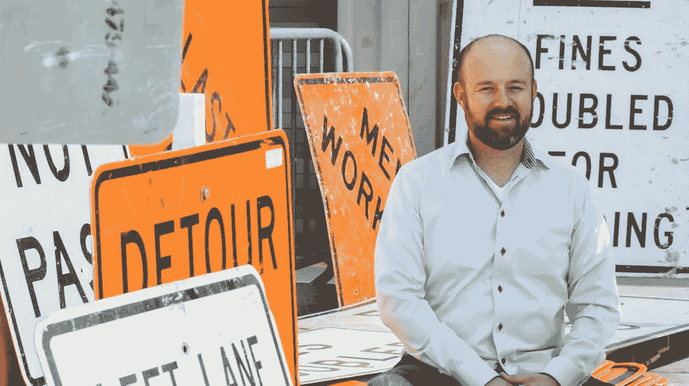

# 一位卖给 Twitter 的创始人考虑他的下一步(或不)

> 原文：<https://medium.com/swlh/a-founder-who-sold-to-twitter-considers-his-next-move-or-not-431f54091538>

退出一家企业后，生活中最困难的事情之一就是你面前无尽的时间。对那些还在努力工作的人来说，这似乎是一种奢侈，但它可能会让人迷失方向，就像一艘在公海上的船，看不到任何地方的陆地。对于以 1.34 亿美元将公司卖给 Twitter 的贾德·瓦勒斯基(Jud Valeski)来说，离开公司是唯一合乎逻辑的经济选择，但他还没有为接下来会发生什么制定计划。

Jud 认为这很好，他认为“你下一步要做什么”这个问题是老生常谈，被高估了，是我们文化中的一种疾病。(我可能稍微夸大了他的重点，但没有太多。)

我发现这场对话真的很吸引人，它为想要退出的人提供了许多关于创建买家市场以及如何思考连续创业的课程。

你可以阅读下面的完整文字稿，或者在这里收听[。](https://itunes.apple.com/us/podcast/5-%24134-million-exit-to-twitter-jud-valeski-founder-of-gnip/id1405769790?i=1000419641529&mt=2)

****************

**劳拉·里奇:**如果你不介意的话，我们先来谈谈你创办的公司吧。

**Jud Valeski:** 这家公司叫 Gnip，G-N-I-P，我们是一家社交数据提供商。我们认为自己是收集商业级的，完全真实的，公开的社会数据的基础设施。我们相信，从商业角度来看，公共社交数据会变得有趣。

劳拉·里奇:这也是推特出现的时间。

贾德·瓦勒斯基:那时候正是时候。他们出现了。他们肯定不是今天的他们。你知道，他们要小得多。如果我还记得的话，我喜欢用一个统计数据…那就是每秒的 tweets 数。消息流量率总是一个有趣的衡量系统受欢迎程度的指标，在它被机器人淹没之前，我们过去常常看到每秒 5 条推文的推文率，几年后，你可以每秒 100，000 条推文。因此，我们在大约六年的时间里围绕这一点建立了一项业务，并花了几年时间摸索，尝试了几个不同的模型，然后花了几年时间完善了一个似乎可行的模型，然后花了几年时间真正实现了这一点，并扩大了业务规模，最终在 2014 年 3 月以 1.55 亿美元的价格卖给了 Twitter。

劳拉·里奇:很好。

Jud Valeski: 我认为在那个时候，Twitter 已经进行了大量的收购。我想说的是，它在 100 左右，我们仍然是系统中最赚钱的业务部门。作为一名企业家，你所希望看到的就是你的事情继续下去。这确实发生了，看起来很有趣。

**劳拉·里奇:**太棒了。我知道很多企业家真的想让你的创作继续下去，并在它继续发展时出类拔萃。我还想问你，交易发生时你的角色是什么。我知道你是联合创始人。你能谈谈退出时你的管理角色吗？

**贾德·瓦勒斯基:**是啊，让我们看看。交易完成时，我是首席技术官。我的联合创始人后来离开了。到那时，六年过去了，当一个人创办一个实体时，那种原始的创新金块已经没有了。因此，这种情况已经发生了变化，因此，我的角色也发生了变化，在此期间，我们聘请了一位经验丰富的资深高管，他最终成为了首席执行官。我们聘请他担任首席运营官，然后随着时间的推移，他过渡到首席执行官的角色。所以，在出售时，他是首席执行官，我是首席技术官。

劳拉·里奇:但是后来发生的事情是，你最终完全转变了。

Jud Valeski: 是的，所以当我们在谈判这笔交易时，出现了这样的前景，也许最初的创始人没有必要完成这笔交易，所以我们投入了大量的精力来试图辨别这是否是谨慎的和可能的，你知道，显然现在有很多担心可能会破坏这笔交易。我花了相当多的时间来衡量、参与，在几个月的时间里，你确定这不会对交易产生负面影响，我不会继续做下去，而且-

劳拉·里奇:对。

因此，随着事情的进展，显然没有。

**Laura Rich:** 你们在 Twitter 上提出了这个想法，因为你们自己也在解决这个问题。那看起来像什么？

Jud Valeski:是的，这实际上是一件旷日持久的事情。简而言之，你开始试探对方，以了解什么是重要的，什么会引起反应，什么不会，但在我们这边，我们的首席执行官克里斯·穆迪(Chris Moody)实际上在某一点上提出了这个问题。他说，你知道，看，交易的经济结果都是这样的，投资股东可能会有一个财务结果，而非既得利益者可能会有另一个，所以既得利益者的结果很重要。

劳拉·里奇:是啊，在-

Jud Valeski: 事实上，我欠 Chris 很多，因为我不确定我自己是否会认为离开是最经济的选择。你知道，这是一生一次的经济动态之一，你需要非常认真地看待它，我在那里呆了六年，所以我最初的创始人股票是完全既得的，所以在谈判方面，没有反增或重置任何既得股份的既得动态。所以，当创始人职位的大部分都准备好了-

**劳拉·里奇:**是的，你还打算做什么？

**Jud Valeski:** 财务结果显然意义重大。

劳拉·里奇:对，有道理。但是，你准备好离开公司了吗？你想去吗？

Jud Valeski: 克里斯让我意识到，是的，我是。当我们第一次开始走这条路时，我并不清楚，所以我继续进行交易谈判，就好像我仍然是这个实体的一部分，并试图找出相应的前进道路。

劳拉·里奇:你认为你会在交易中说出来？然后发生了什么？

Jud Valeski: 你知道，从那以后就有了这一刻的期待，已经六年了。你是否足够投入到这种情况中，以至于在能量上按下重置键，然后再次启动？答案是否定的。10、15 年前，通过 AOL 收购 Netscape，我做了一件事，这是一个非常悲惨的事情。当面对再次拥有它时，很明显，哦，我的上帝，我再也不想那样做了。因此，知道我不想这么做，从奉献和精力分配的角度来看，这将意味着 Twitter 内部的全面重启，在社交数据业务领域工作了六年之后，离开并休息一段时间是明智的，这样才能保持一致。

劳拉·里奇:那么，交易完成后，第二天早上醒来是什么感觉？

Jud Valeski: 是的，所以有点情绪化。你知道，你把你的生活倾注在一件特定的事情上，一个产品，一项技术，一个团队，一个日常事务中，然后刹车就来了。你知道，对于那些把全部精力都花在解决问题和执行上的人来说，这可能会很不和谐。所以，是的，汽车突然减速停下来，你必须重新评估很多东西。

劳拉·里奇:突然无处可去，没有组织，是什么感觉？是这样的吗？

贾德·瓦勒斯基:是的，而且知道没有重返日期，你知道吗？我想一两年前，我休过一次…我想那是一次为期两个月的休假，就像任何假期一样，不管是一天、一周、一个月，我认为甚至是一年，在你的后脑勺都有一个重新进入的时刻，所以你可以减压，你可以脱离，你可以游离，你可以远离你传统的日常活动，但它总是在远处的某个地方，所以只是突然不在那里时换了一副耳机。事情开始变得非常现实，比如我们在这里做什么，下一步做什么等等。

**劳拉·里奇:**你有没有开始做一些自我反省，或者你是如何打发时间的？

**贾德·瓦勒斯基:**你知道，超级早，我其实不太确定。我不太记得了。我不记得具体的细节，但它很快变成了拥抱我的创造性的一面，所以我一直在软件工程方面的事情，我从来没有把科学和艺术融合得很好，所以它对我来说一直是一种二元的，或开或关，所以我有点把科学部分和艺术部分翻转过来，真的一头扎进摄影和许多旅行，许多风景摄影。你知道，去探索和冒险，拍摄世界之类的事情。你知道，这已经持续了整整四年，这很好，很有趣。打开你大脑的那一边是一件有趣的事情。你知道，我想更好地平衡这两者，所以这是我未来的生活目标，让这两者保持某种共生关系，而不是在任何给定的时刻关闭一个，关闭另一个。

劳拉·里奇:真正困难的是，我想你之前说过，这是非常开放的，不像公休或度假那样结束。

Jud Valeski: 是的，是的，当引导性的问题是，“哦，下一步是什么？”时，在谈话中会不断出现重返的概念或者，“哦，你什么时候回来？”社会几乎不可能摆脱耳机。我们永远有根深蒂固的“做”。

**劳拉·里奇:**我很高兴你提到了这个问题，因为我认为很多人在出售自己的企业后都会面临这个问题。所以，你已经决定了，或者说你当时已经决定了，你不想再有下一个了。

Jud Valeski: 我不会说我已经决定了，但是那里什么都没有。我不是说，“哦，不会有什么的。”你知道，已经达到了某些里程碑，我认为我们经常继续在我们面前设定目标和里程碑，以推动我们前进。对我来说，总有一条技术和经济的道路要走，当这些里程碑到达时，就会出现一片空白。有一种“好了，就这样了，还有什么可做的”之类的话。

**劳拉·里奇:**是的，我能理解。尽管你确实去了其他一些公司工作，甚至自己也参与了一些公司的创立。

**Jud Valeski:** 是的，是的，随着时间的推移，你的视角会发生变化，你会对事情有不同的看法，我能够看到我的精力如何能够花费在不仅仅是经济目标和经济成果的事情上，而是更多地围绕环境影响的事情，例如，最近我和一些人成立了另一家公司，将自行车的使用带到城市地区。我一生都是一名热情的自行车骑手，有一种新的方式让人们骑上自行车并使用替代交通工具的想法是一个真正的动力。

劳拉·里奇:那家公司叫什么名字？

Jud Valeski: 是一家名为 UrBike，U-R-B-I-K-E，UrBike 的公司。

劳拉·里奇:那么，让我来问你这个问题。当经济目标没有了，在你如何把时间花在工作上时，寻找有意义的目标的风险是不是大了很多？

贾德·瓦勒斯基:是的，绝对是。以 UrBike 为例，一旦技术平台建立起来，实现这种共享模式的实际技术能力建立起来，我对保持参与的运营兴趣就减弱了，所以是的，当然。

劳拉·里奇:那么，是时候走了？是时候向前看了？

**Jud Valeski:** 是的，所以在这个特殊的案例中，我转而全职参与我几年前做的一项投资，将我的热情放在建立工程团队、构建软件和在不同的业务中再次构建产品上，所以我非常专注于软件方面和 T-construction 方面的东西。

劳拉·里奇:我想对你稍微改变一下。我想问你关于你的个人生活或家庭方面的问题，以及作为销售或经济状况的结果，那里可能出现了什么样的变化？

**Jud Valeski:** 经济地位，不算。除了我不去工作，你根本不会注意到任何不同。甚至那也不完全是真的。后来我建立了一家投资公司，并在几年内积极进行投资，所以这涉及到一些旅行，所以这是工作，但不是有规律的办公室。你知道，旅行方面，这是一个奇怪的转变。你拥有的资源越多，你就能迅速改变你的旅行方式。随着家庭成员的增多，家庭假期也随之改变。就拿春假来说吧。从资源的角度来看，你真的只能与处于类似经济动态的同行一起度假，所以这是一个奇怪的转变。我会说，我们想做的旅行对某一群朋友来说是不可行的，多家庭旅行带来了奇怪的影响或意想不到的影响。

**劳拉·里奇:**这改变了你和那些家庭的关系吗？

**贾德·瓦勒斯基:**不，我的意思是只要你没有花*那*时间和他们在一起，当然。但是，总的来说，没有。

劳拉·里奇:我也有件事想问你。你有两个正在上学的孩子，在这次离职事件之前，你要去办公室或出差，现在突然之间你在家的时间更多了，我想知道他们的情况发生了什么变化？好像你更容易接近是因为你在我身边多了？

Jud Valeski: 是的，我只是想说，越来越容易接近，越来越容易得到。在最初的几年，我真的很努力，实际上，因为这些年对他们来说很容易受影响。April 是一个全职妈妈，所以她的角色已经被固定下来，但是这个在外面赢得面包的家伙现在突然回家的想法，是一个奇怪的动态。所以，我一直在努力解决这个问题。我有一些处于类似情况的朋友，他们用一种方式来管理它。我总是，我不知道，很难向一个孩子解释或示范，在工作环境中，当你不在工作环境中时，那种动态的职业道德和智能部署等等。所以，我一直在努力，就我个人而言。

我不完全知道他们的情况如何。你知道，在这一点上是正常的。在我们博尔德的社区里已经有一些这样的东西，所以对每个人来说并不陌生。尽管如此，对我来说这一直是一件奇怪的事情。

劳拉·里奇:所以，我经常从出售企业的企业家那里听说，搞清楚这种动态变化很有挑战性，另外，我的意思是，无论如何抚养孩子都很难。你知道，我也想问你。我们早些时候在这次对话之外谈了一些关于退出后的过渡，以及在你出售你的公司后会发生什么，我想知道你对这种现象的看法，以及你是否认为在这之后每个人都会经历这种情况？

**贾德·瓦勒斯基:**不，每个人经历的不一样。当然，没有人会有同样的经历。我看到很多跑步机上的人只是追求退出，退出后，退出后，退出后。在某些情况下，这是对其中的成分的真正的爱和激情，他们只是想要更多，这在追求一个人的激情和目标时是令人钦佩的，这太棒了。不幸的是，我认为更多的时候，人们只是不知道。他们只知道这些。我反复看到的另一件事是，好吧，我只是这样做了，为了保持相关性，我需要尽快回到跑步机上，否则，我身上的任何光芒都可能会消失。在某些情况下，这是经济上的。他们的退出并没有带来财务独立。在某些情况下，他们可能会对自己是谁以及想要做什么感到困惑，这是其中的一部分，“好吧，下一步是什么？拐角处有什么？你明天做什么”的事情，就在出口之后，我马上避开了。

我只是不太相信，对我来说。对一些人来说，毫无疑问，如果他们失去了动力，那只是他们的一部分。他们需要动力来继续，如果他们失去了动力，他们可能会挣扎，你知道吗？有时候，当我看到一个企业家经历这些，我感觉很糟糕，就像是，停下来。去发现你是谁，就像不要让这个东西搅动，然后有时它就在那里，真正的，深刻的，充满激情的超现实主义企业家，就像，我是他们最大的啦啦队长，你知道，去，去，去。这就是你。这才是你爱的。别停下来。你知道，就像其他任何事情一样，当有人投入他们的热情和精力时，这是一种不可忽视的力量，看到这一点很棒，但这是…再次，很多时候你只会看到茫然和困惑的表情，然后你又回到跑步机上，因为我不知道还有什么更好的，这总是很难。

**劳拉·里奇:**是的，很难弄清楚，你如何摆脱那种单调乏味的生活，下一步做什么，你从哪里开始寻找自我，你知道吗？那你呢。有没有一些事情，你希望自己以不同的方式去做，或者以不同的方式去做？

Jud Valeski: 有一件事……我想我们搞砸了。在销售动态中，我们只是没有一个市场，我们有一个买方，如果你是卖方，这是最糟糕的情况。

**劳拉·里奇:**除了，你做得还不错。

**Jud Valeski:** 我们就是没有杠杆。我们应该配备全职人员，完全致力于与 Twitter 的一个竞争对手的业务发展管理关系，我们到处谈论这个问题。我们只是没有扣动扳机。我们没有扣动扳机，因为感觉这是在浪费钱。回想起来，这是一笔微不足道的投资，却可能给我们带来天文数字般的好处。

劳拉·里奇:这真的很有趣，因为你们确实做得很好，但这也是你们给其他人上的一课。你能稍微谈一下吗？

Jud Valeski: 这转化为对企业家的建议的方式是，你认为你应该花被动的钱和被动的精力去做的事情？你应该考虑让它变得更积极，实际上做一个真正的投资。我认为这是一件非常好的事情，尽管这可能不会产生任何最终影响，但我至少会尝试一下。

**劳拉·里奇:**你知道，我不知道当你不再为你一手建立并在过去六年中为之工作的公司工作时，如何避免对系统的冲击，但我想知道你是否有想法可以做些什么来预测接下来的事情？

贾德·瓦勒斯基:是的，前几天我们谈过一点。计划这样的事情是一种傲慢。就好像，我要为财务独立做打算了。我的意思是，见鬼，这周围可能有迷信，就像如果你想太多，或者你开始假设，或者你开始计划，你可能会倒霉。

劳拉·里奇:我知道你在说什么，但我实际上认为，如果有更多的计划，人们可以有一个更好的离职后过渡。哦，我确实想问你最后一件事，然后我会让你走，我真的很感谢你的时间和想法。你的飞机座位？你喜欢特定的飞机座位，我想知道这是怎么回事，你的财务独立是否允许你在获得这些座位时有更大的灵活性？

Jud Valeski: 是的，我有严重的强迫症，所以飞机上的特定座位很重要，这是一个扭曲的算法。它的飞机类型，距离舱壁的距离，距离飞机后部的距离，过道与窗户和某些动态。是啊，所以这是它自己的扭曲的野兽。

劳拉·里奇:目标是什么？理想的座位是什么样的？

**贾德·瓦勒斯基:**这取决于航班，因此，一天中的时间，你知道吗？不管它是不是从纽约来的通勤航班，它都是去一个新的地方。一个简单的方法是，如果你要去一个你从未去过的地理上有趣的地方，确保你在飞机的正确一侧有一个靠窗的座位。一个靠窗的座位在飞机的另一边，显然没有任何意义。有趣的是，在三四年前和我的一个朋友的一次谈话中，我们谈到了一些关于身份的东西。他实际上把一个朋友传给他的一些东西传给了我，我认为这些东西说明了一切。场景是事件前的生活和事件后的生活，除了当你在事件后登机时，你向左转而不是向右转之外，真的没什么不同。

**劳拉·里奇:**左转进入头等舱，但是是同一架飞机。

Jud Valeski: 没错，这就是问题的关键，这是有区别的。很微妙，然后在一天结束的时候，没有任何区别，因为-

劳拉·里奇:对，我们都会死。

Jud Valeski:——这是同一架飞机，载着同一批人去同一个目的地。所以这是一种有趣的思考方式。

劳拉·里奇:你知道吗？我想这是结束我们谈话的绝佳地点。我今天很高兴和你聊天。非常感谢你来到这个节目，分享你的经历和给大家的好建议。

Jud Valeski:是的，非常有趣。谢谢你的聊天。

*订阅* [*退出俱乐部*](https://www.fratzkemedia.com/the-exit-club/episodes) *播客，听听企业家们关于如何出售企业的对话。*

## 这篇文章发表在 [The Startup](https://medium.com/swlh) 上，这是 Medium 最大的创业刊物，拥有+368，366 名读者。

## 在这里订阅接收[我们的头条新闻](http://growthsupply.com/the-startup-newsletter/)。

