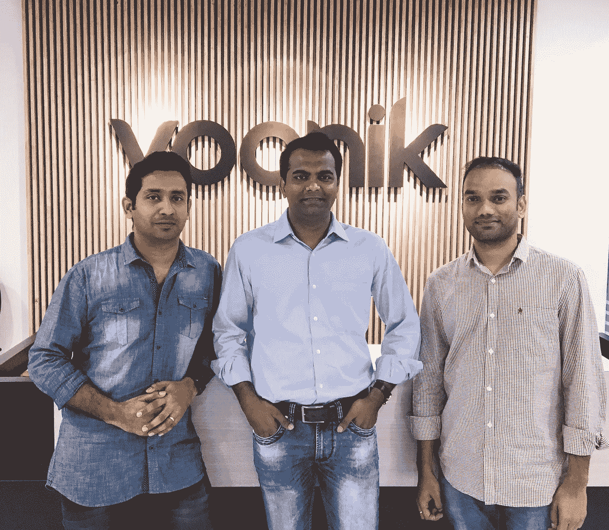

# 一位创始人对收购后生活的描述

> 原文：<https://medium.com/swlh/a-founders-account-on-life-after-acquisition-56e8b014ca73>

"每一项有价值的成就，无论大小，都有其艰辛和成功的阶段:开始、奋斗和胜利。"— **圣雄甘地**

Anup, Sujayath and myself

八个小时。这正是 [Voonik](http://www.voonik.com) 获得 [Styl](https://twitter.com/styl_ai) 的原因。这是我们与 Voonik 团队第一次互动到交易完成的时间。

刚从 Voonik 的办公室出来， [Anup](https://in.linkedin.com/in/anupmhn) & [me](https://in.linkedin.com/in/chsrikanth) 面面相觑&我问——这是真的吗？。没有花太多时间去寻找答案，我们决定庆祝这个时刻。主要是因为害怕第二天醒来会发现这只是一个梦。

Ankur Singla 曾经告诉我要在收购中寻找长期合作，因为大多数收购在 3 个月后就会失败。我们在这里——收购 Voonik 一年后。在此期间，我们的团队开发了应用程序、后端基础设施、设计并处理了运营。

在此期间，我个人有很多未学到的东西。在 Voonik 一年过去了，我认为现在是一个很好的时间来反思我在这段时间里没有学到的东西。

> **忘却# 1——做个好人&创业**

就我个人而言，我对 Styl 的座右铭是“做好人&建立企业”。我们相当成功地做到了这一点。然而，我们还没有大规模地这样做，并对选择正确的座右铭持怀疑态度。

对我来说，友善和创业意味着两件事

1.  为了创业，对员工和你一起承担的风险表示同情。不同的职业和家庭。培养和保护员工的职业生涯，因为他们对创始人愿景的信任。节俭&善待投资者的钱——明智地花钱&尽早纠正错误。一定要向他们汇报进展或缺乏进展的情况。这对天使投资者来说尤其重要。
2.  在坚持上述原则的同时，尽一切努力建立一个持久的企业。

在 Voonik，我看到了大规模发生的事情——做好人&建立企业。这给了我足够的信心来坚持这个座右铭。

> **忘记# 2——保持透明**

当我走进 Voonik 的办公室时，我首先注意到的是一台显示每日指标的电视。这显示了透明度并赢得了信任。

与整个公司&(访问者)分享日常指标需要勇气。这也传达了一个潜在的信息，即团队并不害怕糟糕的日子，而是应该承认并努力克服它。

无论是衡量标准还是公司未来的发展方向，保持透明总是有帮助的。

> **忘记第三条——对虚荣指标说不**

好吧，我将保持这一节的简短，因为已经有很多关于虚荣心衡量标准的说法和文章。这一点在所有展示的 Voonik 仪表盘中也很明显——只有那些值得落后的仪表盘才会被关注。

*提示:不追逐虚荣指标不仅有助于关注正确的指标，也有助于将它们与团队的目标联系起来。几乎 Voonik 的所有团队都是用数字来衡量的。*

## 被收购或被聘用时创业的两点建议

*   真正了解你是否能和团队一起建设超过 6 个月——和人们谈论公司和创始人。是的&我们很高兴我们做出了正确的决定。
*   一定要照顾好你的员工和投资者。很难。但这是正确的做法。

当 Sujayath 在第一次会议上问我们交易的优先顺序时，我们的回答是即兴的，即时的——投资者。2)团队。3)我们(创始人)。我们很高兴能够优先执行这笔交易。

这让我想到了最重要的部分——感谢在我们收购期间帮助和支持我们的所有人。

[Sujayath](https://twitter.com/sujayath) 、[Navaneeth](https://in.linkedin.com/in/jnavaneeth)&[Voonik 的 Swapna](https://in.linkedin.com/in/swapna-sitaraman-12b9623) 、Stylecraze 的[chai Tanya](https://in.linkedin.com/in/chaitanya-nallan-169423)&[Sangram](https://in.linkedin.com/in/sangramsimha)、style craze 的 [Sirish](https://www.linkedin.com/in/sirishkosaraju) 、 [Deepak Ravindran](https://twitter.com/deepakravindran) 、[Ankur Singla](https://twitter.com/singlaank)&[Naman Sara wagi](https://twitter.com/NamanSr)抽空聊天&指南。

也非常感谢我们在 Styl 的投资者——[拉杰什](https://www.linkedin.com/in/rajeshtp)、[尼廷](https://in.linkedin.com/in/nithin-kamath-908a4618)、[基兰](https://in.linkedin.com/in/kiran-jain-44058b29)、[阿伦](https://in.linkedin.com/in/arunkishanvr) & [平托](https://www.linkedin.com/in/pinto-akkara-16833426)。

最后但同样重要的是，我们的海扁王团队是我们度过所有美好时光和不那么美好时光的力量所在。爱你们所有人。

如果你喜欢这篇文章，请推荐或与朋友分享。