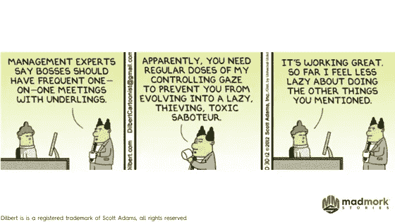
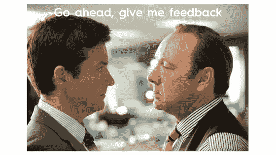

# 强大的 1-1 创始人指南

> 原文：<https://medium.com/swlh/a-founders-guide-to-powerful-1-1s-8691c0e3805b>

作为一名创始人，你工作生涯中最重要的三件事应该是:

1.  雇佣最优秀的人
2.  管理最优秀的人才
3.  留住最优秀的人才

你和你的团队召开的一对一会议通常是创业公司中最不被重视却又最重要的会议之一。简而言之，你与团队持续进行有效的一对一会议的能力将最终成为衡量你作为管理者成功(或失败)的重要标准。

**为什么 1-1 如此重要**

1.**沟通** —一对一是你如何与团队成员沟通的重要组成部分。沟通很重要，因为它有助于澄清你的期望和你的协议之间的区别。如果你期望和你一起工作的人会在某个日期前交付 X，那么这个人可能会以不同的方式看待你的期望，曲解它，并做一些不同的事情。1–1 至关重要，有助于确保您和您的团队就需要完成的工作、顺序和时间达成一致。

2.**优先化—** 在永无止境的体式任务列表(见 [**我的糖果粉碎贴**](https://www.madmork.com/single-post/2017/10/02/How-to-Survive-being-Candy-Crushed-at-Work) )、闲置信息和电子邮件的时代，你会发现当你的团队的优先事项与你的不一致时，糟糕的事情就会发生。1-1 很好地回顾了优先事项，并就什么重要什么不重要与您的直接下属达成一致。你越频繁地校准它，你就越不可能因为不正确的优先级而错过可交付成果。优先级会发生变化，人员会发生变化，市场也会发生变化，因此定期调整哪些事情最重要以及何时应该完成这些事情非常重要。

3.**障碍—** 作为创始人和管理者，你的主要职责之一就是消除障碍，让你的团队尽可能高效。无论你是没有得到一个关键的雇员，一个活动还没有启动，还是一个产品功能被延迟，你的团队都会向你寻求如何解决问题的建议，或者当他们不能解决问题时，实际参与解决问题。你越快发现并消除障碍，任务和项目就能越快完成，每个人也会越开心。

4.**团队动态—** 正如我在一篇关于 [**跳槽:7 个辞职理由**](https://www.madmork.com/single-post/2017/08/25/Jumping-Ship-7-Signs-its-time-to-quit) 的文章中提到的，有害的团队动态是一些人决定寻找更好的工作的关键原因。作为一名经理，你希望在威胁到人与人之间的和谐，或者至少是威胁到他们为共同目标而合作的能力的问题上走在前面。

当你问了正确的问题，比如你的直接下属如何与你的团队成员相处，总体上发生了什么，以及什么样的人的问题可能会妨碍你时，你就能够很快发现问题，如果不加处理，这些问题可能会恶化并导致瘫痪。

5.**职业发展—** 即使是在初创公司，你最年轻、最聪明的员工也总是会考虑这份工作如何让他们找到下一份工作，以及你的公司是否是他们学习和成长的最佳场所。虽然我不建议每次会议都讨论职业，但在我以前的工作中，我会在每 4 次会议中抽出 1 次来了解人们对他们的角色、未来的感觉，以及他们是否认为自己获得了正确的技能、培训和支持，可以让他们去自己想去的地方。当一个人在一个职位上已经工作了 18 个月或更长时间，公司正面临一些特别具有挑战性的问题，或者就在绩效评估之前和之后，这些讨论变得尤其重要。

当你花时间问问题并与员工讨论职业问题时，你表明你不仅是为了自己或公司，而且是真心关心他们的幸福。成为一名优秀的经理不仅仅是把事情做好，而是指导和授权你的员工，让他们能够像人一样发展和成长。记住这一点，你就能真正让你的员工做出令人惊叹的事情，并在这个过程中保持快乐和动力。

也就是说，如果你计划讨论涉及职业发展的话题，提前通知你的直接下属总是一件好事，这样他们就可以带来他们对这个话题的任何想法，并提前为谈话做好准备，正如[这篇哈佛商业评论文章](https://hbr.org/2016/08/how-to-make-your-one-on-ones-with-employees-more-productive)中关于高效的 1-1’s 所阐明的。

6.**获得反馈。**这对于创始人和第一次担任经理的人来说可能会特别不舒服，但实际上，你的一对一会议也是一个很好的机会，让你看看自己在直接下属眼中的表现。盖洛普在 2015 年进行的一项研究发表在《T2 财富》杂志的一篇报道中，该研究显示，超过 50%的 T4 人是因为糟糕的老板而辞职的。没错:你可能是那个杰出的工程师按下弹出按钮，接受谷歌提议的原因。

1-1 提供了一个很好的机会来建立一个强大和开放的关系，让你的直接下属相信他们可以分享他们对你可以做得不同的感受。例如，在我的上一份工作中，我的一位直接下属告诉我，她觉得我不够“积极”地倾听。结果是她不得不重复我说过的话好几次，这让她觉得要么是我没有注意她，要么是我不重视她说的话。如果我没有要求反馈，我不会知道这是一个问题，我也不可能解决它。

可以问什么样的问题？这里有一个简短的列表:

a.我能做些什么让你的生活更轻松？

b.你喜欢我管理风格的哪些方面？你觉得我在哪些方面可以改进？

c.我怎样才能更好地支持你？

d.在(特定情况下)我能做些什么让你的工作变得更容易吗？

​​7.**互相了解。**一对一也是一个真正了解和关心你的同事并了解他们的机会。你花越多的时间去了解你的员工，你就会发现他们越开放，越诚实，越愿意和你一起面对挑战。

询问对方的爱好、家庭、周末活动或者刚刚去过的一次旅行。谈论与工作无关的问题是打破僵局的好方法，尤其是当你不得不处理特别具有挑战性的问题时。你还会发现，你对一个人了解得越深，你让他们了解你得越多，你们之间的纽带就越牢固，你建立的忠诚度也就越高。拥有真正了解并欣赏他们的优秀经理的人，比那些不了解他们的人更难找到机会。

**运行良好 1-1 的技巧**

**1。这是他们的会议，不是你的。**这听起来可能有悖常理，但这次会议确实是您的直接下属寻求帮助的时候了。它不应该是状态报告(你可以通过电子邮件、Slack 或 docs 来完成)。牢记他们的需求，设身处地地为他们着想，你就能为成功的会议建立正确的框架。

**2。安排好时间并保持一致。**一致性是关键。在您的日历中安排您的 1-1 会议，并总是尽量准时并做好准备。如果有紧急事情发生，让他们提前知道，并立即重新安排。不要拖延，因为他们面临的挑战或问题可能需要立即得到帮助。

记住第一条，准时到达。当你总是迟到时，不管是什么原因，你基本上是在说:“对不起，我的时间比你的更重要。”这是粗鲁的，不尊重人的，也表明你没有组织能力。想象一下，如果你的老板或投资者总是迟到。你会有什么感觉？

另一方面，有时你的直接下属可能真的没有任何日程安排，也不介意那天没有会议。这确实是你的决定，但不要强求。如果这个人时间很紧，你有很多事情要做，你可能要重新安排会面时间或者推迟到下一次会面。我会避免太频繁地这样做，因为我发现总有事情要讨论，但这是你作为经理的决定。

偶尔，没有什么紧迫事情的 1-1 是最好的实际检查，看看团队的事情进展如何，甚至谈论职业发展。你甚至可能会发现你们中的一个人所面临的一些个人问题。这些都有助于巩固你们的关系。

**3。有一个议程。**通常，我会与团队成员共享一个谷歌文档，他们可以输入任何他们想讨论的内容，我也会这样做。这给了双方一个准备的机会。如果你在讨论更敏感的话题，比如升职、重大问题或职业发展，这就更重要了。如果您正在讨论这些问题，请确保您的直接下属了解这些议程主题，并有充足的时间进行准备。

**4。给人时间。**这真的取决于你开会的频率，但通常，我发现如果你真的想更深入，处理更具挑战性的问题(通常是最重要的)，你至少需要 1 个小时。这样你就有时间闲聊，讨论快速而容易解决的问题，并深入到更深更具挑战性的问题中。请记住，您还需要 5-10 分钟来商定清晰的后续步骤。(见下一点)

**5。就明确的后续步骤达成一致。**这又回到了协议与期望的概念上。确保留出足够的时间，以便双方就下一步谁做什么达成一致。

没有什么比花时间开会却不清楚接下来谁在做什么(或者项目什么时候需要完成或者它有多重要)更让人们烦恼的了。行动项目也是你下一次会议的基础，所以你想以某种方式记录你同意的任何事情。这可能包括使用 Wrike、Trello 或 Asana 等工具来创建或更新任务，将任务分配给其他人，并在任务后面放置明确的交付内容和日期。

**6。出席并提问。**从个人经验来看，对于一个占用你时间很少、压力很大、感觉很匆忙的人来说，最终让你参加一个会议，却发现你在处理 3-4 件其他事情的同时还在处理多项任务，这确实令人沮丧。记住，这个会议是关于他们的，不是你的。所以把你的 iPhone 收起来，合上你的笔记本电脑，闭上嘴，集中注意力。

在场的很大一部分是让他们控制讨论，问尽可能多的问题，这样既能正确理解问题，又能确保对方知道你已经理解了他们所说的。 [Impraise 博客](https://blog.impraise.com/360-feedback/1-on-1s-for-engaged-employees-how-good-managers-should-do-them-performance-review)有一个很棒的关于积极倾听的部分，有几个问题的例子，你可以问这些问题来表明你在场并倾听你的直接下属。

如果没有具体的问题要讨论，问一些开放式的问题，让人们简单地谈论，这样可以了解正在发生的事情以及这个人或其他人的感受。然后你可以自己决定是否、在哪里或何时需要参与。

**7。说到做到。**这是我最喜欢的一句话，我在谷歌的时候就接受了，并继续在创业公司和我的客户教练工作中使用。

有时候，我最好的谈话和最深刻的见解来自于我们都走出办公室，简单地去散步和讨论问题。如果你不需要将笔记本电脑放在手边，使用白板或参考其他文档，这是一个外出、呼吸新鲜空气和锻炼的好方法。

你还会发现，在讨论某些话题时，双方都会感到更加放松。边走边谈会议对于创造性的头脑风暴和讨论战略和/或职业发展特别有用。

**8。给予反馈。人们，尤其是千禧一代，渴望得到反馈。事实上，如果你读了我在[**【7 个是时候辞职的信号】**](https://www.madmork.com/single-post/2017/08/25/Jumping-Ship-7-Signs-its-time-to-quit) 上的帖子，你会记得，长期缺乏欣赏和反馈往往会把人推到边缘，鼓励他们回复招聘人员和竞争对手的电子邮件/电话。**

提供建设性的反馈，让人们知道他们做得如何以及他们可以改进的地方。同样，也要准备好接受反馈。当人们工作出色时，提供积极的反馈也很重要。

避免过于频繁地给予表扬，因为这可能会被视为不真诚，但一定要确保当某人完成了一项伟大的工作时，你表示赞赏，并让他们知道他们的工作对你和团队有多重要。戴尔·卡耐基在他的开创性著作《如何赢得朋友影响他人》中也指出，你应该尽可能具体地赞美他人，让听到赞美的人知道你完全理解他们在做什么。

跑好 1-1 需要时间、练习和耐心。即使在过去的 18 年里管理团队，我觉得我总是在学习，并在这方面做得更好。但是结果真的会得到回报，更快乐、更有效率的团队成员会享受他们同甘共苦所做的事情，并使整体工作环境变得更好。

如果这篇文章有帮助，请随意点赞，分享和评论。也别忘了订阅我的 [**博客**](http://www.madmork.com/blog) ，在 [**推特**](http://www.twitter.com/madmork) 和 [**脸书**](http://www.facebook.com/madmorkstories) 上关注我，在 [Anchor.fm](http://www.anchor.fm/madmork-stories) 上收听我的播客。为更多快乐的 1-1 干杯！

疯狂默克

## 这个故事发表在 [The Startup](https://medium.com/swlh) 上，这是 Medium 最大的创业刊物，拥有 333，253+人关注。

## 在这里订阅接收[我们的头条新闻](http://growthsupply.com/the-startup-newsletter/)。

