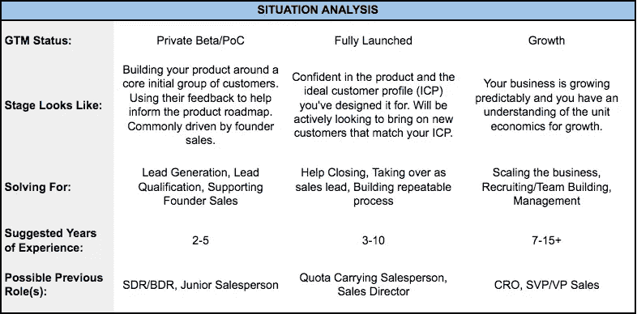

# 创始人首次销售雇佣指南

> 原文：<https://medium.com/swlh/a-founders-guide-to-the-first-sales-hire-afe5a8650868>

## [**克雷格·伯瑞**](/@craig.burel)

****创始人首次销售雇佣指南****

**祝贺你，创始人，你已经准备好进行你的第一次销售雇佣了！这是一个激动人心的时刻，你现在已经准备好开始下一阶段的成长。作为早期投资者，我们会遇到很多准备进行第一次销售招聘的创始人，但不确定如何进行这一过程。这是一个令人惊讶的复杂决定，我们认为我们应该分享一些关于这个话题的想法。**

*****企业现在需要什么？*****

**在与销售候选人会面之前，我们认为创始人评估他们的业务状况并回答三个关键问题非常重要:**

**我们目前的销售增长轨迹是怎样的？
我们的[理想客户概况](http://blog.topohq.com/framework-ideal-customer-profile-icp-development/) (ICP)是什么？
作为一名运营人员，我个人的优势和劣势是什么？**

**回答这些问题将有助于确定贵公司需要的销售人员类型。你的销售吸引力、收入增长和理想的客户档案将决定最适合该角色的销售人员类型。你自己的个人背景将完善搜索，因为你希望补充自己的技能。综上所述，这些问题将帮助你聚焦在最佳的“销售人员角色”上，从而将你的业务提升到一个新的高度。**

**“销售人员角色”是对候选人的总体看法，由许多因素组成:他们的经验年限、他们销售的产品类型、他们销售的客户类型、他们在销售管理方面的专业知识以及过去在销售运营中的角色。在接下来的几节中，我们将帮助解开这些因素，并添加一些你应该从候选人那里期待的基本技能。**

**我们希望这篇文章能激发你深思熟虑地考虑各种销售人员的个人资料和技能，并帮助你找到适合你的企业。**

*****这些技能都是表赌注*****

**早期创业意味着身兼数职。在大多数销售组织中，有许多幕后销售支持工作需要完成，以支持高效的销售流程。销售人员可能会因为成交而获得好评，但签订合同需要销售、营销、客户成功和产品之间的一系列协作努力和协调。**

**考虑到这一点，你必须找到一个既愿意又有能力执行这些核心职能的候选人:**

**● **能够建立叙述性的&推销**——在大公司，产品营销团队设计销售团队使用的推销、轶事和反驳。年轻的公司通常没有这些广泛的资源，你的候选人需要肩负起这个责任。我们建议将您的一次面试设置为模拟推销，候选人必须为您的解决方案设计推销，并即时处理异议。**

**● **创造引人注目的内容**——同样，如果没有营销团队来创造漂亮的演示文稿，这个责任至少应该部分落在你的第一个销售人员身上。确保你对候选人构建销售平台的能力感到满意，这些平台将直观地展示产品及其价值。找一个高度关注细节的人。**

**● **习惯打电话给冷线索**——在成熟的公司里，这种责任要么落在营销团队、初级销售人员或销售发展代表身上。在面试中，找出你的候选人对这个不那么迷人的角色的态度，以及他/她创造新线索的计划。他们会打陌生电话、发邮件或敲门吗？**

**● **构建&完善销售流程** —你的第一个销售人员可能需要帮助完善你的销售流程设计，以便将你的产品推向市场。你不希望你的第一个销售人员只是简单地从他们以前的公司拿走销售流程并应用到你的业务中，仅仅因为它以前为他们工作过。作为家庭作业，让候选人表达他们的销售流程对您的解决方案会是什么样的。在访谈中，让他们证明他们对特定设计的推理。**

**● **解读产品反馈**——这对于公司的成功至关重要，但在销售人才方面却经常被忽视。换位思考对于销售人员的成功至关重要。尤其是在关闭你最早的客户时，他们会帮助你制定产品路线图。确保你的候选人有能力倾听、吸收和清楚地表达客户的反馈。在现场遭到拒绝后，不太老练的销售人员会报告需要降低价格，而顶级销售人员会向产品经理提供建设性的反馈，并帮助确定如何更好地阐述价值主张。**

**● **拥有领域专业知识**——这通常是创始人的首要考虑，虽然不是必需的，但它对销售过程非常重要。具有相关领域专业知识的销售人员对客户的需求有同理心和理解。他们通常了解本地工作流、流程和行话，以及客户日常职责的其他细微方面，这些只有以前担任过该职位的人才能了解。这并不是说雇佣一个名片夹，统计数据显示这是行不通的。**

****

*****多少年的经验？*****

**对于处于预营收或 beta/PoC 阶段的初创公司，雇佣销售主管并不常见。初创公司的第一笔销售通常是由创始人完成的，在每一分钱都很重要的时候，这是成本最低的选择。创始人通常也是最好的销售人员！有一句古老的格言问道:“一个销售人员真的应该比创始人自己达到更高的配额吗？”这当然不是普遍正确的，但却是一个发人深省的想法。**

**对于一个没有实际收入的初创公司来说，雇佣一名销售人员并不是闻所未闻的，但这是一个最低可行产品(MVP)。在这种情况下，初创公司聘用有 1-5 年经验的人来测试市场并获得反馈是合理的，尤其是在创始人必须将重心转移到业务的其他方面时。但现实是，零收入的初创公司可能很难吸引强大的终身销售人才。**

**当企业已经有付费客户和一些收入来源时，首次销售雇佣是最常见的。这就是你的选择余地变大，决策树变得更加复杂的地方。一个方法是雇佣一个初级销售人员，一个有 2-5 年经验的人。有了这个选项，创始人可以继续执行演示和完成交易，但允许初级销售人员处理外联和线索生成。这将允许创始人增加销售能力，将销售的一些更平凡的部分委派出去，同时仍然保持对销售组织的控制。**

**对于有销售吸引力的创业公司，另一个选择是雇佣一个有 5-7 年经验的销售人员。销售成功有时可以归因于创始人纯粹的激情和努力，但销售过程本身可能并没有完全建立起来。有时候，创始人专注于业务的其他方面，比如产品或工程，可能是有意义的。在这些情况下，一个更有经验的销售人员将准备业务规模，销售过程是可重复的，并产生一致的可预测的结果。**

**在高速增长的情况下，收入基数超过 200 万至 300 万美元，预计销售额增长 300%以上，销售人员的选择最多。在这些情况下，人们倾向于相信“产品在自我销售”，任何销售人员都会这样做。但是你可能要考虑雇佣一个在建立高增长销售组织方面有丰富经验的主管，他有 10-15 年以上的经验。这个级别的许多高管不会冒险加入一家非常早期的初创公司，除非它的收入有近乎飞速的增长。值得注意的是，当你把目光放在体验范围的高端时，人才库会变薄，特别是当你还试图匹配其他标准时，如产品和销售类型。但是雇佣一名高级销售主管的好处是显著的。除了提供清晰的领导力，他们还能在整个管理团队中创造无缝的沟通和协调。这个人也可以作为一个稳定的手，发挥稳定的作用，消除无关的风险，最大限度地利用机会。**

*****产品和客户类型*****

**有各种各样的产品和解决方案，每一种都需要不同的技巧和方法来有效地销售它们。我们建议创始人在面试候选人之前考虑他们产品和客户的复杂细节。**

**考虑谁是你的买家。虽然产品和服务通常是为最终用户设计的，但在企业销售中，用户可能不是实际的购买者。根据您的解决方案和走向市场战略的性质，您可能会向高管、入门级员工或两者之间的人销售。**

**销售的类型也很重要。在许多低 ACV 销售流程中，即低于 2 万美元的年度合同价值，您可能会直接销售给最终用户。销售是交易性的，持续时间短，需要销售人员完成大量交易。要想成功，销售人员必须严格控制自己的活动量，并对不断的拒绝免疫。相比之下，如果 ACV 企业销售额高达 6 到 7 位数，那么你通常是在向为整个公司做出购买决策的高级管理人员销售。这是一个持续时间较长的销售周期，需要认真的项目管理和解决方案销售技能。**

**销售 SaaS 企业解决方案和广告销售之间的对比就是一个很好的例子。广告通常通过客户经理与广告买家的关系按季度销售，而在 SaaS 销售中，你通常使用咨询或说明性销售方法来签订 1-5 年的新合同。你的销售人员应该非常适合你的销售类型。**

*****销售经验≠销售管理经验*****

**任何在销售机构呆过的人都知道，销售和体育之间的类比几乎普遍被过度使用，但有些是有充分理由的。我发现有些老生常谈但很有价值的一点是销售角色的高级分类:“球员”、“球员教练”和“教练”。玩家是个人贡献者，这意味着他们根据配额完成业务，对组织中的其他人不承担任何责任。“球员教练”负责完成配额，但也管理一名或一组销售人员。“教练”类似于销售经理，不一定根据个人配额进行销售，但管理一个完成配额的销售团队。**

**虽然这些类比对于第一个销售人员来说似乎不太相关，但不久之后你可能就需要一个完整的销售团队了。提前思考会有回报的。**

**你当前的招聘决定应该反映出你现在和将来想要下放多少销售过程。你过去的工作经历可能会在这里发挥很大的作用。例如，如果你以前是一名高级销售主管，你可能拥有无与伦比的领域专业知识，并且可能希望尽可能长时间地掌握销售过程。相反，你可能有一个不太相关的背景，并期待将销售职能分配给你的新员工，以及依靠他/她在未来招募和管理新的销售人员。**

**就像任何角色一样，拥有敏锐的销售技巧并不一定就能成为一名同样优秀的经理。成为一名有效的经理需要大量的时间和努力，所以如果这是你对第一个销售人员的要求，你应该确保他们在简历中有这方面的经验。**

***无论你的招聘过程有多结构化和规范性，你都很有可能会找到一个具有非凡魅力的候选人，一个本能地觉得自己适合这个职位的人。在某些情况下，这位候选人会缺乏经验，但会表现出巨大的智慧和坚韧。这些人会认同你的价值体系，与你的公司一起成长，并经常成为主要贡献者。有时候，你必须在这样的人身上冒险。***

***文化契合非常重要。所有新员工都应该认同你的价值观和使命宣言。你的核心价值观决定了你的员工应该如何对待顾客和彼此。在我以前的创业公司，我们常说团队凝聚力是整体比部分之和更有价值。你的第一个销售人员将在与客户互动时代表你的价值观，这种信息应该积极反映你公司的使命。你的品牌是你声誉的反映。***

***销售人员还必须对工作节奏、可用资源水平和所需的忙碌程度感到满意。这种一致性对于培养积极的文化非常重要，对公司的成功至关重要。当事情变得不可避免时，你需要知道你周围的人和你一样致力于手头的任务。***

***在我的上一家公司，我们正在有限的跑道上进行首轮融资，我们的主要投资者在交易结束前几天退出了交易。这让我们几乎没有足够的钱来支付租金，我们不得不回到市场，重新开始争取潜在的主要投资者，这一过程可能需要几个月的时间。在那个危机时刻，我们的 20 人团队决定，我们将放弃我们的工资，直到我们找到一个主要投资者，这样我们就可以保持灯和服务器运行。下次你和候选人见面时，问问自己，这个人会把公司和团队放在第一位吗？***

******临别赠言******

***雇佣你的第一个销售人员可能是一个漫长的过程，但找到合适的候选人将对公司的发展轨迹产生实质性的积极影响。这篇文章的目标是为创始人提供一个评估候选人的框架，并帮助解决在雇用第一个销售人员时一些不太明显的细微差别。如果你有想法或反馈，请给我发邮件:craigb at recvc dot com。我们还在下面添加了一些我多年来学到的额外资源。***

***建议阅读:***

***[Mark les lie 和 Charles A. Holloway 的企业销售学习曲线](https://www.khoslaventures.com/wp-content/uploads/The-Enterprise-Sales-Learning-Curve.pdf)
[Mark Roberge 的销售加速公式](https://www.amazon.com/Sales-Acceleration-Formula-Technology-Inbound/dp/1119047072)
[可预测的收入](https://www.amazon.com/Predictable-Revenue-Business-Practices-Salesforce-com/dp/0984380213/ref=pd_lpo_sbs_14_img_1?_encoding=UTF8&psc=1&refRID=KCJ81S9JX5WVRX984ABJ)Aaron Ross 的
[企业家的](http://www.forentrepreneurs.com/)(整个网站)David Skok 的***

******

## ***这个故事发表在 [The Startup](https://medium.com/swlh) 上，这里有 266，600+人聚集在一起阅读 Medium 关于创业的主要故事。***

## ***在这里订阅接收[我们的头条新闻](http://growthsupply.com/the-startup-newsletter/)。***

******