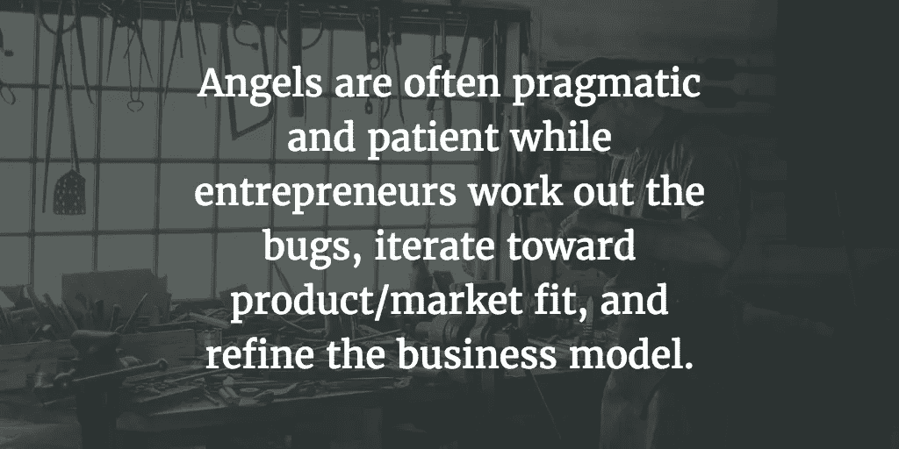
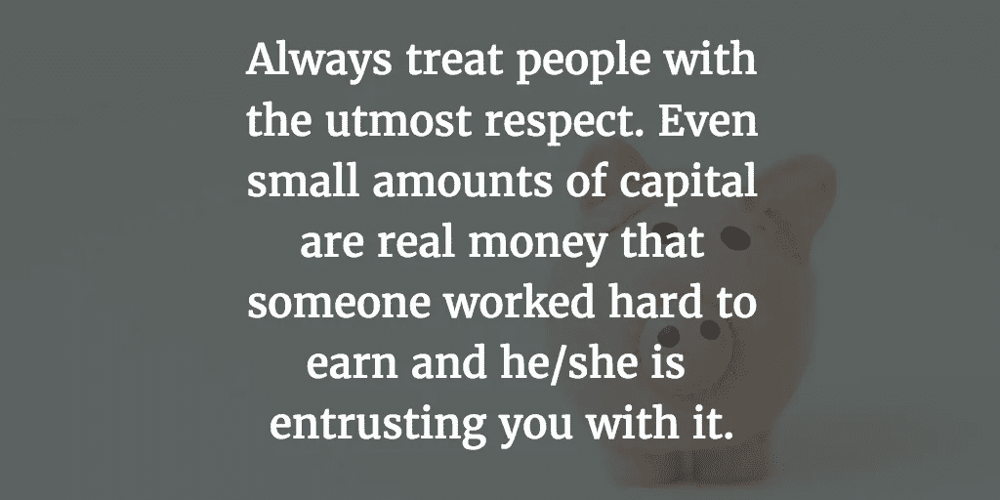

# 与天使投资者合作的创始人指南

> 原文：<https://medium.com/swlh/a-founders-guide-to-working-with-angel-investors-dec8619b50b6>

## 用传统的方式筹集资金。

**天使投资人可能是一群令人困惑的人。他们是个人，不是专业投资者。而个人是，嗯，*个人*。他们有不同的投资主题，不同的目标，不同的风格。一个可能是有着深厚投资组合的资深企业家，他热衷于在 AngelList 上冲浪寻找新的前景，而另一个可能是正在寻找新爱好的退休外科医生。有些人只在他们的朋友投资时才投资，有些人则乐于领投并跟进。不像风险投资家，天使们唯一的信托责任是对他们自己。**

但天使也是创业生态系统的重要组成部分。他们在公司生命周期的最早阶段进行投资，远远早于典型的机构投资者的兴趣。对于需要外部融资的企业来说，天使投资者可能至关重要，有时他们会通过进行关键介绍和提供关键建议来增加现金以外的实质性价值。有合适的天使在船上可以使世界变得不同。他们为企业家希望点燃的篝火提供火种。

这使得与天使投资者合作对创始人来说是一个特殊的挑战。寻找、争取、谈判、结束、沟通、设定期望、获取价值和介绍，以及与天使建立长期关系可能是一个令人担忧和不透明的过程，尤其是对第一次创业的人来说。我试图揭开某些方面的帷幕，比如这里的、这里的和这里的。其他国家在提高透明度方面走得更远。

但有时很难找到一位创始人对管理天使投资人的观点。企业家通常不愿意透露早期融资的细节，因为害怕惹恼沉默寡言的投资者。更重要的是，创业者都在忙着创业！

一旦我开始思考这个问题，我就无法摆脱这个想法。因此，我开始寻找一位能够阐明这些问题并分享他们观点的创始人。我知道有一个人很合适。我是他公司的投资人，从 2011 年开始看他和投资人互动。那个人是乔治·艾斯坎普。

乔治是 GroundMetrics 公司的首席执行官，该公司位于圣地亚哥，为世界上最大的能源公司提供调查和监测服务。几乎就像地质学中的核磁共振成像一样，他们的传感器拍摄地下的全场 3D 图像，操作员使用这些图像来寻找和管理自然资源。

乔治已经通过多轮融资从天使投资者那里筹集了近 1000 万美元。他创造了美国最大的天使团体“科技海岸天使”的规模和速度记录。他的投资人很投入，很热情，经常参与多次募集。他为一家不在硅谷的**而在硅谷的**的初创公司做了这一切，并基于全新的物理学为**打造硬件和软件。这是一个不小的成就，许多创始人都可以从中学习。**

经过几次友好的推动，乔治在这次采访中慷慨地抽出时间分享了他的个人经历和见解。与网上流传的许多吹捧文章不同，他的回答对整个过程的每一个方面都非常详细。这种精细度正是融资讨论中经常缺失的，也是许多企业家最需要的。

事不宜迟，乔治来了。

**你是如何筹集到 GroundMetrics 的首轮天使融资的？你能告诉我到底发生了什么吗？**

GroundMetrics 是圣地亚哥一家名为 QFS 的 R&D 公司的子公司。QFS 专门为 DARPA 和其他联邦机构做高级科学项目。我们在 QFS 内部培育 GroundMetrics，直到需要外部资本来为满足需求所必需的增长提供资金。世界最大的石油公司 Saudi Aramco 要求在沙特王国进行演示。为了确保成功，我们需要比 QFS 预算更多的资金，所以我们决定这将是推出 GroundMetrics 和筹集资金的好时机。

我们还很早，所以天使投资似乎比风险投资更合适。我认为，为一家新的科技企业筹集资金的最佳方式是与了解该技术的投资者合作(在这种情况下，你可能需要让他们相信市场机遇)，反之亦然。世界上很少有人真正理解电磁传感，所以我们认为我们需要从产油国筹集资金，如德克萨斯州或俄克拉荷马州。

我和我的联合创始人以前筹集过资金，但不同的企业会提出不同的问题，所以当我们准备开始吸引石油国家的投资者时，我看到了一个关于科技海岸天使(TCA)的“遇见天使”活动的广告。我相信这是 TCA 的第一次会见天使活动，当时该活动由大约 12 名天使组成，分布在一个宴会厅内，企业家可以向他们推销/交谈。我认为这将是一个测试我们的推销的好方法，可以看到 GroundMetrics venture 可能遇到的各种问题和顾虑。我想人数如下——我与 9 人交谈过，其中 6 人表示感兴趣，这 6 人中有 3 人希望举行后续会议，在 3 名不感兴趣的人中，2 人说这超出了他们的能力范围，一人似乎非常反对。我决定联系那 3 家希望继续进行更多试驾的公司，询问他们是否认为这笔交易可以在圣地亚哥完成，尽管缺乏石油工业和电磁专业知识。他们强烈鼓励我进入 TCA 的正式筛选程序。

最初，我们没有通过预筛选。私下渠道的反馈是，我们的推介非常精炼，因此，由于我没有说融资前的估值是灵活的，他们认为不是，他们觉得估值太高了，在筛选时会持平。我跟进并告诉他们这是灵活的，然后我们开始筛选。

大约 40 人参加了放映。我被告知这大概是他们当时能得到的最多的了。我先提出问题，然后回答问题。然后我被邀请离开。这个过程包括一个闭门讨论来评估兴趣。成员们被要求举手表示是否愿意参与，其中一人必须自愿成为交易负责人——协商条款并领导尽职调查。一位 TCA 告诉我，所有 40 人都举手表示感兴趣，为了确保他们问是否有人没有举手(不，没有人没有举手)。然后，他们提出了 2 个交易线索和 4 个小组，每组 3-4 人，共约 15 人，而不是 3-4 人支持尽职调查的交易线索。

在每一次会议上，预投资都是有争议的，我总是说，如果他们能提出充分的理由，我会考虑降低估值——“太高了”或“我们只是不做那么高的交易”都不是足够充分的理由。最终，我们不仅以提议的前期资金完成了交易，还创下了圣地亚哥 TCA 的两项记录:

1.  从条款清单到成交的最快速度。
2.  大多数从圣地亚哥分会筹集到 120 万美元

那一年，TCA 只投资了数百家公司中的十几家，而大多数公司至少需要去 TCA 的五个分会中的几个。这笔交易进行得如此之快，以至于我们从未离开过圣地亚哥，我听说其他一些分会对他们没有机会投资感到失望。在后来的加薪中，我们去了洛杉矶和奥兰治县，并在这些章节中取得了成功。不幸的是，我们从未去过圣巴巴拉和他们的内陆帝国。

GroundMetrics 打破常规，从天使投资者那里筹集了多轮资金，这是如何实现的？你为什么选择用天使投资来发展公司，而不是去机构化？

我认为对于风险资本或其他机构资金来说，我们还为时过早。我们还没有准备好大幅加薪，所以天使投资似乎是一个显而易见的开始。我知道一些天使组织，特别是 TCA 和其他一些产油国的组织。天使们通常是务实和耐心的，而企业家们解决问题，迭代产品/市场匹配，并完善商业模式。这种实用主义给了我们建立成功基准的自由。

**迄今为止，GroundMetrics 已经筹集了多少天使资金？谁给的。后面几轮和第一轮有什么不同？**

将近一千万美元。

都来自天使。第一轮的大部分是 TCA。随后的每一轮融资都包括约 50%的现有投资者+25%由现有投资者介绍的投资者+25%通过 GroundMetrics 网络和其他天使投资团体获得。最容易筹集的资金(没有钱容易筹集，但相对而言)来自现有股东(如果他们高兴的话)和他们带来的投资者。这是最大的不同。我们的股东群一直对 GroundMetrics 感到兴奋，所以他们会回来，通常是多次回来，其中一些人在每次融资中都进行了投资。

我从没想过我们能在天使投资下走得这么远。我们有机会进行机构轮次，但我们的股东希望自己满足我们的需求，与他们合作非常愉快，所以我们不需要进行机构轮次。

**创始人在哪里可以找到天使投资人？**

优秀的老式网络。在网上查找天使团体。问问天使，你会发现他们与谁合作，或者他们知道哪些其他团体。如果你碰巧认识任何风险投资者，那么向他们寻求天使集团的推荐，这可能是一个很好的选择。

**创始人不该忘记问的棘手问题有哪些？**

他们还做了多少其他交易？在多长时间内？最近怎么样？如果他们可能会成为您的潜在客户，那么他们已经达成了多少交易？

如果他们喜欢他们所看到的，他们会考虑投资多少？通常，问最多问题、需要最多时间的人是投入最少的人。尽早了解他们的范围将有助于你决定对他们进行多少尽职调查……但是除了他们的范围之外，还要记住社会资本。例如，他们可能是其天使团队中的影响者，或者可能通过其他人带来大量资本，或者可能有有意义的行业、技术或运营联系人可以提供帮助。另外，记住永远以最大的尊重对待他人。即使是少量的资本也是真实的钱，是某人努力挣来的，他/她现在正在考虑委托给你。

尽早询问控制条款是否会影响交易。一些企业家不为控制条款所困扰，但如果你是，早点问，因为你不想浪费你(或他们)的时间。找出他们为什么想要想要的控制项，以深入了解他们的观点和动机，帮助衡量一致性。你越一致，控制项实际上就越不重要。

他们的管理哲学是什么？如果你想留在你的位置上(CEO，CTO 等。)而你交付/执行，他们会同意你留在那个位置吗？或者你只是在他们或公司找到或负担得起其他人之前暂时填补这个职位？如果他们想取代你，他们在找什么？问问你自己对此有何感受。如果你留下来，然后询问他们对绩效的期望。

你如何让他们真的开支票？

制造一种紧迫感。做到这一点的一个好方法是设定最后期限。一旦你有足够多的人表示出兴趣(可能是你需要的 50%左右的资金或者是第一次成交)，然后设定第一次成交日期和第二次成交日期。给那些在这些日期前投资的人额外津贴，在第一个日期前投资的人获得更多津贴，在第二个日期前投资的人获得更少津贴(认股权证是这种情况下的常见津贴)。少了多少？也许只有一半那么重要，但也不至于因为错过了第一个而沮丧。第一次多少钱？足够多，以至于当第二秒减少时，第二秒仍然有意义。

与投资者一起确定日期，以便他们能在最后期限前完成。他们可能需要时间来转移资金，和/或可能想多看看引擎盖下，等等。您希望确保第一次结算在所选日期前产生最小结算量。

**这种动态与专业投资者或风险投资家有何相似/不同之处？**

天使投资人是一个模糊的术语——任何人都可以成为天使。让我们假设我们面对的是“金融老练”的天使。

在许多方面，这种动态是非常相似的，因为他们都是熟悉最佳实践的金融头脑，并希望获得一定的资本回报。

如果公司经营良好，天使们往往对退出更有耐心，因为他们不像基金经理那样有时间压力，基金经理有时间目标来满足他们的有限合伙人。

和天使在一起，你是在养猫。你会花更多的时间来测量体温，并与不同的人进行无数次相同类型的对话。他们有时没有一个正式的流程，所以你可能不知道你需要做什么或提供什么，直到它被要求。机构和正式的天使团体往往有一个结构化的过程，更具体地谈论他们的要求是什么，时间表会是什么样子。

你的天使投资人是如何组织的？你如何管理与他们的沟通？

有些人组成有限责任公司，有些人是独立的。

他们有董事会代表，因此我们每季度召开一次董事会会议，内容涵盖一切——财务、销售、销售渠道、技术、知识产权、人员、运营、风险、目标等。

我们每月发送一份损益更新。这是一封通常约一页长的电子邮件，按类别和项目符号进行了细分，以便于浏览，我试图包括图片——简单地展示在现场工作的工作人员可以深入了解现场作业的情况。这是我在股东满意度方面做的最好的事情。我认为他们感到更受尊重和赞赏，对他们来说这更有趣，因为他们可以享受比赛的风景和挑战的戏剧性以及胜利。有些人请我为他们投资的公司举办股东沟通研讨会——我希望有一天能这么做，因为这对所有人都有好处——股东、企业家、管理层、公司等等。

我们还向股东发送年度财务报表和年度预算。

我会向其他人建议以上几点(一开始就承诺)，因为(一)这会增加他们一开始投资的舒适度，(二)会迫使你实际去做，这对你有好处。

这看起来需要做很多工作，确实如此，但是它确实有回报。首先，它提出了许多问题，这比准备更新更耗时。几个回合之后:( 1)你在被提问之前就能更好地回答问题，这样问题就少了;( 2)他们和你在一起会更舒服，也能更好地理解你在说什么，这样问题就少了。当新的投资者进入时，它们再次飙升，但随后以类似的方式回落。

**不只是筹集天使资金，而是和你的天使投资人一起工作五年，你学到了什么？如果你能回到你创办公司的那一天，给自己一条建议，你会说什么？**

你一开始定下的条款和先例将永远有效。在随后的融资中，它们充其量会保持不变，可能会变得更糟……它们肯定不会变得更好。改变现有条款的唯一方法是，如果一个大投资者进来，把它们吹大。那时情况可能会改变，但可能不会变得更好。

你会再次通过天使融资吗？

是的。我希望在未来的投资中与这些天使投资人合作。

**你计划筹集机构资本吗？**

在合适的时间和情况下，我会考虑的。机构资本是火箭燃料，所以你最好做好起飞的准备(例如，产品准备、运营可扩展性、销售渠道、重复销售证明的商业模式等。).对于未来的风险投资，如果我找到一家真正做种子交易的风投，我肯定会考虑与他们合作。

**你对试图融资的企业家还有什么建议？**

诚实，做正确的事。遵循黄金法则。像你希望被对待一样对待投资者(设身处地为他们着想)。生意就像生活一样，是一场重复的游戏，你将不得不永远和自己生活在一起。

喜欢这次面试吗？那么你很可能会喜欢 [*我的阅读推荐*](http://www.eliotpeper.com/p/inner-circle.html) *精选那些探索科技与文化交汇点的精彩书籍。*

[*艾略特·佩珀*](http://www.eliotpeper.com/) *著有《积云*、[霓虹发烧梦](https://www.amazon.com/Neon-Fever-Dream-Eliot-Peper-ebook/dp/B01HUCXBTM)、*、[《不凡系列》](https://www.amazon.com/gp/product/B01604ERV2/) *。他的书受到了*大众科学、商业周刊、TechCrunch、io9、*和* Ars Technica、*的好评，他还在谷歌、高通和《未来评论》等网站发表过演讲。当他不写作时，他与企业家和投资者一起建立科技企业。**