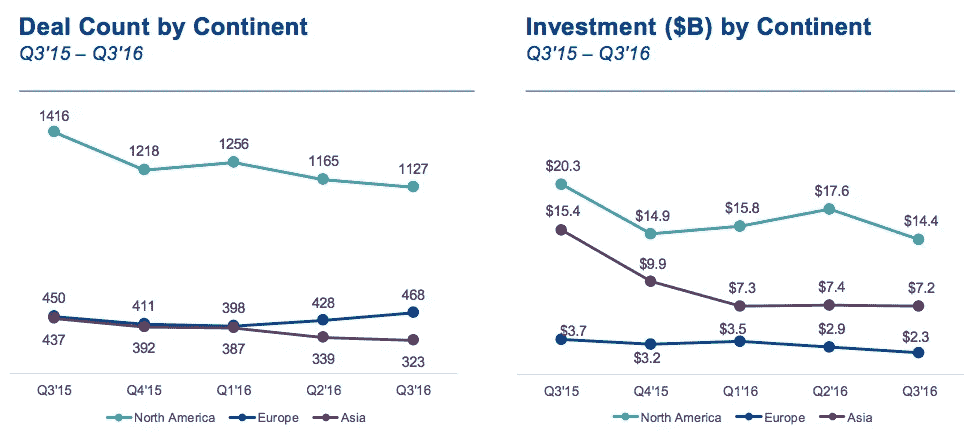

# 创始人对海外投资的主要挑战和好处的看法

> 原文：<https://medium.com/swlh/a-founders-perspective-on-the-key-challenges-and-benefits-of-raising-investment-abroad-257968104b3f>

Credits to Andy Beales

并非所有公司一开始都有明确的海外融资国际战略。“走向全球”可能是一个吸引不少企业家的选项，他们希望在本国以外获得资金。这一旅程通常始于客户订单、商业机会或利用海外关系。

在当今的全球资本市场中，资本流动的便利性使得融资比过去容易得多。根据 [Gust 的**Startup fund Trends 2016 报告**，](http://gust.com/startup-funding-trends-end-of-the-year-2016/)初创公司早期投资者生态系统比以往任何时候都更加强大。随着越来越多的初创公司向种子投资者、天使投资者和风险投资者申请资金，该行业正变得越来越国际化。

 [## 创业融资趋势 2016 年末报告-阵风

### 来自 Gust 的投资者和初创公司数据展示了 2016 年初创公司和早期投资者生态系统的景观

gust.com](http://gust.com/startup-funding-trends-end-of-the-year-2016/) 

然而，在种子阶段和那些早期的后续投资之后，事情可能会变得“复杂”这是陷入*死亡之谷的风险最大的时候，有些人可能会称之为种子轮和大得多的风险投资轮之间的空间。对于成长阶段的公司来说，在国内市场之外寻求资金听起来可能是一个高风险、低成功概率的昂贵提议。*

# *海外融资与国内市场融资*

*几个月前，我采访了四家总部位于欧洲的 Startupbootcamp 校友公司——[*【无限】*](https://limitlessapp.io/)*[*Social Coin*](http://www.thesocialcoin.com/)*[*tes pack*](https://www.tespack.com/)*和* [*虚拟经纪人*](https://virtualbroker.bg/en) ，以了解国际融资的**利弊**。从我们的项目毕业后，他们在本国和海外筹集了更多的资金。***

****以下是我发现的长与短** [ [**点击阅读全文**](https://readymag.com/startupbootcamp/raising-capital-abroad/) ]**

** [## Startupbootcamp | Readymag 的《走向国际:在海外筹集资本》

### Startupbootcamp 的校友们正在分享国际资助的起起落落。以下是我们的长期和短期…

readymag.com](https://readymag.com/985465/) 

## 海外融资的主要挑战:

*   在国外筹集资金可能会变得非常昂贵。有些交易只是需要更长的时间来完成。如果你必须留在那里培养这一过程，你可能会比在家尝试花费更多
*   外国投资者可能不了解新兴市场的全部潜力，并认为那里的风险比现实高得多，例如*美国投资者大多希望投资在美国成立的初创公司，因为他们熟悉法律和税收法规，对正在实施或即将实施的 EU-法规了解较少*
*   如果你正在筹集早期资金，天使投资者会希望看到**在国内成功的证据**

## 海外投资的好处:

*   让你的投资者位于那里或来自那种文化将有助于了解市场
*   投资者可以帮助向潜在客户进行适当的介绍
*   美国等一些市场拥有更发达的投资基础设施，可用资本也比其它国家更多。

> 来自 [**CB Insights**](https://www.cbinsights.com/research-q3-venture-pulse) 的数据显示，欧洲初创公司每获得 1 美元，美国竞争对手就能获得 6 美元。2016 年最后一个季度，欧洲和亚洲分别发生了 468 起和 323 起交易；相比之下，美国同期完成了 1127 笔交易。

Venture Pulse, Q3'16, Global Analysis of Venture Funding, KPMG International and CB Insights (data provided by CB Insights) October 13th, 2016.

# 成长期公司国际化解决方案

作为一个由 20 多个行业项目组成的全球网络，Startupbootcamp 对创新领域有着无与伦比的见解。迄今为止，我们已经收到了来自 120 个国家的数千份申请，投资了 700 多家公司。

自 2016 年以来，去年加速公司的总数量增长了 10%，我们预计到 2018 年底这一数字将翻一番。增长越来越国际化，我们的项目和创业公司都在跨境寻找机会。

随着我们加速越来越多的创始人，这意味着对种子后项目的需求越来越大，因为这些创业公司现在已经度过了婴儿期，并希望扩大规模，扩展到其他市场。

我们知道，启动一家初创公司绝非易事，将初创公司扩展到更大的行业也被证明是一项艰巨的任务，这就是我们创建**规模项目的原因。**

大约一年前的这个时候，我们庆祝了 startup boot camp Scale fin tech Mexico 的推出，旨在支持和扩大拉丁美洲成长期金融科技初创公司的发展。从那时起，我们不仅成功完成了第一个周期，而且我们还将规模计划网络扩展到了 [**【旧金山】**](https://www.startupbootcamp.org/accelerator/scale-san-francisco/)**[**迈阿密(数字健康)**](https://www.startupbootcamp.org/accelerator/scale-digital-health-miami/) 以及不久的上海。**

## **随着我们在旧金山的第二次电子秤演示日的临近，Scale FinTech Mexico 刚刚开放了第二批应用程序！**

**该计划团队将在 2018 年 12 月中旬之前进行一对一面试，让感兴趣的金融科技初创公司有机会了解该计划的好处及其投资团队。**

** [## 适用于 2019 年墨西哥城 SBC 规模的金融科技

### 申请 SBC 规模 FinTech 墨西哥城 2019。Startupbootcamp Scale 是一个面向成长期初创企业的创新计划…

www.f6s.com](https://www.f6s.com/sbcscalefintechmexicocity2019/apply) 

# 一些最后的想法…

毫无疑问，在当今的全球市场中，资本流动的便利性使得初创公司获得融资比过去容易得多。

仍有创始人努力在海外筹集资金，也有超出预期的。在一个好主意会得到回报的时代，让合适的资助者参与进来的重要性从未像现在这样重要。** 

# **如果你喜欢这篇文章，说谢谢👏。**

****

## **这篇文章发表在 [The Startup](https://medium.com/swlh) 上，这是 Medium 最大的创业刊物，有+384，399 人关注。**

## **在这里订阅接收[我们的头条新闻](http://growthsupply.com/the-startup-newsletter/)。**

******