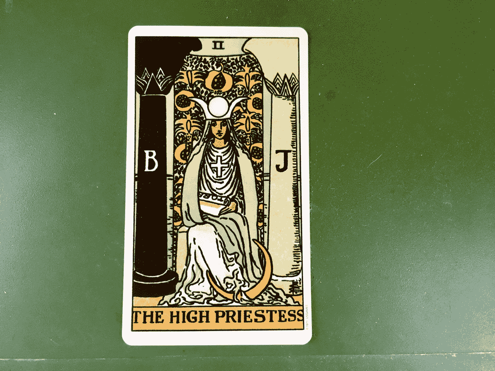
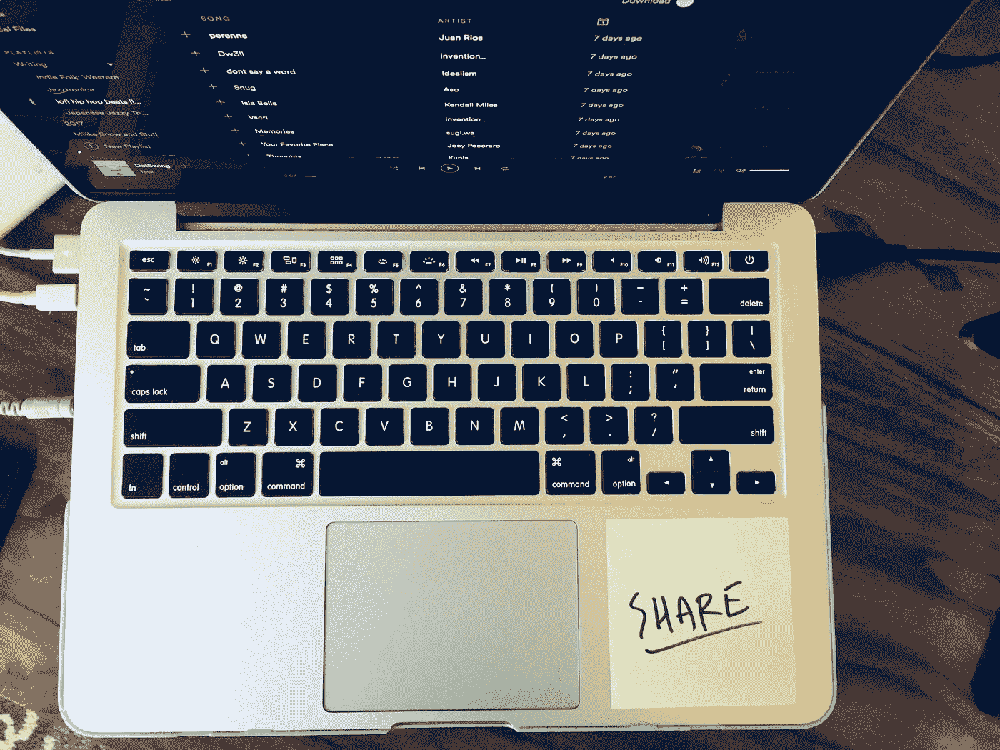
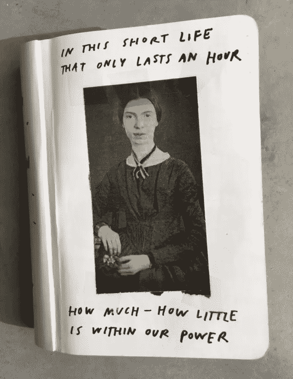
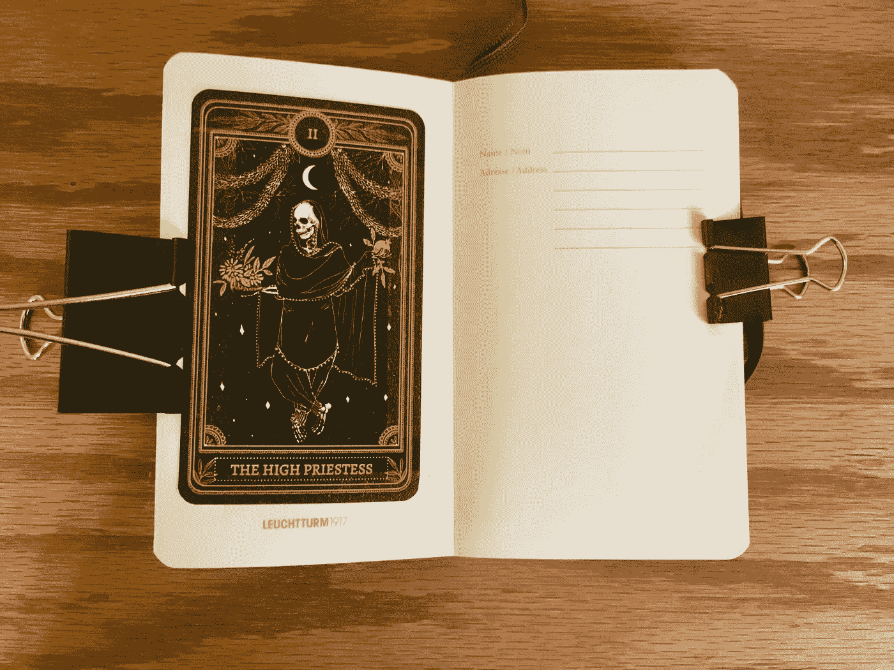

# 一个友好的提醒会带来很大的不同

> 原文：<https://medium.com/swlh/a-friendly-reminder-can-make-all-the-difference-e33486b4c90e>

The **High Priestess** is about trusting your intuition.

当我第一次分享我的 [2018 灯塔词](http://immakingallthisup.com/2018-share)时，几位读者回复了他们自己对未来一年的词。看到其他人[在](https://clowncollegeconfessions.com/2018/01/07/my-lighthouse/) [跳](http://v/) [这个](/p/my-3-principles-for-2018-8a0aedc219f4)练习让写这个帖子变得值得，即使我原本打算跳过它；我本来打算跳过的，因为我觉得去年的单词没什么帮助。

事实证明，“没有发现这个词有用”是一个借口。我的意思是，当我甚至不记得它是什么的时候，很难找到有帮助的单词。我实际上有它来查找，所以我可以写今年的灯塔单词帖子。尴尬。

也许我自己的奋斗与著名的大卫·艾伦(生产率大师和《把事情做好》的作者)的建议有关:

> **“你的头脑是用来有想法的，而不是用来持有想法的”**

(这与我前几周的建议非常吻合——把你的问题写在纸上[。)是的，我确实在博客上写下了这个词，但在你永远不会重温的笔记本上或在你忘记的谷歌文档(或博客)上写下一些东西，与想出一些东西并在第二天忘记它没有太大区别。如果你真的想记住一些东西，那么你必须创造一个视觉提醒，你必须一遍又一遍地看这个提醒。](http://immakingallthisup.com/paper)

当我把今年单词的照片贴在我的笔记本电脑上时，一些人窃笑，但这是真正让今年的单词成为指导我决策的*灯塔*的唯一方法(而不是又一个破碎的承诺)。

有一个焦点并保持这个焦点在头脑中可以帮助你保持在正确的轨道上，避免分心，并完成你的目标。托德·亨利在他的书《偶然的创意》中写了他的“三件大事”——一张他的三个创意优先事项的清单——他一直把它放在手边:

> “我已经养成了把我的大 3 写在索引卡上的习惯，并把它放在我的笔记本或口袋里……定期看到我的大 3 会提醒我现在什么是最重要的，并帮助我过滤刺激。我通过我最重要的创造性优先事项来看待每一天。”

托马斯·哈格罗夫(Thomas Hargrove)，凶杀案档案员(相当的职称！)，一直在开发识别和[追踪连环杀手](https://www.newyorker.com/magazine/2017/11/27/the-serial-killer-detector)的算法。在这个过程的开始，他有很多数据，但不知道如何从这些数据中找出连环杀手。所以他创造了一个友好的提醒:

> **“在他的桌子上方，哈格罗夫贴了一张里奇韦(一个臭名昭著的杀手)的面部照片，照片中他看起来疲惫而阴沉。在下面，他写道，“从统计学上看，连环受害者是什么样的？””**

奥斯汀·克莱恩花了 2017 年在他的笔记本封面上贴上“[守护者灵魂](https://austinkleon.com/2017/12/12/guardian-spirits-2/)”:

> **“早在一月份，我就决定我的新笔记本需要一个守护灵来守护一切……我觉得艾米丽·D·伊金森(Emily D[ickinson]看得很好，所以当我完成那个笔记本时，我决定继续这个练习。今年烧透了 8 个笔记本，所以要挑 8 个精神……”**

克里昂没有具体描述这些精神是如何帮助他的，但我喜欢这个想法，并决定用我最新的笔记本试一试——只是想看看我自己是否能弄明白。我随机抽了一张塔罗牌——女祭司——把她粘了进去。她完全相信你的直觉，并在你自己身上找到答案——这是一个强大的提醒，每次我打开笔记本面对创造性挑战时都要这样做。还不错。

这些想法从愚蠢的到深奥的都有(除了我在这里的简短调查之外还有无数其他的)，但它们都源于同一个想法——记住你的目标还不够好。你的大脑只能容纳这么多的信息，不管某件事今天看起来有多重要，也不能保证明天你会有同样的感觉。虽然在你的办公桌上挂一张某人的大头照可能看起来很傻(或者很可怕)，但是一个小小的提醒可以起到很大的作用。

# 你的一个任务

创建一个你今年正在努力的大目标的视觉提醒(可以是你的 2018 年灯塔单词或其他完全不同的东西)。挂在显眼的地方，发个图给我！

[我的时事通讯](http://immakingallthisup.com)是关于帮助忙碌的人通过可持续的创造力找到意义和满足感。 [**加入我们**](http://immakingallthisup.com) 。

## 这篇文章发表在《创业公司》杂志上，这是 Medium 最大的创业刊物，有 300，118 人关注。

## 订阅接收[我们的头条](http://growthsupply.com/the-startup-newsletter/)。

