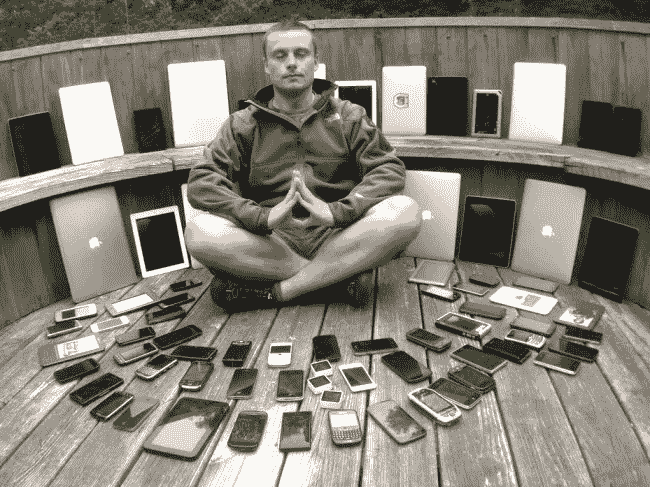
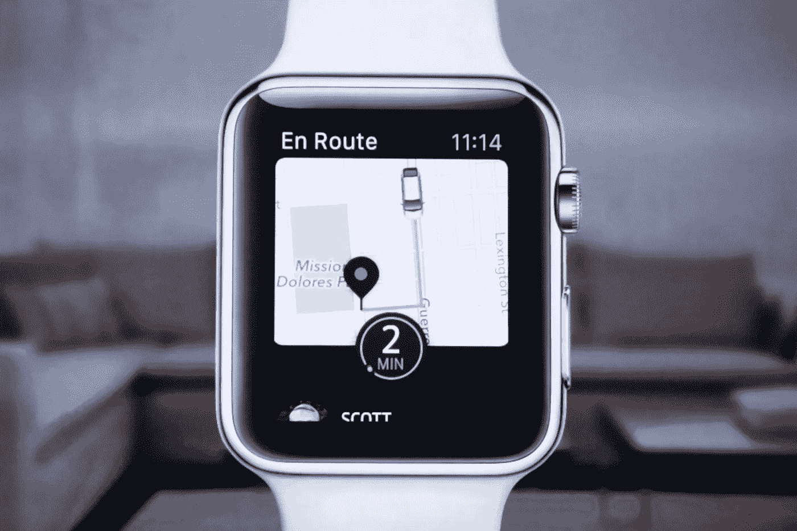
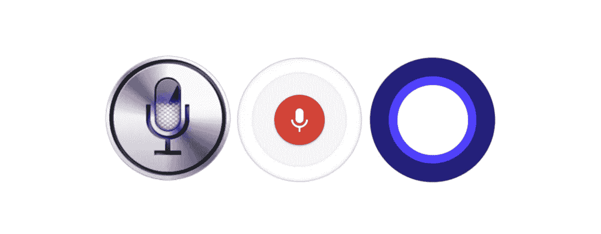
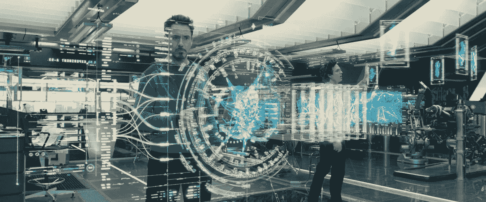

# 体验设计的未来友好方法。2

> 原文：<https://medium.com/swlh/a-future-friendly-approach-to-experience-design-b580375b628a>

这是我的【InVision 网络研讨会的后续，讨论 [UX/XD](https://www.pinterest.com/ashergodfrey/design-ux/) 的未来。在这里阅读第一部分。

*~第二部分~*

像创新和颠覆这样的时髦词汇被抛来抛去，却没有太多意义。如果我们挖掘得更深，在最佳体验的核心，在感知和意识方面有根本性的范式转变。在这个数字领域，我们开始看到无与伦比的连通性。我们在日常生活中消费更多，使用更多，与技术的互动更多，所有这些都可以在任何地方，任何时候，在你的指尖上获得。我们与技术的关系只会越来越密切。

> 我们与我们的移动设备有如此亲密的关系，我们希望它们成为我们自己的延伸——布拉德·弗罗斯特

[The Many Faces of ‘Mobile First’](http://bradfrost.com/blog/mobile/the-many-faces-of-mobile-first/)

# 移动礼物

如果你和我一样，入睡前你触摸的最后一样东西是你的手机，这也是你醒来后伸手拿的第一样东西([起床](http://rise.simplebots.co/)发光，[瞌睡虫](https://www.youtube.com/watch?v=ccwb2AQRhB0))。使用最广泛的移动平台 iOS & Android 值得探索。

# 调和 iOS 和 Android 范式

您如何知道何时使用操作系统的本机控件、创建新模式或使用混合方法？创建一种通用的设计语言可以缓解这些问题。结合两个世界的精华，苹果的“平面”iOS 功能和谷歌的材料设计，可以让你的应用感觉很自然，但又足够独特，让用户意识到他们在一个独特的品牌应用中。

一开始(当你还在学习细节的时候)就遵守规则，沉浸在 [iOS 人机界面指南](https://developer.apple.com/library/ios/documentation/UserExperience/Conceptual/MobileHIG/) & [材料设计指南](http://www.google.com/design/spec/material-design/introduction.html)中。当你第一次钻研它的时候，材料的指导方针可能会让你感到特别难以抗拒，但是正是这种细节和复杂程度让设计师梦想成真。这些基本原则可以跨移动平台应用和整合。在不破坏基本模式的情况下，忠于原生操作系统是很重要的。通过拥抱材料设计和苹果设计准则的精髓，你可以创造融合实用主义、愉悦和意图的有凝聚力的应用体验。

# 打破常规

当你随意使用这些指导方针时，要有意识，并有充分的理由支持。通过混合风格、改变上下文和统一底层模式，将这些本机范例应用到您的设计中，以创建跨所有移动设备和界面的无缝交叉体验。我们能够向前推进和创新的唯一方式是承担创造性的风险。新的和鼓舞人心的工作给别人一个火花，推动他们自己的界限。即使你被迫遵循一种布局或风格趋势，也要加入一点创意，让它与众不同。

# 扁平邮件

时尚来来去去。在过去的几年里，我们已经从 Web 2.0 到 Skeumorphism，再到 Flat to Flatter(随着 iOS 8 的发布)，以及最近的材料设计。Skeuoflatism 会是下一个趋势吗？

> 扁平化设计只是一个开始。真正的趋势是走向简单和直接，我们预计在 2015 年会比以往走得更远——[乔维塔·齐奥布罗](/@jowitaziobro/7-future-web-design-trends-fba93eba6355)

事实上，这与趋势无关，设计系统在不断地自我构建和改进，以适应当前的时代精神。因此，通过超越基本的视觉审美，你可以将“个性”嵌入到一个没有情感的界面中。

> 赋予你的产品灵魂，让它充满活力。

你的产品背后的意义对于你所创造的体验的本质是至关重要的。问问你自己:如果这个意义不存在，你的体验会是一样的吗？最具颠覆性的应用将意义融入到体验中，使它们不可分割。以[优步](/@ImJasonLi/around-the-world-with-uber-1246b0bb796d)为例，真正难忘的体验始于你进入车内，而不是你第一次启动应用程序。Apple Watch 通过让这项任务变得超级简单来促进这项任务。当你打开优步的应用程序时，它会直接显示下一辆车来接你的预计时间。从那里，它只是一个按钮，你的司机就上路了。

Apple Watch event

> 有时候是旅程教会了你很多关于你的目的地——德雷克

旅程就是经历。让它具有吸引力、独特性、粘性和吸引力，即使在用户到达最终“目的地”后，你也能给他们留下难忘的印象

> 专注于微调体验；这就是客户所关心的。用户关注的是体验以及体验带给他们的感受。一旦他们体验到负面情绪——比如沮丧——用户界面就会变得“可见”,他们就会质疑设计。我们应该努力使我们的设计隐形，这样我们的用户就不会看到，而是体验到它们。

我们都在寻找下一个创造性的火花，把它带到我们的作品中。

> *它的真实性；我们可以给我们的界面带来创造性的发明，不仅使它们独一无二，而且更有意义。*

# 发布应用程序

是时候开始考虑设计多任务应用程序、API 和集成平台了。应用程序正在[“成为智能的上下文感知服务，可以链接、共享和相互交谈，而无需我们看到或触摸那些小方块。”](http://www.wired.com/2015/06/apple-google-ecosystem/)随着 Google 的 [Now on Tap](http://www.theverge.com/2015/5/28/8681875/now-on-tap-is-the-coolest-android-feature-google-io) 的推出，Google Now 已经无缝集成，所以你可以不用离开其他应用程序就可以使用它。苹果凭借 Siri 与 iOS 9 的高级集成紧随谷歌之后。个人助理将不可避免地让位于全新的产品形式，并将最终消费单一任务应用。

# 人工智能革命

到目前为止，我们未来最重要的话题是人工智能。 [Siri](http://www.apple.com/ios/siri/) 、 [Google Now](https://www.google.com/landing/now/) 、 [Cortana](http://www.windowscentral.com/cortana) 背后的软件和数据是人工智能，我们听到的声音是那个人工智能的拟人化。人工智能不是机器人，人工智能本身是机器人、计算机或智能手机内部的计算机。只要问这些个人助理中的一个，他们应该能够在不久的将来回答任何问题(例如，你的[超本地天气预报](http://darkskyapp.com/))。

科幻小说在通过讲故事使科技人性化方面做得非常好。《少数派报告》、《星球大战》、《星际迷航》和《钢铁侠》等电影让科技在人类层面上变得更有关联。例如，钢铁侠的头盔是未来派的界面。最令人印象深刻的是贾维斯，超级智能人工智能。当托尼·斯塔克问贾维斯“你能让这件事发生吗？”时，这就相当于说“好吧，谷歌”贾维斯让它发生了。这就是我的未来。

Jarvis simulation in Avengers: Age of Ultron

智能助理仍处于早期阶段，但使体验不同的是与他们声音的情感联系，因为他们听起来像人，他们的特征和个性也很人性化。

> 我们正处在变化的边缘，这种变化堪比地球上人类生活的兴起。— *弗诺尔·温奇*

# 奇点

我们正以越来越快的速度向前迈出更大的一步，在某个时刻，我们将迈出如此巨大的一步，以至于我们的感知将被改变到我们不得不重新考虑作为一个人意味着什么的程度。最终我们会考虑人工智能——从某种意义上说是人类。

> 我们正在接近计算机变得智能的时刻，不仅仅是智能，而是比人类更智能。到那时，人类——我们的身体、我们的思想、我们的文明——将会彻底地、不可逆转地改变。— [时间](http://content.time.com/time/magazine/article/0,9171,2048299-1,00.html)

随着时间的推移，我们设计的界面可能会有效地变得不可见和集成，但这只有在我们将它们设计成易读、有上下文、可理解，并且将文化体验置于技术之上时才会发生。

# 面向未来的设计

设计的未来将在我们运行搜索查询或打开应用程序主屏幕之前预测我们的需求。目前，我们生活在一个有着高度可视界面的世界里，但是如果我们的意图能够被可靠地感知到，我们也许能够摆脱没有界面的生活。今天的设备生态系统清楚地表明，我们可能还没有为零界面做好准备，但我们越来越接近了。我们已经获得了源源不断的上下文相关的、个性化的、经过精心策划的无缝信息。我们应该努力设计能够与现实世界的复杂性流畅互动的界面。

> 体验设计的未来是关于情感意识的；以我们相互联系的方式将我们与产品联系起来。

设计师将被期望创造端到端的体验，而不仅仅是界面；跨多个屏幕和平台的产品和服务与设备无关。UX 设计将不再是设计新功能，而是设计生态系统，在生态系统中，用户体验的每一个细节都被仔细检查和完善。这就是为什么“UX”(用户体验)将成为过去，“XD”(体验设计)已经是未来。

如果你觉得这很有见地，请帮我一个忙，点击那个心形图标❤——你未来的自己会轻拍你的肩膀；-)

## [讨论设计师新闻](https://www.designernews.co/stories/54543)

— — —

## 让我们在社交上成为朋友吧！

[Asher G. Blumberg](https://twitter.com/ashergodfrey) 是一名 UX/XD 设计师，站在技术和人类情感的交汇点，通过品牌和互动将两者结合在一起。他利用业余时间制作迷因。目前 Asher 正在设计移动第一体验#startuplife。

[Twitter](https://twitter.com/ashergodfrey) ， [Dribbble](https://dribbble.com/ashergblumberg) ， [Instagram](https://instagram.com/ashergodfrey) ， [Email](mailto:ashergblumberg@gmail.com)

*发表于* **创业、旅游癖和生活黑客**

-