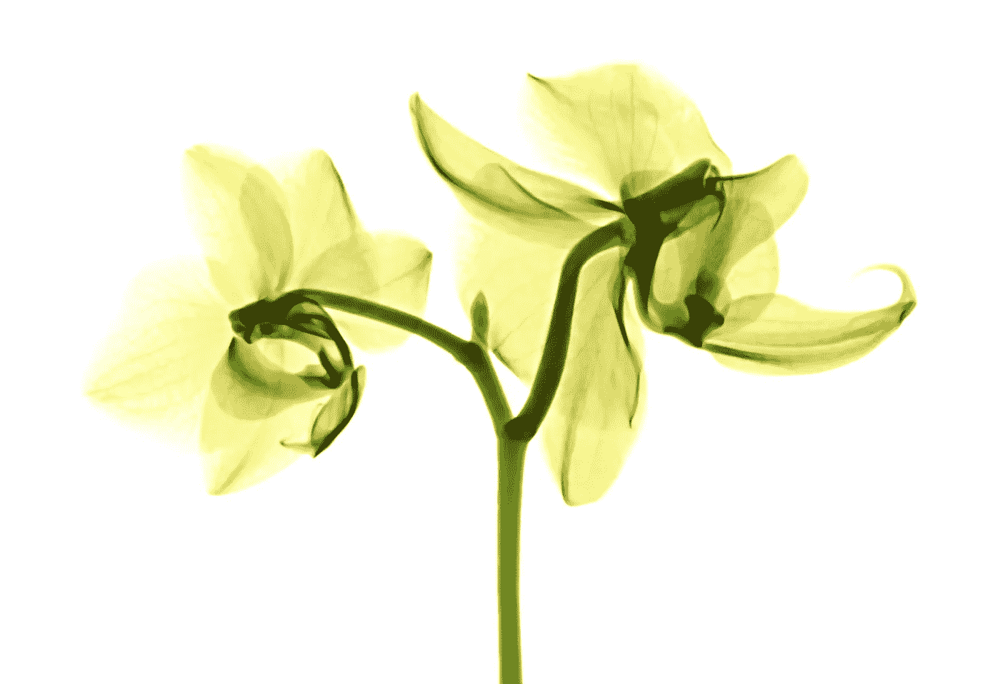
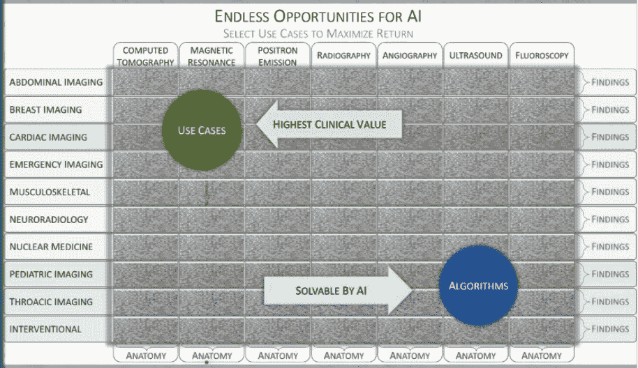
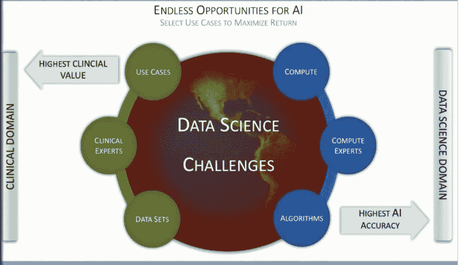

# 人工智能和放射学的未来

> 原文：<https://medium.com/swlh/a-future-of-ai-and-radiology-829b26080a08>

Photo by [Mathew Schwartz](https://unsplash.com/photos/29C0B7Z1NDo?utm_source=unsplash&utm_medium=referral&utm_content=creditCopyText) on [Unsplash](https://unsplash.com/search/photos/xray?utm_source=unsplash&utm_medium=referral&utm_content=creditCopyText)

当我第一次和泰说话时，我清楚地记得他说，“好吧，那么如果我们在 2 到 20 分钟内找到结节，现在怎么办？我们如何确保最佳的连续护理？”

我们需要深入思考并不断挑战旨在破坏医疗保健的潜在新技术的前提。仅仅让一个算法告诉医生什么是不好的是不够的——还需要有**连续性**。也就是说，算法的未来需要比现在的技术水平更深入。

如果不是，它就不会像我们想象的那样*具有破坏性*。

这一创新的一个关键部分是为全球不同经验水平的放射科医生收集意见。没有你和你的同事们的参与，这些系统将不会被充分充实，也不会按照放射科医师的工作流程来设计。

这是*当务之急*放射科社区得到关于这个话题的教育，并说出任何疑虑，困惑，或兴趣。没有愚蠢的问题，每个人都在他们学习旅程中的特定位置。

我们看到这个新平台在我们眼前成长，我们可以随着它的成长而塑造它。这是这些文章背后的主要动机。随着越来越多的人在放射学和医疗保健领域接受机器学习主题的教育，人们会越来越适应使用工具来增强工作流程的想法。

我们相信这张照片能表达一千个字——如果不是更多的话。在表中的每个方框中，都有一系列诊断用例，可以由人工智能研究人员和医生组成的团队进行研究。

然而，我们需要一起适当地确定哪些问题值得解决。我们需要让我们的钱得到最大的回报，正如图像中所示，目前在具有高临床价值的用例与人工智能可解决的算法之间存在权衡。

追溯到上一篇文章，放射学和人工智能的未来状态将面临自己的一系列挑战。上面的这张幻灯片显示了推动这些项目的一些主要活动部分。

*计算、算法和数据*在之前的一篇文章中被提到是大数据和人工智能出现的推动力。然而，随着更密集的用例开始发挥作用，这些因素将变得越来越重要。算法将需要更加高效和可部署。计算需要更快，这样才能处理更多的图像。数据永远是需要改进的地方。

此外，整个过程都需要临床专家。医生可能不会被说服，但他们需要成为这个过程的一部分，因为他们将是使用这些工具的人。需要对 I 型和 II 型错误以及特定放射学用例可以接受的内容进行适当的指导。

人工智能的未来是光明的。在第 4 篇文章中，我们介绍了一些用户几乎一直在使用的真实应用程序。在医学领域，尽管需要时间，但短期、中期和长期都会出现混乱。有很多用例，但只有那些背后有真金白银、人们认为值得解决的用例，我们才会看到机器学习的第一次实现。小心点！

在您的手机上尝试一下:

1.  打开格鲁利希和派尔，选一只手
2.  在您的手机上转到:16bit.ai/bone-age
3.  给手拍张照，看看他们做得怎么样

这篇文章是 10 部分系列的一部分，重点是医疗保健中的机器学习。看一下我们之前的文章。

**放射科医生机器学习入门——10 集系列**

*作者:* [*达尼洛*](https://www.linkedin.com/in/danilo-pena-01010/)*[*泰·瓦雄*](https://www.linkedin.com/in/tyvachon/)*

**编辑:* [*迈克尔博士*](https://www.linkedin.com/in/michael-doxey-md-73508916a/)*

**幻灯片图片来自:* [*凯斯·德雷耶博士*](https://www.linkedin.com/in/dr-keith-j-dreyer-45976539/)*

*[*第一部分*](https://towardsdatascience.com/introduction-to-our-radiology-ai-series-51d0e54cd3b9) *|* [*第二部分*](https://towardsdatascience.com/how-radiology-and-ai-will-come-together-36e48bb56870) *|* [*第三部分*](https://towardsdatascience.com/article-3-machine-learning-and-artificial-intelligence-introduction-c0e558974a11) *|* [*第四部分*](https://towardsdatascience.com/common-applications-of-ml-algorithms-e16f21c85773) *|* [*第五部分*](/predict/machine-learning-starter-pack-part-1-26b7890b59a5) *|* [*第六部分*](/predict/machine-learning-starter-pack-part-2-9a69c16bb6d1)*|**

**

## *这篇文章发表在 [The Startup](https://medium.com/swlh) 上，这是 Medium 最大的创业刊物，有+ 378，529 人关注。*

## *在这里订阅接收[我们的头条新闻](http://growthsupply.com/the-startup-newsletter/)。*

**