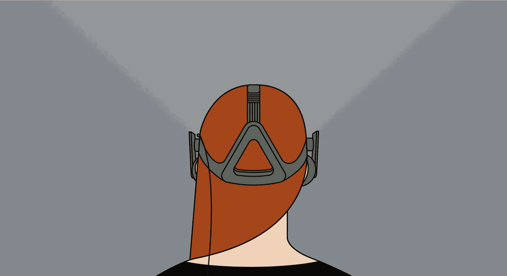
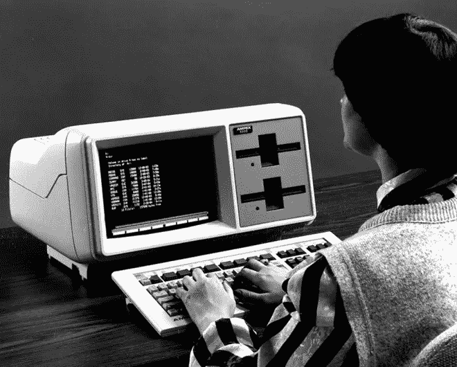
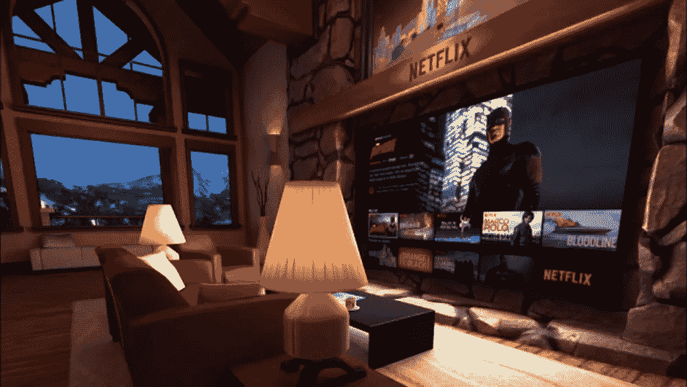
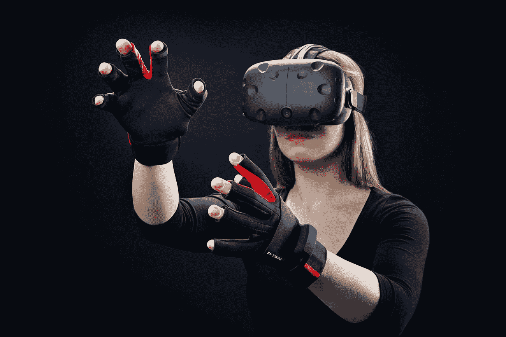
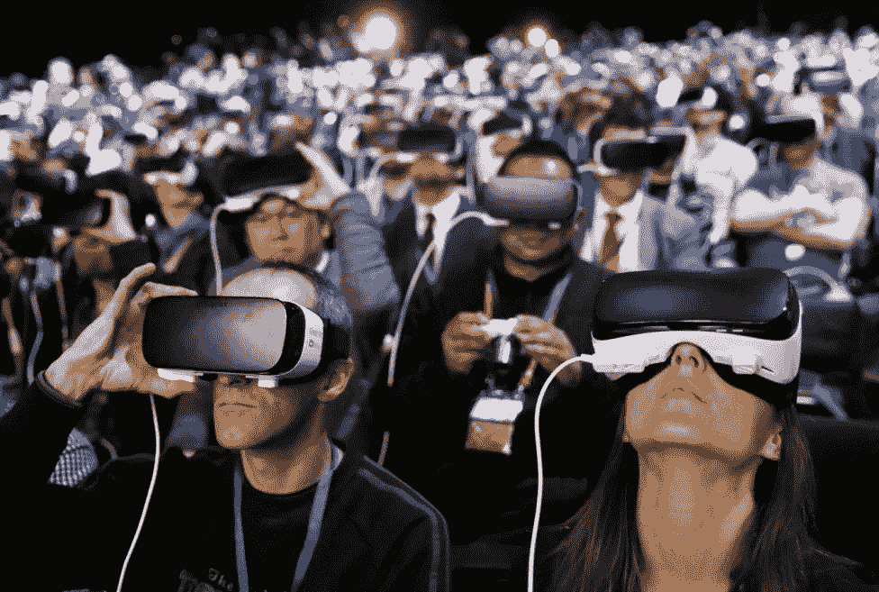
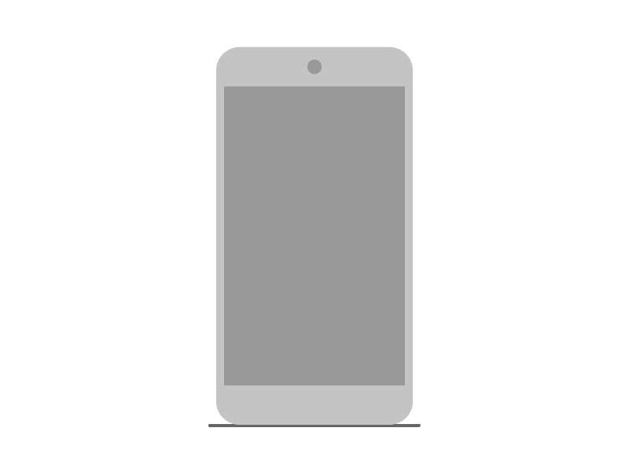

# 没有屏幕的未来

> 原文：<https://medium.com/swlh/a-future-without-screens-9c89afbfedb3>

## 虚拟现实如何快速改变我们与科技互动的方式

[Read all about designing, developing, and building VR businesses on Crew](https://crew.co/backstage/issues/virtual-reality).

很不幸的是，你可能比你童年的卧室更了解脸书的角落和缝隙。我们在日常生活中采用了技术，这使得过去去车道尽头拿纸的散步变成了滚到床边，昏昏沉沉地按下按钮。

但正如社交媒体和屏幕向数字世界的转变与报纸和餐后广播节目大相径庭一样，这种“新常态”正处于另一场地震式转变的边缘。

如果技术专家和未来学家都没问题的话，很快我们就会从车道的尽头退到床边，退到一副护目镜前。

我们已经变得如此舒适的网络世界正在从独立的屏幕转移到虚拟空间——这一变化不仅仅是关于*如何看待*技术，而是关于我们如何实际与它互动。

我们对虚拟现实的采用不仅会促使我们反思我们的社会行为，还会对我们认为理所当然的东西:空间提出一些非常实际、非常有趣的问题。

我们将如何与这个新的维度互动？公司是如何开始考虑这种与空间的新互动的？这将如何改变我们与科技互动的方式？

# 技术简史(以及我们如何与之互动)

几周前，当我和一个朋友讨论虚拟现实的未来时，我们的话题又回到了同一条路上:“当然，虚拟现实会是一种很酷的体验——我期待着随时坐过山车——但我仍然不明白我们将如何在这个 3D 空间中与二维方面互动？”

这种对话很有趣，因为它迫使普通人思考界面:这是一个历史上留给计算机工程师的话题，他们可能从未在潮湿、昏暗的环境中工作过，但想象起来很有趣。

你今天熟悉的界面，就像你正在阅读这篇文章的智能手机屏幕或笔记本电脑，被称为图形用户界面(GUI)，在 80 年代由施乐、苹果和微软普及。

*We’ve come a long way with how we interact with tech.*

在早期，这是一种神秘的、高度编码的体验，包括在不祥的黑屏上键入一组基本命令。

随着时间的推移，个人计算之神(乔布斯、盖茨等)进行了渐进的改进，这样向你的计算机发送命令变得简单而直观。键入的命令慢慢被可以用鼠标指针点击和拖动的符号图标所取代——这些动作我们今天认为是理所当然的，但在当时却是巨大的创新。

现在，我们对当今图形界面的体验已经成为第二天性。

我们的浏览器知道我们想要的单词。我们的移动设备允许我们拖动、捏和触摸，准确地选择我们放置的内容。

简而言之，经过大约 30-35 年的个人计算，我们已经达到了每个人都可以使用电脑的地步，包括你的祖母。如果她不能，那是因为你没有给她买平板电脑。(她的遥控器比波音 747 的驾驶舱多了 38 个按钮。她绝对可以用平板电脑工作。)

所有这些令人着迷的是，就在我们掌握了前一个时代的时候，我们正处在一个全新的计算时代的边缘。

我们已经习惯于在专家层面体验和设计的东西——也就是界面——是设计师和用户必须以一种全新的方式再次审视的东西。

# 为虚拟空间设计

以网飞为例，它的用户体验非常简单。访问网站，滚动浏览电影列表，点击选择，然后观看。但是当界面不一定是屏幕时，这看起来如何呢？突然之间，有一些全新的皱纹必须考虑。

第一个问题是空间:在传统体验中我们不必考虑的东西。

虚拟现实是一个完全不同的旅程。我们戴上护目镜，选择网飞，然后立刻[发现我们在一个小木屋](https://www.youtube.com/watch?v=vAWDhiJpZ2M)。当我们环顾四周，我们意识到我们正坐在一个 60 英寸的大电视屏幕前的红色沙发上——这是我们第一次感受到虚拟尺度的感觉。

*Netflix in VR (complete with snowy mountain backdrop).*

我们不再需要依赖索尼或 LG 为我们生产高清电视。我们在《网飞的世界》中参观的小屋提供了我所见过的最大的电视之一，他们把它安装在一个巨大的石头壁炉里。在我涉足虚拟世界之前，在我的 5 英寸屏幕中拥有 60 英寸的屏幕并不是我所期望的(更不用说透过机舱窗户玻璃倾泻而出的壮丽山脉了)。

在我们使用应用程序的主要功能之前，我们必须使用空间。这引发了其他几个问题，不仅仅是对网飞，而是对少数几个每个人都满意的数字目的地。

**想想谷歌、YouTube 和脸书。我们将如何浏览目前 2D 的基本菜单？**

像谷歌搜索这样简单的东西将如何在新的现实中体现自己？我们会用声音探索吗？我们的手？我们是否会浏览菜单来访问某些功能？

我们甚至还没有触及这些环境的外观、感觉和声音。

# 在虚拟世界里弄脏你的手

就像现在这样，有许多全新的导航功能需要我们重新学习。过去简单的点击操作现在因我们使用的设备而异。一些设备要求我们通过移动头部来导航一组十字准线(而不是我们用来引导手的鼠标)。要选择一个对象、图标或一段文本，我们单击耳机侧面的一个按钮。

在其他情况下，我们可以戴上一套手套来操纵虚拟空间中的对象或从菜单中选择项目。

最后，经过这么多年，我们的声音终于准备好定期使用自己。在我们的移动设备上仍然是一个笨拙的事后想法，在没有鼠标或键盘的空间里，用我们的声音浏览感觉是合理有用的。

当我们沉浸在一个拥有无限可能性的虚拟世界中时，回到现实世界像键盘一样寻找我们想要的东西是多么可笑？

突然间，我们与科技互动的最重要的方法变得模糊不清。试过用 VR 键盘吗？我会帮你省事的。[情况不妙](https://www.youtube.com/watch?v=Ifa-XIjrAYM)。

# 但是，是的，会有成长的烦恼

如果历史是一个标记，我们即将经历的阶段将是最有趣，但也是最可笑的虚拟现实时代。想想早期网络的地理城市。想想早期的脸书。想想世嘉 Dreamcast 的海员。

没有比[观看虚拟脸书](https://www.youtube.com/watch?v=SqspyrTkR9w)的早期演示视频更好的证明了，这感觉就像是实时播放的董事会议头脑风暴。脸书把他们能理解的每一个想法都抛到了软木板上，不管是旧的(又一个版本的油漆)还是新的(照片球)，看看什么能坚持下去。

当相互竞争的科技公司解决了我们界面体验的具体细节，并慢慢开发出一套广泛的标准导航功能时，下一个合乎逻辑的问题似乎是，我们将如何以及在哪里与这些虚拟空间互动？

尽管我们担心越来越孤立，但许多专家都充满希望，预测虚拟现实实际上会帮助我们以前所未有的方式与他人联系。

[在最近的一次 TED 演讲](https://www.ted.com/talks/chris_milk_how_virtual_reality_can_create_the_ultimate_empathy_machine?language=en)中，导演兼虚拟现实先驱[克里斯·米尔克](https://medium.com/u/83cada7e0a26?source=post_page-----9c89afbfedb3--------------------------------)并没有将耳机称为一个技术平台——他将它们称为一个人性平台。不管这种说法听起来多么理想化(和俗气)，他描述了讲故事和人类互动历史中的一个关键因素。

自从我们拥有了交谈的能力，我们就通过口头文化、书籍、广播、电视、电影和网络与他人分享我们的经历。

所有这些媒介的一致之处在于，我们必须在不同程度上运用我们的想象力来与主角或讲故事的人产生共鸣。不管体验有多沉浸，我们总是用我们的想象力来填补空白。

米尔克认为，虚拟现实与以前的媒介的区别在于，我们最终能够以一种发自内心的方式，从讲故事者的角度来体验一个故事。

虚拟现实不是讲述“那边”人们的故事——无论他们是难民、遭受极端干旱条件的人，还是狩猎猛犸象的穴居人——而是有能力将我们直接置于他们的环境中。故事变成了关于“我们”的。

这也是为什么专家们在讨论各种虚拟话题时，从[运动](http://www.ted.com/talks/chris_kluwe_how_augmented_reality_will_change_sports_and_build_empathy)到[基础 VR 教程](https://www.youtube.com/watch?v=T_z5sLijIPg)，通常把它[称为共情机器](http://www.wired.com/brandlab/2015/11/is-virtual-reality-the-ultimate-empathy-machine/)。

上述教程最吸引人的时刻(相信我，我以为这些时刻会在零点开始)是主持人的兴奋，不是太阳马戏团的表演，或在我们的太阳系中漂浮的失重时刻，而是坐在蒙古蒙古包中，体验外国文化的细微差别。

当然，爆炸性的铃声和口哨声很棒，但有趣的是，我们的主要吸引力之一是与他人联系，并以这样一种好奇的方式探索他们的环境。再说一次，在虚拟现实中，你不是在吸收别人的经验，你是其中的一部分。

而 VR 的超越能力并不止于此。Milk 将社会沉浸的概念向前推进了一步，表明我们访问的空间可能很快会超过物理场所的表现。

我们也可以直接接触到某人的想法和感受，而不是去拜访某人的家，或者在一个遥远的海滩上见面。米尔克称之为“冲浪我们的原始情感”,其含义是巨大的。想象一下你自己，日落时斜靠在沙滩上——一群朋友和当地人在你身边——有一条直通他们情感的管道。

不要依赖他们的话语和你的想象来内化他们的经历，如果你也是其中的一部分呢？

# VR 会让社交媒体真正社交化吗？

这些社会和空间创新不仅会对你我这样的个人产生变革，也会对我们熟悉的科技公司产生巨大影响。

目前，我们有一生的音乐唾手可得——最近通过每周播放列表推荐等方式根据我们的个人偏好进行了定制。

不难想象，像 Spotify 这样的公司已经开始构思为你的虚拟体验配乐的方法:为海滩日落创作一首空灵、忧郁的配乐，或者是与一个团体对共享空间的普遍情感反应同步的定制配乐。

这种影响显然也会渗透到这些空间的物理层面。就像谷歌根据个人历史自动填充你的浏览器搜索一样，你可以肯定，你去的地方很快就会根据你的个人喜好量身定制。

如果谷歌或另一个科技巨头变得有创造力，也许我们会有灵感来自我们最喜欢的艺术家或我们最喜欢的导演的经历的空间(由我们的网飞历史推动)——所有这些都是可塑的和可定制的，因为技术遵循[摩尔定律](https://en.wikipedia.org/wiki/Moore%27s_law)的必然轨迹。

当然，我们还没有触及这些空间的持久影响，以及它们被记录和保存的共享体验——这是马克·扎克伯格非常兴奋的事情。

尽管脸书仍处于虚拟现实的早期阶段，[扎克伯格已经讨论了](https://www.youtube.com/watch?v=VQaCv52DSnY)媒体保存我们捕捉的关键时刻的能力，无论是一岁生日还是求婚。

我们将能够邀请来自世界各地的朋友和亲戚与我们分享这些活动，但这一功能最强大的元素将是体验的持久质量。

在我们虚拟的未来，脸书将成为一台时间旅行机器，让人们可以随时进出他们最喜欢的记忆。

半个世纪以来，科幻作家一直在暗示所有这些虚拟的可能性，我们的技术似乎终于赶上了我们的梦想。

当然，我们已经有了几代人来解决个人计算中不太引人注目的元素(即界面)，在未来几年我们还会有更多的问题需要解决。

也就是说，我们已经从单行命令走了很长的路。

# 准备好建立你的虚拟世界了吗？你有想法，我们有才华。[我们谈谈吧。](https://crew.co/?utm_source=Medium&utm_medium=CTA&utm_campaign=MediumCTAs)

## 查看 Crew，在这里您可以与最好的虚拟现实设计师和开发人员一起工作。超过 1000 万人使用了剧组生产的[产品。超过 300 万人阅读了我们的博客。在这里加入他们](http://crew.co/?utm_source=Medium&utm_medium=CTA&utm_campaign=MediumCTAs)。