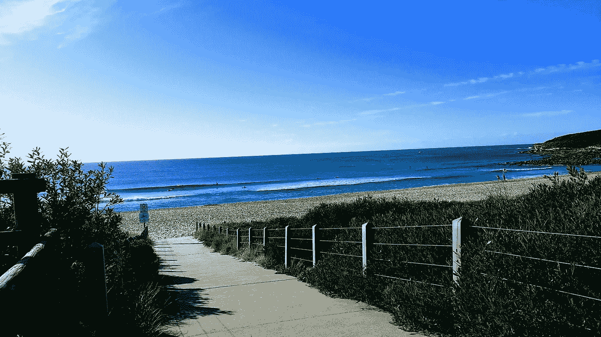
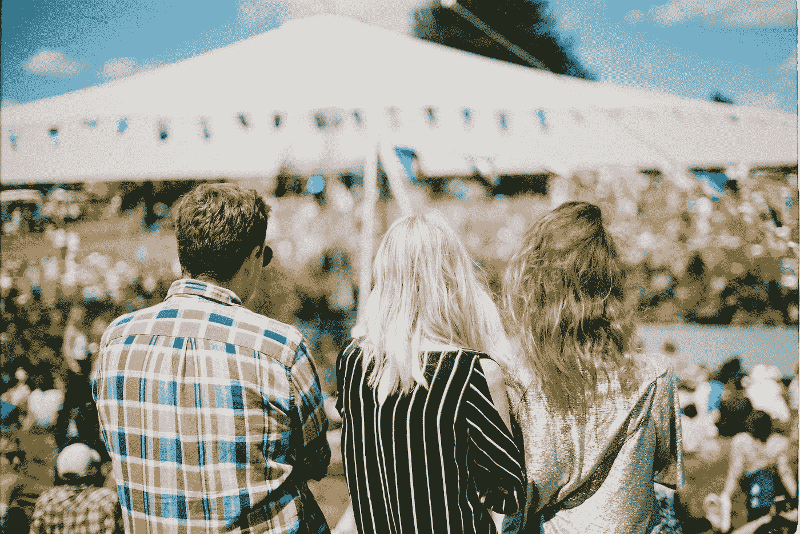
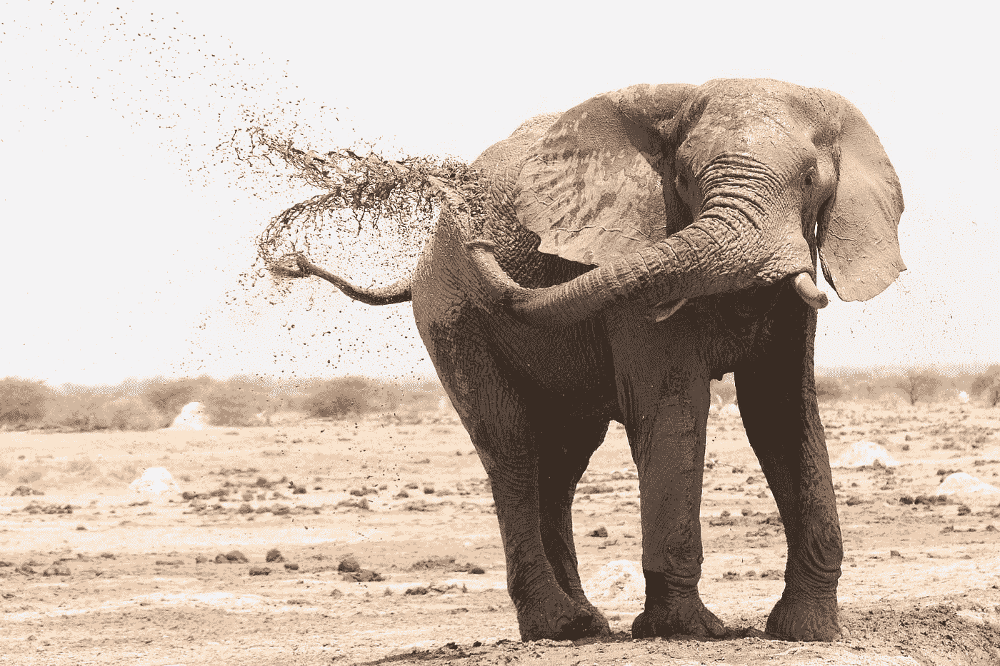
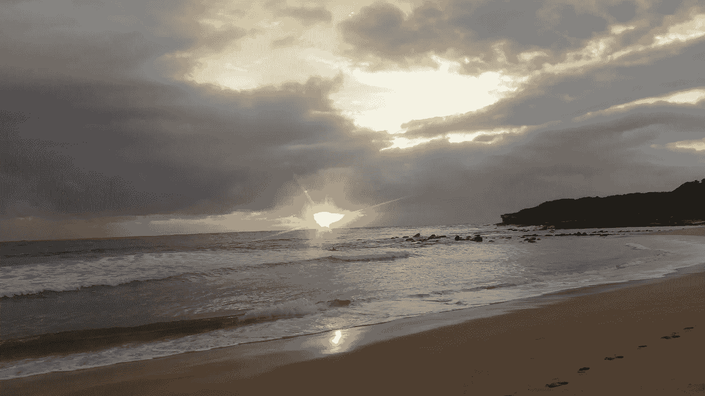

# 我自由事业幕后的一瞥

> 原文：<https://medium.com/swlh/a-glimpse-behind-the-scenes-of-my-freedom-biz-24395aba9c2b>

当我看到 Judith Morgan 正在做一个博客时，我欣然接受了这个机会，成为参与其中的 52 名博客作者之一。首先，任何以 fest 结尾的东西通常都很有趣！我是朱迪思作品的粉丝，在我的待办事项清单上有“客座博文”，这看起来非常合适。

最重要的是继续关于朱迪思的书[你的生意你的方式](http://www.judithmorgan.com/book)的对话，我一直在脸书上看到诱人的片段，一直想看，但还没有抽出时间来读。那种快乐和相关的智慧仍在等待着我！[博客节](http://www.judithmorgan.com/blog)正在[朱迪思的博客](http://judithmorgan.com/blog)上举行，许多优秀的博客作者和企业主一直在这里写他们是如何按照自己的方式经营企业的，并附有朱迪思富有洞察力的回复。

Blogfest ! Who doesn’t love a good festival?! ([Aranxa Esteve](https://unsplash.com/@aranxa_esteve?utm_source=medium&utm_medium=referral) on [Unsplash](https://unsplash.com?utm_source=medium&utm_medium=referral))

所以我和 Judith 定下了我的出版日期，安排在我要写博客的时间。然后，我的脑海里开始充满了关于我如何以自己的方式经营我的企业的想法，这些想法渗透得非常好，随时可以用手指敲击键盘。

直到我坐下来写博客，什么也没有，其实也不是什么都没有，有很多话，但我不喜欢这些话的样子！我换了位置，这是我被困时常用的一招，从家里的办公桌换到健身房的咖啡厅，还是没有结果。什么都没有，形式上什么都有，但没有什么有价值的。我发现自己不是一个兴高采烈的 blogfest 参与者，而是穿着雨靴，带着帐篷冲进大门，而是尴尬地站在外面，看着其他参与者在节日上愉快地交往和玩耍。

在获得参加 blogfest 的入场券(简单地回答“是，请朱迪思”)和到达 blogfest(也就是提交我的博客)之间，我一直在通过他们的博客了解其他优秀的企业主，冒名顶替综合症发作了！我凭什么用我的方式写我的生意，我甚至不知道我的方式是什么！我是不是耍了朱迪思的小聪明，在黑暗的角落里从一个兜售者那里非法获得了我的票，当我交出现金时，他鬼鬼祟祟地从他的肩膀上看过去？！

然后我又看了一遍朱迪思的书名。我们的生意，你的方式。学会相信自己。放松点。你有这个。

更真实的话是说不出来的，因为我发现学会相信自己是做生意的一个非常非常重要的部分。朱迪思又一次击中了要害！我放松了，太阳从云层后面出来了，博客之门猛地打开了，我被迎了进去。所以现在房间里的大象，或者我应该说节日里的大象已经被解决了，让我们继续吧！

The elephant in the fest! (C[aterina Sanders](https://unsplash.com/@catsanders?utm_source=medium&utm_medium=referral) on [Unsplash](https://unsplash.com?utm_source=medium&utm_medium=referral))

# 所以，最大的问题是，我的方式是什么？

老实说，由于我对商业还相当陌生，这是一种我仍在摸索的方式。但我已经得出了一些重要的结论，并在缓慢但稳步地发展其他结论。我的方式伴随着自由，大量的自由，正如我的事业恰如其名。它适用于我、我的企业和我的客户，并在我的宣言中被总结为几行；

***选择自己是谁，做什么的自由。放弃、坚持或尝试不同事物的自由。生活是为了活着的人，你将如何过你的生活？***

自由是我离开全职工作开始自己创业的理由，所以现在我在这里，我打算充分利用它！

很长一段时间以来，我一直是一名被困的员工，听从别人设定的时间和地点。甚至我的衣服，不管是高跟鞋还是钢头靴子(我都穿过！)不是我的选择！也不是我必须遵循的路线或我必须说或做的事情。有时很累，有时会摧毁灵魂。

现在我有选择我是谁和我做什么的自由，我可以坦然地做我自己，用最适合我的方式做事。

我的一周更加不固定，有些日子我会早开始晚工作，有些日子我会早结束或晚开始，通常是用锻炼或冒险来填补传统的“朝九晚五”的空白。周三是我最喜欢的一天，在那里我可以注射两次阳光和盐水来保持我的精神和动力。海洋游泳之前先做一点工作，然后再做一点工作，然后早早结束在悉尼港的航行。极乐世界！工作现在确实悄悄进入了我的周末，但我完全可以接受，因为我喜欢它的工作，它穿插着乐趣，对我来说，这一切都是关于平衡。

Maroubra Beach — not a bad place for a swim!

Twilight racing on Sydney Harbour

我已经决定不赞同这样一种理论，即当你开始一项新业务时，你必须在最初几年全力以赴，抛弃朋友、家人和爱好。谁知道这样也许生意会发展得更快，但如果我在此期间筋疲力尽，不再享受乐趣呢？对我来说，古老的格言适用；

***“你总能赚更多的钱，但你永远赚不到更多的时间”*** **吉米·罗恩**

所以我选择明智地利用时间，平衡我的事业和生活。我的目标是为我的客户树立这种行为模式，这样我们就能过上和谐快乐的生活。

我也选择了自由的地点，在家工作，在咖啡馆工作，甚至在多个营地工作，在我最近的挑战中，包括连续 52 周每周去露营，我都做到了。我发现户外活动鼓舞人心，也激励了我的事业。我的教练课程在户外、海滩或公园举行，我即将开始的面对恐惧计划将包括露营、徒步旅行和在一个美丽的国家公园面对恐惧。计划进行一次更长的自行车旅行。多么有趣我想让我的客户从繁忙的生活中抽出宝贵的时间，所以我选择我觉得有趣和鼓舞人心的活动和地点。没有需要小薄荷糖的沉闷的会议室(虽然我确实喜欢小薄荷糖，但也许其中一些是必需的！)

[Sunrise Sessions](http://www.oodlesoffreedom.com/programs/the-sunrise-sessions/) — my monthly intention setting sessions are held at Maroubra Beach, timed to the sunrise

我宣言中的一些话也适用于此:做你自己的自由，追求你的梦想，做让你快乐的事情。生活，是一次冒险，所以好好生活吧！

我已经学会有意识地提醒自己我的梦想，以及什么让我快乐。人们很容易陷入喧嚣和匆忙之中，有这么多不同的来源告诉我应该如何经营我的企业。如果我听信他们所有人的话，我将永远从一个任务跳到另一个任务，而一事无成。我已经意识到按我的方式做事的重要性。通过写日记、冥想、感恩和计划来定期抽出时间对我很有效。它给了我时间和空间去发现什么适合我，并提醒自己我的大目标，这样我就不会偏离轨道。我很确定这些大目标会随着时间的推移而改变，我的风格也会改变，但是现在博客流行，视频过时了！

**总而言之，按照我的方式做生意确实可以归结为自由。追求梦想的自由，做让我开心的事的自由！不要忘记通过[博客](http://www.judithmorgan.com/blog)了解其他人是如何做生意的！**

在[许多自由](http://www.oodlesoffreedom.com)我们相信过上你梦想的生活是可能的，并且我们不断地向这些梦想迈出一小步。我们利用教练的力量、自然的灵感和冒险的美妙来抽出时间，欣赏、反思和重新聚焦，为什么不来加入我们呢？！

*原载于 2018 年 2 月 11 日*[*www.oodlesoffreedom.com*](http://www.oodlesoffreedom.com/bizwithfreedom/)*。*

## 这个故事发表在 [The Startup](https://medium.com/swlh) 上，这是 Medium 最大的企业家出版物，拥有 296，127+人。

## 在这里订阅接收[我们的头条新闻](http://growthsupply.com/the-startup-newsletter/)。

