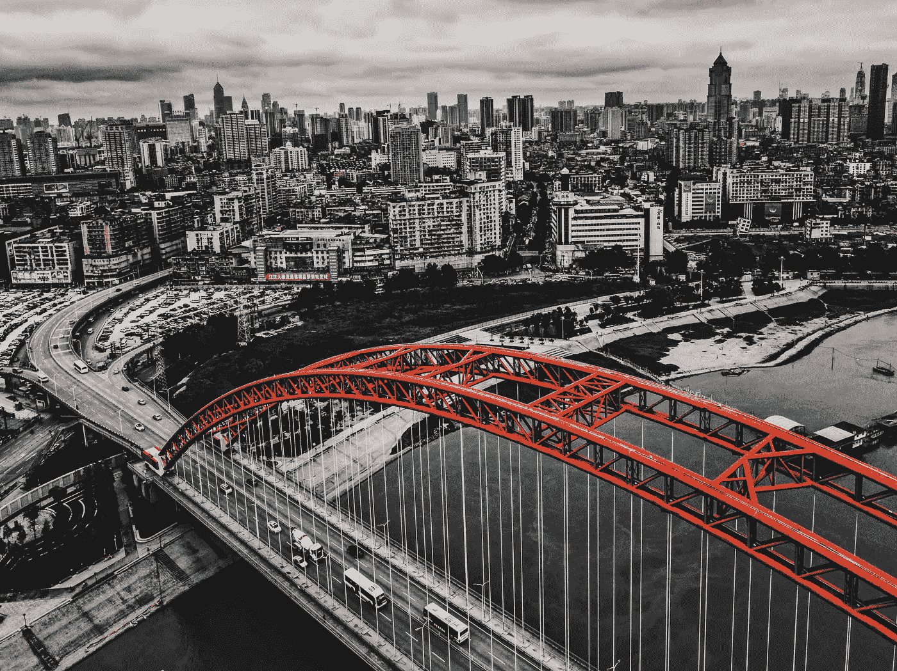
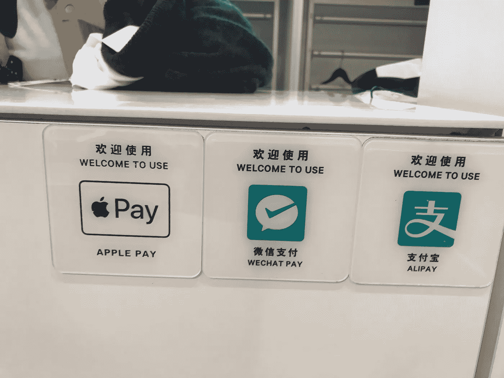
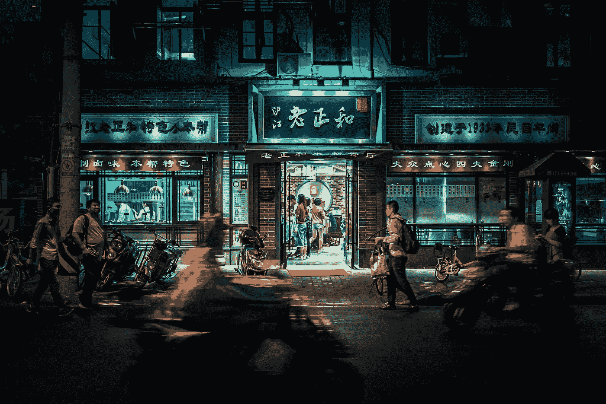
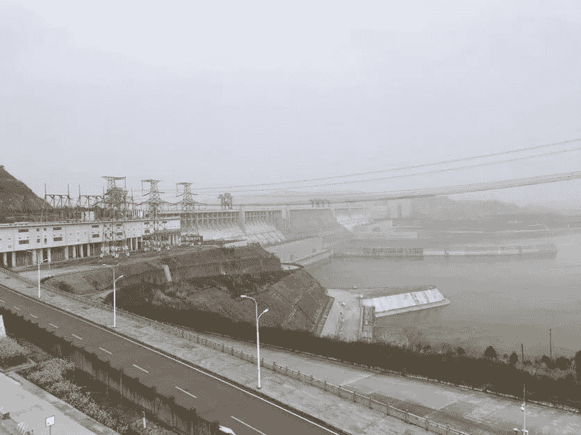
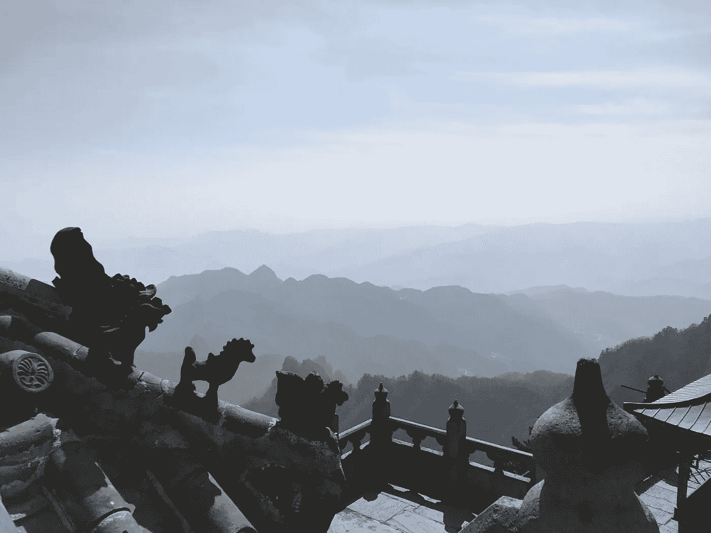

# A glimpse into the future —5 predictions from traveling China

> 原文：<https://medium.com/swlh/a-glimpse-into-the-future-5-insights-from-traveling-china-cad376a9caaa>

During this year’s National People’s Congress in China ([when president Xi Jinping “was allowed to remain president for life](http://www.bbc.com/news/world-asia-china-43361276)”), I spent a week in the central Chinese metropole Wuhan, the little known 12 million inhabitant capital of the province of Hubei.

Since I got some family ties to that region I wanted to find out if Wuhan and surroundings might be a suitable place for (remote) working in the future, how the startup landscape developed and what the latest innovations are (I did similar trips to Shanghai, Beijing, Hong Kong among others in the past). Investigating the working and living conditions with a “field trip” I stumbled on a couple of Aha experiences I like to share.

Wuhan Skyline with Yangtze River. Source: [https://unsplash.com/photos/LFgoS0fg88E](https://unsplash.com/photos/LFgoS0fg88E)

## Mobile phone is the central hub for everything

One thing that jumped into my face from the first to the last minute of my China stay was that the mobile phone obtains a much more vital role for people’s daily life than in Germany. In China, the mobile phone is the central hub for information, communication, entertainment and money flow.

In accordance, mobile internet (4G) is everywhere, even in metros and on top of the 1.600m high peak of the Wudang Shan mountains (where hikers send live video greetings home to proof their crest, no joke)!

Different mobile payment options at a fashion store in Wuhan.

Paying with your phone is the new credit card (or for Germans: the new cash) and multiple mobile payment options are available in each shop. Sometimes, international credit cards (Mastercard and visa) were not accepted at all — probably also due to the comparably little number of foreigners in Wuhan. It impressed me how easily integrated the purchase of a metro ticket is with mobile payment options: imagine an oldschool Windows 98 styled underground ticket machine displaying a QR code, scanned by any mobile phone and tadaa, ticket comes out. Simultaneously in Germany you need the right amounts of **coins** to pay your bus ticket.

The QR code (especially the Wechat specific “WeCode”) played also a big role as identification for huge post boxes in **each** **compound** where your e-commerce (Alibaba, Tmall, TaoBao…) dealer stores your purchase while you’re at work. Same-day delivery is quite normal in China and the problem of the last mile is already solved here.

Interesting to see how speech control has taken over keyboards as the main controller, leading to masses of pedestrians talking, talking, talking with their phones instead of writing, or even watching movies without headphones in trains, metros and shops. The future will be noisy!

Wuhan, capital of the Chinese province Hubei. Source: Google Maps

一些提到的移动服务对外国人不可用，因为他们需要一个中国身份证或至少一个中国电话号码。但外国游客最大的痛苦将是，他们日常使用的许多(美国)应用程序在中国完全受到审查(所有谷歌产品，如 Gmail、脸书和 Whatsapp、Twitter、某些新闻页面)，而且现在也不再能与 VPN 一起工作。原因当然是，完全的国家控制和审查对于“大陆托管”的应用和网站来说是可能的，这给当地创业生态系统带来了良好的经济副作用，即中国的“GAFA”同行(谷歌、苹果、脸书、亚马逊)可以在没有过度竞争的情况下茁壮成长(结果:BAT 百度、阿里巴巴、腾讯)。我很好奇 BAT 公司何时以及如何在欧洲面向广大受众。

## 数百万人的清洁移动

当德国的政治家、专家和媒体讨论电动汽车、汽车共享、便宜得离谱的公共交通和相应的基础设施投资是否是一个好主意时，我们可以在中国体验绿色交通的蓝图(同意，绿色产业是另一回事，还有很长的路要走，但官方态度的变化是显而易见的)。

Source: [https://unsplash.com/photos/IrGyuTSrkK4](https://unsplash.com/photos/IrGyuTSrkK4)

然而，汽油滑板车在几个城市被禁止，而电动滑板车的电插头随处可见(基本上，每个咖啡馆和水果店都可以为滑板车提供电力，方便驾驶整个城市)。[近年来，自行车共享创业公司呈爆炸式增长](https://www.forbes.com/sites/ywang/2018/01/26/after-bike-sharing-explodes-in-china-local-authorities-now-move-to-clamp-down/)，自由浮动的自行车随处可见。

顺便说一句，地铁单程票价是 0.25€。更多关于地铁系统的信息如下。

## **区块链和加密货币:尤美**

有时候，你看不到的东西比你看到的东西更能告诉你一个地方的情况。在这种情况下:在日常生活中，我无法注册任何加密货币或基于区块链的技术。我很好奇，想看看热爱新技术的中国人是如何适应这种(炒作)技术的，但这两种技术在中国的日常生活中似乎都不是什么大事。

我肯定在中国的创业中心有 BC/CC 爱好者在讨论潜力和工作用例，但我是从我在武汉的访问者的角度来说的。随着**中央**政府禁止 ico 并限制一个**分散**管理的货币体系的采矿和贸易活动，我不认为这在未来会改变。

## 中国风格的企业家精神:没有太大的任务

2012 年，我在上海进行创业教育项目时，我们试图在学生中开展创业活动，作为当时仍受青睐的知名国有企业或机构工作的替代选择。六年后，我在参观武汉光谷时，看到了一幅完全不同的画面。光谷是一个巨大的科技集群(实际上是一个卫星城)，以激光和光纤生产(因此得名)起家，现在是投资者、现任者和初创企业的家园，是特殊贸易区和拥挤的购物天堂。互联网巨头腾讯在那里设立了地区总部。在光谷，每天**有六家创业公司**成立。这个[视频](http://www.iqiyi.com/w_19rtcuvow5.html?from=groupmessage&isappinstalled=0)给你一个很好的概述他们的活动。

光谷是武汉的一个地方，在这里你可以感受到“任何事情都可以做，不管任务有多大、多难、多贵”的精神。另一个是武汉外的三峡大坝，世界上最大的水力发电大坝，为 6000 万人提供电力。家庭。施工比计划提前九个月完成(不利方面，130 万英镑。人们不得不离开他们的村庄，搬到“更现代”的房子里，为堰塞湖腾出空间，但是，嘿，谁想阻止进步呢。

Three Gorges Dam with powerhouse on the left

## 国家在关注你，支持你

当然，政府在这些经济热点中扮演着重要角色，用税收奖励或公共资金吸引某些行业(过去是光学技术，现在是软件)。例如，人工智能被选为中国未来竞争优势的关键技术，并因此被投入数十亿补贴[。模仿的形象已经过时，是老外的一种危险的误解。](http://www.sciencemag.org/news/2018/02/china-s-massive-investment-artificial-intelligence-has-insidious-downside)

中国大都市的不断进步和改善也意味着目前有十条地铁线(线路，而不是车站)正在建设中，并且每二三十年就要彻底改造一次。旧的给新的腾出空间，没有人抱怨，因为“你必须打破一个鸡蛋来做煎蛋卷”。迭代过程由政府示范，由社会适应！

像“斯图加特 21”这样的抗议在中国是不可想象的。但是 BER 机场的项目管理灾难也是不可能的！国家在看着你，所以你的工作做得很好，但更重要的是，它像一个上了油的发条一样有效地工作。

## 结论

总结我所经历的，我敢对我们的未来做如下预测:

*   Mobile phone or its succeeding technology (implants) will be crucial in our life for communication, information, payment and entertainment converging with the human senses, erasing all other devices as TVs, newspapers, PCs and basically all full-offline experiences.
*   The future will be noisy and crowded, making fast and reliable transportation a key competence of a metropole and personal space a luxury. The green mobility revolution is possible.
*   Future economies tend to be centrally controlled by governments (China) or business monopolies like GAFA (Europe, USA). Hence, there might be no space for decentralized currencies and databases (although I like to be wrong about that).
*   Change-reluctant societies (like ze Germans) have to change their attitude towards innovation or will be rolled-over by the innovators.
*   With its pride, speed and “can do spirit” China will play a decisive global role, economically, politically and hence culturally and the rest of the world has to get along with that. Or with Xi Jinping’s words at this years national congress: China is not to stop!

We don’t know much about China ([as pointed out here](http://foreignpolicy.com/2018/03/21/nobody-knows-anything-about-china/)), but I’m sure about one thing: China is closer to the future than we are and we should learn.

Wudang Mountains — great view and 4G internet

## This story is published in [The Startup](https://medium.com/swlh), Medium’s largest entrepreneurship publication followed by 317,238+ people.

## Subscribe to receive [our top stories here](http://growthsupply.com/the-startup-newsletter/).

