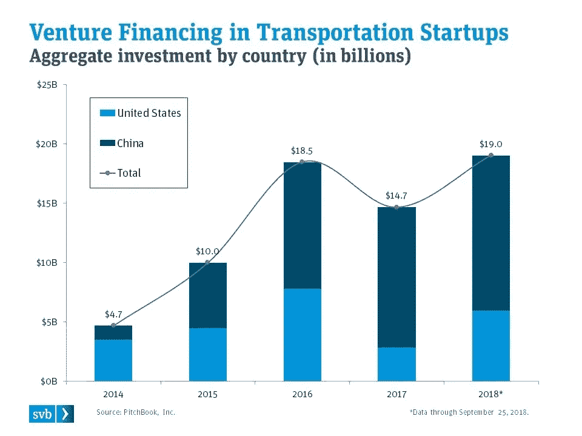
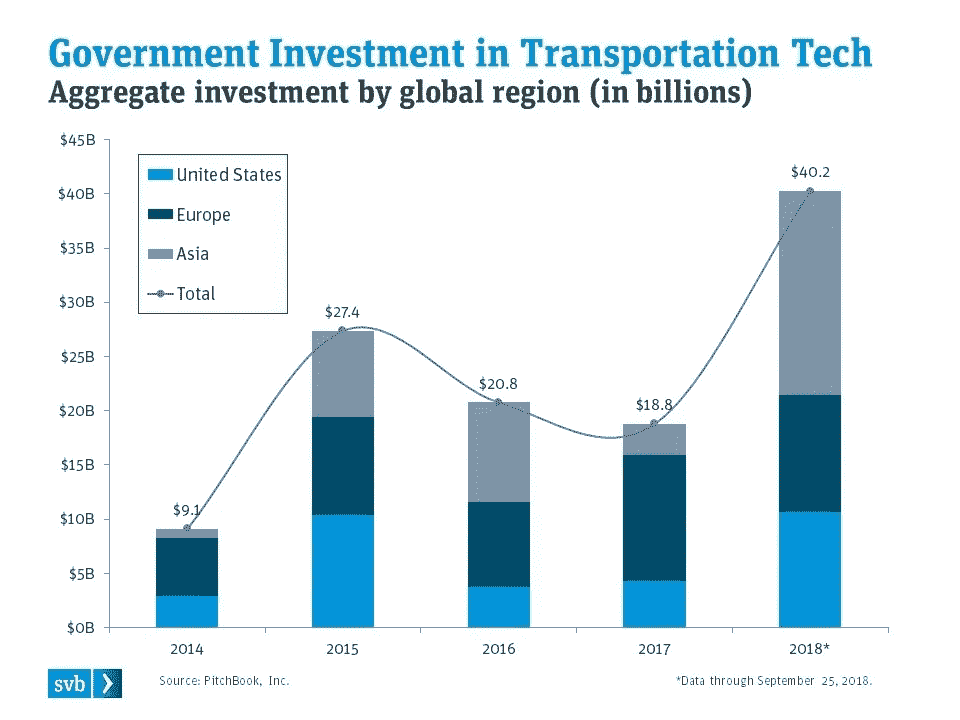
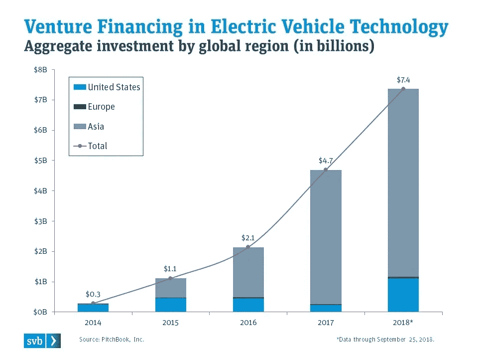
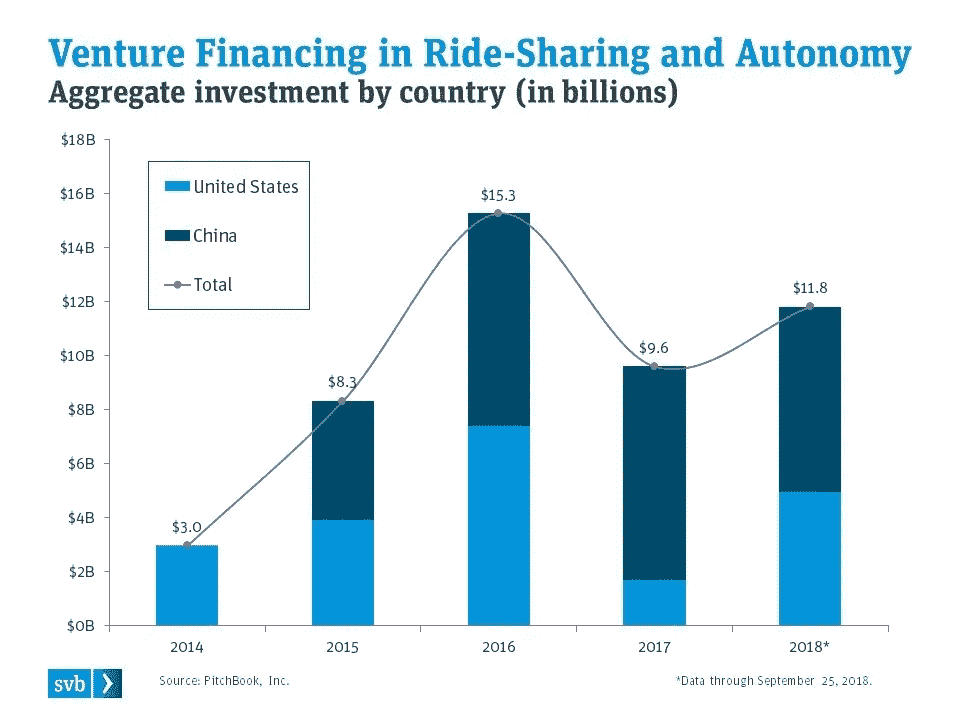

# A global game of Go: Is China pulling away?

> 原文：<https://medium.com/swlh/a-global-game-of-go-is-china-pulling-away-c2472837810d>

Source: CNN Money/Shutterstock

## Investment in transportation technology is not just about innovation and out-sized returns; it’s about securing our future

The United States is no stranger to the positive economic effects of new transportation technology; early in our nation’s history, our economy was built on a network of rivers and railroads, where steamboats and trains helped move our economy and the country forward. On the heels of the Great Depression, the development of an interstate highway system born out of the New Deal led to an estimated $41 billion in government spending on highway infrastructure, propelling our country out of stagnation and into a new era of prosperity and global leadership.

The United States remains a major hub of innovation in transportation, but other countries are recognizing the strategic significance of global trade and the economic influence of a robust transportation network, particularly in the Asia-Pacific region. India, Korea, and Japan continue to build state-of-the-art transportation networks in the region, but China stands out among them for the sheer size, scope, and ambition of its plans.

Why is China’s investment in transportation fundamentally different from that of other countries, particularly the United States? Simply put, China’s demand for transportation and logistics infrastructure is the product of a much broader long-term strategic vision — one that spans nearly a century and three political epochs, beginning in the 1950s. With China’s current leadership, the country has shifted its focus from gaining political influence and economic prosperity to a grander vision: China at the center of the world. China’s current leader, Xi Jinping, is looking to broaden and strengthen the country’s sphere of influence; according to Jinping, “Being strong first of all means being a global power: being a world leader and therefore leading the world.”

A significant part of this grand vision is to rapidly transform China from its agrarian roots into a global trading hub, with highly efficient transportation networks spanning not only within and across Chinese cities but also to the continents of Africa and Europe and across the entire Asia-Pacific region. Of course, China’s steady focus on this vision spells major infrastructure development in these regions, but it also has a significant impact on investment trends in transportation technology around the globe.

虽然美国的交通技术创新仍然被认为是全球领先的，但中国政府以直接投资和支持性法规的形式提供的支持，正在为中国在不久的将来在交通技术领域的领先地位铺平道路。中国有利的监管环境，以及看似无穷无尽的现金供应，是该行业快速发展和被公众接受的秘诀。这种支持性背景的主要例子是中国的国家“一带一路”政策，中国计划在未来几十年内向整个亚太地区的交通和物流基础设施投资数万亿美元。这一单一政策在全球范围内具有重大影响，因为所涉及的项目将覆盖约 65%的世界人口，约三分之一的世界国内生产总值，以及约四分之一的全球货物和服务。

虽然最近几个月看起来中国的[风险投资可能正在降温](https://www.forbes.com/sites/rebeccafannin/2018/08/09/china-venture-funding-is-undergoing-cyclical-change-mainly-on-a-downward-trend/#5cb583011940)，但随着中国创始人和企业家竞相打造未来的福特或联邦快递，运输行业是一个越来越令人感兴趣的领域。看看资本流入中国和美国的交通初创公司。2015 年，投资于中国交通相关初创公司的传统风险资本与美国不相上下，约为 50 亿美元。到 2018 年，中国超过美国*两次，*近 130 亿美元的私人资本流入该领域，而美国约为 60 亿美元。

Source: PitchBook, Inc. and SVB Analysis

这些数字没有提到中国政府对亚太地区新交通技术和基础设施项目的直接支持。2014 年，政府对该地区新技术的投资只是美国政府投资的一小部分。2018 年迄今为止，亚太地区在这一领域的政府投资约为 180 亿美元，由中国牵头，而美国约为 100 亿美元，欧洲约为 90 亿美元。在不到五年的时间里，中国政府在交通科技领域的投资从相对无足轻重变成了领先。

Source: PitchBook, Inc. and SVB Analysis

支撑中国交通技术投资战略意义的是该国对外国石油的依赖。2013 年，中国成为全球最大的石油燃料净进口国；到 2017 年，中国每天进口 840 万桶原油，超过美国，而美国每天进口 790 万桶原油。由于需求增加和国内产量下降，中国对原油进口的依赖不断增加，并且在可预见的未来将进一步增加。根据美国商务部 2018 年 7 月的[概述](https://www.export.gov/article?id=China-Oil-and-Gas)，预计到 2030 年，中国的石油进口依存度将上升至 80%。

这对中国来说是一个重大的战略问题，这也是为什么中国在太阳能、电池，尤其是电动汽车(EV)技术方面处于全球领先地位的部分原因。看看全球电动汽车技术的风险融资趋势:值得注意的是，中国在这些技术上的投资在整个亚太地区都产生了连锁效应。虽然 2014 年该地区对电动汽车技术的投资几乎不存在，但仅仅四年后，该地区就出现了 60 亿美元的新风险投资，使美国相形见绌，几乎是 T2 的六倍。

Source: PitchBook, Inc. and SVB Analysis

在 2017 年全球投资下降后，2018 年私人投资者对乘车共享和自动驾驶汽车技术的投资重新产生了兴趣，今年上半年总额近 120 亿美元，而 2017 年全年为 96 亿美元。有趣的是，美国和亚太地区的投资在这里大约是一对一的，这表明在人工智能和自动驾驶汽车硬件创新方面，与美国有着更公平的竞争环境。美国和中国市场都有可能迅速采用自动驾驶汽车技术，两国的共乘公司都在通过将其平台扩展到其他形式的交通工具，如自行车共享和电动滑板车，来实现持续增长。

Source: PitchBook, Inc. and SVB Analysis

尽管有些人可能认为资本向运输和物流技术的长期转移是中国进一步成长为“全球超级大国”的信号，但问题仍然是:这将把美国带向何方？在硅谷，我很高兴地说，自从蒸汽机发明以来，交通运输部门还没有经历过美国历史上最具创新性的时期，SVB 的前沿技术团队非常兴奋地帮助这个领域的企业家和创新者推动我们的国家和经济向前发展。如今，要巩固美国在未来交通运输领域的全球领先地位，就要靠 SVB 这个金融伙伴，以及支持性的公共政策和政府监管来帮助这些企业家，最终帮助我们的国家。

## 这篇文章发表在 [The Startup](https://medium.com/swlh) 上，这是 Medium 最大的创业刊物，有+385，662 人关注。

## 订阅接收[我们的头条](http://growthsupply.com/the-startup-newsletter/)。

