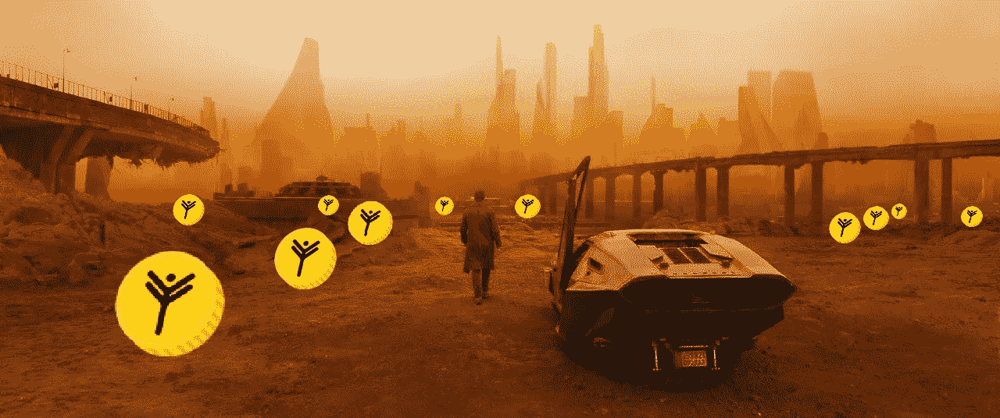
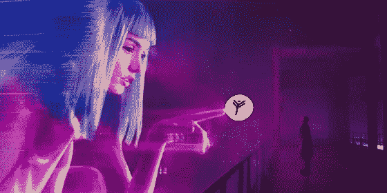

# 比特币支配下的黯淡未来

> 原文：<https://medium.com/swlh/a-gloomy-future-under-the-dictates-of-bitcoin-ab14ec00812d>

一封署名为 Luka_Magnotta 的时间旅行者的有趣信件在网上流传，描述了一幅受比特币力量支配的世界末日般的画面。这封信于 2013 年发表在 Reddit 新闻网站上，没有人关注它，直到比特币的成本预测——2017 年为 1 万美元——出现。

Luka 谈到了 2025 年的不远的将来，比特币的成本超过 100 万美元，自 2017 年以来，它的成本每年增加 10 倍。之后，美元和其他法定货币将失去意义。未来的世界有两种基本价值:土地和加密货币。所有这一切将导致一个关键的社会分层:人们将被分为“早期”——那些在适当的时候设法购买比特币的人，以及所有其他人。“早期”将被他们自己的基础设施包围，住在城堡、受保护的城市或社区，那里有采矿车和其他先进世界的福利。城堡内的所有服务都将是机器人。由于无法向加密货币所有者征税，几乎所有国家都将失去其重要性。当然，也有彻头彻尾的怪事，比如占主导地位的国家——比特币的持有者是沙特阿拉伯和北(！)韩国。在后者，顺便说一下，根本没有互联网。还有一个关于非洲人的故事，他们的政府把所有的手机都发了出去，让后者可以有加密货币钱包，邪恶的俄罗斯黑客黑了他们，偷走了 60%的资金。

通缩经济的恐怖令人恐惧，但也不要忘记，没有什么比暂时的更永久。比特币的资本化仍然低于苹果的资本化，这使得这种加密货币如此不稳定。随着乳齿象开始发胖，它在经济上也会变得更加稳定，几十个几千万美元的大叔也无法如此有效地排场和甩掉它。我们从侧面看一下情况，看看比特币的背后是什么。裸体区块链和对秘密社区的巨大崇拜。仅此而已。下一步很可能是行业专用加密货币的普及和发展，与复杂的智能合约 transportcoin、funcoin、foodcoin 等等联系在一起。用于零售和广告的加密货币的角色很可能由 https://izx.io/的 IZX [承担。](https://izx.io/)

很快，Instagram 或 Youtube 将能够给你加密货币信用，你将被令牌化并在个人令牌交换中报价。告诉我，在区块链时代人们会做什么？最有可能的是，会有一个基本的无条件收入，这样人们就不会安排抗议和饥饿骚乱。

巴迪比特币表现良好，区块链将绽放出不同的颜色和旗帜，假以时日，当更灵活和进步的工具发展起来时，这必然会降低比特币的作用。我们仍处于旅程的起点。万福加密！

## 这个故事发表在 [The Startup](https://medium.com/swlh) 上，这是 Medium 最大的企业家出版物，拥有 283，454+人。

## 订阅接收[我们的头条新闻](http://growthsupply.com/the-startup-newsletter/)。

