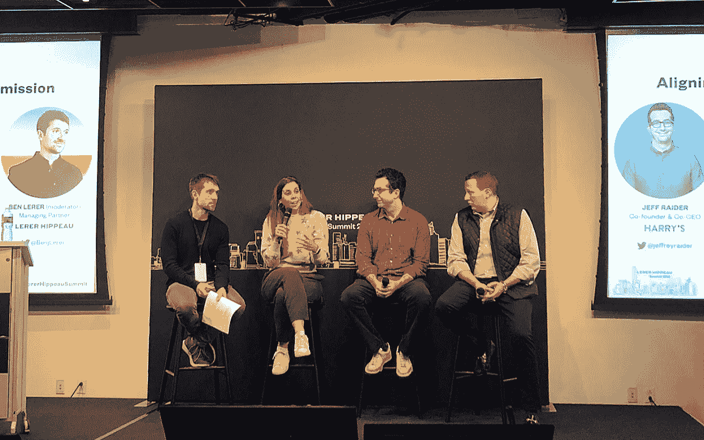

# “一个伟大的品牌兑现一个伟大的承诺”:来自 Casper、SoulCycle 和 Harry's 首席执行官的 6 条品牌经验

> 原文：<https://medium.com/swlh/a-great-brand-delivers-on-a-great-promise-6-brand-lessons-from-the-ceos-of-casper-soulcycle-61aef4df2969>

Left to right: Ben Lerer, Managing Parter, Lerer Hippeau, Melanie Whelan, CEO, SoulCycle, Jeffrey Raider, Co-CEO, Harry’s, and Philip Krim, CEO, Casper

床垫，健身班，剃须刀。这些类别本身并不令人兴奋。那么，Casper、SoulCycle 和 Harry 是如何在他们各自的领域取得突破性的成功的呢？他们的领导者建立了世界级的品牌，有明确的使命和愿景，他们的员工和客户可以支持。

上周，我们邀请了这些定义类别的公司的首席执行官在纽约市的年度峰会上与 200 名创始人和投资者分享他们的经验。我们的希望是:他们的观点可以通知和激励我们的[早期公司](https://www.lererhippeau.com/companies)和企业家。

在与我们的管理合伙人 Ben Lerer 的对话中，Casper 的 Philip Krim、SoulCycle 的 Melanie Whelan 和 Harry 的 Jeff Raider 讨论了在他们的组织中保持“品牌”意味着什么。作为创始人，他们考虑如何让他们在组织内部建立的业务与他们在外部向客户展示的业务保持一致。这里有六个要点。

# **1。品牌是反过来的**

相对于消费者对品牌的外部认知而言，公司的内部行为正变得越来越有意义。这部分取决于公司文化，但也取决于招聘和人力资源。创始人，以及后来的招聘经理，都试图寻找那些“理解”自己使命、能够为公司文化增添价值的人。但创始人有责任尽早并经常传达这些价值观。将公司内部发生的事情与公司对外投射的(或想要投射的)事情结合起来，可以从内到外建立品牌亲和力和社区。

# **2。品牌是由人驱动的**

如果品牌始于企业内部，那么培育品牌必须从员工入职时就开始。这么早就向新员工介绍公司的使命、价值观和历史，可以让员工在以后做出更深思熟虑的决定。

对公司目标感到忠诚的员工最有可能在业务扩张时保持敬业和坚守岗位。他们将与公司一起成长，成为公司最有力的支持者。这种参与可以用工具来衡量，但也是定性的。当团队动力不起作用，需要高层给予一些关注时，经理们能够感觉到。

实施指导和认可计划是在企业早期培养亲和力和社区的一种方式。调动最积极的员工意味着将他们变成组织的大使。认识到公开支持这些价值观的人将有助于鼓励其他人在内心与他们一起行动。

# **3。品牌必须进化**

刚成立的公司可能会在构思时考虑他们的价值观，但只有在员工开始工作后，一个脚踏实地的文化和社区才能开始有机地形成。品牌不可能在文化上停滞不前，因为它们的员工和文化本身一直在发展。随着公司的成熟，它们的创始人可以进行更宏大、更长期的思考，并考虑他们的团队能够产生什么样的更大影响。

无论一家公司的使命从一开始看起来多么本能，它都会随着其员工的发展而发展，在许多情况下，随着规模的扩大，它会变得更加清晰。随着品牌接受其不断发展的身份，他们必须重新定义并向公司的每个新员工阐明他们的愿景，以确保与公司的发展保持一致。

# **4。品牌需要透明度**

对公司来说，内部透明度可能意味着工资级别、对财务状况的洞察，或者对公司业务目标的清晰沟通。创始人有责任营造一种环境，让员工能够诚实、坦率地谈论问题和担忧。公司领导可以也应该敞开大门，回答员工的问题，即使这些问题并不总是令人舒服。

# **5。品牌可以对问题直言不讳**

无论是内部还是外部，或者两者兼而有之，品牌都应该考虑在问题上表明立场。如果新闻中的某些事情会影响员工或消费者的心理健康和幸福，并且领导层对该话题有强烈的感受，那么品牌就应该采取积极的方法来解决这些问题。

行动可以包括简单地向员工确认消息、重申现有价值观、公开声明、支持受影响的群体或创建安全的对话空间。采取一种立场总是冒着疏远组织内外一些人的风险，但它更有可能在已经认同公司使命和价值观的人中间创造更大的亲和力——并且可以帮助其他人意识到他们是否与品牌有着相同的价值观。

# **6。品牌保持专注**

即使是最成功的创始人也会偶尔陷入日常运营的泥潭。这是必然的。但是能够在这些时刻退后一步，并缩小到更大的图片是至关重要的。心怀愿景创建公司的创始人需要表现出纪律性，因为他们的努力可以最好地用在品牌发展和演变的大局上。

## 跟上我们的社区。订阅[每日综合报道](http://lererventures.us6.list-manage.com/subscribe?u=d34b43a395d6f0cc105a42bf1&id=68fc2c8f4e)并在[推特](https://twitter.com/LererHippeau)和 [Instagram](https://www.instagram.com/lererhippeau/) 上关注我们。

## 这篇文章发表在 [The Startup](https://medium.com/swlh) 上，这是 Medium 最大的创业刊物，拥有+383，380 名读者。

## 订阅接收[我们的头条新闻](http://growthsupply.com/the-startup-newsletter/)。

