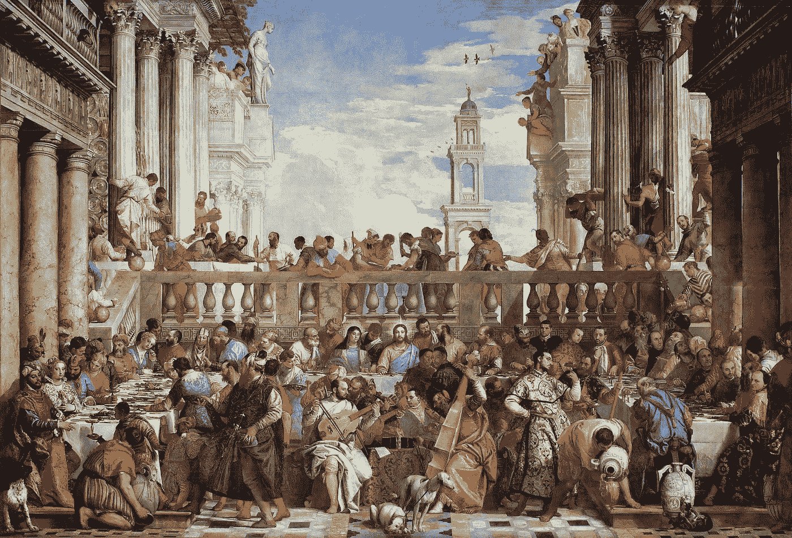
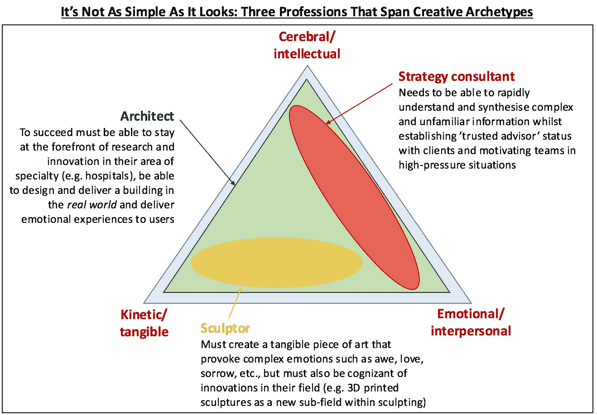
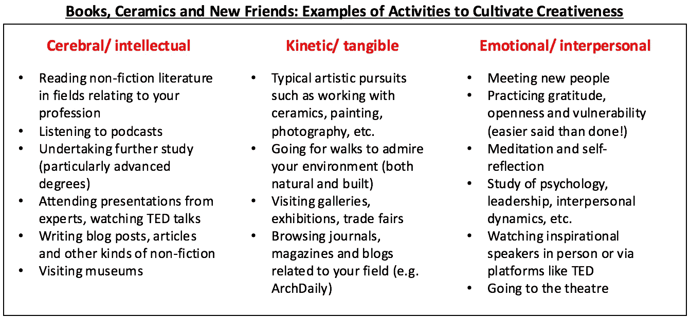
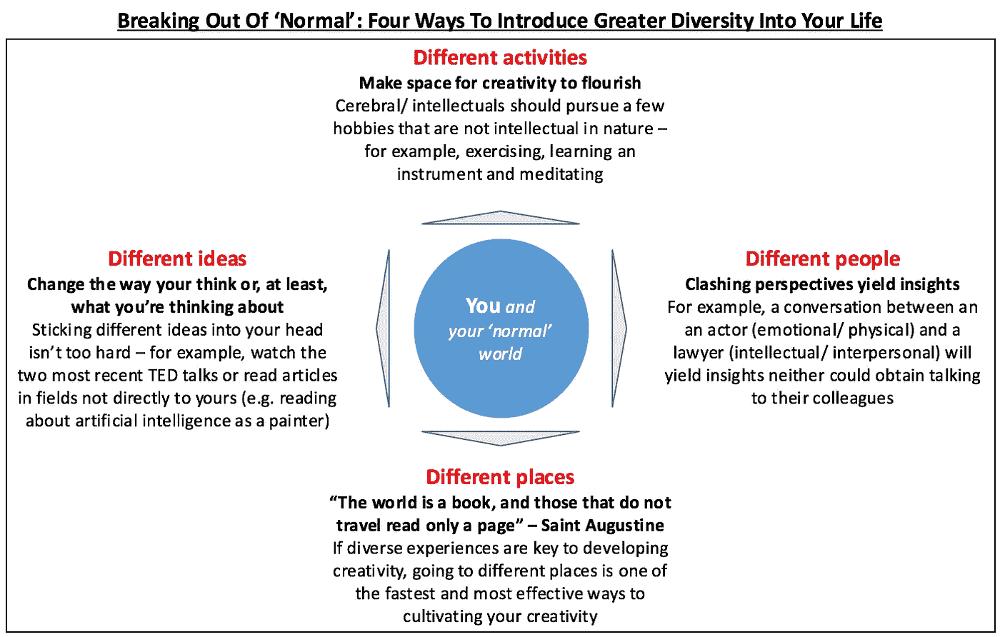
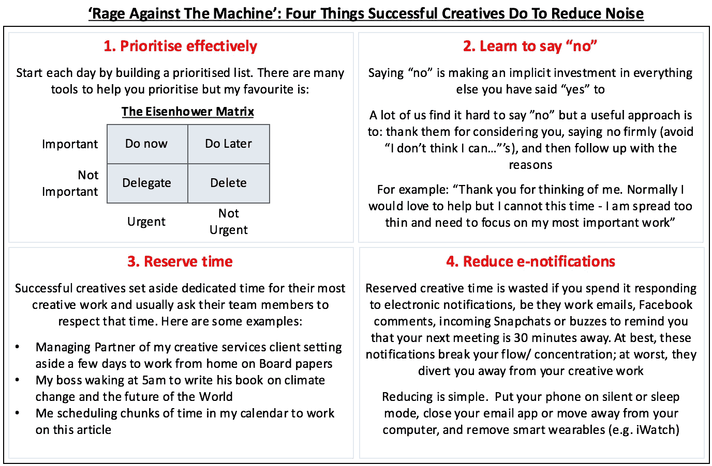

# 开发你创造力的指南

> 原文：<https://medium.com/swlh/a-guide-to-developing-your-creativity-1e0f20049e0b>

## **原型，四个步骤&对你的挑战**

你认为创造力是与生俱来的，只存在于那些从事创造性职业的人身上吗，比如艺术家、建筑师和广告人？在为新西兰一家领先的创意服务公司做了六个月的顾问后，我对创意有了不同的看法。创造力并不是传统创造性职业的人独有的技能。它不是你要么有要么没有的东西，也不是同质的技能。我相信创造力是一种可以而且应该训练的肌肉，能够运用创造性的视角是所有职业生涯中的关键成功因素。

## **你是哪种创意？**

《牛津词典》将创造力描述为“使用想象力或原创想法来创造某物；创造性。”这是一个相当宽泛的描述。对我来说，有三种创造力:智力/大脑，动力/有形，情感/人际。我认为他们是三种创造性的原型——科学家、艺术家和催化剂。

**大脑/智力**创意者是我们的理论家和思想领袖。他们通常会被综合事实、识别模式和发展假设的能力非常重要的职业所吸引。他们是我们的科学家、经济学家和历史学家等。动态/有形创意人员更接近我们传统上认为的创意人员:我们的艺术家和工匠。他们的画、百吉饼、玩具卡车和桌子给我们的世界留下了有形的印象。情感/人际创意人员对人有深刻的理解，并擅长识别、激发和管理情感。他们可能会被领导力、人员发展和市场营销所吸引。他们是我们鼓舞人心的政治家、心理学家和广告人。实际上，这是一个过于简化的模型。我们都有自己独特的三种原型的混合体。

在大多数职业中，成功需要具备不止一种创造力。建筑师就是一个很好的例子。专攻健康领域的建筑师必须运用他们的大脑/智力创造力，走在医学研发关键领域的最前沿。毕竟，如果 10 年后 80%的病人护理将由人工智能机器人提供，那么设计拥有大型护理站的医院就没有多大意义。此外，当她与建筑师和分包商团队合作设计和建造医疗和护理设施时，她必须发挥情感/人际创造力，为所有在其中工作、参观和生活的人提供帮助。她的项目通常会持续五年或更长时间，需要成功应对众多利益相关者带来的挑战和机遇。最重要的是，她必须是一个强大的动力/有形的创意，能够根据她的设计能力区分自己、她的公司和她的项目。如你所见，我非常尊重建筑师！

确定你的职业需要哪些类型的创造力，并磨练这些创造力，这对你的成功至关重要。在下一节中，我将分享创意人的四种活动和帮助你发展自己创造力的小贴士。

## **开发创造力的四个步骤**

创造力可以像任何技能一样被训练和发展。即使是出生时就中了天赋彩票的人，也可以通过练习变得更好。我所知道的最有创造力的人是那些努力工作来培养自己创造力的人。他们是怎么做到的？他们练习四种活动:

1.  变得对创造过程感到舒适
2.  培养创造性的日常事务和习惯
3.  拥抱多样性
4.  消除噪音

这里有一些实用的建议来帮助你将这些活动融入你的生活。

**适应创意过程**

要成为一名成功的创意专业人士，你需要熟悉创意过程。有些人可能认为“创造性过程”是一个矛盾修饰法，但我不同意。创造力总是一个过程。这可能是一个非常简单的过程——一个开始，一个“发现！”，和一个结束——但它通常是一个提炼的过程。当我的创意服务客户的管理合伙人将创意过程描述为从分歧开始，然后通过里程碑强制收敛，接着是分歧的第二阶段，再次强制收敛，如此类推，直到团队达成最终设计时，我明白了这一点。

这个过程包含高度的变化和不确定性，你无法知道你的输出在第一个里程碑会是什么样子，更不用说在最后了！为了应对如此多的不确定性，尤其是当与压力相结合时，你需要学习并熟悉你的创作过程。最终，伟大的创意者学会了“信任过程”

**养成创造性的惯例和习惯**

成功的创意人员知道发展常规可以加强他们的创意技能。他们利用这些习惯来获得新的视角，扩展他们的知识，并产生洞察力。从本质上来说，这些相关的习惯扩展了你潜在的“想法的范围”,从上面的创作过程的例子来看。相关的活动可以根据你寻求发展的创造力类型和你工作的专业领域而有所不同。

这里有一些我经常做的活动来拓展我的智力创造力。在工作日，当我通勤和锻炼的时候，我会听关于商业、技术和历史的播客。我在周日预留时间阅读非小说类书籍(目前，尤瓦尔·诺亚·哈拉里的《德乌斯人》和《经济学家》的《T2》。这些高效的承诺为我提供了一个多样化的、不断扩大的、当代的知识基础，在工作中我可以作为团队的一员，为客户解决复杂的问题，评估创新/投资，并提出新颖的解决方案。我手边放着一个笔记本，当我的大脑滑入白日梦和珍贵的“发现了！”瞬间来袭。为了发展我的情感和人际交往创造力，我每天都冥想，目标是每周至少认识一个有趣的新人。

**拥抱多样性**

拥抱多样性是有抱负的创意人员最有价值的事情之一。你不能日复一日地做同样的事情；优秀的创意人员明白这一点。他们通过追求与职业无关的爱好，为新想法和联系的蓬勃发展创造空间，因为他们认识到，新鲜的见解往往来自于与不同的人互动，并获得对更广阔视角的欣赏。他们花时间在不同的地方，追求新的体验。他们挑战自己，改变自己的思维方式。

也许改变你思维方式的最显著的例子是西尔威斯特，我 2015 年在危地马拉遇到的一位 60 岁的美国绅士。西尔维斯特在德国的军事情报部门开始了他的职业生涯，最终获得了硕士学位，最后进入了金融领域，在那里他获得了令人难以置信的成功。他将自己的财富归因于“每十年左右改变一次大脑的工作方式。”在一次改变大脑的探索中，他花了一年时间和南北美洲的巫师一起学习。跟萨满学了一年！他花时间学习神经语言学程序(NLP ),又花了一年时间学习西班牙语。毫无疑问，他是我见过的最有趣的人之一。

**消除噪音**

你一天中有很大一部分时间花在处理噪音上了吗？也就是说，这些活动并不是你想要实现的核心目标。对我们大多数人来说，答案是“是”噪音有多种形式，从回复“紧急”电子邮件，到被拉入不必要的会议，以及不断被手机上的社交媒体通知纠缠。为了让你的创造力出现，你必须尽可能多地消除生活中的噪音来源。

你如何着手消除噪音？我观察到成功的创意人员做了四件事，让他们有更多的时间去创造。他们有效地安排优先次序，学会说“不”，为创造性工作预留时间，尽量减少电子干扰。

总的来说，适应创造过程、培养创造习惯、拥抱多样性和消除噪音这四个步骤是相辅相成的活动，你可以采取这些活动来显著提升你的创造能力。你只需要承诺给他们一个机会…

## **30 天的创造力:对你的挑战**

无论你是什么样的创意者或者渴望成为什么样的创意者，致力于发展你的创意是一个“不会失败”的局面。现在你已经了解了创造力的类型以及如何开发你的创造力，我向你发出挑战，在接下来的一个月里，在你的生活中做一些简单的改变来开发你的创造力:

*   尝试一种新的日常创造性惯例或爱好。可以是任何事情，从编织到阅读历史文献到观看 TED 演讲。它可能只需要五分钟的摄影，30 分钟的瑜伽，几个小时的历史教科书(你的书呆子作者的理想星期天……)
*   每周至少走出你的舒适区一次。与陌生人交谈，加入当地的演讲会，去一个你从未去过的地方，读一本讨论你不同意的事情的书
*   尝试 30 天，然后反思这两项新活动是否提升了你的创造力

让它变得有趣，给一两个朋友贴上标签，作为对他们的挑战，以提升他们的创造性游戏。我也将致力于同样的挑战，每天至少花 30 分钟学习吉他。

祝你的创作之旅好运！

詹姆斯。

## 这个故事发表在[的《创业](https://medium.com/swlh)，这里有 258，400 多人聚集在一起阅读 Medium 关于创业的主要故事。

## 点击这里，订阅我们的头条新闻[。](http://growthsupply.com/the-startup-newsletter/)

