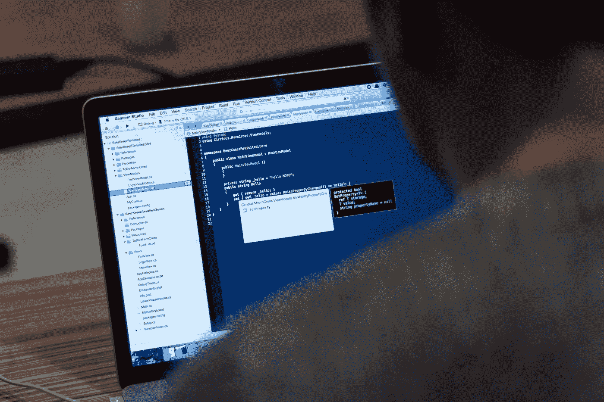
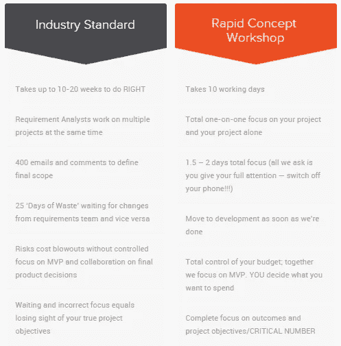
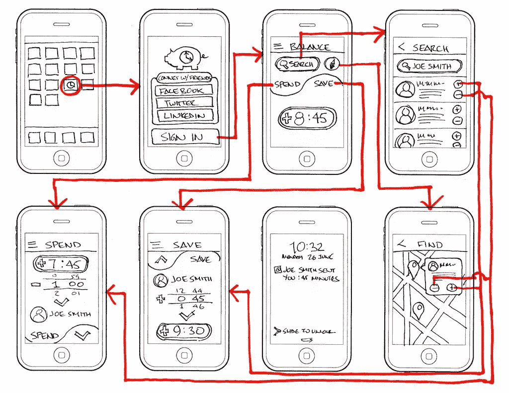
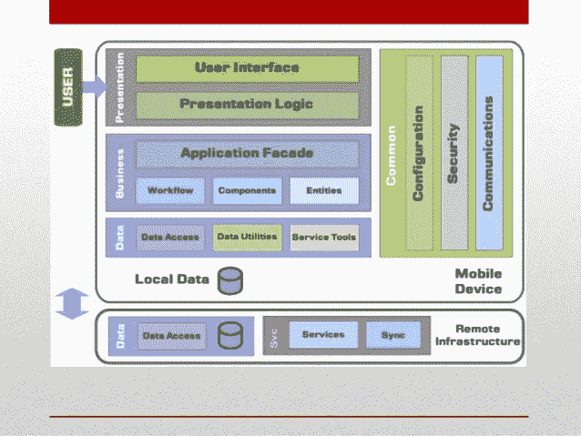
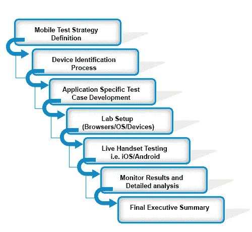

# 5 步移动应用开发生命周期

> 原文：<https://medium.com/swlh/a-guide-to-the-5-step-mobile-app-development-lifecycle-dad5122f882>

Originally published on [http://www.appsterhq.com](http://www.appsterhq.com/?utm_source=CP&utm_medium=Medium)/

移动应用生态系统短期内没有关闭的迹象，应用商店的收入预计到 2020 年将达到 806 亿美元，高于 2016 年的 446 亿美元。

鉴于[iOS 应用商店中有 220 万个应用，Play 商店中有 280 万个应用](https://www.statista.com/statistics/276623/number-of-apps-available-in-leading-app-stores/)，创建高质量的应用再加上可靠的营销策略是成功的唯一保证。

但是在如此激烈的竞争中，除非你遵循一个文档化的应用程序开发过程，否则你成功的机会是非常低的。

这个过程将确保你不会在应用开发阶段浪费宝贵的资源和时间。

这一过程的五个步骤如下:

# 1.想法

虽然每个应用都是从一个核心想法开始的，但你最初的想法可能不足以构建一个赚钱或吸引观众的应用。

你需要开发一个既能迎合足够大的市场，又能引起特定用户共鸣的应用。

以下是你在构思阶段应该做的事情。

## 发现和市场研究

与其从设计阶段开始，不如花时间进行广泛的市场调查。一开始就这样做可以让你站稳脚跟，让你、你的组织和你的投资者相信你的努力不会白费。

此阶段市场研究的一些指导原则包括:

*   **选择利基:**你要锁定特定的受众。因此，你的应用可以面向男性玩家，而不是面向所有用户。
*   **瞄准特定的用户类型:**为了对你有利，你可以瞄准微利基的一个方面。例如，你的应用可能只面向税务专业人士或律师。当你采用这种策略时，你可以很容易地验证你的应用想法。
*   **解决你遇到的一个问题:**如果有问题，有一个 app 可以解决。从生产力到健身，到分摊账单，再到两者之间的一切，解决重复问题的应用程序通常会吸引忠诚的用户。这里的关键是用别人没有的方法来解决问题，这样你就能在竞争中脱颖而出。
*   **利用应用商店获取市场情报:** Google Play 和 iOS 应用商店是市场研究的金矿。这篇[文章](https://www.bluecloudsolutions.com/blog/app-market-research-process/)相当全面地概述了使用应用商店进行市场调查的过程，包括使用的工具和寻找的线索。
*   **在线搜索:**查看 Kickstarter 上获得资助最多的项目。上 Quora 看看最受关注的问题。搜索天使名单和产品搜索。查看 Reddit，或者去任何行业论坛。你会得到带有某种程度的确认的想法。
*   **查看 Crunchbase:**[Crunchbase](https://www.crunchbase.com/#/home/index)显示了关于应用和初创公司融资模式的细节。虽然投资者支持了很多无用的东西，但了解哪些东西得到了资助可以帮助你优先做出决定。
*   使用关键词:特定关键词的谷歌趋势可以让你了解热门话题。要评估应用商店中使用的关键词，像 App Annie 这样的工具很有帮助。

在市场研究和想法验证的背景下，请查看[我们专有的敏捷验证方法](http://www.appsterhq.com/rapid-concept-workshop)，它提供了比行业标准更好的结果。

一旦你有了一个想法，使用我们的[想法分级器](http://www.appsterhq.com/startuptools/surveys/idea-grader?ref=HQ)来找出你的应用程序概念如何与独角兽理论和垄断理论等不同框架相比较。

如果你的应用程序是为内部使用而设计的，你就不必经历上面概述的大部分验证策略，尽管你仍然需要与利益相关者和潜在用户合作，以了解他们的日常工作流程。

## 建立应用程序目标和目的

一旦你验证了你的想法，了解了你的市场，你就可以着手建立你的应用程序的目标。

根据从第一阶段收集的数据，你应该确定你的应用程序的独特之处，使其区别于类似的应用程序。

在这个阶段，深入研究并确定用户将获得的结果以及应用程序将包含的功能也很有用。

不要用太多的功能来膨胀你的应用程序，采取精益的方法，利用市场洞察力来保持你的应用程序专注。

在这个阶段，你还应该记住[应用程序开发趋势](http://www.appsterhq.com/blog/mobile-app-development-trends)趋势。比如你在 2017 年开发一个 app，你要考虑 app streaming，渐进式的 web apps，或者有 AR/VR 功能的 app。

在这个过程的最后，你应该规划出工作的范围，并确定有多少设计过程将在内部完成。

# 2.设计

根据你的[应用预算](http://www.appsterhq.com/blog/app-development-cost)和项目范围，设计阶段可以在一个下午完成，也可以花费团队数千小时。

这一阶段的一些步骤包括:

**线框和故事板**

这是你开始研究你的应用程序的外观和感觉的时候，因为你已经知道你将寻求向用户提供的功能和结果。

首先，从不同的功能和屏幕方面描述用户将如何与你的应用程序进行交互。还可以创建用户旅程，你可以详细地描绘出用户在你的应用中的旅程。

在创建用户旅程时询问这些问题:

*   用户打开你的应用背后的背景是什么？
*   用户创建个人资料或上传照片需要点击或滑动多少次？
*   用户如何发现新内容？

一旦你有了这些信息，用纸和笔(或者像 [Balsamiq](https://balsamiq.com/) 这样的线框图工具)来创建你的屏幕的线框图。

以下是你应该做的线框图:

*   尽可能详细地概述应用程序每个屏幕的布局。
*   添加按钮、占位符、图标和其他视觉元素，让你的设计师有所遵循。
*   遵循每个平台独特的设计线索。然而，不要偏离常见的设计惯例，如后退按钮的大小和位置。
*   布局屏幕时，请牢记应用程序的主要目标。例如，Snapchat 是一个照片应用程序，而 Instagram 是一个社交网络，这两个应用程序的第一屏都反映了这些差异。
*   通过调整按钮、导航和其他视觉元素的布局，在同一个屏幕上创造多种变化。你的变化越多，你的 UX 就越有可能是真正的原创。

如果你想让事情尽可能真实，你也可以下载用于移动和平板平台的[样本屏幕](https://www.interfacesketch.com/)。

这篇[文章](/@kshields/diy-wireframes-and-storyboards-for-your-app-1c8443719165)非常详细地介绍了线框图和故事板的整个过程。

**应用架构**

*图片来源* [*幻灯片分享*](https://www.slideshare.net/hassandar18/architecture-of-mobile-software-applications)

线框和故事板将让你深入了解支持你的应用功能所需的后端。

根据您想要的功能，您的主要和次要目标将是缩小应用程序需要的 API、推送通知服务、分析工具、用户参与平台和数据库类型。

你还将清楚你的应用程序是否可以托管在现成的移动后端，或者是否应该从头开始构建。

在这个阶段，如果你遇到技术上的限制，你可能需要修改线框或者故事板。

**原型设计和测试**

一旦你完成了线框图，是时候建立一个交互式的高保真原型了。原型将让不同的利益相关者第一次看到你的应用程序，并帮助你验证你收集的信息。

你应该让潜在用户测试原型，修复任何缺陷或解决他们在这个阶段提出的 UI/UX 问题。

做得好的话，[原型](http://blog.proto.io/5-tips-for-effective-rapid-mobile-app-prototyping/)将是开发者开始构建实际应用的基础。

有许多工具，如[视觉](https://www.invisionapp.com/)、 [Justinmind](https://www.justinmind.com/) 、[漫威](https://marvelapp.com/)、[折纸](http://origami.design/)和 [Proto.io](https://proto.io/) ，让你无需编码就能创建高保真原型。

# 3.发展

您的开发人员可以使用像 [GoodBarber、Shopgate 和 Buildfire](http://www.businessnewsdaily.com/4901-best-app-makers-creators.html) 这样的应用程序开发平台，或者在他们开始构建您的原型的后端时设置存储、数据库、API 和服务器。

随着开发的进展，应用程序将经历几个阶段。

*   在 **alpha 阶段**中，核心功能存在，但没有经过测试。这款应用仍然漏洞百出，非核心功能也不存在。
*   在**测试阶段**，大部分被提议的功能被合并。这款应用也经过了光线测试和错误修复，尽管可能存在一些问题。在这个阶段，应用程序可以发布给一组选定的外部用户进行更多的测试。
*   在测试阶段的错误被修复后，应用程序将进入**发布候选阶段**，准备发布。

至此，你应该已经为你计划发布应用的应用商店设置了[开发者账户](https://play.google.com/apps/publish/signup/)。

在此阶段，您必须考虑多种因素，如多任务处理、外形、设备和操作系统碎片。如果你的应用程序与绝大多数智能手机不兼容，那么将这些特性和功能整合到你的应用程序中是没有意义的。

开发人员必须牢记移动设备上的资源限制，并编写代码，以便应用程序不会给处理器或内存带来太多负担。

在应用程序开发生命周期的这个过程中，我们使用[敏捷开发方法](http://http://www.360logica.com/expertise/mobile-application-testing/http:/www.appsterhq.com/rapid-agile)。

# 4.测试

对于移动应用程序开发来说，尽早并经常进行测试是一个好主意。

这样做可以降低最终成本。开发周期越深入，修复错误的成本就越大。

在构建各种测试用例时，您应该始终参考原始的设计和规划文档。

*图片*[来源](http://www.360logica.com/expertise/mobile-application-testing/)

此外，在应用程序的每个版本中重新测试之前清除的功能。仅仅因为一个特性在 beta 版本中可以工作，并不意味着它在发布候选测试过程中也可以工作。

此阶段不同类型的测试包括:

*   可用性测试
*   兼容性测试
*   接口测试
*   服务测试
*   低级资源测试
*   性能试验
*   操作测试
*   安全测试。

查看这份详细的[移动应用测试指南](http://www.softwaretestinghelp.com/beginners-guide-to-mobile-application-testing/)了解更多信息。

除了在尽可能多的设备上手动测试你的应用，你还可以使用一些工具[进行测试和崩溃分析，比如 Testflight、Appium 和 Bugsee。](http://www.infoworld.com/article/3184333/mobile-development/8-great-testing-tools-for-mobile-app-developers.html)

# 5.发动

应用开发生命周期的启动阶段对应用的成功至关重要。这个阶段搞砸了，你投入的所有心血和金钱都会付之东流。

发布阶段的目标是让尽可能多的用户使用你的应用。

这一阶段应包括:

*   **应用商店优化:**由于 65%的用户依赖应用商店搜索新应用，提高你的应用在应用商店中的排名至关重要。这篇文章列出了 24 条建议，你应该遵循这些建议来提高你的应用在 iOS 应用商店中的地位。跟随[这篇文章](https://www.apptamin.com/blog/optimize-play-store-app/)在游戏商店中排名更高。
*   **SEO:** 你还需要对描述你的应用的关键词进行排名。客座博客，建立反向链接，优化您的网站是启动过程的重要组成部分。你还应该将 Firebase 添加到你的 Android 应用程序代码中，让你的[应用程序内内容被谷歌应用程序索引 API 正确索引](https://firebase.google.com/docs/app-indexing/android/app)。
*   **网站或登陆页面:**即使你有一个网站，创建一个专门针对你的应用的网站或登陆页面也很重要。你需要从你的应用商店描述中链接到它。该网站应该有视频，文本内容，常见问题，[图标](http://www.appsterhq.com/blog/app-icon-design-ideas)，截图，商店徽章，二维码，社交媒体页面链接，用户评论(发布后，新闻包等)。
*   **邮件列表:**许多应用在发布前已经建立了预期，并通过建立发布前邮件列表获得了较高的初始下载量。你应该从建立一个测试列表开始，在应用正式发布之前，你可以邀请用户成为测试者。通过定期邮件和高质量内容吸引你的用户，这样当应用最终推出时，它的初始下载速度将会很高，增加它在应用商店上流行的机会。
*   **付费广告:**你可以考虑使用谷歌、脸书、推特等平台投放广告。根据你的预算和目标市场，付费促销可以带来早期访客的涌入。
*   **公共关系:**公关和影响者营销也将在发布阶段推动应用下载。甚至在你开始编码或设计你的应用之前，你就应该与媒体和有影响力的人建立关系。随着应用发布日期的临近，使用你的应用的独特挂钩来开始对话并制造轰动。

这篇文章有更多关于移动应用发布策略的细节。

## 结论

应用开发并没有真正在发布时结束。当你的应用程序被用户使用时，反馈会蜂拥而至，你需要将这些反馈整合到应用程序的未来版本中。

如果你是第一次开发，可能需要一些时间来适应这个过程，但是随着你重复这些步骤，你的应用程序开发将变得更加可预测。

> 最初发表于[http://www.appsterhq.com/](http://www.appsterhq.com/?utm_source=CP&utm_medium=Medium)

