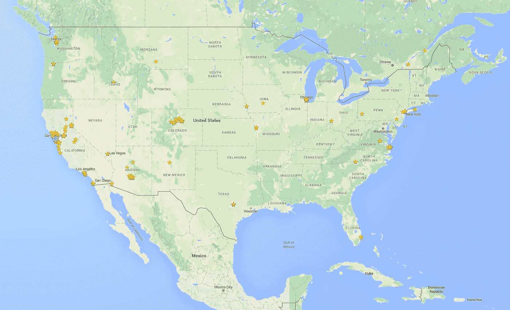
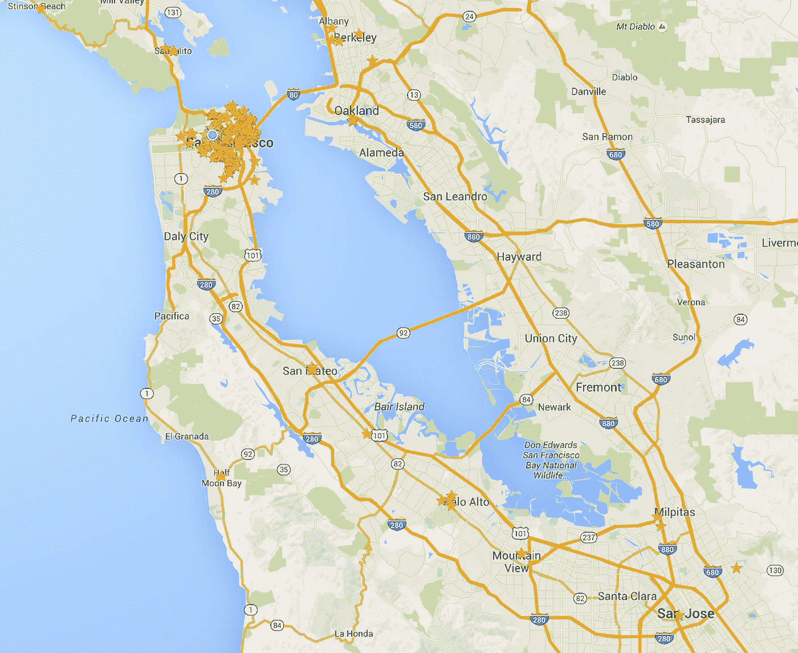
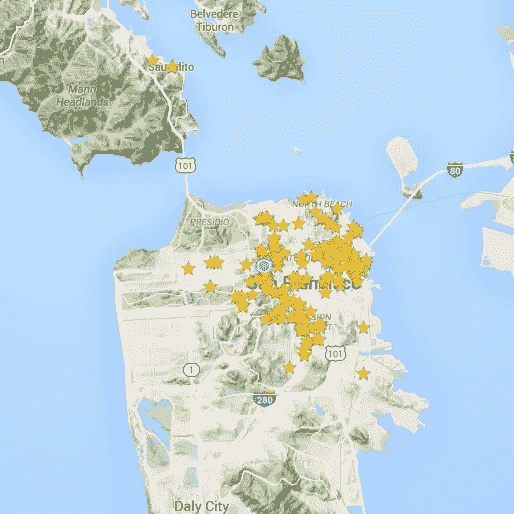
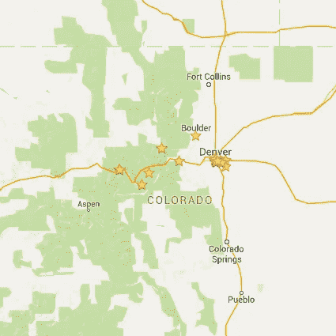
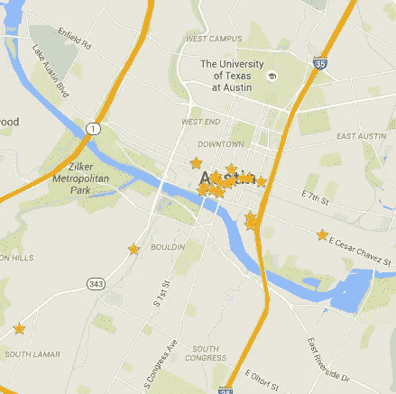
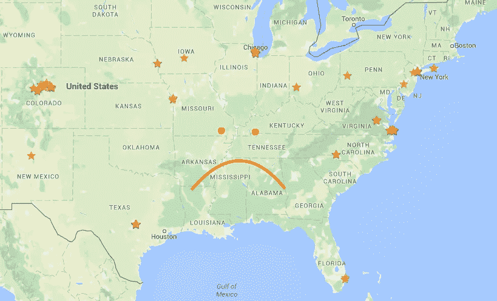

# 我生活的热图

> 原文：<https://medium.com/swlh/a-heat-map-of-my-life-999659fa355d>

## 从我吃饭的地方来看

## 关于[这篇文章](https://blog.mitchjlee.com/2016/a-heat-map-of-my-life)的最新版本，请参见[我的博客](https://blog.mitchjlee.com/)。

我是一名工程师。我也是关于追踪事物的强迫症。将这两个特征结合起来，你会得到一些有趣的，尽管有点奇怪的结果。

举个例子，我曾经计算过[我骑车上班比开车节省了](/life-learning/the-economics-of-biking-to-work-ae0f15a36636)多少钱，在计算了我骑车的日子里额外消耗的食物的成本后*。单程要骑 15 英里的自行车，所以那些卡路里不是微不足道的。(我接着又联合创立了 [Penny](https://www.pennyapp.io/?utm_medium=Medium&utm_source=A%20heat%20map%20of%20my%20life&utm_campaign=top) 。去想想。)*

所以，是的，有时候我对记录我的生活有点过分了。但是有时候，我也可以用这些数据做一些很酷的事情。

例证:我生活的热图。

# 搭建舞台

2012 年初，我的生活中发生了两件重要的事情:我爱上了尝试新的就餐地点，我获得了在这些新地点开始就餐的资金。

## 对新地方的热爱

我和我(现在的)未婚夫在 2011 年开始约会。在我们开始约会之前，我并不知道这一点，但原来她家经营着一家很棒的爆米花公司。(是的，没错:我要嫁给一家爆米花和糖果公司。梦想真的会实现。)

我越了解她家对那家企业投入的血汗资本，我就越有动力去支持当地的餐馆和连锁商店。当地的餐馆和商店是爱情、汗水和泪水的结晶；连锁经营(在其成熟状态下)是对单位经济、巧妙营销和大众市场吸引力的一种锻炼。

我的未婚夫已经是本地连锁超市的大力支持者，但我把它提升到了一个全新的水平。我不仅不再经常光顾连锁餐厅——在过去的四年里，我尽了最大努力不去同一家餐厅两次。我会为当地的咖啡店或体育酒吧破例，但即便如此，我也是在光顾了我所在区域的所有咖啡店之后才会这么做。

## 开始吃饭的资金

2011 年，我大学毕业，机械工程专业。在这之前的四年里，我拼命学习，打零工，靠加水煎饼和偶尔吃的墨西哥玉米饼为生。

煎饼的事我也没开玩笑。在我高三的时候，我从好市多买了一包 10 磅重的速溶煎饼粉，一周七天都做早餐、午餐和晚餐。为了多样化，我买了一些好市多大小的袋装碎奶酪和玉米饼，偶尔还会做些奶酪玉米饼。不用说，我的身体渴望大学毕业后的变化。

2011 年秋天，我开始涉足现实世界，之前我放了一个夏天假，尽情享受我最后的自由时光。我花了一段时间来建立一个安全网，但考虑到这份工作(波音)和可负担得起的地点(凤凰城)，我能负担得起更频繁地出去吃饭只是时间问题。

# 热图

随着我增加了非煎饼类饮食，培养了我对尝试新地方的热爱，我开始在谷歌地图上标出我吃过的每一个地方。

每一个。单身。一个。

迄今为止，我已经在全国 650 多个不同的地方出演过。我还会对每个地方进行评分和评论，所以如果你在谷歌搜索餐馆时碰巧看到*“米切尔·李，当地导游”*的评论，你好！

事实上，我很确定我是谷歌地图上最多产的评论者之一。至少，我正在打破最高等级的“[当地导游](https://www.google.com/local/guides/)的门槛，即使他们已经提高了所说的门槛，增加了额外的等级，并改变了评分机制。接招吧，谷歌。

我不断主演的结果？一张非常漂亮的地图，看起来像这样。

I eat a lot of food.

# 但是为什么呢？

问得好。首先，因为我有强迫症，像我这样的人都会这样。

不过，这不是唯一的原因。这里还有一些:

*   每次打开谷歌地图，迎接我的都是星星！🌟
*   我得到了免费的额外津贴，因为谷歌现在认为我是一名“当地导游”。
*   只需点击几下鼠标，就能为朋友推荐餐馆。
*   我有办法唤起我对以前吃过的地方的记忆。

但最重要的是，这成了我生活的热图。请记住，几乎每次外出就餐都会产生一颗新星，

> 密度越高，我在那里呆的时间就越长。

有了这个新的视角，我可以得出一些有趣的结论。

*   一个能看到地图可缩放版本的陌生人可以很容易地推断出我自 2012 年以来住在哪些地方。一点都不恐怖。
*   尽管我热爱旅行，但迄今为止，我对南方视而不见。
*   显然，我只对丹佛的山感兴趣。
*   在那里的一个周末，我在奥斯丁做了*破坏*。
*   显然我去过一次阿尔伯克基。

# 下一步是什么？

如果有人对如何处理这些数据有什么想法(星级，数字评级，或两者都有)，请在评论中告诉我。你也可以在我的博客和推特上关注我的更多更新！

> 如果你喜欢这个，不要害羞👏为了它！