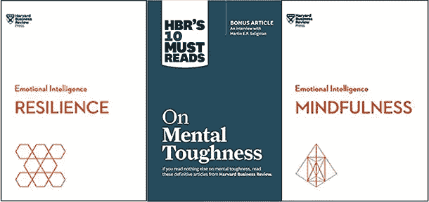
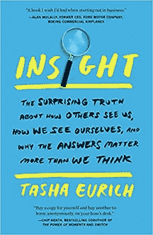
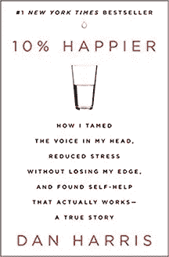
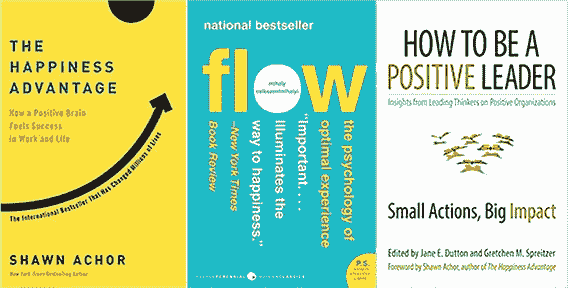
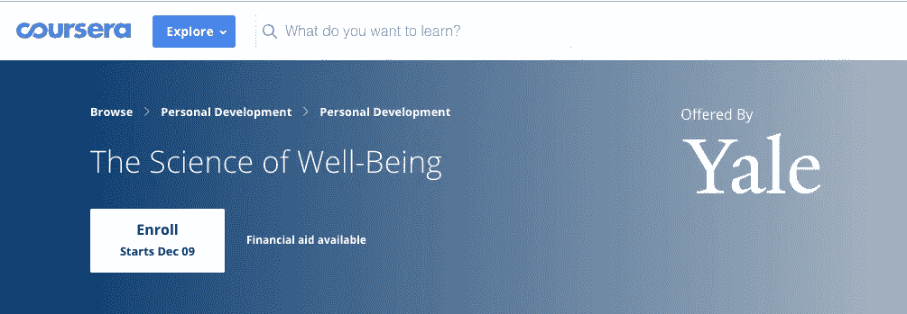
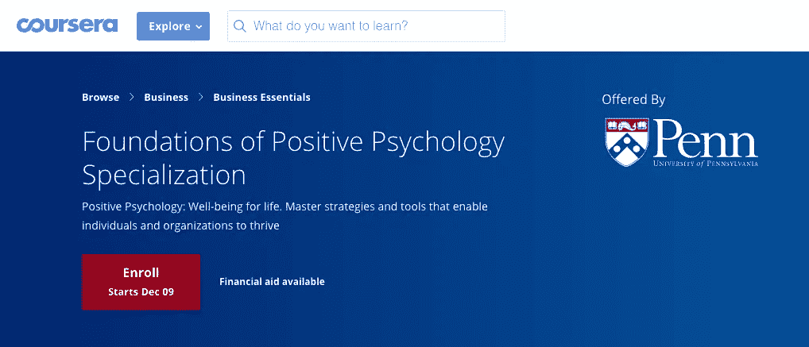
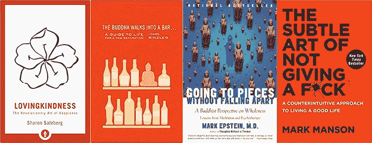
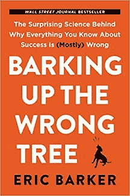
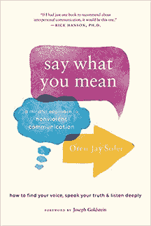
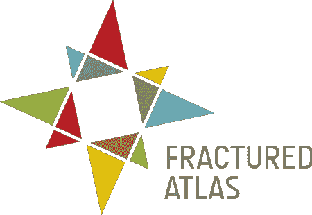

# 培养适应力的旅程

> 原文：<https://medium.com/swlh/a-journey-in-cultivating-resilience-465fb11c441b>

## 应用程序、文章、书籍和课程，在你的生活和工作中建立一个反思和弹性的自我保健实践

## [*骨折图册*](https://www.fracturedatlas.org/) 首席运营官蒂姆·库诺娃

几个月来，在我的网飞队列中不断出现关于小房子的纪录片，我终于坐下来看了。这导致了观看关于在生活中采取极简主义方法的这本书，然后是像丹·哈里斯的《快乐 10%》和杰弗瑞·普费弗的《渴望薪水》这样的书，以及一门关于基于正念的减压课程。那时，我已经坚定地掉进了一个关于弹性和自我护理的研究的兔子洞。

我一天中的大部分时间都专注于打造致力于反种族主义和反压迫的高绩效团队和组织。我越来越关注弹性和自我照顾如何成为这些环境的核心，以及这看起来像什么。作为一个经常四处思考的人，“哦，这很有趣，我想知道[插入东西]是否可以以及如何应用于建设人们茁壮成长的伟大工作场所，”这感觉像是我偶然发现了一个了不起的思想材料宝库。

> 当我们说我们没有“时间”时，我们是在说我们没有时间投资于我们自己的幸福。

当我们最需要的时候，最难找到让我们照顾好自己并保持活力的解药。当我们说我们没有时间做这件事的时候，我们实际上是在说我们没有时间投资于我们自己的幸福，没有时间去寻找更充实的生活，真正的生活和繁荣。我们在积极地淡化我们自己，我们自己的幸福，以及我们对使我们的兴趣与生活的意义和目的相一致的追求。作为交换呢？

## 不要为自己的工作殉难，也不要要求别人这样做

自从我在四年级的时候拿到一把 Tonette，我就踏上了文化领域的人生之路。虽然我在考虑工作场所时经常使用这个参考框架，但从人类的角度来看，在私营或公共部门工作并没有什么独特之处。在非营利部门，我们喜欢告诉自己有一些特殊之处——通常是当有人试图证明无情的工作条件和低薪酬水平是合理的时候——但大多数情况下，我们是人，花时间试图完成一些事情。

**对于我们这些非营利部门的人来说，这里的转折——也是真正可悲的讽刺——是这个部门的存在是为了让世界变得更好，更美丽，更善解人意。这在很大程度上是通过烧穿它的人民来实现的。**与其接受它本来的样子或它必须的样子，不如让我们积极地拒绝这种观念，去寻找创造更好、更可持续的地方，让人们能够工作、适应和发展。

If you thought the Atari 2600 was awesome, you *have* to try this new game called Stop.

## **假期最热新游戏**

当我发现自己感到狂热时，我正在玩一个很酷的新游戏:它叫做，停止。不，不是一些花哨的缩写或谷歌推广的新管理框架。这个词简单地说明了一切。别推了。不要从一个会议跑到另一个会议。不要从一个电子邮件跳到另一个电子邮件，打电话到另一个电话。停下来。就一会儿，就在你在的地方和你正在做的事情。

停下来。放松你已经长到耳朵的肩膀。分开牙齿，放松下巴和面部肌肉。然后缓慢深呼吸三次。当你这样做的时候，扫一扫你的身体，找出你保持紧张的地方——肩膀、膝盖、脚趾、膝盖、脚趾(哎呀，错误的游戏)——当你呼气的时候感觉它融化掉。如果你坐着，每次呼气的时候，感觉自己更深地陷入椅子中。就这样，60 秒的停顿。

什么？！我没时间做那个，提姆。嗯，这里有一些快速数学。一周工作 40 小时有 144，000 秒。现在，相信我(我正看着你，未来的蒂姆！)，我们都可以在一天中有几个 60 秒的停顿。

## 我如何在工作场所使用以下资源？

可能性是无限的！我鼓励你花 4-5 分钟思考一下在你自己的组织中弹性和自我照顾是什么样的。简单问自己:我的工作场所安全吗？在这里工作的人都安全吗？对每个在这里工作的人来说，这是一个健康的地方吗？人们能轻松地生活和工作吗？带着喜悦？为什么或为什么不？然后深入研究这些答案，看你是否能找到方法去做更多积极的事情，解决消极的事情。

我敢打赌，如果你和你的同事开始问:“我们如何才能让适应力和自我关怀成为我们工作方式中更重要的一部分？”你们都会想出一大堆适合自己工作方式的绝佳选择。你可以简单地从询问其他同事他们为自己的适应力和自我保健做了什么开始。这个看似简单的问题将话题摆到桌面上，不再是眼不见，心不烦。

然后，一起努力。创建一个图书或播客俱乐部。在 Slack 频道上分享资源和文章。将会议安排成步行会议，或者就在室外。进行评估并讨论你对结果的看法。在全体员工会议期间，留出时间让员工分享他们的自我保健方法。像上面的 60 秒停止游戏一样，以两分钟的引导呼吸开始每次会议。(这可能是一个人一天中仅有的两分钟，他们可以静静地坐着，意识到自己在呼吸。)

**好吧，所以我答应给你一个应用程序、文章、书籍和课程的样本，这些都是我在偶然发现那个小小的家庭纪录片后探索的。本着先戴上氧气罩再帮助别人的精神，我希望你能从中发现一些价值。**

想知道更多我说的“韧性”是什么意思吗？《哈佛商业评论》在[弹性](https://www.amazon.com/gp/product/B01MTDVKOK/ref=oh_aui_d_detailpage_o03_?ie=UTF8&psc=1)、[精神韧性](https://www.amazon.com/gp/product/B073RNTXT8/ref=oh_aui_d_detailpage_o04_?ie=UTF8&psc=1)和[正念](https://www.amazon.com/Mindfulness-Emotional-Intelligence-Harvard-Business/dp/1633693198/ref=tmm_pap_swatch_0?_encoding=UTF8&qid=1544563360&sr=1-1)中提供了大量关于信息技术各个方面的文章。

我从这些阅读材料中得到的一个建议是，在飞行时，不要试图工作。你可能和我一样，有一份我计划在飞机上完成的工作清单。然后，因为座位太小，我的邻居的眼睛在跟着读，GoGo 无线慢得令人沮丧，我筋疲力尽地到达另一边，没有感觉到我“抢先”了一步。花点时间在这个最后的无连接堡垒上，享受阅读，看几部电影，冥想几个小时。到达时精神饱满，压力较小。你可能不会像你希望的那样在工作中取得很大的成就。

建立弹性的一部分是理解并能够清楚地表达我们重视什么，以及什么推动和激励我们。这就像一颗指引我们努力的北极星，或者用我的导师的话来说，“如果你不知道你要去哪里，你将很难知道你是否以及何时到达那里。”

塔莎·欧里奇的书和附带的练习册《T2 洞察:关于他人如何看待我们、我们如何看待自己，以及为什么答案比我们想象的更重要的惊人真相》提供了一些提示，供你在需要一点推动的情况下考虑和评估。该工作簿帮助读者清楚地回答诸如以下问题:你的价值观是什么？你的激情是什么？你的抱负？你理想的环境？以及你是否有什么不为人知的未知。认为你在生活中做的事情可能与你应该做的事情不一致？采取有效的评估，如自由荷兰职业主题[这里](https://openpsychometrics.org/tests/RIASEC/)，或稍微更美观的版本[这里](https://www.truity.com/test/holland-code-career-test)。

如果没有对我的朋友、耶鲁大学教授艾米 Wrzesniewski 的工作大加赞赏，提到在工作和生活中调整兴趣和激励因素是不完整的。如果你还没有[看过她谈论](https://www.youtube.com/watch?v=C_igfnctYjA)如何在你的工作中创造意义，阅读过[拥有多种动机的影响](https://insights.som.yale.edu/insights/when-is-one-motivation-better-than-two)，或者阅读过她的[工作制作手册](https://positiveorgs.bus.umich.edu/cpo-tools/job-crafting-exercise/)，今天就花点时间。

有很多文章对[顶级冥想应用](https://thewirecutter.com/reviews/best-meditation-apps/)进行了排名，所以我不会在这里花费笔墨。我开始使用 1GiantMind，并在洞察计时器上发现了有益的冥想。但是，我现在的冥想应用程序是[快乐 10%](https://www.10percenthappier.com/)。我尤其喜欢约瑟夫·戈尔茨坦和莎伦·萨尔茨伯格(马萨诸塞州巴尔市[洞察冥想协会](https://www.dharma.org/)的联合创始人)的课程。柳文欢·杰伊·索弗的沟通课程与我的调解工作非常契合，亚历克西斯·桑多斯帮助提醒我们，当我们刷牙、通勤、排队或使用智能手机时，我们可以实时在场并保持专注。

挖掘适应力和自我关怀时，你会发现幸福这个话题，这只是时间问题。我鼓励你看看[如何成为一个积极的领导者:小行动，大影响](https://positiveorgs.bus.umich.edu/books/how-to-be-a-positive-leader-small-actions-big-impact-2/)。这本论文集收录了该学科的一些主要思想家。肖恩·阿克尔在他的[快乐优势](https://www.amazon.com/Happiness-Advantage-Principles-Psychology-Performance/dp/0307591549)中深入探讨了积极心理学的原理。视频[显示，快乐的秘密](https://www.ted.com/talks/mihaly_csikszentmihalyi_on_flow)是由著名的积极心理学家米哈里·契克森米哈制作的。(如果你听说过或使用过“心流”这个短语，你可以参考 Csikszentmihalyi 关于最佳体验心理学的著作。)

对于那些想要深入研究的人来说，幸福科学(耶鲁有史以来最受欢迎的课程版本)在 Coursera 上是免费的。这是一个伟大的探索，它包括了很多关于为什么你认为会让你生活幸福的事情不会让你幸福，以及该怎么做的研究。

我特别喜欢这门课的参考资料部分，因为它与我多年来在文献中读到的许多研究相关联。就像卡尼曼和迪特曼的研究发现，一旦人们赚到大约 75，000 美元，每增加一美元，他们的幸福感就会逐渐低于之前的一美元。研究还发现，平均而言，人们觉得他们需要比现在多挣 40%才能快乐。也就是说，我们挣得越多，我们就离我们认为最终会让我们快乐的绝对金额越远。

对于那些*真的*想在不回学校的情况下深入研究积极心理学的人来说，积极心理学的[基础](https://www.coursera.org/specializations/positivepsychology)是由来自宾夕法尼亚大学的团队在 Coursera 上开设的五门课程专业(研究该主题的*地方之一)。相对便宜，但不免费。

正是在这一点上，我读了很多关于正念和冥想的书，包括:马克·爱泼斯坦的[走向崩溃而不崩溃](https://www.amazon.com/Going-Pieces-Without-Falling-Apart-ebook/dp/B00C0AM01U/ref=sr_1_1?s=digital-text&ie=UTF8&qid=1544287732&sr=1-1&keywords=going+to+pieces+without+falling+apart)；莎伦·萨尔茨伯格的[爱:幸福的革命行为](https://www.amazon.com/Lovingkindness-Revolutionary-Happiness-Shambhala-Classics-ebook/dp/B005DXOMBW/ref=pd_sim_351_13?_encoding=UTF8&pd_rd_i=B005DXOMBW&pd_rd_r=26403719-fb09-11e8-9909-b13733703ee0&pd_rd_w=syDNn&pd_rd_wg=x50QL&pf_rd_p=18bb0b78-4200-49b9-ac91-f141d61a1780&pf_rd_r=XB9Z1EE5QGX9791ZZAVN&psc=1&refRID=XB9Z1EE5QGX9791ZZAVN)；山姆·哈里斯的[苏醒:没有宗教的灵性指南](https://www.amazon.com/Waking-Up-Spirituality-Without-Religion-ebook/dp/B00GEEB9YC/ref=pd_sim_351_14?_encoding=UTF8&pd_rd_i=B00GEEB9YC&pd_rd_r=26403719-fb09-11e8-9909-b13733703ee0&pd_rd_w=syDNn&pd_rd_wg=x50QL&pf_rd_p=18bb0b78-4200-49b9-ac91-f141d61a1780&pf_rd_r=XB9Z1EE5QGX9791ZZAVN&psc=1&refRID=XB9Z1EE5QGX9791ZZAVN)；罗伯特·莱特的[为什么佛教是真的](https://www.amazon.com/Why-Buddhism-True-Philosophy-Enlightenment-ebook/dp/B01MPZNG63/ref=pd_sim_351_15?_encoding=UTF8&pd_rd_i=B01MPZNG63&pd_rd_r=26403719-fb09-11e8-9909-b13733703ee0&pd_rd_w=syDNn&pd_rd_wg=x50QL&pf_rd_p=18bb0b78-4200-49b9-ac91-f141d61a1780&pf_rd_r=XB9Z1EE5QGX9791ZZAVN&psc=1&refRID=XB9Z1EE5QGX9791ZZAVN)；杰克·康菲尔德的[智慧之心:佛教心理学普遍教义指南](https://www.amazon.com/Wise-Heart-Universal-Teachings-Psychology-ebook/dp/B0013TPVU6/ref=sr_1_1?s=digital-text&ie=UTF8&qid=1544287913&sr=1-1&keywords=the+wise+heart)；还有洛德罗林兹勒的[佛陀走进一家酒吧](https://www.amazon.com/Buddha-Walks-into-Bar-Generation-ebook/dp/B00BPE416E/ref=sr_1_1?s=digital-text&ie=UTF8&qid=1544287979&sr=1-1&keywords=buddha+walks+into+a+bar)。以及相关但不同的:马克·曼森的[不给一个 F*ck 的微妙艺术:过好生活的反直觉方法](https://www.amazon.com/Subtle-Art-Not-Giving-Counterintuitive-ebook/dp/B019MMUA8S/ref=sr_1_3?s=digital-text&ie=UTF8&qid=1544288071&sr=1-3&keywords=the+subtle+art+of+not+giving+a+f---+mark+manson)；还有，卡罗尔·德韦克的[心态](https://www.amazon.com/Mindset-Psychology-Carol-S-Dweck-ebook/dp/B000FCKPHG/ref=sr_1_1?s=digital-text&ie=UTF8&qid=1544288175&sr=1-1&keywords=mindset+carol+dweck)。

除了埃里克·巴克的[叫错了树:为什么你所知道的关于成功的一切都是(大部分)错误的背后令人惊讶的科学](https://www.amazon.com/Barking-Wrong-Tree-Surprising-Everything/dp/0062416049/ref=tmm_hrd_swatch_0?_encoding=UTF8&qid=1503067296&sr=1-1)之外，巴克在各种每周读书报告中汇编了最新的研究，提醒我们许多我们认为正确的东西实际上并不是。我特别喜欢他的作品[“如何避免倦怠:来自研究的 3 个秘密”](https://www.bakadesuyo.com/2017/05/how-to-avoid-burnout/)重述马斯拉赫&莱特的[倦怠的真相:组织如何造成个人压力&如何应对。](https://www.amazon.com/Truth-About-Burnout-Organizations-Personal-ebook/dp/B00267SROQ/ref=mt_kindle?_encoding=UTF8&me=&qid=)剧透:压力和倦怠的解药之一是加倍重视我们的关系。

Research highlighted in Pfeffer’s **Dying for a Paycheck**

在另一篇文章中，著名的组织行为学专家杰弗里·普费弗强调指出，研究表明，拥有朋友对我们健康的保护作用不亚于戒烟，而且远远超过锻炼。什么？！尽管，可悲的是，调查证据表明，说自己没有亲密朋友的美国人的数量在最近几十年里大约增加了两倍。

为了让我们更进一步，Pfeffer 使用二手烟暴露作为衡量标准，并据此对我们经常忽视的工作的危险影响进行排序。(在上图中，你可以看到其中一个与心理健康相关的排名。)对于我们这些在“零工经济”中工作的人来说，就像许多艺术家一样，这些与工作相关的不确定性使人们特别容易在工作家庭冲突、失业、组织公平感低下和工作不安全感等方面受到负面影响。

基于正念的减压是我最近完成的一个非常棒的免费项目。这是一门为期八周、大约 50 个小时的课程，以麻省理工学院的乔恩·卡巴特-津恩创立的 MBSR 框架为模型。在世界各地的[都能找到 MBSR 的现场课程](https://www.umassmed.edu/cfm/mindfulness-based-programs/mbsr-courses/find-an-mbsr-program/)，但是戴夫·波特不吝时间创建了这个在线版本，包括视频、阅读材料、冥想和记录你进步的工作表。对于那些完成课程的人，戴夫甚至会写一封私人电子邮件来反思你的工作。这是一个令人难以置信的友好姿态。

我发现《MBSR》是对正念和各种内观冥想方法的精彩介绍，它帮助我弄清楚什么时候最有效。(并提醒我，是的，我真的不喜欢瑜伽。)特别感谢我的同事 [Pallavi Sharma](https://www.fracturedatlas.org/site/bios/staff/75/Pallavi_Sharma) 向我透露了这个课程。(在我 2019 年的清单上，是把启功作为工具箱的另一个工具。Pallavi 推荐这个[视频](https://www.youtube.com/watch?v=ymO7ybqMQkU)和[这个入门文章](https://flowingzen.com/9544/the-number-1-mistake/)来入门。)

对我们许多人来说，我们不能简单地用弹指一挥间改变我们十年来的旧生活方式。查尔斯·杜希格的[习惯的力量:为什么我们在生活中做我们在做的事情&商业](https://www.amazon.com/Power-Habit-What-Life-Business-ebook/dp/B0055PGUYU/ref=sr_1_2?ie=UTF8&qid=1544291173&sr=8-2&keywords=the+power+of+habit)不仅包括一些关于改变行为的有趣的现实生活轶事(比如如何让更多的人刷牙)，而且他还提供了[一个在你自己的生活中打破或建立新习惯的框架](https://charlesduhigg.com/additional-resources/)。

NYU 心理学教授 Gabrielle Oettingen(也是《反思积极思维:激励的新科学》的作者)提供了另一个实现目标的工具。她称之为心理对比，并使用她研究支持的方法创造了 [WOOP](http://woopmylife.org/woop-1/) (愿望。结果。障碍。计划。)来帮助增加成功的机会。甚至还有一个“WOOP 你的生活”的应用程序

曾经和人交谈过吗？然后你可能想看看柳文欢·杰伊·索弗的新作[说出你的意思:非暴力沟通的一种专注方式](https://more.orenjaysofer.com/book/?_ga=2.266990157.279988428.1544291011-1984256490.1544291011)。高绩效团队的特征之一是他们有能力参与健康的冲突。我敢打赌，对许多人来说，会议就像一个接一个痛苦的冲突谈判。柳文欢的指导可能意味着将冲突的负面影响带在身边，或者以一种理解和放手的方式仔细检查它们。如果对话*是*关系，拥有更好的对话是能够生存和发展的关键。

在你自己的生活中，你发现什么对建立弹性和自我照顾有用？请在评论中给我留言。

**对探索如何使用这些工具来创建高绩效团队和组织感兴趣吗？申请参加我们即将举办的** [**战略人力资源训练营**](https://blog.fracturedatlas.org/attend-the-2nd-annual-strategic-hr-bootcamp-33b80be1bfb4) **。**

*Tim Cynova 是一名资深人力资源认证专家、训练有素的调解员，也是一家帮助艺术家开展商业工作的非营利组织*[*Fractured Atlas*](http://www.fracturedatlas.org)*的首席运营官。要了解更多关于骨折寰椎的信息，或参与其中，请访问我们的* [*这里*](http://www.fracturedatlas.org) *。*