# 统计之旅——日记中的简单数据能告诉你关于你自己的什么。

> 原文：<https://medium.com/swlh/a-journey-of-statistics-what-simple-data-from-journaling-can-tell-you-about-yourself-21d100592eba>

> 第一次写日记的旅程。


[Cathryn Lavery](https://unsplash.com/@cathrynlavery?utm_source=medium&utm_medium=referral)

在创业公司工作让你体会到数据的*价值。*

我一向重视数据。在加入创业世界后，我已经成为一名坚定的支持者，以合乎道德的方式收集和使用数据。

营销团队使用数据，设计团队使用数据，甚至运营团队也使用数据。

基于数据的决策远比没有数据的决策更有价值和稳定。我一次又一次地看到这一点在工作中得到证明。

我想通过个人项目为自己做一些类似的事情。自从今年一月我加入 medium[以来，我一直在阅读写日记的好处。作为一名作家，我当然想尝试一下。](/p/an-experiment-to-tell-3d9431982aba)

出于隐私和便于写作的原因，我确信我不想要一本实体日记。此外，数字记录文本对我来说非常自然。我以编码为生。[文笔自然](https://writingcooperative.com/can-you-help-me-prove-i-didnt-write-this-1e0290ea98e0)。我的笔记本电脑总是开着某种文本编辑器。:)

为了让我的日志更容易，我决定使用 [Aytekin Tank](https://medium.com/u/4a88c1adcc3?source=post_page-----21d100592eba--------------------------------) 的 [JotForm](https://medium.com/u/d01266a9fdd5?source=post_page-----21d100592eba--------------------------------) 。我也可以使用 Google Forms，但是我需要一个 Google Forms 没有提供的特性。

## 我创造了两种形式。一个叫[早恋](https://form.jotform.me/80622688195466)另一个叫[夜自省](https://form.jotform.me/80623028295456)。

而且还买了这个叫 [**的神奇 app**](https://journey.cloud)。*更上征途，稍后*。

对于表格，我一醒来就填了早晨的表格。还有我睡觉前的夜表。

JotForm 或 Journey 都没有付钱给我来谈论它们。*

## 在“早恋”中，我提出了如下问题:

1.  我睡眠充足吗？
2.  我现在感觉有多有活力？
3.  为了让今天成功，我需要…
4.  今天我很感激..
5.  每日承诺(*最后提到的一长串*)
6.  我觉得我今天会有多好？

## 在“夜间自省”中，我提出了如下问题:

1.  晚餐吃得好吗？
2.  今天什么让我笑了？
3.  我今天赢了什么？
4.  我从中学到了什么:书籍(Kindle)，互联网，音乐，生物，未知
5.  我今天担心什么？
6.  我今天过得怎么样？
7.  我现在有什么心事吗？
8.  我生命中最美好的一天？是的，不，也许。
9.  我想明天早上醒来吗？

此外，除此之外，我还记录了每个提交的时间戳。

事不宜迟，让我们深入一些数据图表。

# 先从*早恋*说起吧

## 你睡眠充足吗？

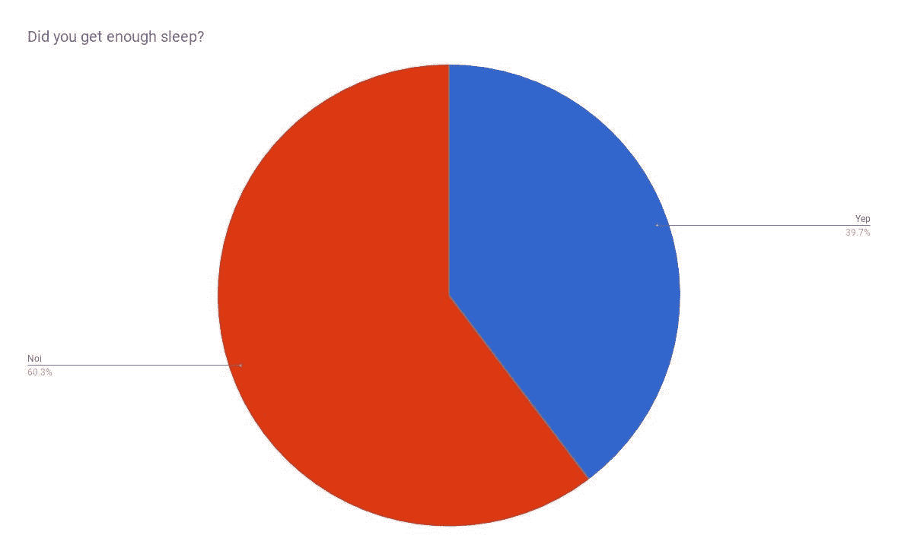

看起来，不是。我记录过在 40%的时间里“足够”的睡眠。


## 你现在有多兴奋？
答案在 0 到 7 之间。

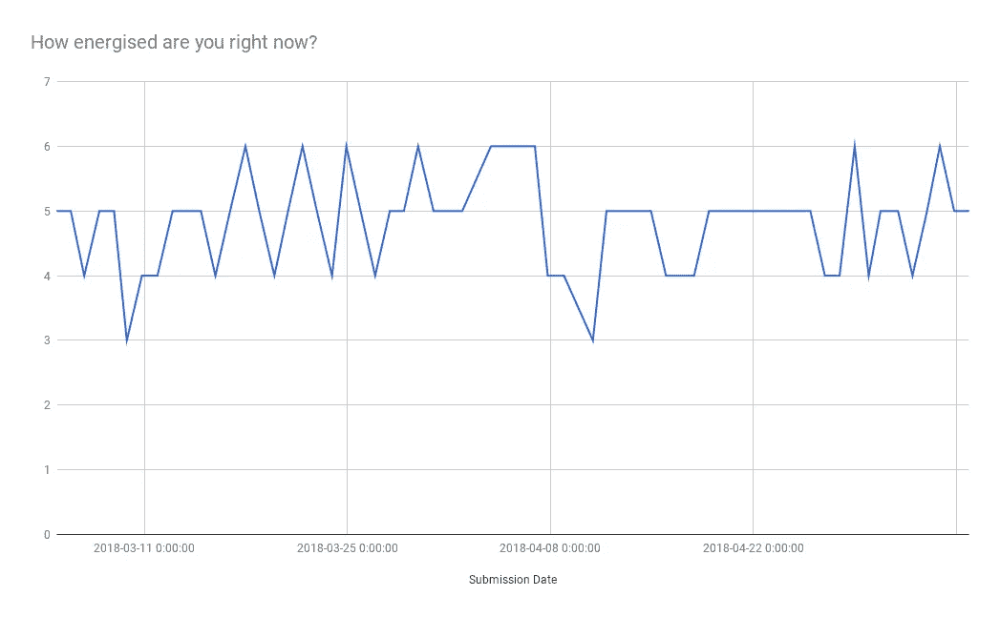

貌似我从来没低于过 3，高于 6。总能量始终超过 50%。


## 你觉得你今天会过得怎么样？范围从 0 到 10。

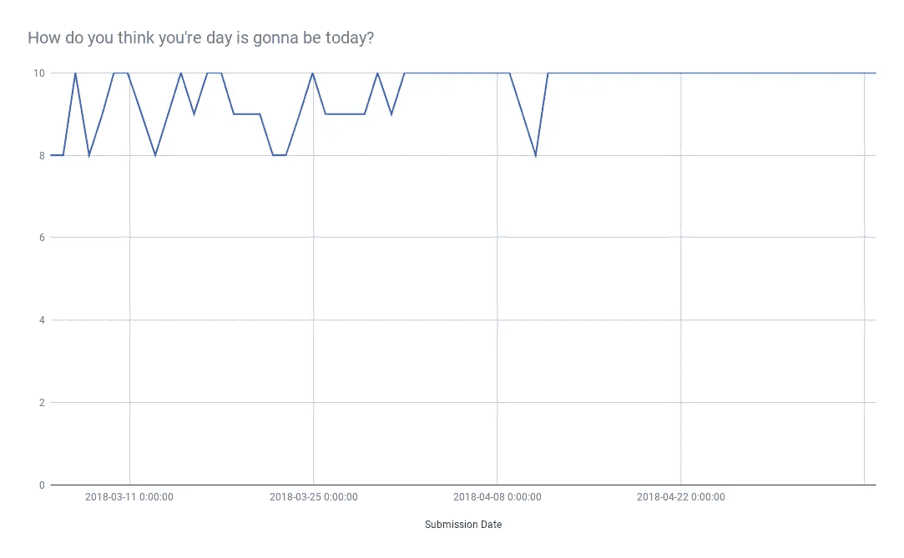

看来我是个乐观主义者。我从来没有录过 8 以下的；最近几乎是 10 年。看来我对这一天的期望与日俱增。

# 现在，夜自省。

## 我晚餐吃得好吗？

也许很琐碎，但是吃一顿饱饭，并且吃饱喝足，是相当重要的。

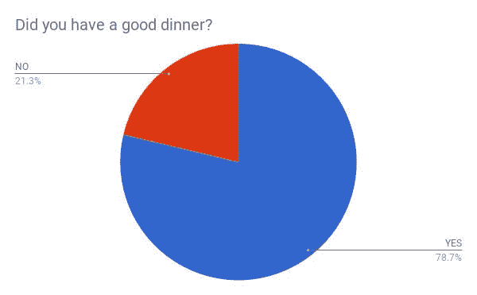

我 80%的时间都吃得很好。:) *Yumm。*


## 你今天过得怎么样？数字范围从 0 到 7。

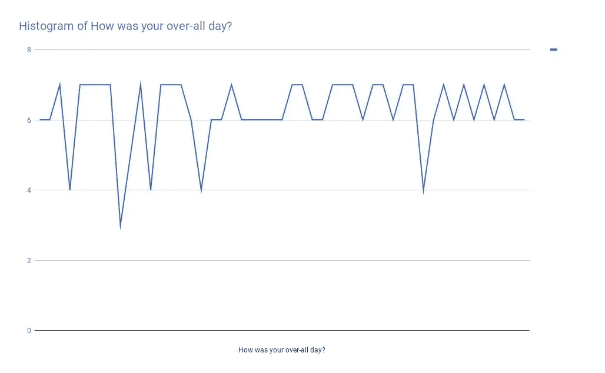

看起来我有很多美好的日子，也有一些糟糕的日子。我很高兴。是的。


## 今天是你一生中最美好的一天吗？

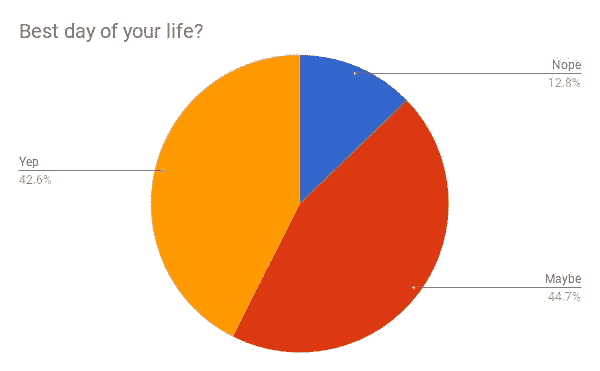

我有超过 40%的时间过得最好，而 ***也许*** 也有超过 40%的时间过得最好。有超过 10%的时间没有“最好的一天”。

> 对我来说，“最好的一天”是我能快乐地重新生活的那一天。


## 你想明天醒来吗？

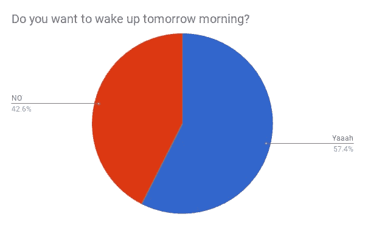

几乎 60%的时候，我都愿意第二天醒来。其他时候，我没有意愿或动力。


## 接下来是两个数据点的组合:度过了最美好的一天？&明天早上醒来？

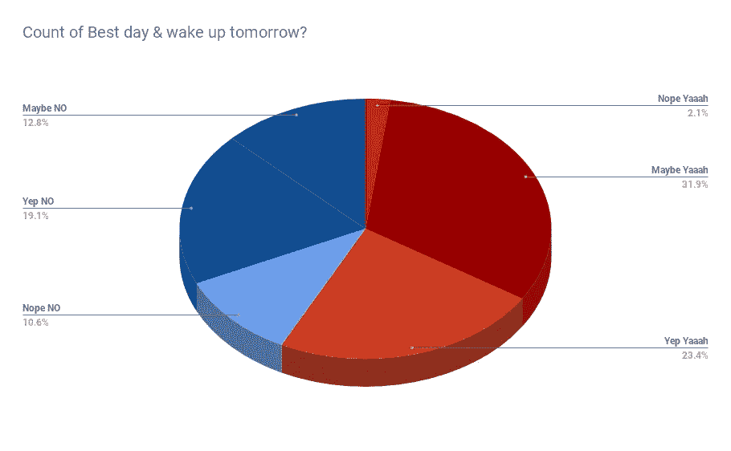

红色区域是我愿意第二天醒来的地方&蓝色区域是我不愿意的地方。这两种分类中最佳天数指标的数量颜色略有不同。大多数情况下，我希望第二天早上醒来时，我的前一天可能是最好的一天。当我没有过上最好的一天时，我第二天醒来的意愿是不可预测的。


## 这些是我记录的夜晚自省的时间。

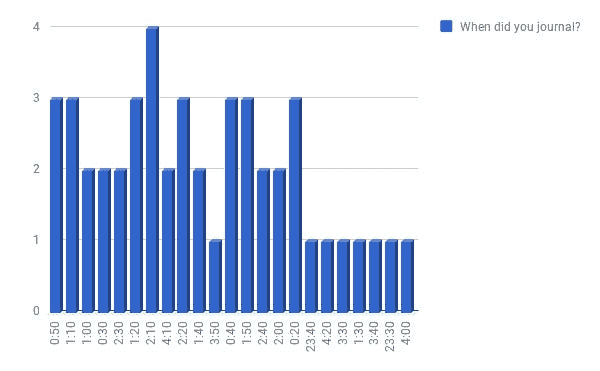

也就是说，我睡觉的时间是随机的。大多在 12:30 到 02:30 之间。有时在 23:30，有时也在 04:00。:P


## 下面是我写日记的日子。

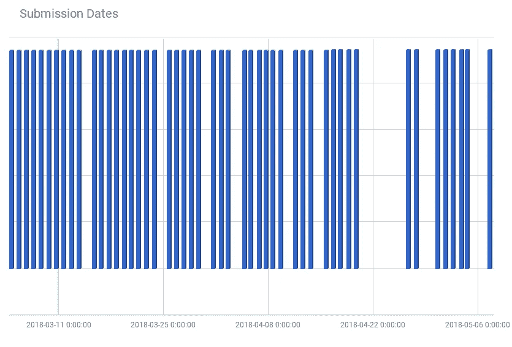

看起来我错过了几天时间。还有，那个巨大的缺口就是我的假期。

***Pheww。好多图表啊。***


## 其他问题呢？

我们还没有谈到这些表格中的主观问题。

例如:

今天什么让你笑了？
你今天赢了什么？你今天在担心什么？你现在有什么心事吗？

这些都是非常主观的，应该放在完全不同的位置上。

在这篇文章的开始，我也提到了我正在做的另一种形式的日志。这是自由形式的日志。使用移动应用和网络应用进行*旅程*。不管是幸还是不幸，都是超个人的。所以我不能分享太多。

因为在开始这个实验之前，我不仅仅是偏执(不是临床诊断)，我还维护了另一个数据集，用于跟踪另一个名为*Habit-Loop*的应用程序中的几个习惯。下面是这些数据的图表，这是我所有习惯的记录。

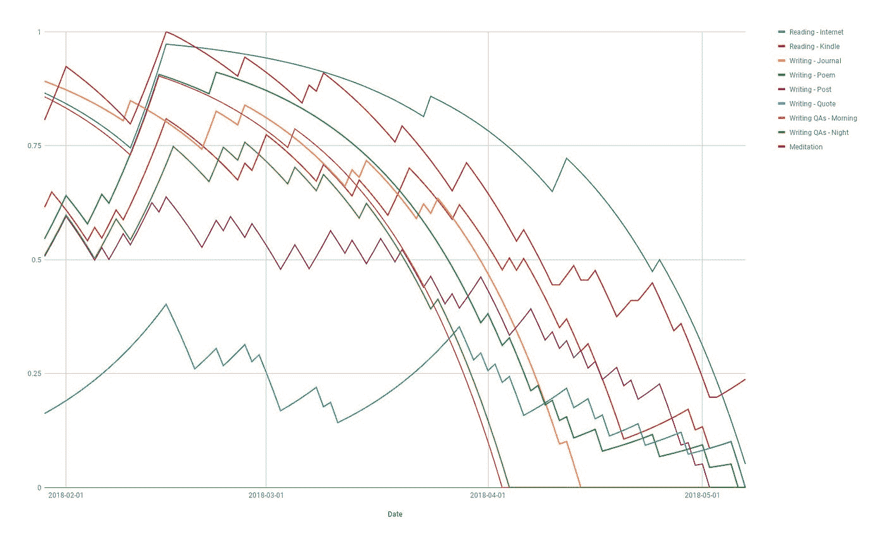

X 轴是日期范围。y 轴是我每天为当天的习惯输入是/否后，应用程序的得分从 0 到 1。

到实验结束时，我并没有真正的动力去维护这么多份拷贝。所以我把所有东西都转移到了一个应用上。那可以以后再贴:P


# TL；速度三角形定位法(dead reckoning)

*   我**没有得到足够的睡眠。**
*   不管前一天晚上睡得怎么样，我早上的能量水平都很分散。
*   我总是希望自己每天都过得开心。
*   我有幸享用了大部分美味的晚餐。
*   因为我期待自己有美好的一天，所以我大部分时间都过得很好。
*   几乎 ***80%*** 的日子都是我一生中最美好的一天或者“可能是最美好的一天”。
*   我挣扎于第二天醒来的动力或意志力。
*   我睡得不是时候。
*   我休假的时候不做这种填表(主要是因为没有互联网)。

```
***The list of daily affirmations:***May I be happy
May I be calm
May I be peaceful
May I be safe
May I be grateful
May I work deliberately & diligently
May I respect my body
May I use social media only after 6 PM
May I respect my own time
I am in charge of how I feel today. And I choose happiness. :)
```


我写[给媒体的公开信](https://writingcooperative.com/an-open-letter-to-medium-1a5d415bbf99)，[谈千禧一代](/the-post-grad-survival-guide/millennials-from-a-millennials-point-of-view-cbf2ca66f9fa)，[回味我十年前写的诗](https://writingcooperative.com/can-you-help-me-prove-i-didnt-write-this-1e0290ea98e0)，&写关于[告别](https://psiloveyou.xyz/invisible-threads-65a78c69c207)，[疯狂的前女友](https://thecreative.cafe/you-are-chaos-my-darling-d714894073f6)，[简单的谋杀](/lit-up/death-note-simple-murders-5d84f77097b2)。你可以打电话到 hi@writealetterforme.com 找我。比起咖啡，我更喜欢茶😋

[](https://medium.com/swlh)

## 这个故事发表在 [The Startup](https://medium.com/swlh) 上，这是 Medium 最大的企业家出版物，拥有 325，962+人。

## 在这里订阅接收[我们的头条新闻](http://growthsupply.com/the-startup-newsletter/)。

[](https://medium.com/swlh)