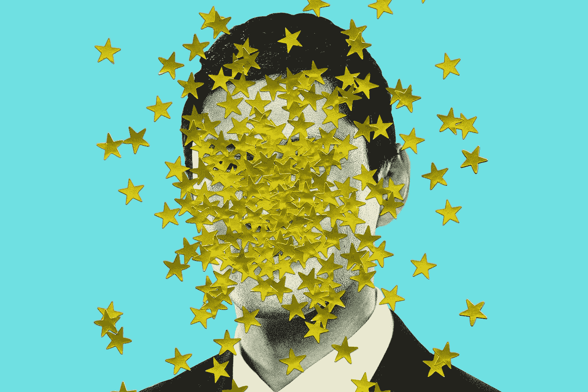

# 领导者给予第二次机会——这是一个通过努力获得机会的故事。

> 原文：<https://medium.com/swlh/a-leader-gives-second-chances-a-story-of-earning-your-way-to-opportunities-cdf6174cd2cb>

Image Credit: [MIKE MCQUADE](http://mikemcquade.com/)

那天我休息。我花了两个小时除了思考什么也没做。

这个思考时间是在我灰色的宜家沙发上，翘着脚，喝着一杯抹茶绿茶加杏仁牛奶完成的。这是我让我的大脑进行深度思考的方式。