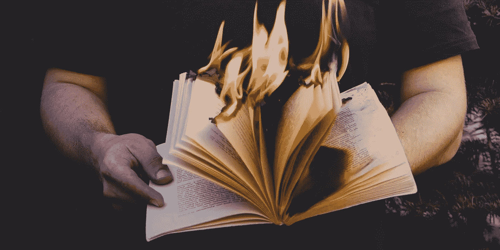

# 商业和企业家精神的一课:燃烧绝望的恶臭

> 原文：<https://medium.com/swlh/a-lesson-in-business-and-entrepreneurial-ism-burn-the-foul-stench-of-desperation-9efa972e75fd>

说实话，没人想活在生存模式中。

糟透了。

你失去了对自己能力的关注，你被账单分散了注意力，你没有安全网，没有柔软的毯子在大便碰到风扇的时候轻轻地抱着。

生存模式下生活的压力就像和不喜欢的人约会。

你这样做是因为你需要这样做，这意味着你不能惹恼他们，但你也不能责怪他们不讨人喜欢..这时你才恍然大悟——你在和自己约会，唯一有错的人是你自己。

当我们处于生存模式时，我们没有想到的是，没有人会注意，因为没有人在乎。

没有人想要你半吊子的报价、产品、服务，甚至是你该死的免费赠品——***，因为你需要他们接受*** 。

看到问题了吗？

他们是在帮你的忙，并且已经有了“我今天在这个世界上做了一些好事”的内啡肽，除了接受你提出的任何东西，他们没有采取任何进一步的行动。

人们知道绝望是什么感觉，因为每个人都经历过。

他们知道你会做出错误的决定。

他们知道你会不择手段地接近他们。

当你在绝望的时候寻找他们，你是在要求他们在你身上赌博。

> **除非他们确定你的能力和潜力，否则当你走出绝望的时候，你就是在让自己被拒绝。**

# 2017 年我收到的最好的建议， ***想富——要富。***

我不是在卖梦想，这不仅仅是钱的问题。但事实是，我们是一个被有效的东西、生长的东西和创造成功的东西所吸引而茁壮成长的物种。这就是我们如何成为食物链顶端的——在我们自己的三角形中，存在着一种扭曲的自然选择形式:

> 如果你自己没有提升的愿景，没有人能帮助你，也不会跟随你走上不归路。

10 天前，我辞去了在 Freelancer.com 工作了近 3 年的勇士论坛合作伙伴和营销主管一职..疯狂吧？

我有一份舒适的工作，整洁的桌子，免费的啤酒，周游世界，遇到了一个改变我生活的女孩，我周围都是业内最好的(有时是最聪明的)人..

..不，说真的，如果你受雇于自由职业者，你在过去的生活中做了一些正确的事情。

# 那么是什么让我抛弃了所有的名声、金钱、权力和“稳定”呢？

老实跟你说，最初我在别的地方得到了一个职位。伙计，它拥有你职业生涯中想要的一切。

它符合自我成就的清单。

它用一个奇特的头衔来满足你的自负。

它给了你友谊和成长的感觉，即使你面前什么也没有发生。

它给了你名声，金钱，权力。

它唤醒了一种新发现的虚构的自我感知的优势，只有像哈维·斯佩克特(#WWHD)或乔丹·贝尔福特这样的骗子才有胆量实现。

但它没有提供的是建造某物的饱腹感。在齐颈深的自我污秽和泥浆中游泳，撕裂你从零开始精心制作的东西——强大到足以改变世界。

就像我说的，很疯狂吧？每个企业家都是。你如何确定自己是企业家？

> 你用流行语说话吗？跟随流行的“成长秘诀”？订阅了 100 个播客，每一个听 30 秒，假装知道他们在说什么？
> 穿上印有你品牌名称的衬衫？codecademy 上的免费课程是关于如何编码的吗？(无意冒犯，他们其实是一个很棒的免费学习中心)。

如果你对以上所有问题的回答都是肯定的，请停止阅读。

以上所有的**并不能把你定义为一个企业家。**

即使是整体而言，如果你真的相信他们有，你甚至没有触及它的表面，你实际上只是在激怒我们其余的人，没有人会想要一个思想浅薄的实体靠近他们蓬勃发展的业务。句号。

# 那么你能做什么呢？你如何燃烧绝望的气味？

答案很简单:从让自己被生活中最强的牌所激励开始。

让我们来解决这个问题，拿起纸和笔，把这些东西分成两栏写下来:

*   你看怪不怪(现有的知识、技能、才能、能力)
*   你认识谁？(在你的网络中，在你的网络外，影响者的智慧)

现在想一想，你如何利用这两者来帮助你起步、成长或把你推向正确的方向？你可以尝试什么组合？

把它写在列中，当你开始组合它们时，拿起一支红笔，开始画连接线。一旦你画出了你的连接**在**中添加第三和第四列:

*   我需要什么
*   *我 ***想要什么****

*答案总是相似的，但绝不会相同。示例:*

**你* ***需要*** *一辆车，但你* ***想要*** *一辆保时捷。**

**你* ***需要****1000 美元来还清你的账单，但你* ***想要****3000 美元，因为有它来过节会很好。**

*你 ***需要*** 来学习交朋友，但是你 ***想要*** 拥有他们，即使你是一个可怕的人。*

**你* ***需要*** *2 个客户来让你的生意运转，但是你* ***想要*** *20，这样你就可以退休在波多黎各长岛的海滩上啜饮。**

*现在举起你的纸告诉我:你知道你想要什么吗？其次，你知道你需要什么吗？*

*两个问题都回答是，因为如果你正确完成了这个简单的练习，你就不再绝望了。*

*你 ***不再需要*** 去思考你的方向，因为你在纸面上已经有了。*

*恭喜你，这是你的保时捷:*

**

*你现在可以告诉我你想要什么，无论是保时捷，现金，朋友还是海滩上的长岛，我们都知道你想要的东西可以实现，如果你遵循你的需求的方向。*

*所以知道你需要什么，明白你想要什么并不是一蹴而就的:是时候采取行动了。燃烧绝望的恶臭。*

*呼出狗屎，吸入好东西。*

*不要盯着你最强的牌，开始在桌上打。你的卡是易燃的。*

*你的技能，你的天赋，你的知识——没有人能把这些从你身上拿走；无论你把它们扔在燃烧台上多少次，它们都不会燃烧。*

*年底，当你完成你的清单时，把它卷起来，点燃它。*

**

*在为别人工作了 10 多年后，我刚刚开始了建立一家数字网络代理公司的史诗般的旅程。我非常兴奋，这个永久成功的引擎不会很快停止，因为我在方向盘后面。*

*仅在过去一周，我就完成了价值 7，000 多美元的客户交易，客户的“需求”被确定为 3，000 美元。我现在的个人挑战是在不到 6 个月的时间里达到每月 30，000 美元以上。*

*可实现？他妈的胡说八道。*

*我在理解自己需要什么的基础上建立自己的需求。我在把我的梦想变成现实，而不是被雇来创造别人的。*

*所有这些都是通过坚定信念的行动实现的，知道我的狗屎，打出我最强的牌，推倒一座桥，经历每一个糟糕的时刻，庆祝每一个美好的时刻——最后燃烧绝望的恶臭。*

*#letshustle*

**

## *这篇文章发表在 [The Startup](https://medium.com/swlh) 上，这是 Medium 最大的创业刊物，拥有 277，994+读者。*

## *在这里订阅接收[我们的头条新闻](http://growthsupply.com/the-startup-newsletter/)。*

**