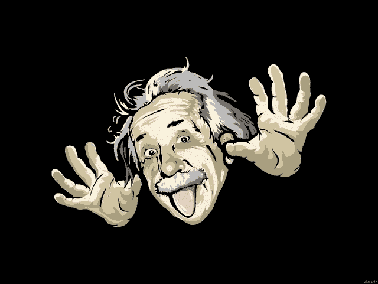

# 爱因斯坦给马基雅维利的信

> 原文：<https://medium.com/swlh/a-letter-from-einstein-to-machiavelli-3ba3ac846469>

## 唐纳德·拉姆斯菲尔德递交的信

在美国帮助冲突国家中有需要的人的特殊时期，作为乔治·w·布什总统的国防部长，唐纳德·亨利·拉姆斯菲尔德说:“国防部与国际人道主义援助机构有着良好的联系。所以我们想确保我们给正确的人提供食物。他想要保修，因为食物会被飞机扔出，这不是一件容易的事情。

拉姆斯菲尔德补充说“*不做好事，就不会有恶事发生”。*批评可以说他们[美国/国际开发署]喂错了人，也可以说食物不够。即使是这个拉姆斯菲尔德也坚持他的立场去帮助那些需要帮助的人。简而言之，拉姆斯菲尔德的行动是:不管批评，不要停止。

另一种做好事的方式……在第二次世界大战爆发前不久，阿尔伯特·爱因斯坦给美国总统写了一封著名的信，警告他德国人可能正在研制原子弹，并建议美国开始自己的核计划。这封爱因斯坦信的蝴蝶效应以广岛和长崎的核攻击而告终，六年后这封信。

你想象过如果没有这些信会发生什么吗？也许你正在用德语阅读这篇文章。对盟国和全世界来说，爱因斯坦的信是好的，因为它指明了结束战争的道路。但是爱因斯坦把新型战争造成的恐怖归咎于自己，并责备了自己的信件。

拉姆斯菲尔德和爱因斯坦做了好的行动，但是第三方从他们的良好意图出发使用的方法是不同的。一个是飞机，另一个是原子弹……好的和坏的方式！两者都受到正面和负面的批评。只有一个人能够综合这种有益的两极性:尼依格罗酒店·马基雅维利。

如果爱因斯坦能给马基雅维利写一封信，其中可以写下下面的句子:*“亲爱的王子朋友，如果我不再需要开始，怎么说目的证明了手段的正当性？”* …也许答案可以是*“亲爱的亲戚朋友”“我们无论做好事还是做坏事都会被憎恨”，所以开始并不重要*。

在这封虚构的信中，拉姆斯菲尔德可以对马基雅维利说:“嘿，我警告过爱因斯坦”“不要做好事，就不会有坏事发生”，但他给我看了他的舌头。

_ _ _ _ _ _ _ _ _ _ _ _ S Q N Mind _ _ _ _ _ _ _ _ _ _ _ _ _

上面的文字是我之前在 MEDIUM 网站上写的另一个例子。SQNMind 理论试图从你阅读的每本书中提取精华。该理论包括将书中最有趣的段落提取到你头脑的“必要条件”类别中。这将把你的大脑变成原始知识的海洋，随时准备在任何情况下适应你的现实。

因此，为了更好地解释这个理论，我在大胆的范畴内写下了一些解释，这是我多年阅读后形成的二十个解释之一。作为动力，我引用了唐纳德·拉姆斯菲尔德、阿尔伯特·爱因斯坦和尼依格罗酒店·马基雅维利。

分开书的段落！你不需要像我上面那样写它们，只要尽可能多的阅读它们就行了。与那些不读书、不读书、不记所学知识的人相比，一个有 SNQMind 的人在不同领域都有很好的成功机会。

这是第三章第五场，亲爱的。下一个场景是关于知识的。但是如果你错过了关于 SQNMind 理论的最后一整章，请点击[注意差距](/@danieljunior_58594/mind-the-gap-e6dd7ee7ad0e)。

**未完待续！**

The DJerian theory number ONE

## 这篇文章发表在[《创业](https://medium.com/swlh)》上，这是 Medium 最大的创业刊物，有+400，714 人关注。

## 在这里订阅接收[我们的头条新闻](http://growthsupply.com/the-startup-newsletter/)。

