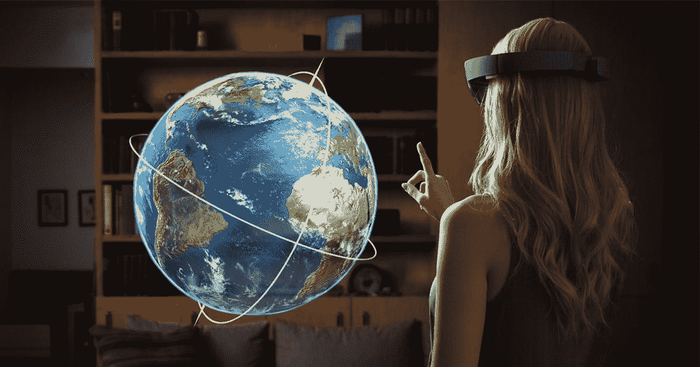

# 手势设计的未来

> 原文：<https://medium.com/swlh/a-look-at-the-future-of-gesture-design-9cd63efc6a9b>

## 基于手势的交互揭示了多模态的未来

Photo by [Microsoft](https://docs.microsoft.com/en-us/windows/mixed-reality/gestures)

机器学习、计算机视觉、自然语言处理和传感器技术的最新进展使我们能够以前所未有的方式与数字世界互动。以前受限于鼠标、键盘或触摸屏，现在我们可以越来越多地使用手势和语音输入…