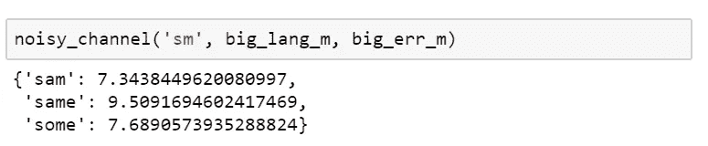

# 一个理解花哨缩写的机器学习模型，接受过托尔金的训练

> 原文：<https://medium.com/swlh/a-machine-learning-model-to-understand-fancy-abbreviations-trained-on-tolkien-36601b73ecbb>

最近在 Stackoverflow 上碰到了一个[问题](https://stackoverflow.com/questions/43510778)，如何从缩写中恢复短语，比如把“ *wtrbtl* ”变成“*水瓶*”，把“ *bsktball* ”变成“*篮球*”。这个问题还有一个额外的复杂因素:缺乏全面的词汇列表。这意味着，我们需要一种能够发明新的可能单词的算法。

我很感兴趣，并开始研究现代拼写检查器背后的算法和数学。事实证明，一个好的拼写检查器可以用 n-gram 语言模型、单词变形模型和贪婪波束搜索算法来完成。整个构造称为[噪声通道](http://web.stanford.edu/~jurafsky/slp3/5.pdf)模型。

有了这些知识和 Python，我从头开始写了一个模型。经过对“环的友谊”文本的训练，它能够识别现代体育术语的缩写。

拼写检查器应用广泛:从手机键盘到搜索引擎和语音助手。做一个好的拼写检查器并不容易，因为它必须同时非常快速和通用(能够纠正看不见的单词)。这就是为什么拼写检查有这么多的科学。这篇文章旨在给出这门科学的概念，只是为了好玩。

## 拼写检查器背后的数学原理

在噪声信道模型中，每个缩写都被视为原始短语随机失真的结果。

为了恢复原始短语，我们需要回答两个问题:哪些原始短语是可能的，哪些失真是可能的？

根据贝叶斯定理，

这里的*变形*是对原*短语*的任何改变，使其变成可观察到的*缩写*。“~”符号表示“成比例”，因为 LHS 是概率分布，而 RHS 一般不是。

原始短语似然性和失真似然性都可以用统计模型来估计。我将使用最简单的模型——角色级 [n-grams](https://en.wikipedia.org/wiki/N-gram) 。我可以使用更难的模型(例如递归神经网络)，但这不会改变原理。

有了这样的模型，我们可以使用贪婪的定向搜索算法，一个字母一个字母地重建可能的原始短语。

## n 元语言模型

n-gram 模型查看前面的 *n-1* 个字母，并以它们为条件估计下一个( *n* 个)字母的概率。例如，字母“g”出现在“bowlin”序列之后的概率将由 4-gram 模型计算为 *p(g|bowling)=p(g|lin)* ，因为为了简单起见，该模型忽略了这 4 个字符之前的所有字符。诸如此类的条件概率是在文本的训练语料库上确定(“学习”)的。在我的例子中，

这里 *#(凌)*是训练文本中“凌”出现的次数， *#(林)*是文本中所有四字格的数目，从“林”开始。

为了正确估计甚至罕见的 n-gram，我应用了两个技巧。首先，对于每个计数器，我添加一个正数 *δ=1* 。它保证我不会被零除。第二，我不仅使用 n-grams(在文本中很少出现)，还使用 n-1 gram(更频繁)，以此类推，直到 1-gram(字母的无条件概率)。但是我用一个 *α* 乘数来贴现低阶计数器。因此，实际上我把 p(g|lin) 计算为

对于那些更喜欢实现而不是理论的人来说，这里有我的 n-gram 模型的 Python 代码和接下来的一切。

## 缩略语的模式

我们需要语言模型来理解哪些原始短语是可能的。我们需要缩写(或“变形”)的模型来理解原始短语通常是如何变化的。

我将假设唯一可能的扭曲是从短语中排除一些字符(包括空白)。该模型可以被修改以考虑其他失真类型，例如字符的替换和排列。

我没有一个大样本来训练一个复杂的失真模型。因此，对于失真，我将使用 1 克。这意味着，模型将只记住每个字符从缩写中排除的概率。尽管如此，我还是把它编码成一般的 n-gram 模型，以防万一。

## 贪婪地寻找最可能的短语

有了语言和变形的模型，理论上我们可以估计任何原始短语的可能性。但是为此我们需要循环所有可能的(原始短语，变形)对。它们实在是太多了:例如，在 27 个字符的字母表中，有*个 27^10* 个可能的 10 个字母的短语。我们需要一个更智能的算法来避免这种近乎无限的循环。

我们将利用模型是基于单个字符的事实，并逐个字母地构造短语。我们将建立一个不完整候选短语的堆，并评估每个的可能性。最佳候选项将用多个可能的单字母延续符进行扩展，并添加到堆中。为了减少选择的数量，我们将只保存“足够好”的候选人。完整的候选项将被搁置，最终作为解决方案返回。除非堆或最大迭代次数用完，否则将重复该过程。

候选词的质量将被评估为缩写词的对数概率，假设原始短语以候选词开始，以缩写词本身结束(因为候选词不完整)。为了管理搜索，我引入了两个参数:“乐观”和“自由”。“乐观”评估当候选人完全覆盖缩写时可能性将如何提高。将“乐观度”设置在 0 和 1 之间是有意义的；它越接近 1，算法尝试添加新字符的速度就越快。“自由度”是与当前最佳候选相比，质量的容许损失。“自由度”越高，包含的选项就越多，算法就越慢。如果“自由度”太低，堆可能会在找到任何合理的原始短语之前耗尽。

## 对霍比特人的测试

要真正测试算法，我们需要一个好的语言模型。我在想，如果一个模型是在一个刻意限定的语料库上训练的——就一本关于一个不寻常主题的书，那么它能在多大程度上破译这些缩写。我拿到手的第一本这样的书是《指环王:指环王联盟》。好吧，让我们看看霍比特人的语言能在多大程度上帮助破译现代体育术语。

但首先我们需要训练模型。对于缩写模型，我手动创建了一个简短的训练语料库，其中 25%的辅音和 75%的元音被缩写掉。

在“测试集”(本书的结尾)上比较了不同模型的平均可能性之后，我选择了 5-gram 语言模型。似乎字符概率预测的质量随着模型的阶数而增长。但我没有超越 5 的阶，因为阶大意味着模型的训练和应用慢。

训练结束后，我将算法应用于不同的宫缩。首先，我要求“ *sm* ，意思是“*山姆*”。模特很容易认出他。

“佛罗多”也是从“frd”毫无问题地破译出来的。

“戒指”也是，来自“rng”。

在运行“wtrbtl”之前，我尝试了第一部分，“wtr”。“水”被完美地破译了。

有了“瓶子”,模特就没那么自信了。毕竟战斗在《指环王》中出现的频率比瓶子还高。

但在某些情况下，这正是我们所需要的。

对于“wtrbtl ”,该模型提出了多个选项，但“水瓶”是其中的第二个选项。

以前从未见过的“Basketball”几乎被正确地识别出来，因为单词“basket”出现在训练文本中。但是我必须将搜索光束的宽度从 3 扩展到 5，才能发现这个选项。

训练文本中从未出现过“ball”一词，因此模型未能识别“bwlingbl”中的“bowling ball”。但它提出了“比尤林比尔博”，“保龄球打击”，以及其他几个替代方案。“保龄球”这个词也从未在《指环王》中出现过，但这个模型不知何故成功地用它对英语的共同理解重建了它。

## 怪异文本的产生

最后，只是为了好玩，我尝试用我的缩写模式来缩写《指环王》的开头。看起来很奇怪。

> 这本书非常关注 Hbbts，并且从它的文章中可以看出它的许多特点和不足。此外，在《霍比特人》的第二部中，还会发现已经出版的红宝书中的一部分。这个故事来源于红河流域的早期居民，由第一个在世界上出名的霍比特人 Blbo hmslf 完成，他在那里找到了他，又找到了他，记录了他去东方的旅程和他回来的路程。

语言模型可用于生成全新的文本。它有一些托尔金的风格，但完全没有意义。

> 佛罗多想要我，但是他们却溜了进来，他看见了，皮聘沉默地说，跟随的名字就像白天一样，或者霍比特人逆转了任何前进的方向，说着说着，许多人闲下来的时候，他们伸出手，我们哭泣着，他们点燃了一个简单的攻击，挣扎着，在一个什么是巴罗，意志，耳朵，什么都在生长。

从头开始生成有意义的文本仍然超出了数据科学的能力范围。因为它需要真正的人工智能，能够理解发生在中土世界的复杂故事情节。

## 结论

自然语言处理是科学、技术和魔法的复杂混合体。即使是语言学家也不能完全理解人类语言的规律。机器真正理解文本的时代不会很快到来。

自然语言处理也很好玩。有了几个统计模型，您就可以识别并生成不明显的缩写。对于那些想继续我玩数据的人，有一个 [jupyter 笔记本](https://github.com/avidale/weirdMath/blob/master/nlp/abbreviation_spellchecker_english.ipynb)，里面有实验的完整代码。至于这个博客，其他的实验会跟进。所以订阅吧！:-)

## 这篇文章发表在[《创业](https://medium.com/swlh)》上，这是 Medium 最大的创业刊物，有 284，454+人关注。

## 在这里订阅接收[我们的头条新闻](http://growthsupply.com/the-startup-newsletter/)。

