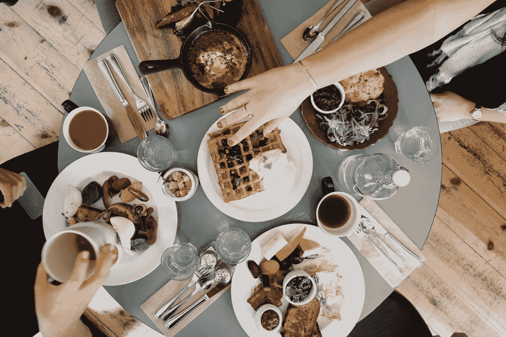
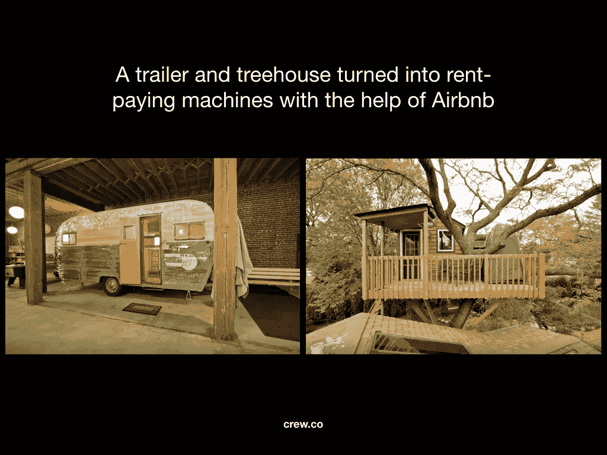
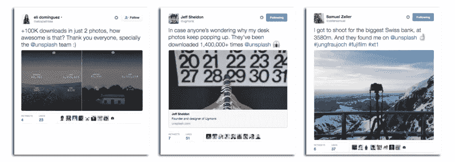
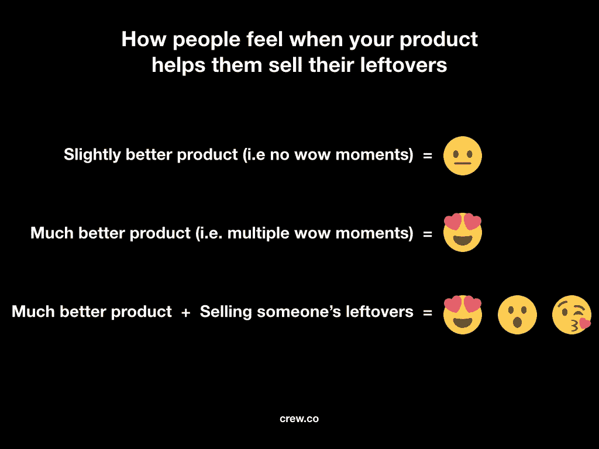

# 神奇的商业模式:帮助某人出售剩菜

> 原文：<https://medium.com/swlh/a-magic-business-model-help-someone-sell-leftovers-689345225904>

## 俗话说:一个人的垃圾是另一个人的财富…

[Photo by Ali Inay / Unsplash](https://unsplash.com/@inayali?photo=y3aP9oo9Pjc)

[*本帖最早出现在剧组博客上。*](http://crew.co/backstage)

与许多企业一样，优步和 Airbnb 的存在是为了让事情变得更简单。对优步来说，这让搭车变得越来越容易。对于 Airbnb 来说，最重要的是轻松找到住宿的地方。

但是[如果有这么多的业务让事情变得更简单或更好](https://crew.co/backstage/blog/the-psychology-of-simple/)，为什么优步和 Airbnb 会脱颖而出，成为“革命性的”

除了明显优于其他选择之外，优步和 Airbnb 脱颖而出的原因之一是，它们的商业模式建立在一种令人感觉不可思议的成分之上:它们帮助人们出售他们的剩菜。

# 卖剩菜

我第一次听说“卖剩菜”是在畅销书作家、Basecamp 创始人杰森·弗里德(Jason Fried)的一篇名为“[卖你的副产品](https://signalvnoise.com/posts/1620-sell-your-by-products)”的文章中。

Jason 写了一个木材行业的例子，木材企业已经想出如何通过出售他们砍伐木材后剩余的锯屑和其他副产品来创造收入来源。

卖你的副产品，或者说剩菜，意味着卖你做了核心产品后剩下的东西。

在你的加工过程中发现副产品并打包出售不仅可以节省你的时间，还可以将你认为是废物的东西变成有价值的东西。

Basecamp 以卖剩菜为生。

他们最畅销的书籍是他们在创建公司时经历的经历的遗留物。流行的编程语言 Ruby on Rails 是他们开发产品的遗留物。甚至他们的博客都是已经转化为重要价值的剩余物。Basecamp 从未支付任何营销费用。相反，他们部分依靠出售他们的剩余产品来建立一个价值数百万美元的公司。

优步和 Airbnb 等公司背后的商业模式的美妙之处在于，它们帮助很多人出售他们的剩菜。它们让几乎所有有车有房的人都有机会从无到有。

有了优步，你可以从汽车的剩余空间中赚钱。

有了 Airbnb，你就可以利用房子里剩余的空间赚钱了。或者你的[预告片](https://www.airbnb.ca/rooms/774999?wl_source=list&wl_id=75&role=public)。或者你的[树屋](https://www.airbnb.ca/rooms/440817?s=TGir4yxD)。

那辆昂贵的汽车或房子，可以在一夜之间变成提款机。这感觉就像魔术一样。

# 为什么你觉得卖剩菜能得到更多

出售剩菜的感觉很特别，因为你如何看待收益。

这里有一个简单的例子:

假设你有一张漂亮的桌子想卖掉。你认为它值 200 美元，但你不知道卖给谁，也不想花时间去卖。

然后，一家企业找到你，说他们会帮你以 400 美元的价格卖掉那张桌子。作为交换，他们保留 100 美元。你得到 300 美元。

如果桌子卖了，你会很高兴的。你不需要考虑卖掉它，你得到了 300 美元，比你认为的桌子的价值多了 100 美元。你会觉得自己脱颖而出。

现在让我们假设你有一张桌子，你觉得它太丑了，明天你会把它扔进垃圾桶。

然后，一个商家来找你，说我帮你把那个丑桌子卖了，同样的东西，400 美元。他们保留 100 美元。你得到 300 美元。

这可能看起来像是同一笔交易，但是因为你把你丑陋的桌子估价为 0 美元，你认为第二笔交易更好。准确地说是三倍。

## **蛮表交易**:

**$300** (你从卖你桌子的公司那里赚了多少)——**$ 200**(你认为桌子值多少)= **$100 感知收益**

## **丑表交易**:

**$300** (你从卖你桌子的公司那里赚了多少)——**$ 0**(你认为这张桌子值多少)= **$300 感知收益**

尽管你卖漂亮或难看的桌子都能赚 300 美元，但当你卖难看的桌子时，你的感知收益是原来的三倍。

这会让你有什么感觉？最有可能的是，你会对能够通过出售你的丑桌子来帮助你赚钱的生意产生更多的积极情绪，而你会想着那个生意，想知道他们如何能够帮助你从无到有地创造一些东西。

你可能会回到这个行业，看看他们是否能帮你卖出更多你打算扔掉的东西。你甚至可以告诉你的朋友也做同样的事情。

# 卖剩菜比卖更高的效率能产生更大的影响

这些“惊喜时刻”——人们从你的产品中获得的积极感受——是你在当今竞争激烈的市场中脱颖而出的原因。

[你创造的‘惊艳时刻’越多，你就越突出](http://backstage.crew.co/building-in-public/#start-with-problems)。

如果你提供了一个更好的产品，但它仍然不够好，不足以产生“惊叹”，人们可能不会对你有足够的信心，不会放弃他们目前用来完成工作的任何东西。

在精神上，我们的大脑想要做的是用最少的工作给我们最大的回报。如果你不能让事情变得简单，为什么会有人选择你呢？

这是公司经常碰到的一堵墙。

他们可能已经造出了更好的产品，但他们还没有造出足够好的产品来弥补人们认为的从他们目前正在做的事情转向新的东西的成本。

你必须做得非常好，以至于转换变得很明显。

产品体验中的多个“惊喜时刻”不容易产生。他们通常需要数年时间才能恢复正常。

人们被第一代 iPhone 震惊了，但是[花了 5 年时间才把](http://mobile-review.com/articles/2010/iphone-history3-en.shtml)做好。

这就是为什么弄清楚如何帮助别人卖掉他们的剩菜比通过更好或更多的功能卖给别人更有效率更容易产生“哇时刻”的原因。

当有人意识到你帮他们卖剩菜时，这比一个特色更突出。

虽然不容易，但想想你的产品如何帮助别人出售他们的剩菜，将会给你的产品带来一个“惊喜时刻”。它可能会给人留下一种印象，就像你构建的功能所创造的多个“惊喜时刻”一样强烈。

我亲眼目睹了这种影响。

[Unsplash](http://unsplash.com) 是我们创办的一个摄影网站，免费提供高清照片，你可以随心所欲。

我们最初建立 Unsplash 是因为我们不喜欢任何替代的库存照片选项，但它也是建立在帮助销售剩余物的基础上。我们的剩菜。

我们开始 Unsplash 是因为我们有一个摄影剩余的照片，我们不会做任何事情。与其把它们放在文件夹里浪费掉，我们决定免费赠送。

我们认为，如果人们发现我们的照片有用，也许我们可以为我们的核心业务——剧组——获得一些曝光。

因为我们反正不会用这些照片，在我们看来，它们毫无价值。因此，当这些照片被下载了数万次，[以及摄制组的大量曝光和销售](http://blog.crew.co/how-side-projects-saved-our-startup/)时，我们被震撼了。

今天，我们 Unsplash 的目标是为许多人做同样的事情:将可能是剩余的照片转化为价值。基于这种模式，我们已经看到 Unsplash 起飞，增长到超过 50，000 名贡献者，几乎每月有 10 亿张照片被观看，以及[许多](https://twitter.com/zellersamuel/status/723436863109787649)[良好](https://twitter.com/grakozy/status/721003705013772288) [共鸣](https://twitter.com/elizabethlies/status/729657677689786369)。

当你帮助别人出售他们的剩余产品时，这比试图向别人推销稍好的产品中的另一个功能更容易，也更有效。

为了工作，企业需要比现有的选择更好。但如果你能以某种方式将帮助别人卖剩菜融入你的模式，你就为你的业务增加了一个维度，这将帮助你进一步脱颖而出。

如果你帮助别人卖剩菜，更多的人会对你产生“天哪，太棒了”的感觉。

找出如何帮助别人出售他们的剩菜的最好方法之一是看看你自己的剩菜。

你坐在那里什么都不创造价值？

你的客户坐在那里没有创造价值的是什么？

对我们来说，是照片。

对于木材工业来说，这是锯屑。

对于 Basecamp 来说，它是书籍、编程语言和博客。

到处都有机会制造一种产品，帮助人们打包剩菜并出售。

弄清楚如何帮助别人卖掉他们的剩菜比卖给别人更有效率会产生更大的影响。