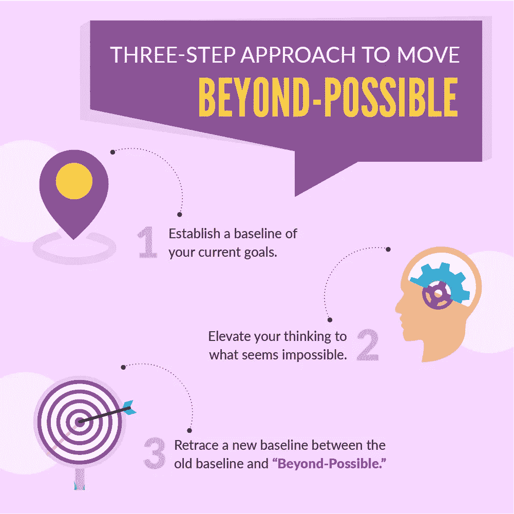
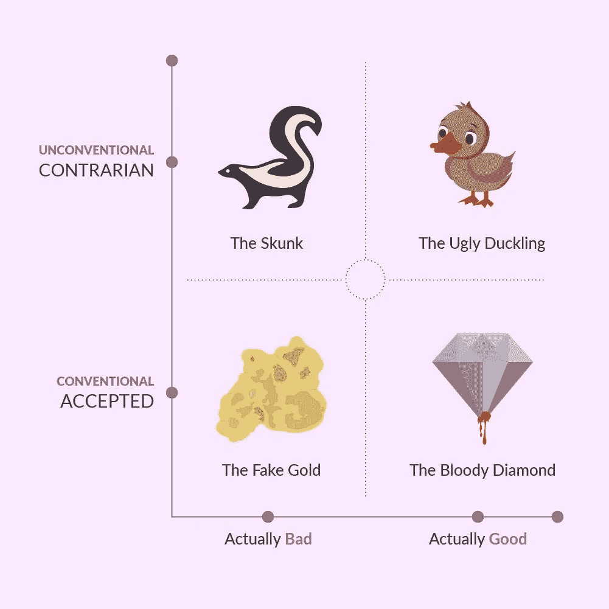
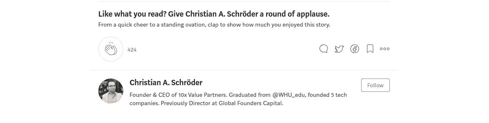

# 实现更多目标的思维框架:超越“可能”

> 原文：<https://medium.com/swlh/a-mental-framework-to-achieve-more-moving-beyond-possible-f97a8850a96f>

总结:初创企业的成功往往可以通过胸怀大志、追求远大目标来实现。在这篇文章中，我将描述创业成就的三个步骤:首先，建立你当前目标的基线。然后，把你的思维提升到看似不可能的事情。最后，追溯一个新的基线，代表旧基线和“不可能”之间的最佳点

## 看做新手的美德。

五年前，当我加入 Rocket Internet，担任其投资组合中一家公司的董事总经理时，我以雄心勃勃而闻名，有时甚至会向员工提出不可能的要求。这种心态主要是由我获胜的决心驱动的，但也有一部分是因为我对我们行业的实际局限性缺乏了解。尽管如此，设定不可能的目标驱使我们的员工跳出框框思考，想出新的方法来实现更多。结果，我们超越了竞争对手，成为亚洲五个国家电子商务的市场领导者，最近[甚至将公司卖给了阿里巴巴集团](https://techcrunch.com/2018/05/08/alibaba-buys-rocket-internets-daraz/)。

回顾过去，我明白了缺乏经验有时也是一种美德。如果对你所处的系统边界没有一套明确的预期，你就有机会用一双全新的眼睛颠覆一个行业。

这种现象的另一个众所周知的例子是，埃隆·马斯克通过建造可重复使用的火箭改变了太空旅行行业，这在当时被认为是不可能的。当然，现在我们知道这项创新让 SpaceX 比其他导弹运营商拥有巨大的成本优势。

## “疯狂”是转型的根本。

那些有着“疯狂”想法的人，在传统的做事方式和被认为不可能的事情之间找到了最佳平衡点，是推动人类进步的人。从外部的角度来看，这些企业家超越传统，扩大了在这个过程中可能实现的事情的范围。这样做，他们有时可以产生史蒂夫·乔布斯著名的“宇宙中的一个凹痕”的影响。

实际上有一个非常著名的体育故事巧妙地强调了这一点:

1954 年 5 月 6 日，罗杰·班尼斯特第一次跑了不到 4 分钟的一英里。在这场里程碑式的比赛之前，人们普遍认为人类不可能在 4 分钟内跑完一英里。事实上，很多年来，人们认为 4 分钟一英里是一个物理障碍，没有人可以打破它而不对跑步者的健康造成重大损害。在两年半的时间里，10 名跑步者打破了 4 分钟一英里的记录，在四年内，这一记录被降低到 3 分 54.5 秒。

那么，阻止人类跑完 4 分钟一英里的物理障碍发生了什么？人类进化有没有突然的飞跃？不，是思维的改变造成了差异。

# 实现“超越可能”

虽然这个故事非常鼓舞人心，但它缺乏在日常创业生活中超越可能的可操作要点。因此，我想介绍一个实用的三步法，以结构化的方式实现“超越可能”:

为了将这一点付诸实践，让我们来看看创业环境中的三种不同情况:

*   推导运营目标和 KPI
*   设计客户喜爱的用户体验
*   寻找新的创业想法

## 推导运营目标和 KPI

衍生运营目标和 KPI 是“超越可能”框架最明显的用例之一。它可以帮助你合理化如何和为什么更高的目标可以实现。这样一来，在同等的现金和时间投入下，你可以获得更多的产出。另外，如果你和团队以研讨会的形式进行，你可以获得员工的强烈支持，因为他们会认为新的基线是合理的和可实现的。

*我想给你举两个过去几周的真实例子:*

首先，我与我投资的一家公司的创始人会面，讨论他们的商业计划。他们提出了到年底月销售额达到 25 万美元的目标。使用“超越可能”框架，我问他们为什么不能实现 100 万美元的月销售额，深入到一个细节层次，包括他们需要雇用多少人以及他们需要实现什么样的效率增益。现在，50 万英镑，是他们最初目标的两倍，似乎不再那么遥远了。这可能会导致下一轮估值的大幅提升。

第二，我会见了一个以销售线索为导向的企业的创始人，他提到了各种各样的服务。我们讨论了对该公司的潜在投资以及他们的运营计划。在我看来，他们目前通过销售线索获得的价值比例非常低，所以我要求创始人从每年 60 欧元提高到每年 500 欧元。然后，我们确定了 2-3 个容易实现的成果，以进一步实现盈利潜力，该业务现在有望大幅提高每个用户的单位经济效益。

使用“超越可能”框架得出运营目标和 KPI 的关键不在于简单地设定高目标。主要的价值来自于分析需要拉动哪些价值驱动杠杆来实现天价目标。这反过来有助于您了解哪些因素将对达到您定义的新基线目标做出最大贡献。因此，你将能够智胜你的竞争对手，为你的公司创造超额价值。

## 设计客户喜爱的用户体验

在最近一篇关于 Medium 的[文章](/@reidhoffman/how-to-scale-a-magical-experience-4-lessons-from-airbnbs-brian-chesky-eca0a182f3e3)中，[雷德·霍夫曼](/@reidhoffman)描述了 Airbnb 如何使用体现“超越可能”方法的策略来优化其客户体验。

*   首先，他们建立了旧的基线，他们称之为五星级体验:“你敲门，他们开门，他们让你进来。”
*   然后，他们一步一步地想象“超越可能”的 10 星级体验:“将有 5000 名高中学生欢呼[你的]名字，用汽车欢迎[你]来到这个国家，这将是一次疯狂的体验。”
*   最后，他们回到了一个中间点，那就是当主人用一瓶酒和一个准备好的冲浪板来迎接你，因为你喜欢冲浪。

一般来说，“超越可能”的方法非常适合设计客户体验，将你的客户变成品牌大使，为你的公司创造大量积极的口碑。显然，平衡影响、可行性和成本总是很重要的。尽管如此，还是有一些唾手可得的果实可以用 80/20 的方式来开发。

## 寻找新的创业想法

我相信一些最好的创业想法是逆向的，或者至少在本质上是非传统的。这是由于两个主要原因:

1.  由于市场的效率，最明显的想法中最好的往往已经被采纳并付诸实施。
2.  围绕这些想法的竞争较少，导致有可能建立一个利润率高于平均水平的垄断企业。

因此，你应该训练自己的思维，想出这些反向的、非传统的想法。

为了实现这一点，我们可以利用“超越可能”的方法，从步骤 2 开始:

首先，打开你的思维去思考完全疯狂的想法。这样做的结果是，你最终会得到大量非常糟糕的想法，但我保证你也会得到一些丑小鸭，它们最终会变成美丽的天鹅。这种思路实际上反映在麻省理工学院和加州大学戴维斯分校的研究中。著名作家[塞思·戈丁](https://itsyourturnblog.com/@thisissethsblog)也指出了产生大量坏主意的重要性，认为这比完全没有主意导致像企业家这样有创造力的人更少失败。

然后，反思你的想法。你可以通过使用“确定性元素”方法来做到这一点，我将在下一篇博文中解释这一点。通常，你会不惜一切代价避免那些通常被接受但实际上很糟糕的想法。这方面的一个例子是，既然自动驾驶汽车就在眼前，那就开一个停车场。

关键是要找出那些表面上看起来很疯狂，但实际上很好的想法。我称之为“丑小鸭”，因为人们最初会因为你追求他们而贬低你，但一旦商机出现，他们会钦佩你的远见和远见。这方面的一个例子是 Airbnb，它最初未能从许多著名的风投那里筹集到资金，因为他们对愿意与陌生人分享房屋的人持保留态度。事后看来，这些保留可能是正确的，但即使只有 1%的人愿意分享他们的房子，这仍然是一个巨大的市场机会。

有一些心智模型可以用来区分“丑小鸭”和“臭鼬”。其中之一是我在上面简要描述的“二元对比光谱”心智模型。本质上，大多数人认为世界是二元的，而现实是大多数事物确实在一个光谱上移动。从更全面的角度来看，你需要对未来有一个准确的愿景。如何做到这一点将是今后论文的主题。

一旦你确定了“丑小鸭”的清单，你就想把它们进一步分成两种类型的想法:

(1)自己想且能追求的想法。
(2)可能是好的但已经被采纳的想法，太早，或者太不符合传统而不能被社会或法律接受。

后者的两个例子是交易人体器官或使用迷幻药治疗精神病患者的市场。如果你做了调查，这两个想法都很好，但是现在不可能执行。抛开第二个类别，第一个桶代表你的非常规创业想法的新基线，其中存在具体的市场机会。如果你问我，我会推荐 2018 年的企业家在快速消费品、数字健康、移动和清洁能源领域寻找。

## 超越可能:一种胜利的心态

总之，让你的思维“超越可能”有助于你取得创业成功所需的非凡成果。这同样适用于寻找创业想法的企业家或学生，以及希望推动团队实现更多目标或提升客户体验等目标的高管。

在我的公司 10x Value Partners，我们与我们的公司合作，协调这一过程，帮助他们实现更多目标，获得宝贵的竞争优势。

## 这篇文章发表在 [The Startup](https://medium.com/swlh) 上，这是 Medium 最大的创业刊物，拥有 343，876 多名读者。

## 在这里订阅接收[我们的头条新闻](http://growthsupply.com/the-startup-newsletter/)。

