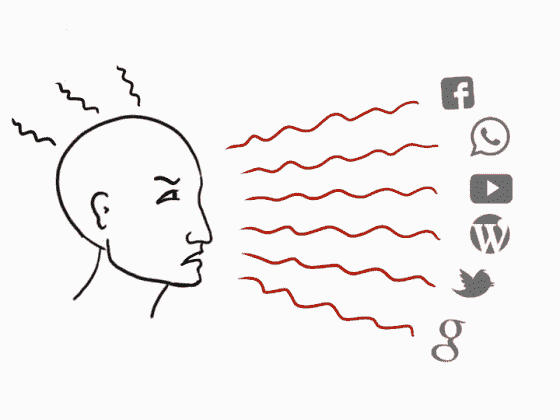
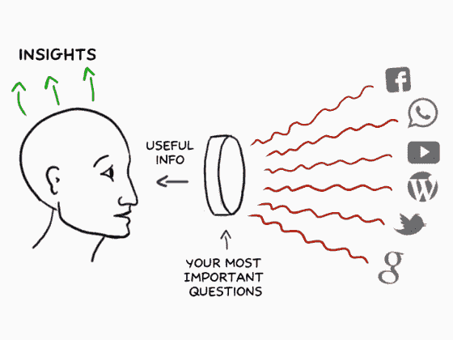
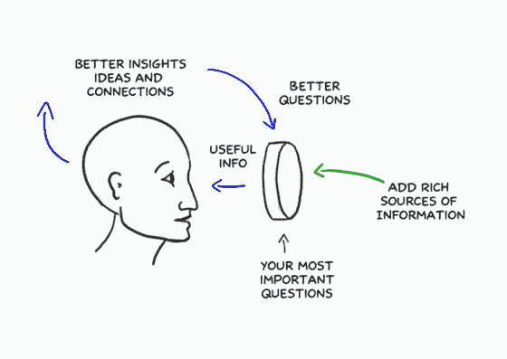
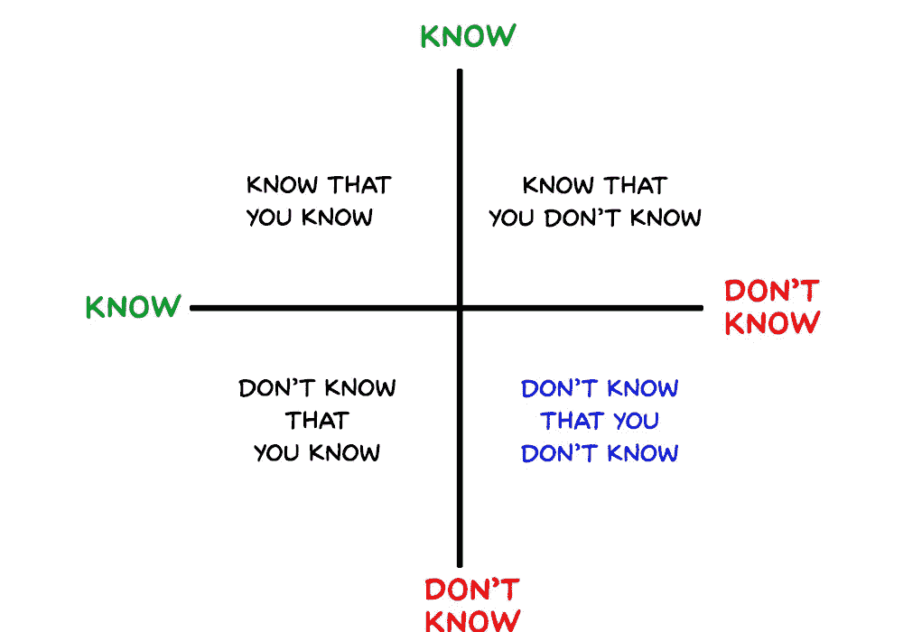
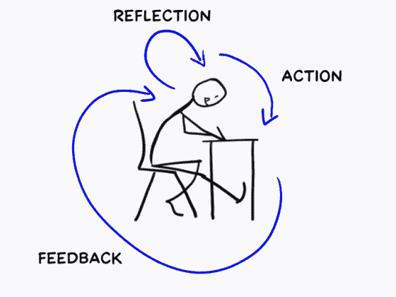

# 利用信息过载作为解决问题的创造性燃料的心智模型

> 原文：<https://medium.com/swlh/a-mental-model-to-leverage-information-overload-as-creative-fuel-for-problem-solving-584647c9b633>

网上冲浪感觉就像从消防水管里喝水一样。

我发现自己被 YouTube 视频、亚马逊书籍推荐、在线课程、博客帖子等淹没了，它们都在争夺我的注意力。

如果我不把它们都吃完，我担心我会错过一些重要的信息，这些信息会以某种方式影响我的生活。

更糟糕的是，信息流量呈指数级增长！

当我看到卡尔·纽波特的书《深度工作》时，我松了一口气。精髓总结在这个公式中:

**高质量的工作产出=(花费的时间)x(专注的强度)**

这很有意义。通过关闭分心和干扰，我将能够专注于在世界上创造价值的关键项目。

我受到启发，关掉了所有的社交媒体。不再有脸书。没有 Whatsapp。没有推特。只是基本的电子邮件和在线研究。

但后来我意识到，切断不同的信息来源是在后退一步。我错过了机会和想法，否则我永远不会得到。

互联网是一个巨大的网络，让你可以实时获取信息流。

推特。脸书。WhatsApp。中等。Quora。他们给你带来了你可能从未想过的视角。它在你的头脑中建立联系，激发出创新的想法，否则这些想法永远不会出现。

不是限制你的信息来源，这里有一个新的模式来利用丰富的信息来提高你的创造性产出。

# 1.通过你最重要的问题来过滤信息

在不久的将来，你可以向 Siri / Google Assistant 提出任何问题，它会立即给出答案。

世界上有很多答案。答案变得廉价了。每一个视频，博客文章，在线课程都是某人对他们曾经有过的一个问题的回答。

所以与其盲目消费别人的答案，不如得出自己的答案。

这要从问**好问题开始。**

什么是好问题？《连线》杂志的创始人凯文·凯利在他的书《不可避免的事情》中解释道:

> “一个好问题就像阿尔伯特·爱因斯坦小时候问自己的问题——“如果你在一束光上旅行，你会看到什么？”这个问题引发了相对论、MC2 和原子时代。
> 
> 好问题与正确答案无关。
> 
> 一个好问题不能马上回答。
> 
> 一个好问题挑战现有的答案。
> 
> 一个好问题创造了新的思维领域。
> 
> 一个好问题是能产生许多其他好问题的问题。
> 
> 一个好问题是，这可能是机器将学会做的最后一件工作。
> 
> 一个很好的问题是人类是为了什么。"

反思当前你最感兴趣的话题，然后列出你的“最重要的问题”。这些是基于你的问题的问题列表。

以下是我最重要的一些问题:

*   我如何过有目的的生活？
*   我如何组织我业务中的系统，以使涌现的特性是目的、快乐和成长？
*   我该如何组织我的一天，让我自动高效？
*   我如何布置我的工作空间，让创造力自然涌现？
*   加密货币如何替代货币？

这个想法不是要找到最聪明的问题，而是解决对你来说最关键的问题的问题。

透过你最重要问题的镜头上网。这些问题会组织你的注意力。你会发现自己对最重要问题的答案。新的见解将会出现。

问题不是信息过载，而是你没有把有用的镜头放到过滤器上，给你你需要的信息。

一旦你有了这些过滤器，你可以通过下面的步骤产生新的见解。

# 2.通过探索丰富多样的信息来源，获得新颖的见解

如果你花时间在你已经熟悉的材料上，你的见识和学习将会受到限制。

相反，通过包含更多样和丰富的信息来源来扩大你的信息摄入。

如果所有的知识都放在一个矩阵上，它会是这样的:

你最大的机会在第四象限:你不知道的事情，你不知道的事情。

这是我们最害怕采取行动的领域。这是对未知的恐惧，因为我们不知道那里有什么。探索身体、个人和人际关系的新奇体验。尝试你以前没有尝试过的东西。

当我回顾我的人生时，我最大的胜利发生在我踏入未知领域的时候。

反思自己的生活。你会发现那是真的。以下是一些你可以用来发现新体验的问题:

*   你会有什么新的体验，与你平常的体验非常不同？
*   你害怕做什么？
*   你不同意哪些信息来源？

通过增加新的经历，从更多样的来源获取信息，并通过你对重要问题的看法，它将使你的假设无效，在你的头脑中建立新的联系，新的见解出现。

以下是你如何将这些见解融入到你的工作中。

# 3.完成(小型)项目以整合学习内容

> “我们只知道我们制造什么。”
> 詹巴迪斯塔·维科，哲学家

学习不是记忆信息。真正的学习发生在你采取行动的时候。采取行动给了你来自真实生活经验的反馈，这给了你新的数据来反映你的工作。

为了将这些见解融入你的思考方式，你需要从消费转向真正的创造。

当你采取行动时，你会收到来自现实世界的反馈。你从直接经验中学习。

你可以这么做。

从你拥有的最重要的问题中，选择一个试图回答其中一个问题的项目。

它不一定是一个大项目，即使是一些小的也可以。例如，如果你有兴趣了解更多关于加密货币&比特币的信息，这里有一些你可以探索的简单项目:

*   向家人解释什么是比特币
*   投资少量比特币
*   写博客
*   掀起一场推特风暴

以上任何一项都会竖起一个镜头，它会过滤掉 99%的信息，并准确地告诉你你需要知道哪些与你现在的需求相关的信息。

解决特定需求的有用项目是你观察世界的最聚焦的镜头。

以这篇博文为例。通过参与发表这篇文章的项目，我在脑海中理清了一个处理信息过载的新的思维模式，也学会了如何创建简单的动画 gif。

# 拥抱丰富的信息

> 互联网最大的好处是有如此多的信息。互联网最糟糕的地方就是信息太多了。

在我改变了对信息的思维模式后，我不再被大量的信息淹没。我不再为消费有趣和令人兴奋的想法而感到内疚。

我寻求它。

我利用丰富多样的来源信息来创作作品。

我们生活在一个以指数速度创造信息的世界里。如果你认为你需要全部消耗掉，这听起来很有压力。

把信息想象成食物。

想象一下，你在一家五星级自助餐店，有很多选择。如果你认为你必须全部消耗掉，这是有压力的。但是，如果你知道你想吃什么，你就可以找到味道和营养的平衡来制作你的食物，这是一种解放。

同样，如果你知道自己想要什么，接触大量信息也是一种解放，因为接触更多信息会增加找到问题解决方案的机会。

*这篇文章的灵感来自于参加了* [*蒂亚戈福特的建造第二个大脑*](http://www.buildingasecondbrain.com) *课程。你会发现一些关于如何使用 Evernote 这样的工具来提出重要问题、产生见解&并把它们带到你的工作中的前沿实践。*

**💬** [***在 Twitter 上关注我***](https://twitter.com/CalmAchiever) *了解更多关于生产力、GTD 和自我管理的见解。*

## 这篇文章发表在 Startup 上，这是 Medium 为企业家和初创公司发行的领先刊物。

# 你可以订阅[在这里获取头条新闻](http://growthsupply.com/the-startup-newsletter/)。

