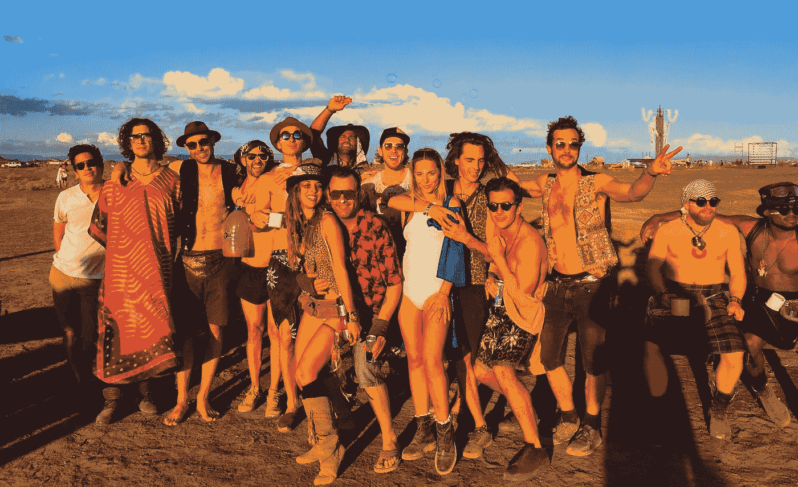

# 给任何专业人士和企业的一个信息是:保持人性——在这里，为什么和如何

> 原文：<https://medium.com/swlh/a-message-for-any-professional-business-stay-human-here-why-and-how-a59d415e38d0>

AfrikaBurn.com

今天很难保持人性。我们尝试新的东西(或者他们告诉我们尝试新的东西)，突然我们把它简化成一种模式:

*   我将使用 Instagram 故事来解释我们项目的里程碑。
*   我将推出一个播客，采访我所在行业的名人。
*   我会每天在 Instagram 上分享激励人心的内容。
*   我会写在我的博客上，并链接到所有可能的网站。
*   我会转发那些提到我产品的人。
*   我会在 Youtube 上解释我的产品是如何被消费的。
*   我将使用 Pocket 来分享热门新闻。

机器人行为我们把优点减少到重复和无聊的模式，而不是 [**是人类**](https://isragarcia.com/category/human-media) 。

在这个过程中的某个地方，我们经常会消除那种必须有人际关系的感觉。当然，我们有很多事情要做。当然，我们希望在保持 [**超高产**](https://isragarcia.com/books/ultraproductivity-book) 的同时，我们的尝试能够产生巨大的影响。然而，我们这样做是否会损害更人道的行为？

如何继续维持人类的工作？

# 检查你的结果

每周花些时间看看你正在往网上注入什么样的内容。你还在创造人际关系吗？你会投身于与迷人的人有关的行动吗？还是在这个过程中，你在沉淀自己的本质和个性的同时，实现了自己的商业目标？你认为保持人性是一个更科技化的问题吗？

# 混合

也许你和我一样。你写了很多文章和博客。考虑添加一些视频，如果可以的话，音频。扰乱一切网络系列是 100%的视频，因为我想保持更人性化。在这个项目中，我还做了一个播客版本。内容各异，各平台互为补充。我做音频是因为它帮助我更亲密地接触到更多的人。

# 出去互动

保持人性的最好方法之一是与你每天遇到的人进行令人难忘的交流。我不希望一封邮件是一封简单的邮件，一个简单的电话或一条简单的信息。我喜欢尝试与每个互动的人都有独特的想法，因为我认为你们都是独一无二的。当我阅读一个帖子、文章或新闻时(每天一次)，我几乎总是评论或互动。我每天至少分享一件事，能给我价值的事。我回答任何问我的人，我与批评家交流而不是批评家。

# 不完美:保持人性

去擦亮，擦亮，让一切变得美好。停止使用过滤器、改进或润色来完善一切。脆弱是性感的。缺陷创造人性。庆祝它们，而不是试图隐藏它们。如果我们与众不同，独一无二，我们就是人类。让那些错误的行为过去吧。视频里会出现一瓶水吗？别管它了。你的照片里有一卷卫生纸吗？呸。这将是他们在视频中谈论的内容。

一切都是我们的一部分。

继续 [**为人**](https://www.humanmedia.es/) 。让我们保持人性

【【isragarcia.com】本文首发于

# **只有当你觉得值得的时候，才让这个故事震撼吧！如果你发现任何有价值的东西，请鼓掌。**

> **Isra Garcia = 55 个客户，44 家企业咨询，398 次发言，3.377 篇帖子，24 个项目，6 本书，380 场讲座，6 家公司，16 次冒险，24 次实验，∞失败。到目前为止…**
> 
> **[营销人员](https://isragarcia.com/wp/marketer)。顾问。扬声器。作家。教育家。经理。在 [IG](http://thisisig.com) 的负责人。博主。企业家。颠覆性创新。数字化转型。高绩效者和生活方式实验者。**

# **行动号召>>点击[这里](http://feeds.feedburner.com/isragarcia)订阅更多类似的文章！**

****

## **这篇文章发表在 [The Startup](https://medium.com/swlh) 上，这是媒体最大的创业刊物，拥有 295，232+人关注。**

## **在这里订阅接收[我们的头条新闻](http://growthsupply.com/the-startup-newsletter/)。**

****