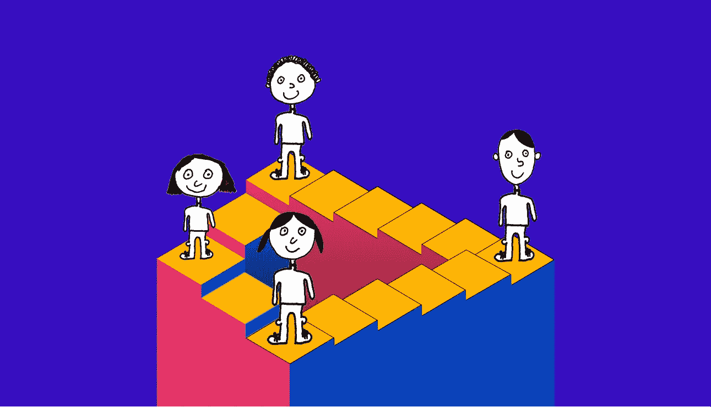
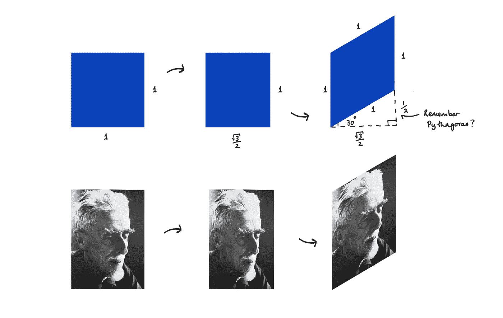
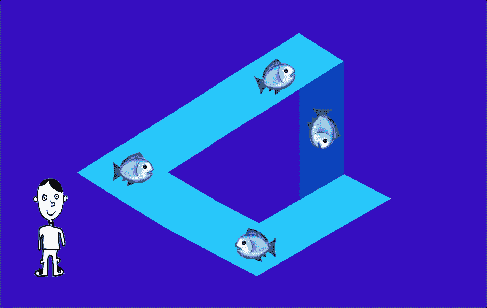

# 埃舍尔下午茶的等距设计方法

> 原文：<https://medium.com/swlh/a-method-for-isometric-design-or-afternoon-tea-with-m-c-escher-c759624d3891>

Never-ending isometric staircase

等轴测设计现在随处可见。

# 几个例子

1.  在**公司 logo**(air table，Node.js，旧 Rightmove logo，Neo，RaiBlocks，Gas，Enigma，Neblio **)** 。
2.  在**硅谷**的电视剧中，开场序列是等长的。
3.  直到最近， **Slack** 在他们的营销网站上描绘了一个完整的等距办公室场景。
4.  在 **dribbble** 上，在任何一个时间，肯定至少有一个等距“镜头”。

# 那么到底什么是等距设计呢？

等距设计(在希腊语中的意思是“T10”相等的尺寸)是指当你从一个特定的三维视角来描述物体，但是**没有任何透视**。

这是我们从玩**模拟人生**或**主题医院**或从玩更近的游戏 [**纪念碑谷**](https://www.monumentvalleygame.com/) 从 [Ustwo 游戏](https://ustwogames.co.uk/)中所知道的观点。

Isometric cube

最近，我决定要学习更多关于等轴测设计的知识，特别是如何用草图自己创作这样的设计。

经过几次失败的尝试，我很快意识到一定有什么方法可以创造一个。

因此，我打电话给等距大师本人，我的老朋友 M. C .埃舍尔，问我是否可以来喝杯茶，把一切都谈清楚。他说这是他的荣幸，我们安排在第二天下午见面。

# 米（meter 的缩写））c .埃舍尔的房子

不幸的是，M. C .埃舍尔的作品受版权保护，所以我在下面放了他作品的链接。

当我到他家喝茶时，我穿过他的前门，走进一个装饰华丽的前厅。地板上铺着鱼的镶嵌图案……或者是鸟……或者是蜥蜴？这是不可能的。

*参见 M. C .埃舍尔的* [*变形版画*](http://www.mcescher.com/gallery/transformation-prints) *。*

房间周围有石柱，但很难确定它们的起点和终点，它们似乎交织在一起，难以描述。

有许多楼梯都朝着不同的方向。

整个地方…不可能一下子看完。从任何特定的方向看，它似乎在几何上是有意义的，但当看整个空间时，它没有意义。仿佛墙壁和天花板打破了维度和视角的法则。

有一个巨大的楼梯在我面前，一个类似的楼梯在我的右边。

*见 M. C .埃舍尔的***。**

*我在大厅的桌子上发现了一张便条，要求我到四楼去，于是我向我面前的楼梯走去。*

*我爬了四段楼梯，每一段都是从前一段楼梯右转。然而，当我爬上第四层时，非常奇怪的事情发生了。我似乎又回到了我开始的地方。我又一次站在大厅的桌子旁边，手里拿着通知我上四楼的纸条。*

**见 M. C .埃舍尔著* [*上升下降*](http://www.mcescher.com/gallery/recognition-success/ascending-and-descending/) *。**

*这令人困惑，但对我的老朋友 M. C .埃舍尔来说并不意外。四楼和一楼是一样的吗？还是我没有集中注意力？当我听到我的老朋友走进门来时，我正在考虑是否要再上四楼。*

*他为迟到道歉(嘟囔着时间是他无法弯曲的维度)，我们回到他的客厅喝了点茶。*

*我们终于谈到了等距设计的问题。*

# *等距设计*

*他承认，他很高兴设计界正在享受这种奇怪而有趣的等距世界。*

*然后他向我展示了如何开始这样的设计…*

*“我的老朋友，我们要创造的是一个菱形。这个菱形的每条边的长度必须相等，比如说 1，菱形必须成 30 度角。*

*“要在**草图**中创建这样一个形状，我们可以从一个宽 1 个单位、高 1 个单位的正方形开始。*

*“那么我们必须将正方形的宽度减少到 3 除以 2 的平方根，大约是 0.866。然后，我们必须将正方形沿其纵轴旋转 30 度。这为我们提供了我们想要的菱形，所有边的长度等于 1，角度为 30 度。*

*“这是我们等距设计的平面之一！*

**

*Creating an isometric plane, and then doing the same transformation to a picture M. C. Escher himself*

*“现在我们可以简单地将这个菱形旋转 120 度和 240 度，以创建等轴测立方体的另外两个平面。*

*“这三个平面构成了等距设计的景观。现在，我们可以从这个角度出发，通过对整个对象进行完全相同的变换来绘制任何对象”*

*总而言之，老人告诉我要做的事情如下:*

1.  ***从一个 1 乘 1 的正方形开始，***
2.  ***将其宽度缩小到 0.866，***
3.  ***将它垂直倾斜 30 度，***
4.  ***旋转到你想要的平面。***

# *摆弄等距图*

*当我把这一切都看完，喝完茶后，M. C .埃舍尔想再给我看一样东西。他继续说道…*

*“现在你已经掌握了如何绘制等距图，你可以从中获得一些乐趣，因为我相信你已经看到了我在我的工作中所做的，正如你之前对我的楼梯所做的体验一样。*

*"让我带你去我的花园，让你看看我的意思."*

*所以 M. C .埃舍尔带我去了他花园里的水景。*

*“看看水是如何沿着这条水道的三面流动的，基本上在同一水平面上，但随后它以瀑布的形式流回源头。如果我用手画，你可以看到我们如何通过使用我们在里面讨论过的等轴测平面来实现。*

**见 M. C .埃舍尔著* [*瀑布*](http://www.mcescher.com/gallery/recognition-success/waterfall/)*

****

**Isometric Waterfall**

**“这一切都是可能的，因为我们正在玩弄我们对世界的感知，我们正在将现实扭曲到一个变得自相矛盾的地方。”**

**所以他给我画了上面的草图，作为带回家的纪念品。我对他传授给我的所有智慧感到惊讶，带着尝试更多等轴设计的愿望回到了家。**

**如果你觉得这个博客给了你一个新的视角，甚至是一个等距的视角，请鼓掌👏来分享。**

***完全不同的视角，请查看我之前的博客* [*爱因斯坦的相对论中隐藏着更长寿、更幸福的秘密。*](/swlh/the-secret-to-a-longer-and-happier-life-is-hidden-in-einsteins-theory-of-relativity-85bc2e07ce48)**

***还请查看我公司*[*www.pilcro.com*](https://www.pilcro.com/?utm_source=medium&utm_medium=Escher&utm_campaign=awareness)。我们为 G-Suite 制作智能品牌管理软件。**

****

## **这个故事发表在 [The Startup](https://medium.com/swlh) 上，这是 Medium 最大的企业家出版物，拥有 289，682+人。**

## **在这里订阅接收[我们的头条新闻](http://growthsupply.com/the-startup-newsletter/)。**

****