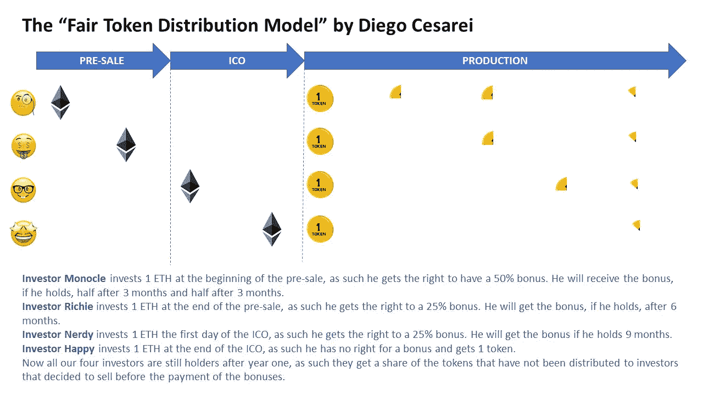

# 在预售和分布式交易盛行的时代，如何公平分配 ICO 代币

> 原文：<https://medium.com/swlh/a-modest-proposal-on-how-to-fairly-distribute-ico-tokens-in-a-time-of-wild-pre-sales-and-48f64d212ef2>

即使我倾向于对 ICO 持高度怀疑态度，当我参与一个令人兴奋的项目时，我也无法克制自己不去参与。到目前为止，我已经做了很多 ico，涵盖了不同的角色(投资者、顾问、池组织者等)。).

总的来说，令我感到惊讶的是，所有的事情都变化得如此之快和持续，它非常具有流动性，投入新的资金或参与其中有助于让你保持领先，这是令人兴奋的。

我真正不喜欢的是，参与 ICO 的大多数人都疯狂地期望通过它致富，最初贪婪主要集中在企业家一方，然后所有相关各方都开始想要分一杯羹:顾问和专业人士，然后是交易所(好像他们已经赚不到足够的钱了)，银行，中介，活动组织者等。所有相关的当事人都索要数目惊人的钱。这是遥远西部的秘密宝贝，爱它或离开它，对不对？没有。

我投资的最后一个 ico 是通过私人预售完成的，越来越多(如果不是全部)的 ico 给私人富裕投资者或资金池提供机会，在私人预售阶段以大幅折扣进行投资。如果这在某种程度上类似于更传统形式的另类投资，那么另一方面则非常不同，对整个生态系统来说尤其危险(如果在道德上没有问题的话)。

通常的情况是，无论官方 ICO 价格是多少，一旦代币发布，价格在私人预售价格区迅速下降。事实上，我认识一些系统而专业地做这件事的人，他们试图进入预售市场，不管背后的项目是什么，他们都不关心，只要他们能在 ETH 投资上有一点(或大)的加价，就把代币扔到分散的交易所。他们把保证金兑现，剩下的投入新的预售。这种趋势在很多方面都非常糟糕，所以我不会浪费你的时间来解释为什么会这样。最重要的影响(从财务角度来说)是，通常在初始转储之后购买代币比在 ICO 期间更方便。

所以现在让我们来看提案。所有的投资者，私人预售，预售，第一个小时，第一个星期，你说吧…所有人在 T+0 每个 ETH 得到相同数量的代币，所有人都是平等的。公司将以定期空投的形式向所有持有者支付实际折扣(更准确地说是奖金),投资者越早达成交易，奖金就越高，他/她就能越早得到。这很简单，但我很喜欢这个老式的幻灯片。为了更清楚，我向您展示“**公平令牌分配模型**”:

我看到的优势数不胜数:

1.  相信项目的人通常会持有，持有人会因为他们对这种模式的信任而获得回报，因此项目会吸引持有人，从而创建一个强大的社区来支持项目。
2.  ICO 投资者受到保护，免受倾销者的影响，而预售投资者因其额外的风险而适时获得回报，因此该公司将能够从所有细分市场筹集资金。
3.  该模型在项目的初始阶段增加了稀缺性，在此阶段，通常没有令牌的有效使用，因此价格主要由投机者驱动(很明显，投机在初始阶段后很长时间内驱动了密码的价格，但我希望这一点是清楚的)。
4.  社区将关注公司的信息渠道，以便了解何时以及如何接收空投物资。
5.  这种模式会让投机者和垃圾远离。是的，的确，*事实上*，该模型的风险只是推迟了倾倒阶段，但实际上我认为情况并非如此，因为倾倒者通常不会花机会成本持有这么长时间，他们会更愿意专注于其他项目。
6.  所有的 ICO 参与者将获得相同的价格，如果公司有目的地为那些将获得免费代币的人(创始人、员工、赏金猎人、下线等)建立机制。)，只要人们对项目保持信心和信任，价格可能不会低于 ICO 价格。

现在总结一下，有了区块链、cryptos 和 ICOs，我们正在构建一些大而重要的东西(我刚才听起来像 Donald Trump 吗？)这将在许多方面塑造未来。显然有贪婪和金钱可赚，这吸引了骗子和小偷，但依靠监管机构来保护周玩家是不明智的，我们作为一个社区需要共同行动，以使生态系统安全和成熟。因此，请随意使用我刚刚在您的 ico 中介绍的模型，或者从其背后的原则中获得灵感，找到您自己的公平分配方式。但是，如果你这样做了，请在你的 WP 和其他材料中承认我迭戈·塞萨雷，如果你觉得是这样的话，提示如下 **ETH** 地址:0xa 5d 9099 ba 1 Fe 0374 FCA 15 f 19811989638347709

同样，不要害怕通过 Medium 或 LinkedIn(开放连接)与我联系，以便一起改进和完善模型。

## 这篇文章发表在《T4》杂志《创业》(The Startup)上，这是 Medium 最大的创业刊物，有 320，131+人关注。

## 在这里订阅接收[我们的头条新闻](http://growthsupply.com/the-startup-newsletter/)。

