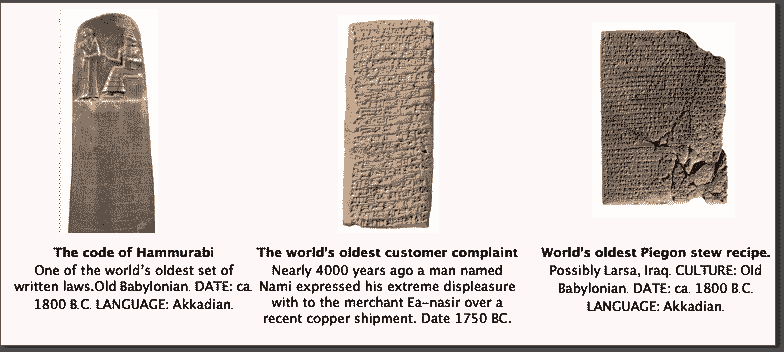
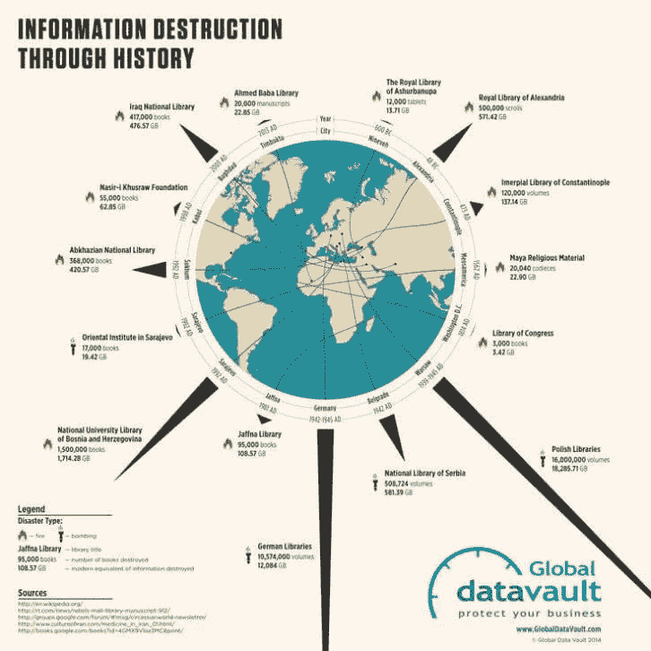
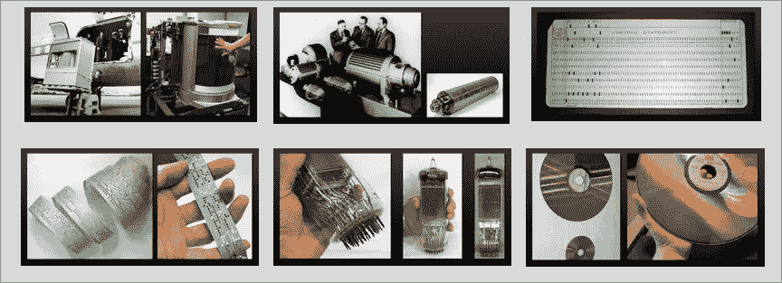
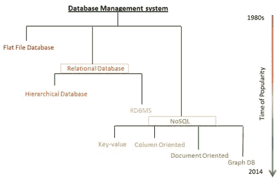
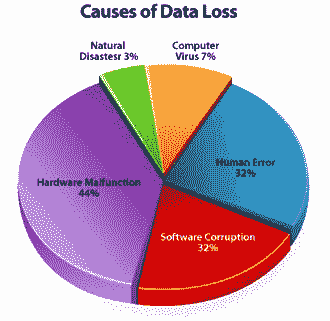
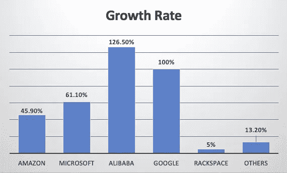

# 我们所有的数据都被不兼容的 API 丢失了。

> 原文：<https://medium.com/swlh/a-moment-for-all-of-our-data-lost-in-time-260a54fef86>

## 我们数据的编年史。

**Are we heading towards the dark ages of data?**

2015 年 2 月，也被称为互联网之父的温顿·瑟夫向人类发出了[警告](https://www.theguardian.com/technology/2015/feb/13/google-boss-warns-forgotten-century-email-photos-vint-cerf)——一个可能的黑暗时代和失落的一代，仅仅因为未来的系统将无法呈现现在的文件。

> “我们漫不经心地将我们所有的数据扔进了一个可能成为信息黑洞的地方，却没有意识到这一点。我们将东西数字化，因为我们认为我们会保存它们，但我们不明白的是，除非我们采取其他措施，否则这些数字版本可能不会比我们数字化的文物更好，甚至可能更差，”

仅仅因为较新的软件/硬件不理解它被写入的格式而导致的文件衰减被称为[比特腐蚀](http://www.economist.com/node/21553445)，每一代新的存储、处理器或软件都会出现这种情况，使上一代变得不兼容和过时。

[美国国家航空航天局最近声明](http://www.economist.com/node/21553445)他们已经无法访问早期登月的大量数据，因为用于读取磁带的机器已经报废，无法重建。

在某些情况下，我们正在失去超过 80%的科学数据，这些数据来自计算的早期，我们甚至常常没有意识到这一点，这在遥远的未来并不是问题..我们不能再玩 90 年代的视频游戏了，因为游戏机不兼容或者发行商不在了。快速变化的标准，加上我们在销毁旧文本的物理副本的同时保留“数字副本”的事实，意味着我们不仅有可能抹去我们时代的编年史，还有历史本身。

# 我们在时光中倒退了吗？

**The stories of the earliest human-beings etched in stones on the inside of caves have survived over thousands of decades.**

当我们刚开始写作时，我们使用泥板，在某些情况下这些泥板存活了数千年，然后我们改用纸介质，在纸上存储信息更方便，但它也衰减得更快，我们今天发现的唯一纸书写物是那些经过时间精心保存的，在某种意义上“被认为是重要的”。

然而，纸质书写和泥板并没有检索数据的巨大成本，因为任何能够阅读和理解这种语言的人都可以从纸质材料中阅读。

然而，在信息时代，大规模存储数据是有成本的，包括运行服务器、支付电费和管理这些服务器的人员的费用，以及技术进步时的升级费用。检索它也是有成本的，用户需要硬件和软件来理解和呈现文件被写入的格式。

格式会发生变化，有时是由于技术原因，有时是由于纯粹的政治原因。如果 Microsoft Word 决定停止支持 docs 格式，或者如果随着更好的格式的出现，PDF 格式不再被接受，并且随着时间的推移，硬件和软件设计会转向不同的方向..在未来，所有储存在 pdf 中的研究论文、财务报告、出生证明和死亡记录都将永远丢失。

随着我们创造更多的数据，我们也在永久地抹去我们的过去。如果一家消费者网络公司被收购或清算，它就没有动力保持其数据中心的运行，就像家庭自动化公司 Revolv 被 Google Nest 收购[时发生的那样，其自动化中心被关闭，让智能家居产品的所有者对他们的决定感到非常无语。类似地，银行或金融机构可能没有动力保留超出业务和监管要求所需的交易记录。
考虑到我们今天看到的流行博客或社交媒体平台几乎都不会在 50 年后出现，很难想象这些公司多年来积累的所有数据会发生什么。这些数据将成为我们生活和时代的编年史。](https://gizmodo.com/nest-owned-smart-hub-gets-permanently-killed-1768977505)

当我们使用的每一个软件都是一项服务时，那么我们对事物的所有权和控制权就由服务提供商决定了。具有讽刺意味的是，2009 年，在与出版商发生争执后，亚马逊从 Kindle 设备上远程删除了乔治·奥威尔的《1984》。

游戏玩家经常会感觉到这一点，因为他们的软件和硬件变得不兼容，游戏变得毫无用处，如果 Steam 关闭其服务器，数百万玩家将无权玩他们购买的游戏。如果英雄联盟服务器关闭，游戏玩家可能永远无法再玩这个游戏，因为强大的版权确保游戏服务器不能被重新创建。《孤岛危机》和《战地 1942》的玩家意识到了这一点，因为游戏关闭了服务器。PS3 游戏与 PS2 游戏机不兼容，随着对软件和硬件支持的减少，你玩游戏的时间记录将永远消失。

一封信藏在壁橱里可能会保存一百年，但是久而久之和文件格式以及所有相关的知识都变得过时了，没有以文件格式写的信件或日记可以被检索到..

# 数据存储简史

**The earliest recording in tablets have survived for thousands of years.** [**Source**](https://www.archaeology.org/issues/214-features/)**.**

我们最早的祖先在洞穴深处的绘画中勾勒出他们的思想，这些绘画变成了指导人类前进的永恒的数据档案。当我们开始写字的时候，我们曾经在泥板上写字，这些泥板保存了几千年，越来越多的泥板今天仍然被发现。

然后在公元 1440 年，[古腾堡印刷机](http://www.bbc.com/news/the-reporters-38892687)出现了，这是历史上的决定性时刻之一，让人们获得了长期以来为精英保留的知识，刺激了定义现代世界的科学革命。尽管纸介质有一个缺陷，纸是一种脆弱的材料，容易腐烂。我们发现只有保存最完好的书才是几百年前的。

随着我们迈向信息时代，将数据存储转变为存储在服务器上的比特流，我们刺激了另一场革命，即互联网。
我们的成就在于信息论和机器学习的进步。我们在 Twitter、脸书和 Instagram 上记录我们的生活，这些网站将其数据存储在公共云或数据中心，我们在 Github 上记录我们的工作，并将其存储在这些 SAAS 供应商的数据中心。

# 我们是如何丢失数据的？

在我们有数据中心之前，我们有图书馆。图书馆的任务是保存书籍和期刊的目录，从人类的角度来看，这些书籍和期刊从现在到过去都是重要的。这些图书馆有时会存在几个世纪，但其中许多都毁于战争和自然灾害。

**The records of books and texts we have lost through history**

**改变硬件标准**

摩尔定律表明，集成电路中的晶体管数量大约每两年翻一番。磁盘存储和处理器能力在不断发展，但并不总是向后兼容的。通常情况下，维护向后兼容性是不可能的，而其他时候，这种努力会因为回报随时间递减而被放弃。

我们已经失去了前 VCR 时代的许多电影和录音，因为人们只是忘记了将作品转移到更新的存储介质中，现有的作品丢失了，或者播放它们的格式不再受支持。要了解这些年来磁盘存储的变化，你可以查看这个[链接](https://www.pcworld.com/article/127105/article.html)。

**A snapshot of storage hardware through time**

**不断发展的数据库 API 和引擎**

A snapshot of database API evolution [[source](https://www.analyticsvidhya.com/blog/2014/11/types-databases-evolution/)]

数据库 API 随着数据性质的变化而发展，在计算关系数据库的早期，它是分层的，直到实体-关系模型被提出并导致关系数据库管理系统的发展。NoSQL 系统的发展是为了满足非结构化数据互联网时代的数据需求。

问题是这些 API 经常互相不兼容。即使不同供应商提供的 SQL 变体也不是现成的替代品，不同供应商支持不同的 API 变体，并且以与任何其他 API 都不兼容的格式存储数 Pb 的数据。因此，如果支持 API 的公司倒闭，流行编程语言的数据库驱动程序将会消失，API 中锁定的数据将会永远丢失，即使这些数据实际上并没有从硬件中删除。

**硬件故障和人为错误**

Predictable reasons for data loss[[Source](http://www.datlabsdatarecovery.co.uk/common-data-loss-situations/)]

存储硬件经常出现故障，有时是由于病毒或软件崩溃，有时是由于人为错误或断电。当你的手机硬盘烧毁时，数据就会丢失，有时是因为无法恢复，有时是因为这样做可能很昂贵。

# 公共云:基础设施层的永恒抽象(至少在理论上)

**The promise of Timeless abstraction over infrastructure layer transcending hardware or API upgrades**

我们相信云提供商将是永恒的，将比市场力量和不断变化的技术更持久，并且存储在公共云中的数据将被永远铭记。我们相信，如果旧机器过时，云提供商会在内部将数据迁移到新机器上。云提供商将维护副本和拷贝以防数据中断，并处理软件迁移。但也许这根本不是真的。

Growth rate for public cloud providers in 2016 [[source](https://www.channele2e.com/news/gartner-public-cloud-iaas-market-share-amazon-aws-microsoft-azure-google-growth/)]

放眼全球 IAAS 市场，我们看到许多公司和初创企业提供“基础设施即服务”解决方案。从某种意义上来说，他们将获得或失去市场份额，随着时间的推移，许多品牌将会消失，新的品牌将会取代它们的位置，虽然我们可能会假设随着巨头吸收较小的公司，合并将会发生，但我们不知道随着技术和市场力量的发展，什么样的 SLA 将会得到遵守。

# YugaByte 背后的想法

## 不受基础设施或 API 限制的永恒存储引擎。

We gave names to the stars and constellations and passed it down the generations.

宇迦在梵语中代表一个时代。 [YugaByte](https://www.yugabyte.com/) 背后的愿景是建立一个数据层，在某种意义上它是永恒的、不可摧毁的。几位在脸书和甲骨文公司建立了存储和信息基础设施的创始人，特别了解未来公司在 Pb 级规模变得普遍时将面临的一些挑战。今天的任务关键型数据将成为明天的仓库数据和几年后的存档数据。我们希望数据能够经受不断变化的 API 和硬件规格。我们遵循以下指导原则-

## 数据层必须是 API 不可知的。

回顾过去 40 年来的数据库系统，可以看到充斥着各种 API 的景象，这些 API 之间互不兼容。我们着手构建一个与 Redis、CQL 和 SQL APIs 有线兼容的数据库，在大多数用例中性能相当，在重点用例中性能比原始存储引擎更高。

## 数据层必须与硬件无关。

我们能否完全抽象出基础设施层，在 AWS、GCP 或 OnPrem 提供商上提供相同的体验，并消除数据层上的云锁定。(我相信现在的孩子们称之为云原生)
我们能否以一种硬件无关的方式向数据集群添加或删除节点，我们能否使用现代 devops 工具和容器化来构建一个完全抽象出 IAAS 提供商的基础架构的解决方案。

## 数据层必须是开源的，并与开放标准兼容。

一个开源代码库和一个繁荣的贡献者社区意味着软件将比大多数市场力量更持久，并发展到支持更适合未知未来的用例。

## **数据层必须是分布式的，容错的。**

数据层能否承受任意数量节点的故障，我们能否将警报机制和指标本机集成到引擎中，以便不会因节点停机或磁盘已满而丢失数据。我们能否在流程编排层内部消除大多数节点故障的运营使用案例。

## 数据层必须本机支持异步副本和快照。

我们能否将上述原则不仅应用于主群集，还应用于读取副本、备份和快照，并使它们与硬件和 API 无关，从而在各种基础架构提供商之间提供完美的移动性。

为了回答其中的一些问题，我们构建了 [YugaByte 项目](https://github.com/YugaByte/yugabyte-db)。这是一种不断发展的努力，旨在获得某种意义上永久的数据。

如果你喜欢这个故事，有 50 种方式(鼓掌)来表达你的欣赏:)

## 这篇文章发表在[《创业](https://medium.com/swlh)》上，这是 Medium 最大的创业刊物，有 293，189+人关注。

## 订阅接收[我们的头条新闻](http://growthsupply.com/the-startup-newsletter/)。

