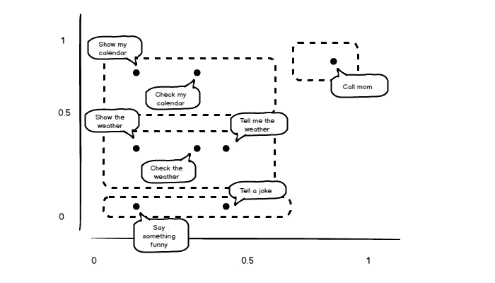
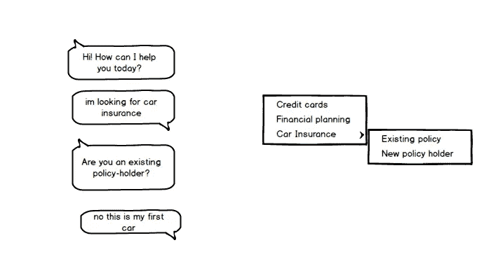
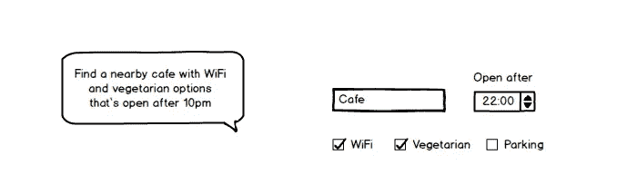

# 自然语言用户界面只是一个用户界面

> 原文：<https://medium.com/swlh/a-natural-language-user-interface-is-just-a-user-interface-4a6d898e9721>

## 关于那个机器人炒作的几句话…

假设你正在编写一个应用程序，你想给它一个对话界面:你的用户将输入一些命令，你的应用程序将做一些响应，可能是在要求澄清之后。

有很多术语与这项技术相关联——对话式商务、机器人、人工智能代理等。我认为称它为语言用户界面 *(* LUI)更清楚，通过与图形用户界面(GUI)的类比，你可以附加到同一个应用程序上。

想象你的应用程序有一个 GUI，这是一个很好的解毒剂，可以消除对“人工智能代理”的模糊思考。您仍然需要将 UI 连接到底层应用程序，并且底层应用程序的概念模型仍将在整体用户体验中发挥主导作用。

## 你的用户的文本就像一次点击

假设您有一个简单的应用程序，能够执行四个功能:

*   **check_weather()** :显示当前天气和明天的天气预报。
*   **check_calendar()** :显示今天的约会。
*   **call_mom()** :给妈妈打电话。
*   **讲 _ 笑话()**:讲一个老掉牙的笑话。

想象一下，从头开始为这个应用程序编写一个 GUI。用户移动光标并单击。每次点击，你都会得到一对数字，代表光标的位置。所以，每个用户动作给你一个两个实值的向量。你的应用程序知道它的四个按钮的边界框。对于每个向量，检查该点是否落在一个按钮的边界内。如果是，您触发按钮动画，并执行适当的功能。

要从头开始编写 LUI，我们必须获取用户的文本，并将其解析为一个数字向量。我们必须弄清楚用户“点击”了“哪里”。通常我们将每个单词映射到一个任意的 ID。然后，如果我们识别 5000 个单词的词汇，我们可以将每个单词视为 5000 维空间中的一个独特的点。然后我们把这个空间缩小到一个更密集的空间，比如说 300 维。这让我们在很大程度上将文本解析成一个易于管理的意义向量。

为了说明这一点，让我们识别几个单词的词汇表，并给每个单词分配一个真实值。为了将用户的文本映射到二维空间，我们将识别的第一个单词作为 *x* 坐标，最后一个单词作为 *y* 坐标。

上面的简单函数让我们将用户文本的“含义”表示为一对两个实数值:

*   **get_coords("查看天气")** → (0.3，0.3)
*   **get_coords("显示我的日历")** → (0.1，0.7)
*   **get_coords("说点好笑的")** → (0.1，0.1)
*   **get_coords("叫妈妈")** → (0.9，0.9)

我们可以通过绘制出这些值，并为我们的“按钮”——我们的应用程序的动作——提出一些边界，来完成 LUI 和 GUI 之间的类比。

有了 GUI，确定单击的坐标就没有问题了，而且您永远不必考虑将单击事件解析到特定的按钮(如果有的话)。这种事情就这么发生了——它已经为你处理好了。对于 LUI，你必须注意这些细节。在这方面，你可以做得更好或更差，但“黄金标准”——你所有机器学习努力的圣杯——只会在 GUI 中给你一些你一直认为理所当然的东西。当然，你有一个大得多的多维画布，用户可以在上面“点击”，每次点击都可以给你丰富的结构化数据。但是你仍然需要在画布上绘制按钮、表单、导航菜单等等。您仍然需要将 UI 连接到一些固定的底层功能集。

考虑这样一个对话:

> 嗨！今天我能为你做些什么？我在找汽车保险。
> -您是现有的投保人吗？
> -不，这是我的第一辆车

假设在引擎盖下，用户最后的发声触发了函数**car _ insurance . non _ holder . tell()**，打印出一墙文字。这里的 LUI 为用户提供了一个分层菜单，其选项由基础域决定。在 GUI 设计中，嵌套菜单带来的问题是众所周知的，很容易想象 LUI 也会有类似的问题。

如果你在看一个嵌套菜单的顶部，你怎么知道树的叶子是什么？如果你知道你需要一个特定的叶子，你如何可靠地猜测如何导航到它？LUI 提示给你更多的文本，所以上下文有时可能会更清楚。另一方面，可用选项的范围并不总是被列举，您的意图可能会被错误分类。

我的观点是，语言用户界面(LUI)只是一个界面。您的应用程序仍然需要一个概念模型，并且您肯定仍然需要与您的用户交流这个概念模型。所以，问问你自己:如果这个应用程序有一个 GUI，它会是什么样子？

Siri 的 GUI 版本可能会给你一个带有表单元素页面的主屏幕，Siri 的每个子应用程序都有一个表单元素页面。还会有一长串按钮来触发 Siri 的原子“渴望蛋”功能。注意，Siri 的 GUI 将*而不是*仅仅是 iOS 的主屏幕。如果这是真的，那么 Siri 会将你的话语映射到一系列触摸事件和用户输入。

当你说“告诉我妈妈我爱她”的时候，Siri 执行命令**短信(“我妈妈”、“我爱她”)**。它肯定不会执行一系列用户动作，像你那样“驾驶”你的 iPhone。试图这样做是疯狂的。Siri 只是一个应用程序，它有自己的概念模型，你可能想执行这些动作。它通过 LUI 而不是 GUI 向您展示这些操作。

## 昨天我们不能做什么？

我认为准确理解新的和改进的人工智能技术所带来的机遇是很重要的。LUI 现在是可行的，因为你可以期望能够捕捉用户的“点击”,并合理准确地将其解析为正确的动作。你现在可以期待很好地解释用户的文本。那是新的，机会是有趣的。但机会也比许多人想象的要少得多。

我认为 LUI 特别适合填写复杂的表格，在这些表格中你有很多很少使用的参数。然而，我越想精确，就越不愿意使用自然语言。我的 NL 查询将被映射到一个数据库查询中，并且我所查询的表的结构是预先确定的。桌子的结构对我来说是隐藏的，这既有好处也有坏处。

这样做的好处是，表格的结构可以改变，而我不必改变与 UI 的交互。缺点是我被欺骗了——我被迫通过一个[泄漏抽象](http://www.joelonsoftware.com/articles/LeakyAbstractions.html)与应用程序交互。如果我想找一家附近的咖啡馆，晚上 10 点以后有 WiFi 和素食，我会很乐意使用本地语言界面。如果我要预订去澳大利亚的航班，我宁愿打开我的笔记本电脑并填写一个 web 表单。

除非你把用户的指令编译成代码并进行评估(我不建议这样做！)，LUI 不会引入任何额外的表现力。语言用户界面和图形用户界面都是…用户界面。

语言界面可能更好，也可能更差。归根结底是设计，你的成功将与你试图构建的应用程序紧密相连。问题是我们设计 LUIs 的经验少得多，用户使用它们的经验也少得多。

我的预测是，对于用语言用户界面构建应用程序的人来说，将会有一个强大的后动优势。关于用户界面设计的课程需要重新学习，一种使用假设的文化将会产生。与此同时，我预计 LUIs 最适合于那些对削减成本和搭载流行平台感到兴奋的相对简陋的应用程序。

换句话说，我认为 LUIs 最适合做小投资的小团队。如果你有一个大胆的计划，你的野心包括给你的应用程序一个“独特的用户界面”，你应该小心你的愿望。那就像希望生活在有趣的时代。

# 关于我

我是来自悉尼和柏林的计算语言学家。我是 spaCy NLP 工具的开发者，也是 Explosion AI 的联合创始人。如果你正在研究 AI 或 ML，你应该看看我们的主动学习工具 [*【神童*](https://prodi.gy) *。*

邮箱:[m](mailto:honnibal@gmail.com)att @ explosion . ai推特: [@honnibal](https://twitter.com/honnibal)