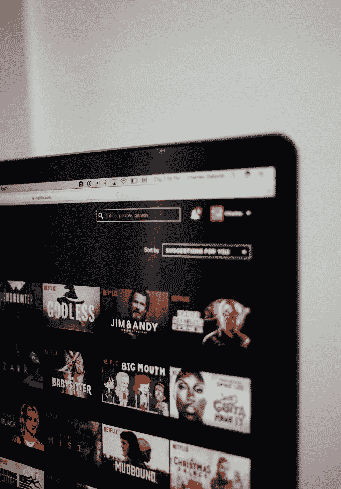
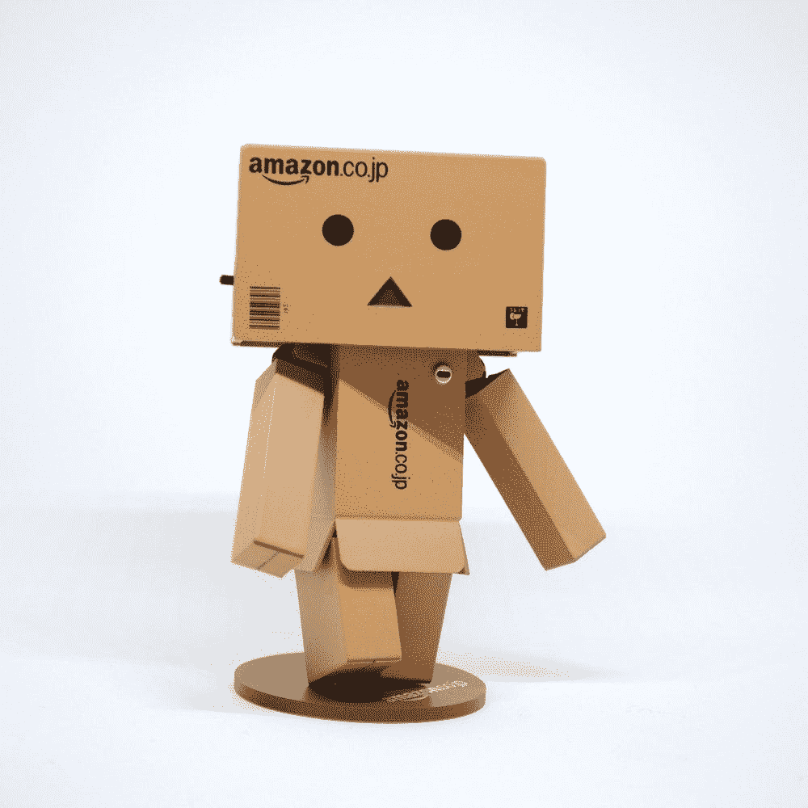

# 社交应用的新领域

> 原文：<https://medium.com/swlh/a-new-frontier-for-social-apps-95dc8de21061>

《剑桥分析》的出现和《GDPR》的发行如何影响我们今天使用的标准免费应用。

过去十年中，大多数软件社交科技公司都建立了一种商业模式:

> 提供免费服务，
> 
> 获取您的数据，用它来改善服务
> 
> 并将数据出售给第三方广告商或企业

如果没有这种心态，我们今天的 Web 2.0 体验会存在吗？

> 我认为是的

替代的商业模式，虽然不像谷歌和脸书那样有利可图，但也是可行的:

1.类似于网飞和 Spotify 的月费——他们似乎对每个人都很好

credit: [https://unsplash.com/photos/MDUI8XIq6Mc](https://unsplash.com/photos/MDUI8XIq6Mc)

2.服务+信息访问的年费——Amazon Prime——最近已经成为一股主导力量

credit: [https://unsplash.com/photos/r22qS5ejODs](https://unsplash.com/photos/r22qS5ejODs)

3.一次简单的软件费用——项目管理工具 basecamp 已经走过了这条路——没有庞然大物，但他们仍然存在！

以下是这些企业的一些共同主题:

*   将软件成本直接转移给最终消费者
*   提供令人惊叹的体验和产品( **10x** )，让你毫不犹豫地每月支付 5-20 美元
*   首先关注客户
*   产品如何使用您的数据的透明度，例如网飞关于创建更适合特定受众的内容的博客帖子。

我脑海中的一个问题是，如何使用这一套相同的成分来制作社交和对话软件:

*   改善我们的福祉
*   私密、安全和透明
*   保持你的信息是你自己的
*   价值美元/月

# 你能离开谷歌或脸书几个月吗？

如果你依赖更简洁的内容形式而不是直接的形式，你的生活会是什么样子。

*   只访问你经常阅读的网站，比如报纸、博客，以防程序员栈溢出
*   被迫通过人来发现信息——询问餐馆或方向时，问一个人而不是你的手机
*   通过客户端发送电子邮件，不是每分钟都同步，而是每天同步一次

# 我在生活中注意到的 3 个趋势

1.视频通话正在成为一种主要的通信方式——群组通话仍然难以轻松使用——最近更是让父母甚至祖父母感到舒适。

2.每天只访问电子邮件**2**次——这对于处理最重要的事情来说绰绰有余——让我们拭目以待吧

3.信息和新的联系——通常基于一个共同的地点或地点或事件而形成

鉴于这些注意事项和趋势，我将在接下来的几个月里进行试验，看看如何将更具思想性和面向工具的心态带回软件和硬件。

**喜欢这篇文章吗？点击“掌声”推荐给其他感兴趣的读者！感谢**👍

## 这篇文章发表在《创业公司》杂志上，这是 Medium 最大的创业刊物，有 325，521 人关注。

## 订阅接收[我们的头条新闻](http://growthsupply.com/the-startup-newsletter/)。

