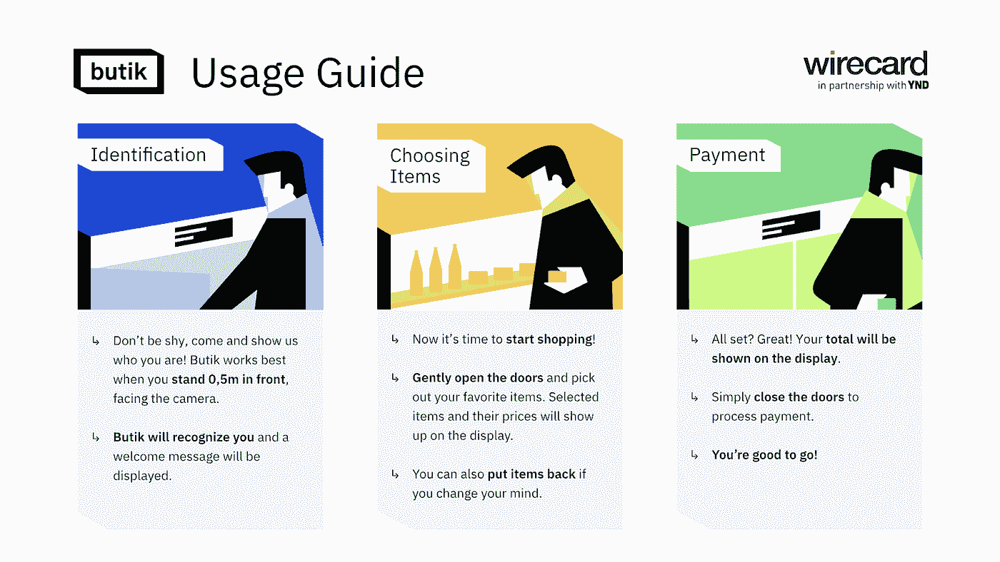
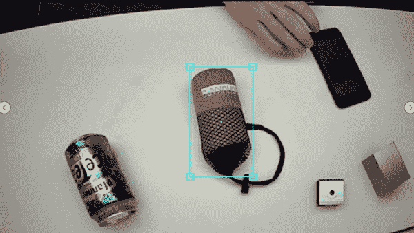
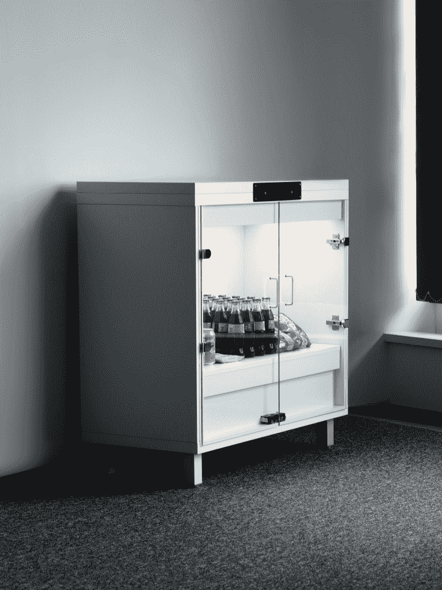
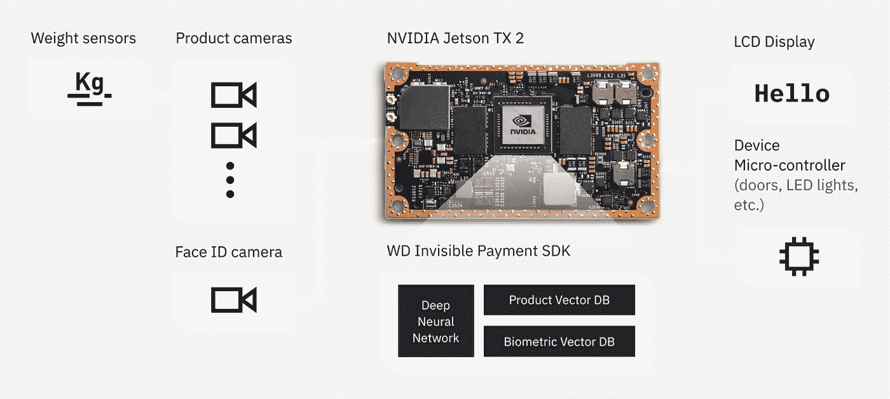
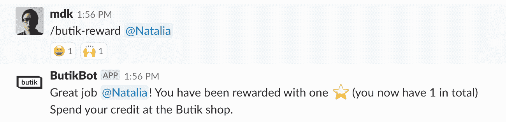

# 一种新的购物方式

> 原文：<https://medium.com/swlh/a-new-way-of-shopping-eb43a1cdd285>

当我们想到购物时，我们通常认为它是一件令人烦恼的事情，需要等待很长时间。如果你可以走进去，拿走你需要的东西，然后简单地走开，会怎么样？受到亚马逊 Go(位于西雅图)的启发，Wirecard 和 YND 决定一起重塑购物体验，就像我们已经在 T2 的 Smartbar 项目中所做的那样。这将引导我们与 Wirecard Innovation Labs 展开下一次合作……进入 Butik。

# 💪Wirecard x YND:变得强大

当 Wirecard 要求我们研究下一代购物体验时，我们发现我们必须解决许多问题。例如，你能从购物过程中真正消除多少摩擦？我们能让它感觉更自然，同时更快吗？当然，顾客还会喜欢吗？作为这些问题的答案，我们开发了一种智能自动售货机的概念，它使用面部识别技术来识别客户。在这篇博文中，我们将分享我们的发现和这些问题的答案。

# 布蒂克到底是怎么回事

Butik 的概念基于 YND 与 Wirecard 共同开发的生物识别支付技术，创造了一种“隐形”的结账体验。这项技术可以很容易地部署在不同的环境和用例中。使用计算机视觉，Butik 知道顾客取出或放回什么产品，并自动处理货款。

# 它是如何工作的

Butik 背后的技术拥有内置硬件的所有“智能”。该独立单元完成面部和产品识别的所有计算。在当前设置中，Butik 不需要额外的客户端应用程序，因为客户已经预先注册。Butik 上运行的商店应用程序旨在让用户在演示和贸易展会上也能使用这项技术。它模拟了用户关门时触发的支付过程。该系统旨在根据使用情况，允许与任何支付堆栈和客户端应用程序集成。

Butik in action

我们建造了一个最小版本，配备了一个人脸识别摄像头，一个产品识别摄像头，四个智能重量传感器和电子锁来控制访问。

Butik 的当前版本展示了全自动、计算机视觉辅助购物体验的可能性。它证明了通过使用摄像机和一套智能称重秤可以实现精确的防篡改解决方案。

在开发过程中，我们能够重用来自 [Smartbar](/swlh/started-from-the-bottom-now-theres-beer-15ff4e2a4be4) 项目的大部分面部识别框架和存在检测技术，因此客户识别主要是将现有组件与保护访问的电磁锁相互连接。

产品检测对我们来说是一个相对较新的话题，所以这自然是我们花费大部分机器学习努力的地方。我们使用计算机视觉构建了一个解决方案，并通过其他传感器(包括一个精确的 4 张力计称重秤)来验证结果。当客户从 Butik 中取出一件产品时，我们的视频“大脑”会对其进行检测，并根据秤的输入信息进行复核(以验证相应的重量差异)。

这使我们能够确保系统能够处理某些篡改企图，例如:

*   拿走一件产品，然后只拿回包装(例如，放回一个空罐)
*   检测不属于 Butik 库存的“外部”物品
*   检测产品何时相互隐藏或覆盖

在我们的 showcase 中，模拟支付仅在客户关门后处理，同时有多个操作可以改变虚拟购物篮的状态。我们正在跟踪库存的所有变化，并在嵌入式有机发光二极管显示器上显示篮子的当前状态。这样，顾客总是知道他们选择了哪些商品，以及他们最终会支付多少钱。

为了防止 Butik 在欺骗攻击期间受到未经授权的访问，我们正在使用我们最近开发的反欺骗[解决方案](/swlh/anti-spoofing-mechanisms-in-face-recognition-based-on-dnn-586011ccc416)。这使用 DNN 来识别一张脸是真是假。

在我们的办公室对 Butik 进行了数小时的测试后，我们首次将其部署到了 Spielfeld Digital Hub。在与 Wirecard & Visa 创新实验室的合作中，我们为 Butik 选择了健康和保健产品，以验证在健身房、健身俱乐部、水疗中心等场所实现零售的概念。该用例允许顾客轻松挑选并支付毛巾和按摩滚筒等简单物品。拥有一个独立的专柜并配备专门的工作人员并不总是可能的，这就是 Butik 的亮点:在以前不可能零售的地方提供简单的购物体验。

Thanks to a nifty Slack integration you can reward your coworkers so they can shop in the butik!

# 布蒂克的未来是什么？

Butik 1.0 的首次展示目前部署在柏林 Spielfeld 的 Visa 创新中心。它将 Butik 展示为一种自动售货机，可部署在健身房或水疗中心等生活场所。对于未来的更新，我们将考虑添加更多的摄像头(正面和侧面)，冷却功能，分析和更多。Butik 也部署在慕尼黑的 Wirecard 办公室。Wirecard 团队将在今年的几个贸易展上使用它来展示生物识别支付。

*本文由尼基·杰基·戴尔芬&撰写，他是我们在*[*【YND】*](https://ynd.co/)*的特别项目负责人米查·张秀坤·科斯特泽瓦。需要一些脑力吗？如果您对您的技术项目有任何疑问，请随时通过 hello@ynd.co 联系我们。*

## 这篇文章发表在 [The Startup](https://medium.com/swlh) 上，这是 Medium 最大的创业刊物，有+369，832 人关注。

## 在这里订阅接收[我们的头条新闻](http://growthsupply.com/the-startup-newsletter/)。

