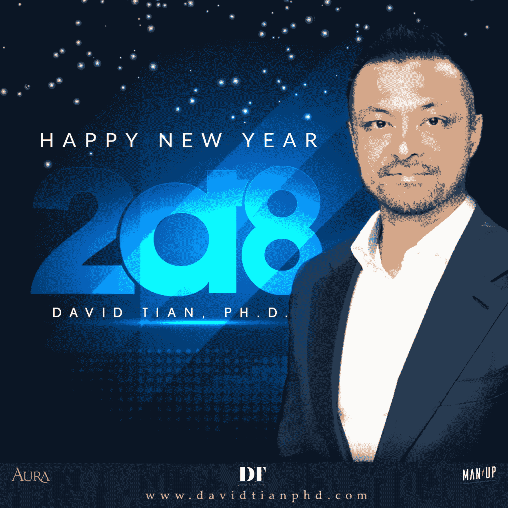

# 新的一年挑战，想得更小(并拥有你最好的一年)…

> 原文：<https://medium.com/swlh/a-new-year-challenge-to-think-smaller-and-have-your-best-year-yet-9afc6988f19>

这是新的一年…我知道许多人对他们的生活有着宏伟的计划…

大计划，大目标，大梦想。这很自然——作为成功者，我们总是在挑战极限，寻求创造更多。

你知道什么不常见吗？

想得更小——想想这一秒。就现在。

***活在当下。***

那是我 2018 年的个人决心之一。

从十几岁开始，我就一直是一个长期规划者。中学的时候，为高中做打算。在高中，为大学做计划。在大学，为读研做打算。在研究生院，为职业生涯做计划。几年前，当我开始创业时，我制定了季度计划、1 年计划、5 年计划和 10 年计划。大目标。大计划。大思维。

当然，这帮助我获得了我今天喜欢的生活方式。

但实际上，讽刺的是，所有这些庞大的计划使得在它经历过的唯一时间框架内享受生活变得更加困难——现在。

在现在。

你看，生物的必要性——我们进化是为了生存和繁衍——让我们的想法自然而然地指向那个方向，所以对未来的想法点燃了希望和恐惧。

此外，未来对我们来说是未知的，所以当我们想到它时，我们会想到不现实。

未来比过去或现在更是所有罪恶的根源。

感激着眼于过去，爱着眼于现在。

恐惧、贪婪、嫉妒和焦虑向前看。

当然，不时为未来做计划是有帮助的——只要有必要就行。

但是过度计划就像没有任何计划的不负责任的生活一样有害。

*“每个人都有一个计划，直到他们被打了一拳。”* —迈克·泰森

“生活就是当我们制定其他计划时发生在我们身上的事情。” — J.R.R .托尔金

理想的状态是这样一个人，他为了后代的利益(如果那是他的工作)整天心流不息地工作，当他完成工作时，放下工作的压力，并立即回到对正在流逝的时刻的感激或当下的享受中…

而不是一个为未来担忧的人——他的幸福依赖于他无法活着看到其结局的计划的成败。

大多数人一辈子都在追求彩虹的尽头，现在不勇敢，不善良，也不快乐……但总是把现在给予他们的感激、欣赏或享受推迟到未来。

关于“活在当下”这句话的最后一个警告…

这一切都很好，除非…这个人对未来无忧无虑，不是因为他沉浸在现在，而是因为他说服自己，未来将是积极的。

只要这是他平静的真正原因，他仍然感到困惑…因为当他的虚幻希望破灭时，他只会越积越多的失望，从而越来越焦虑。

然而，如果你意识到艰难的挑战、陷阱和损失*可能*在等着你——你现在正在训练无论发生什么都要尽力而为——同时，尽可能地活在当下，因为只有在那里，所有的快乐、所有的优雅、所有的喜悦和所有的爱才会存在…

那么，我的朋友，你将拥有人生中最伟大的礼物。

祝我和[光环转换](https://www.davidtianphd.com/)、
大卫团队新年快乐

如你所见，我刚刚开始在我的中型账户上发帖。如果你喜欢这个帖子，请在下面鼓掌并订阅——作为一个作家，这意味着全世界:)还有，在[我的新 Instagram](https://www.instagram.com/davidtianphd/) 上关注我！

## 这篇文章发表在 [The Startup](https://medium.com/swlh) 上，这是 Medium 最大的创业刊物，拥有 289，682+人关注。

## 在这里订阅接收[我们的头条新闻](http://growthsupply.com/the-startup-newsletter/)。

