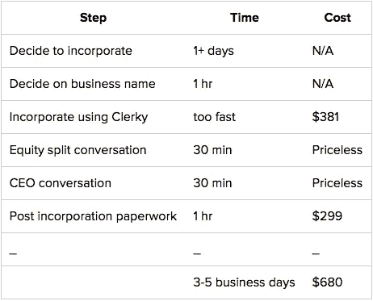

# 新手合并指南

> 原文：<https://medium.com/swlh/a-newbie-s-guide-to-incorporating-97bdf79dcf33>

## 关于[这篇文章](https://blog.mitchjlee.com/2015/a-newbies-guide-to-incorporating)的最新版本，请参见[我的博客](https://blog.mitchjlee.com/)。

如果你和我一样，组建一家公司是一个非常模糊的过程。令人惊讶的是，关于公司实际上是如何合并的报道少之又少；通常听起来更像是:“一些伟大的人创造了一些伟大的创业公司。他们筹集了很多钱。结局。”

我写这篇文章的目的是探究*这到底是如何发生的。具体来说:如何着手组建公司？我将通过详细描述我和我的共同创始人 Alex 和 Penny 的过程来回答这个问题。*

# 步骤 0:如果可能的话，不要

合并会不可避免地使你的生活变得复杂，所以在扣动扳机之前，你最好 100%确定你想要— *需要*合并。抛开混乱、复杂和神秘的合并过程。想想[税收影响](https://en.wikipedia.org/wiki/Franchise_tax)。或者不要，尤其是如果你手头没有阿司匹林的话。请相信我的话，它并不漂亮。

我们等了将近两个月才把 Penny 纳入其中，但当我们开始扩展到朋友和家人之外时(在我们的律师朋友 h/t Neil Devani 的要求下)，我们终于屈服了。

正如我将在后面的帖子中详述的那样，在我们能够实施真正的[隐私政策](https://www.pennyapp.io/privacy.html?utm_medium=Medium&utm_source=A%20newbie%E2%80%99s%20guide%20to%20incorporating&utm_campaign=middle)，与我们的第三方服务签署协议，更换我们的应用商店开发者名称(之前使用我的真实姓名列出)，以及保护我们自己免于个人责任之前，这是必需的(或者至少是强烈鼓励的)。

> 成立独立法律实体的主要目的是保护自己免于个人责任。卡罗琳·利维

一旦你决定合并，目标应该是尽可能快而正确地完成这个过程。这让我迈出了正式的第一步…

# 第一步:使用克里基

因为我在 Penny 之前对创业一无所知，所以我非常依赖 2014 年秋季萨姆·奥尔特曼在斯坦福教授的开源课程《如何创业》中的优秀建议。

[那门课的第 18 讲](http://startupclass.samaltman.com/courses/lec18/)涵盖了法律和会计基础知识，并提到 [Y Combinator](http://www.ycombinator.com/) 公司经常使用一种叫做 [Clerky](https://www.clerky.com/) 的服务来组建他们的公司。

事实证明，克莱基对我这样的人来说是天赐之物。

我能给出的最好的类比是这样的:还记得在过去你实际上不得不使用一张*真实地图*来获得驾驶方向吗？然后当你遇到交通堵塞或者发现一条路被封了，你基本上就完蛋了，除非你的车里有一个专业的导航员？这就是 5 年前合并的感觉。除非你身边有律师，否则你只能祈祷不会发生什么不寻常的事情。你可能还是花了太多时间到达目的地，或者最终完全走错了地方。

然后出现了智能手机的谷歌地图应用程序，那些没完没了地对你的丈夫/父亲/兄弟大喊大叫，说他不知道要去哪里，应该问路的日子终于结束了。(有趣的事实是，事实证明 MapQuest 仍然存在。但是不要去他们的网站，因为它刚刚让我的浏览器崩溃了。)

亲爱的朋友们，这是谷歌地图。它消除了通常合并过程中存在的手工劳动、低效和痛苦，并将其提炼为几个快速、几乎没有痛苦的表单来填写。在这里左转。小心前方封路。诸如此类的事情。这不是一个一刀切的解决方案，就像你有时会偏离谷歌地图的方向一样，但对于大多数创业公司来说，这正是你想要的。

也就是说，我们利用克莱基来整合佩妮。根据我们的经验，你也应该这样做。

# 第二步:执行

通过 Clerky 合并的实际过程非常简单，可以归结为填写四个字段。

## 1.企业名称

选择企业名称可以说是整个过程中最难的部分。由于 Clerky 在特拉华州注册了您的公司，您需要使用特拉华州的[名称可用性搜索](https://delecorp.delaware.gov/tin/EntitySearch.jsp)工具来检查您想要的名称是否可用(尽管实际上不要保留它！).

我们的第一站是检查佩妮是否有空。不是的。

*Womp。*

经过一番反复，我们最终决定友好财政，因为这是我们的口号彭妮。这不是最迷人的名字，但它服务于它的目的(填充我刚才盯着的输入框)。

你还需要包括一个业务后缀。假设你正在创建一个公司，这意味着附加以下任何:协会，公司，股份有限公司，企业，公司，俱乐部，基金会，基金，股份有限公司，研究所，有限公司，社会，辛迪加，联盟。

我们选择了 Inc .，将我们的正式公司命名为 Friendly Finances，Inc .

## 2.要授权的股份数量

*授权*的股票数量与*实际发行*的股票数量略有不同，但稍后会更多。克莱基默认为 10，000，000，所以我们就用这个。

## 3.公司名称

这只是实际填写表格的人的名字；现在还不需要列出所有与你公司有关的人。代表我们:米切尔·李。

## 4.营业处

最后(是的，我们已经到最后了)，你需要一个商业地址。这里唯一的问题是确保你没有列出明确禁止你在那里经营的地方。比如一些(很多？)公寓楼禁止你将自己的公寓用作办公地址。

填写完这四个字段后，只需点击提交按钮，在生成的文件上电子签名，就万事俱备了！

下面是我当时日记的摘录:*“一旦我们决定了名字，剩下的就简单得吓人了。大约 5 分钟后，我申请以友好金融公司的名义成立公司，这份申请被寄到了特拉华州，我的信用卡被扣了 381 美元。希望我没有打错字，因为显然现在已经没有回头路了。”*

克莱基向特拉华州提交了相关表格，等待批准，这样你就离拥有自己的公司又近了一步。据他们说，大约需要 2-3 个工作日你的申请才能得到回音。在我们的例子中，只需要 1。

# 第三步:尴尬的对话很多

当你在等待特拉华州的回复时，如果你还没有解决两个尴尬的合并后对话，这是一个好主意。

根据我们提交的实际公司文件，我们被允许*发行*多达 10，000，000 股。在克莱基的建议下，我们发行了其中的 800 万份，并将剩余的 200 万份留作将来使用(例如，用于员工储备或投资者补偿)。

然后，我们必须决定如何分配这 800 万股股票。进入尴尬对话#1。

## 1.股权分割

出于隐私考虑，我将省略我们谈话的细节，但可以说的是，我非常幸运地拥有一位联合创始人，他不仅才华横溢，而且非常务实。

我想推荐的一件事是:留意在萨姆的创业课上多次给出的建议，即股权分割应该几乎相等。

> 关于这一点:在顶尖的 YC 公司中，我们称之为估值最高的公司，创始人的股权比例极不相称的例子为零。——[第十八讲](http://startupclass.samaltman.com/courses/lec18/)

此外，类似但不平等的股权分割是一个巨大的精神负担；这意味着个体联合创始人对公司的价值是不平等的，实际上他们各自的结果并没有太大的不同。换句话说，应该有一个非常高的平均分配股权的重力。

一旦你决定股权分割，一些简单的数学(股权分割*发行总数)将会给你应该分配的期权数量。假设五五分成，这意味着给每位联合创始人分配 400 万份期权。

然后，为第二次尴尬的谈话做好准备。

## 2.谁应该是首席执行官

没有正确的方法来进行这种对话，但是你需要在完成必要的合并后步骤之前进行这种对话。如果业务和技术专长之间有很大的分歧，希望这能让对话变得容易一些。

亚历克斯很好地总结了我们对此事的集体意见。

> *我们应该尽量减少公司内外对官衔的区分或提及，我认为这对文化也有好处。亚历克斯*

一旦你撕掉了这些对话的创可贴，特拉华州回复你竖起大拇指，你就可以自由地进入下一步了。

# 第四步:大量文书工作

仅仅因为你已经在特拉华州注册了你的新公司并不意味着你已经完成了合并。事实上，这是最简单的部分。接下来最困难的部分是:需要生成的大量合并后文档。

这些包括信息和发明转让协议(你的新公司对你为之工作的一切拥有所有权)，股票发行通知(你有数百万股股票！)、股票购买协议(与你的期权相关的法律术语)、公司章程(是的，这些都是真实存在的)、公司发起人的行为(嘿，你有一个董事会！)，和董事会同意(不要枪毙合并者，董事会现在负责一切)等等。

幸运的是，在你填写一个非常短的表格后，Clerky 会自动为你生成所有的文书工作，从而使这变得非常容易。该表单如下所示:

*   *公司名称* —与您之前注册的公司名称相同
*   *公司名称* —填写此表的人的姓名
*   *首席执行官兼总裁*——摘自尴尬对话之二
*   *秘书姓名* —如果您愿意，首席执行官也可以担任这一职务
*   *股票购买价格* —默认为 0.00001 美元
*   *管辖法律* —您目前运营所在的州(如加利福尼亚州)
*   *董事人数* * — 2(将要求您说出两者的名称)
*   *创始人数量* — 2(你会被要求说出两者的名字)
*   *发行的股票数量*——来自尴尬对话#1
*   *总购买价格* —不知道为什么没有自动计算，但它只是股票购买价格*发行的股票数量(例如 40 美元)
*   *授权条款* —除非你对如何做得比标准的 4 年+ 1 年悬崖授权时间表更好有强烈的意见，否则请保持原样
*   *排除知识产权描述* —与我之前提到的转让协议相关；您可能应该将此设置为“无”

* *经过一番快速调查后，我们选择将自己任命为董事会内部董事(即代表自己作为主要利益相关方)。*

填写完这些字段后，点击“提交”按钮，让所有相关人员在文件上签名，就万事俱备了！你很快就会有比你所能利用的更多的公司文件！

# 第五步:利润

实际上，更像是税。请务必填写 83(b)选举，克莱基包括在文书工作。我不知道这是什么(我只是开个玩笑)，但你所到之处，人们都在小题大做。幸运的是，克莱基给你发来了提醒和非常明确的指导。从公司成立之日起，你有一个月的时间将填好的表格邮寄给国税局。

从技术上讲，还有一些事情需要做。例如，你需要给公司一张给你的期权的支票(例如 40 美元)。如果你在加州之外经营，你还需要[向加州州务卿](http://www.sos.ca.gov/business-programs/business-entities/faqs/#form-question8)注册。不管怎样，我会把这些留到另一篇文章中，因为它们只是有一点点关系，而且这篇文章足够长了。不客气

# 摘要

就这样——您现在是一家完全注册和认可的公司的骄傲的所有者了！这可能看起来工作量很大，但主要是因为我很啰嗦。

这里有一个快速回顾:

希望你觉得这至少有点意思！随时欢迎反馈和建议: [@dontmitch](https://twitter.com/dontmitch) 或 mitch [at] pennyapp.io。

米奇，联合创始人@ [佩妮](https://www.pennyapp.io/?utm_medium=Medium&utm_source=A%20newbie%E2%80%99s%20guide%20to%20incorporating&utm_campaign=bottom)

> 如果你喜欢这个，不要害羞👏为了它！