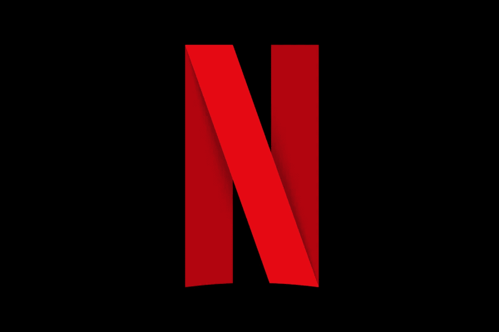
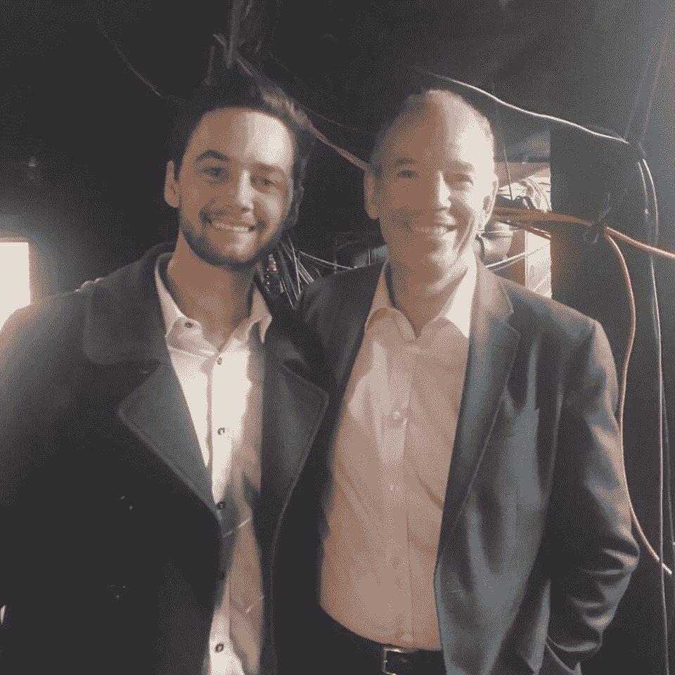

# 与网飞联合创始人的一夜&创新的秘密调料

> 原文：<https://medium.com/swlh/a-night-with-the-co-founder-of-netflix-the-not-so-secret-sauce-to-innovation-bc8367d664ed>

我有幸见到了网飞的联合创始人！

许多人梦寐以求的经历。

他善良、谦逊，很高兴见到我们。

他手下有 2000 人。都在等着听他说些什么。

灯灭了，开始播放介绍音乐。

网飞的联合创始人马克·伦道夫(Marc Randolph)准备好了分享 2018 年的最佳知识。这是我们没有预料到的事情…

但是接下来的主题演讲确实触动了我。

它会说话，它帮助我从思考一个想法到行动起来。

# RNT 计划诞生了

他谈到了创新。

创新是网飞接管世界的原因。当它刚开始的时候，它是一个简单的，可以说是无聊的 DVD 递送公司。一个人下订单，网飞就会用他们标志性的红色盒子送来 DVD。一点也不鼓舞人心。但后来他们着眼于改变世界。

然后他们颠覆了整个行业，搞垮了百视达。

如你所知，他们从一家快递公司发展成为今天的电影流媒体巨头，并成为世界上第一家也是最大的流媒体公司。

# 调整你的想法，不要停止！

虽然这是世界上最快的对[网飞](https://www.netflix.com/sg/)进化的解释，所有需要的都在那里。

> ***这与他们无关。这是关于创新。***

我们学到的一件事，也是我们在没有计划的情况下开始 rnt 项目的原因，是因为对我们来说很明显，你不需要有一个完美的想法来开始。

你不需要知道确切的计划或正确的道路。我操。你甚至不需要知道你想去哪里。

你只需要开始。

一旦你有了，调整你的想法，然后再多调整一点，直到它完美。

我们最近看到了 Finder(澳洲最大的比价网站)CEO 的演讲。

他说:

> ***“挑选你的核心产品并完善它。忘掉其他一切，只需完善你的核心"***

将这一点与网飞的建议结合起来，你会得到以下结果:

> *“你不需要完美的想法来开始。开始吧，一路完善它"*

# 入门指南

当 2000 人坐在一个房间里，听着你等得越久，你就落后得越远的事实时，有几个人把这当成了一些严肃的建议。少数人会站出来开始行动。他们会回家并采取行动。

大多数人都不会。

但是有些人会，有些人已经走在你前面了。

成千上万。成千上万。成千上万的人决定每天都要适可而止。当你坐下来思考如何开始的时候。

所以今天是你要做些事情的日子。

它不必很大，但你会采取下一步。

在你这样做之前，我们假设你已经做了足够的计划。所以，如果你认为你的下一步是检查你的“商业计划”或写下你的待办事项清单或任何其他任务，把它他妈的放下。

做出真正的举动。完成一个真正的任务。买一个企业名称。建立你的网站。

做一些有影响力的事情。

那么当你完成后。做下一个。

下一个。

下一个。

直到你 5 年后过上你想要的生活！

# 订阅我的免费目标规划工具！如果你喜欢这篇文章，别忘了“鼓掌”!

## 这篇文章发表在[《创业](https://medium.com/swlh)》上，这是 Medium 最大的创业刊物，有+ 378，907 人关注。

## 订阅接收[我们的头条新闻](http://growthsupply.com/the-startup-newsletter/)。

