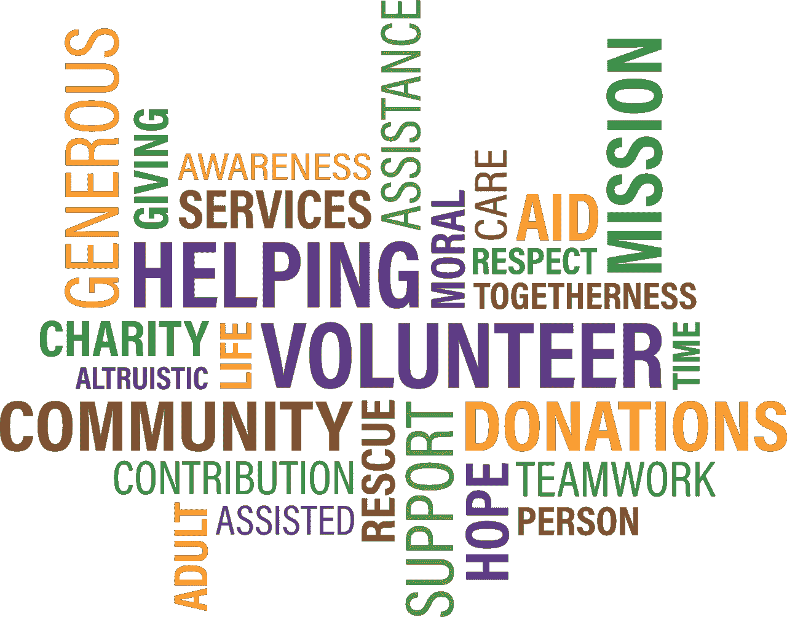

# 非营利组织:通过帮助那些帮助你的人来贡献你的配额

> 原文：<https://medium.com/swlh/a-nonprofit-for-nonprofits-contributing-your-quota-by-helping-those-who-help-ad891e60d37f>

Credits: Pixabay

如果你的生意不是以赚了多少钱来衡量的，那会怎样？

如果你的资产负债表是多少张笑脸，以及你服务过的组织数量，那会怎样？

如果你的服务是时尚的和高科技的会怎么样？

**见见 NPNP。一个假想的非营利组织，向其他非营利组织提供定制软件开发，作为捐赠。**

**他们的工人不是志愿者。**

NPNP 代表非营利组织。它使用现代技术提供网络和移动开发服务。他们的用户界面光彩夺目，提供了美妙的用户体验。

NPNP 敏捷且反应灵敏。他们的团队精干高效。他们有很棒的产品经理。他们的工人不是志愿者。只有经过严格的审查程序，申请人才能被接受。当然，他们还能满足数据保护的安全性和合规性要求。

# NPNP 有市场吗？

Helastel 的营销经理 Christina Lynch 在他们的博客[中写道:](http://blog.helastel.com/ngo-software-development-challenges-and-how-to-solve-them)

> 非政府组织和慈善机构必须充分利用数据。我们发现，非政府组织和慈善机构越来越重视数据驱动的洞察力的价值，以履行其核心使命。
> 
> 对于那些提供紧急或急救护理服务的组织来说，他们收集和分析信息的方式对于运营决策至关重要。

流程的数字化已经成为常态。林奇继续道:

> 以前，他们应对“拯救更多生命”或其他可衡量结果的方法可能是将宝贵的资金用于额外的人员或更现代化的设备。现在，数据科学方法正在帮助协调和整合各种不同的数据源，形成一个智能引擎。事实证明，这些都是非常高效、值得使用的资金，因为它们将资源用于最需要的地方，有助于长期战略和短期战术选择。

非营利组织的软件计划包括结构化教育解决方案，使护理人员及其客户能够参与、互动和主动管理医疗状况。恶劣环境条件下安全个人数据捕获的数字化。实时数据分析和可视化工具，提供对快速变化的危机情况的即时洞察。

营销经理总结道:

> 软件在慈善机构和非政府组织的未来扮演着越来越重要的角色。这反映了私营部门组织的趋势，它们同样热衷于利用数据的价值，并以尽可能低的成本实现自己的目标。

# NPNP 可行吗？

有一些组织帮助软件开发人员在空闲时间贡献他们的专业知识。其中包括像[社交代码](http://socialcoder.org/)、[捐赠代码](https://www.donatecode.com/)和[慈善 IT 协会](https://charityithelp.org.uk/resources/)这样的公司。那么为什么非政府组织和慈善机构会为任何软件开发买单呢？

许多项目太复杂，或者太重要。

非政府组织和慈善机构想要比志愿服务更多的承诺(在这方面)。

NPNP 工人不是志愿者。他们是受薪员工。NPNP 必须很好地交付你的项目，以便向他们的捐助者提供续发赠款的证明。

接受 NPNP 捐赠的人可以自由地向 NPNP 捐赠现金。

NPNP 可以向盈利组织捐赠软件吗？

是的。好的企业公民更有可能接受软件捐赠。

NPNP 有一个合作伙伴公司，以惊人的低费用和同样高的质量进行盈利性开发。那些爱上 NPNP 的服务并希望自己拥有所有这些服务的组织(我们真的希望这是可能的)，将被推荐给该合作伙伴，以获得持续的体验。

# NPNP 是向贫困地区提供商品和服务的一流供应商

当然，与它所服务的组织会有保密协议。NPNP 也可以成为软件形式的高价值服务的一流提供者，因为软件在现代已经成为一种商品。

这些创造性的解决方案作为“商品”可以“分发”给发展中国家得不到充分服务的人，就像分发药品和食品一样。这些目标可以是尽量降低婴儿死亡率、文盲率和公平对待妇女。

感谢阅读。

我很想在评论区听到你对这个模型的想法。

如果你喜欢这篇文章，请随意点击“鼓掌”按钮👏帮助其他人找到它。

## 这个故事发表在 [The Startup](https://medium.com/swlh) 上，这是 Medium 最大的创业刊物，拥有 303，461+人关注。

## 在此订阅接收[我们的头条新闻](http://growthsupply.com/the-startup-newsletter/)。

