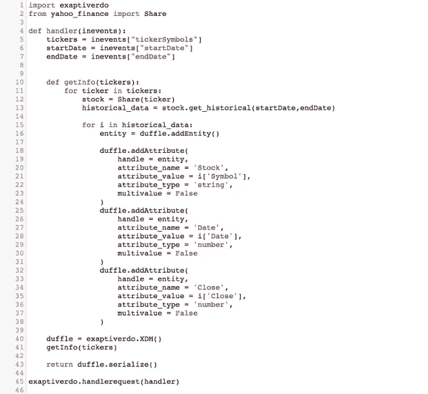
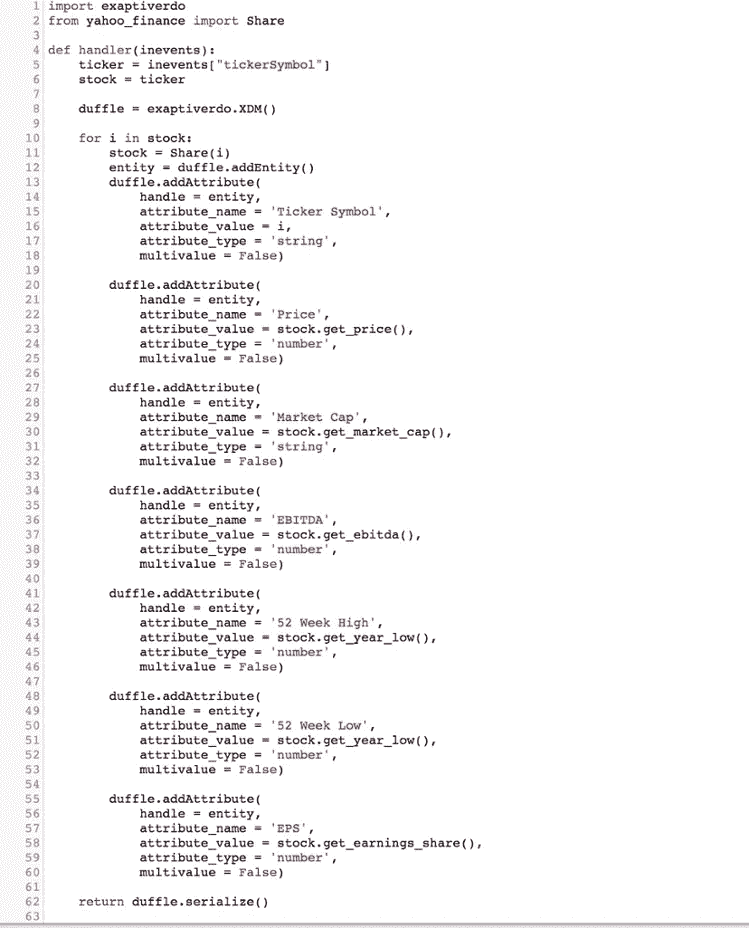
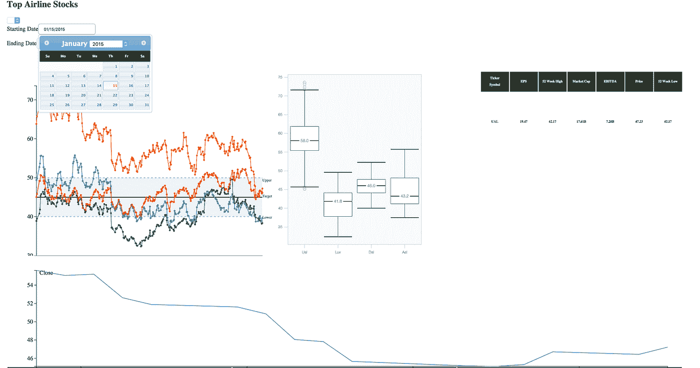
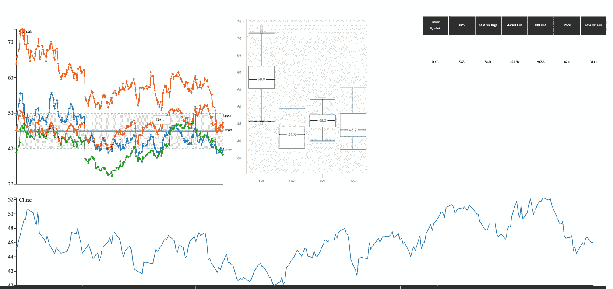
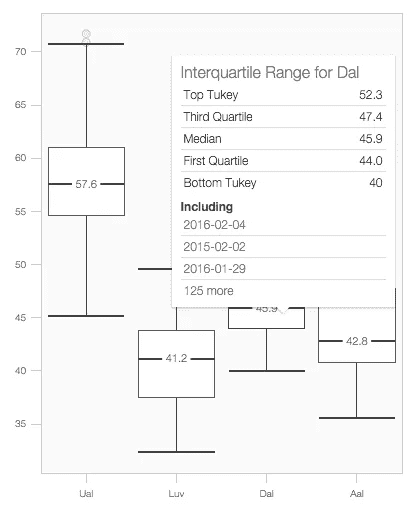

# 一个编程新手，一个财务数据应用程序，以及快速原型的价值

> 原文：<https://medium.com/swlh/a-novice-coder-a-finance-data-application-and-the-value-of-rapid-prototyping-bb3f69e30296>

产品负责人卢克·塔克

我喜欢建造东西。我喜欢分析。我喜欢编程。有趣的是，在您能够构建用于分析某些东西的应用程序之前，您通常需要颠倒这个顺序。你需要编程知识来把分析变成“东西”问题是，虽然我喜欢编程，但我还是新手。我的意思是，我很擅长 Codecademy，但这并不能转化为利用 Python、Javascript 和 D3 的面向用户的应用程序。因此，当我最近坐下来构建一个最低限度可行的数据应用程序来查看航空公司股票时，我想知道它可能需要多长时间才能变得可行，坦率地说，我担心它可能会变得多么微不足道。

但是，一个小时后我拿到了。它并不漂亮，从提供有价值的见解的意义上来说也不可行。然而，这很能说明问题。这让我们很容易问:“这种布局有意义吗？”“这是我真正想要的数据吗？”我可以把它展示给客户或我的老板，然后问:“这是我们想要的方向吗？”我可以很快得到反馈。那辆很值钱。

我是如何在不到一个小时的时间里造出东西的？我尽可能利用已经构建好的东西，尽可能少写代码，最好是不写。如果你还记得的话，这是我在建筑方面的弱点。

我从快速白板会议开始。我大概知道我需要什么。日期、股票价格、股票信息、可视化等等。我寻找我可能需要的组件，有些我知道存在，有些我不知道。一个令人惊喜的例子是在搜索“日期”时，当我需要某种方法来输入日期范围时，我发现了一个“日期选择器”组件。这正是我所需要的，也是我要花一整天时间才能完成的东西。

在[实验工作室](https://www.exaptive.com/platform)建造的实体模型看起来是这样的:

这只花了几分钟的时间，但是有效地阐明了我所拥有的(组件)、我所需要的(指示必要组件的注释)以及我的仪表板的初始框架。在这种情况下，它帮助我看到问题大部分都解决了，我是一个足够有能力的程序员来填补空白。如果有我不能填补的空白，我可以通过共享白板来轻松地引入我们更有经验的程序员。但是，在这种情况下，我可以处理。

为了填补空白，我需要获取财务数据的组件。快速的谷歌搜索显示雅虎金融 API 是一个简单易用的解决方案。我发现的一个 Python 库将“简单易用”变成了获取我需要的信息的 3 行代码，以及获取信息并遍历它的不到 50 行代码，为我的初始可视化创建了一个数据袋(给定日期范围和股票代码的价格)。如果您想知道 duffle 是什么，它是一个实验性的特定数据模型，非常简单。如果您感兴趣，请点击了解更多信息[。回到 Yahoo Finance，对于返回更细粒度数据(市值、EBITDA、EPS 等)的组件来说，情况类似。对于给定的股票代号)。不到 110 行简单明了的代码之后，我得到了我需要的东西。](https://helpdesk.exaptive.com/support/solutions/articles/11000010290-entities-and-duffles-exaptive-data-model-part-1-of-3-)

获取历史数据:

获取粒度数据:

剩下的就是连接东西和配置可视化。

我添加了一个进度条组件，因为对于较大的日期范围，API 调用有点慢，还添加了一个折线图工具提示，以便更好地查看鼠标悬停的股票。其余的时间都在配置组件。(哦，对了，使用堆栈溢出中的复制和粘贴作业来破解 CSS 以获得布局。)

输入四个航空公司股票代码，一个日期范围，然后…瞧！两个折线图、一个箱线图和一个表格。在上面的图中，橙色线表示联合航空公司(Ual)，蓝色线表示美国航空公司(Aal)，红色线表示达美航空公司(Dal)，绿色线表示西南航空公司(Luv)。

下面，我盘旋在达美航空公司的航线上。(请注意我悬停的地方有一个带有股票代码的小工具提示)。该表显示了 Delta 的数据，下面的更新折线图仅显示了 Delta 在给定时间段内的库存。

我还可以将鼠标悬停在箱线图上以获取更多细节。

因为这是一个原型，是流程的第一步，所以我还在仪表板下面包含了一个可排序的、可滚动的表，其中包含了所有的数据。我可能不会在进一步的迭代中包括它，但是在早期阶段，我可以使用它来解决数据返回的问题。

我们的目标是 MVP 仪表板，我想我已经实现了。我会根据美国航空公司提供的一些信息购买它的股票吗？今天不行。我能更好地看到有价值的数据应用程序吗？绝对的。那么我学到了什么？

我需要一个更好的数据源，提供更精细的数据，包括能够洞察这些公司个体状况的比率，因为它们彼此相关，以及航空业作为一个整体。我可以构建组件来将我拥有的数据转化为更有用的东西，但是为什么要重新发明轮子呢？事实上，我给第一个人看这个，他说，“财务人员使用 Quandl API，数据要好得多。”#快速反馈精彩部分？多亏了模块化的精神，我可以取出雅虎财务组件，用 Quandl API 组件替换它们，在这个过程中不会丢失我当前的任何功能。

我知道我不是 CSS 奇才(注意不太完美的布局)，但我们有一个人是，所以为什么要花太多时间担心呢？我的目标不是美好的东西。这是一个指向更好应用的下一步的指南针。

最后，我了解到，尽管燃料价格持续下滑，航空公司的股票在过去的一年里并没有表现突出。事实上，总的来说，你可以把它们描述为表现不佳，波动性很小。这是否意味着燃油价格不会影响他们的盈利能力，从而影响他们的价值？它不能。这是否意味着这些股票目前被低估了？有可能，仪表板的下一个版本可能会有助于做出决定。

为什么我能在不到一个小时的时间内做到这一点？因为其他人已经通过构建组件解决了他们的问题，这些组件后来成为我的问题解决方案的一大部分。(令人惊讶的是这种情况如此频繁，例如这里的和这里的)。

但是令人满意的是，没有人需要构建一个组件来获取股票价格。我完成了这项工作(总共 45 行),现在任何人都可以使用相同的数据集来解决问题。我尽我所能利用这个系统。我尽我所能做出了贡献。结果是在 45 分钟内完成了原型数据应用程序。

## 这篇文章发表在 [The Startup](https://medium.com/swlh) 上，这是 Medium 最大的创业刊物，有 295，232+人关注。

## 订阅接收[我们的头条新闻](http://growthsupply.com/the-startup-newsletter/)。

