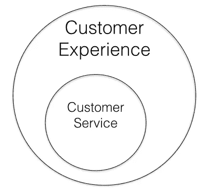
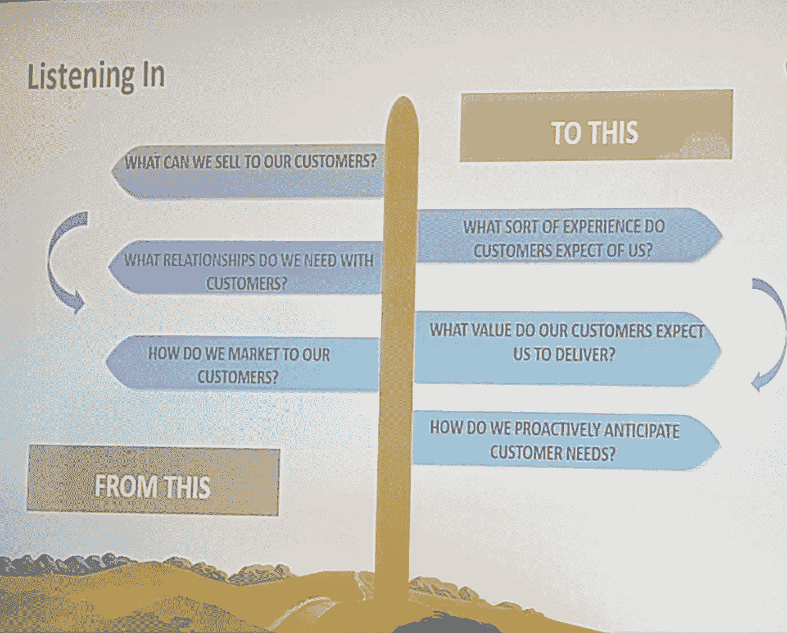

# 客户需求的范式转变——7 大教训

> 原文：<https://medium.com/swlh/a-paradigm-shift-in-what-customers-want-7-major-lessons-5c8dafe06d1>

## 创业公司应该问自己的问题已经改变了

rawpixel.com from Pexels

这个世界充斥着对未来的预测。深度学习、人工智能、增强现实、大数据——每个人都在谈论它们将如何改变我们做生意的方式。

但是在这一切中，公司已经忘记了他们为什么要做生意——为顾客服务。

尽管“尖端技术”激增，但大多数公司在客户服务方面几乎没有触及皮毛。

事实上，他们已经利用技术做了根本不需要做的事情。

现在，我不是一个[新勒德分子](https://www.webopedia.com/TERM/N/Neo_Luddite.html)。但我不禁注意到，从长远来看成功的公司更关注客户，而不是技术。

这并不意味着以客户为中心的公司是原始的。相反，他们是技术的引领者，他们利用技术来取悦顾客。

亚马逊就是一个例子。无人机送货、AWS、亚马逊 Prime 和其他技术进步都源于他们对你、我和其他所有客户的不懈关注。

顾客也是苹果开始改变想法的原因。每一个新的小玩意都利用科技来取悦顾客。

但是很少有公司说到做到。这方面有很大的改进空间，会影响公司的顶线和底线。[研究显示](https://instapage.com/blog/increase-customer-lifetime-value)一个长期客户有可能比她的第一笔交易多做十倍的生意。

> “如果你只是为了钱而工作，你永远不会成功，但如果你热爱你所做的事情，并且总是把顾客放在第一位，成功就会属于你。”—麦当劳前首席执行官雷·克洛克

上周，我参加了亚洲客户关系管理学院(CRM Academy of Asia)的客户战略圆桌会议(Customer Strategies Roundtable ),会上业内资深人士谈到了客户关系的重要性，以及品牌必须如何发展才能满足新的期望。

以下是我最大的七个收获。

# 1.你的顾客不理智

我们期待人类依靠逻辑，根据功能、价格等方面来选择产品。

但是逻辑思维发生在新皮层，这是大脑最近发展的部分。管理我们情绪的边缘脑是最古老的部分。情绪主宰着我们的决定，因为它们深深地吸在大脑中。

恐惧使早期人类能够从掠食者手中生存下来。对地位的渴望使我们提高了生活质量。

特拉尼咨询公司的主管 Anil V. Pillai 博士解释说，这些情绪让我们做出非理性的行为，这让我们自己都很惊讶。也许这就是为什么当有更便宜更好的选择时，我们会买价格过高的商品。

要理解顾客的购买行为，发掘他们潜在的情感是至关重要的。

# 2.客户体验是新的黑色

顾客体验(CX)始于他们购买之前。现在很流行。在他们购买后只提供客户服务就像固定电话一样过时了。

据易贝[公司全球客户体验总监兼负责人阿曼迪普·辛格·穆尼尔](https://www.linkedin.com/in/amandeepmunial/)所说，客户服务是*公司的反应式服务*，因为它发生在客户伸出手的时候。CX 是积极主动的，当一家公司在从潜在客户到售后支持的任何阶段接触客户时就会出现。

Customer Support is a subset of Customer Experience

[Tally 全球客户营销主管 Sudiptaa Paul Choudhury](https://www.linkedin.com/in/sudiptaa-paul-choudhury-71b4a91/) 分享了一个个人的例子。在一次国际旅行中，她没有意识到自己丢了钱包。然后，她接到了银行的电话，通知她作为预防措施，他们已经冻结了她的卡。她认为这是一个骗局，于是再次给银行打电话。他们证实，他们已经冻结了她的卡，并在她的账户上存了一些钱，以使用免息。这就是主动的客户体验。(关于隐私的讨论我们以后再说。)

皮莱博士认为，收集客户反馈是客户服务的一种形式。当公司利用这些数据来改善运营时，CX 就会提高。

品牌和营销现在对顾客购买行为的贡献约为 40%。剩下的就是客户体验了。

# 3.问题变了

对 CX 的关注导致了各行各业的范式转变。

公司最好意识到这一点并适应，而不是等待这个“阶段”过去。因为它会留在这里。

Salesforce Service 高级总监迦尔吉·v·亚萨斯表示，这种转变迫使公司应该问自己的问题发生了 180 度的转变。

*   来自*“我们能卖什么？”*到*“客户想要什么体验？”*
*   从*“我们需要维护哪些关系？”*到*“我们的客户期望什么价值？”*
*   “我们应该如何推销我们的产品？”到*“我们应该如何预测客户的需求？”*

© Kalki Yasas

这听起来可能很刺耳，但公司无法从思维停滞的员工那里找到这些问题的有效答案。

新的工作方式需要注入新的思维和人才，以保持客户在每一个行动中的中心地位。

# 4.衡量正确的指标

*“事情就是这样做的”*综合症已经渗透到我们对待顾客的方式中。

Amandeep Singh 强调，大多数公司使用过时的指标，如响应时间和解决的问题数量来衡量客户满意度。但是，当这些数字增加时，客户满意度通常不会成比例地上升。

为什么？

因为公司看的指标不对。例如，衡量问题响应时间可以确保联络中心更快地做出响应，但这并不意味着他们会很快解决问题。公司可以使用更好的指标来提高 CX。

一个好的指标有三个关键方面:

1.  它在整个组织中定义明确
2.  它足够健壮，受外界因素的影响很小
3.  它测量信号，而不是噪音。

例如，对调查的普遍回应率仅为 5%。易贝并不仅仅依靠顾客的数据，而是通过检查顾客是否会重复购买来判断他们是否对解决方案感到满意。

# 5.数据本身毫无用处

公司可以收集大量关于客户和产品的数据。但是，除非这些数据创造了智能，并授权给正确的人，否则这些数据毫无用处。Yasas 是这种哲学的坚定倡导者。

想象一个场景:一台冰箱的某个组件即将出现故障。OEM 会收到一个通知，通知客户此事，并提议派一名技术人员来更换。这些数据不仅仅改善了 CX。识别模式也可以帮助原始设备制造商提高产品质量。

这听起来可能像“哇！”就现在。但在不久的将来，这可能会成为一种常态。

# 6.地缘政治因素影响 CX

全球性公司遵循一个信条:全球工作，本地思考。在印度，公司必须考虑微观的地方，因为这个美丽的国家本质上是许多小国的集群。

这就是为什么地缘政治因素也会影响一家公司在不同地点提供的体验，米特卡特咨询公司的联合创始人兼首席执行官[帕万·德赛](https://www.linkedin.com/in/pawan-desai-5455562/)说。

例如，优步可能不会在班加卢鲁提供与孟买相同的客户体验。电子商务公司在诺伊达不提供[货到付款。](https://www.quora.com/Why-are-Amazon-and-Flipkart-not-delivering-products-in-Noida)

当你在一个地区建立业务时，考虑地缘政治因素以确保顺利运作。

# 7.一致性是王道

公司一直在寻找令人惊叹的因素来取悦顾客。但他们忘记了一个关键因素:一致性。

顾客喜欢在生日和纪念日得到祝福，喜欢手写便条这样的小举动。但是这些都是好东西。

顾客看重的是这种表达爱意的方式能始终如一地兑现你的承诺。

当客户与你接触时，你提供的一切都变成了承诺。你的推销、你的产品、交货日期、售后支持等等。客户更喜欢与一贯信守承诺的公司合作，而不是那些出色但不一致的公司。

> “客户不指望你完美无缺。当事情出错时，他们希望你去解决。”—英国航空公司副总裁唐纳德·波特

承诺是好的，信守承诺更好。一次又一次地保持它是理想的，因为它建立信任，这是买方/卖方关系中最有影响力的因素。

# 总结

你的企业做了很多正确的事情。所以你还在做生意。

但是范式的转变需要战略的转变来跟上。CX 不再是客户支持部门的职能。这是整个组织的作用，通过为买家提供一个整体的体验，使他们想回来。

不要为了*的下一件大事*(技术)而忽略了*最重要的事情*(你的客户)。

下一件大事是帮助你到达目的地的交通工具。像所有的车辆一样，它需要航向修正以保持在正确的航向上。

使用*下一件大事*来关注*最重要的事情*。

*最初出现在*[*LinkedIn*](https://www.linkedin.com/pulse/paradigm-shift-what-customers-want-7-major-lessons-vishal-kataria/)*上。*

## 这篇文章发表在 [The Startup](https://medium.com/swlh) 上，这是 Medium 最大的创业刊物，拥有+388，856 名读者。

## 在这里订阅接收[我们的头条新闻](http://growthsupply.com/the-startup-newsletter/)。

