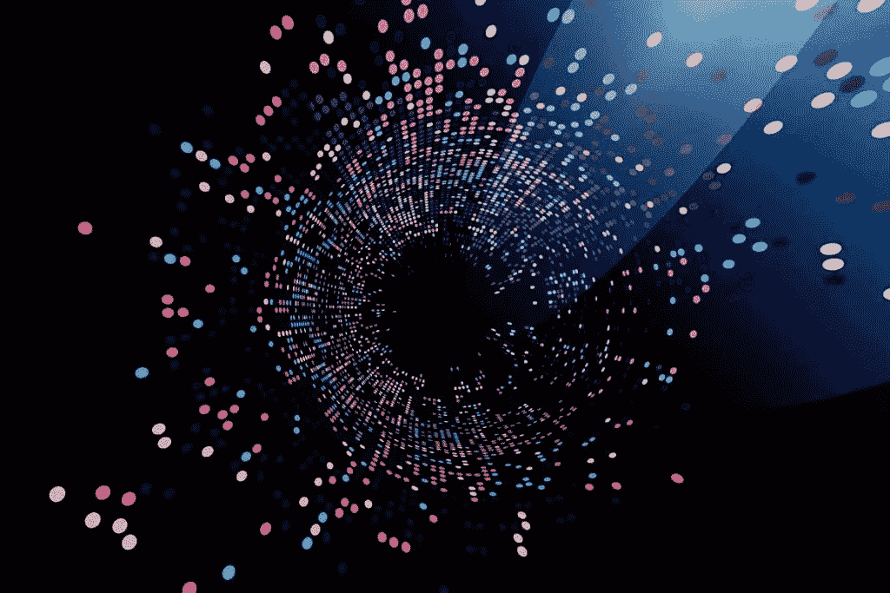
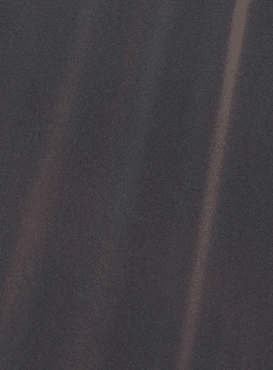

# 一个代码、像素、原子与时空碰撞的地方。

> 原文：<https://medium.com/swlh/a-place-where-codes-pixels-and-atoms-collide-with-space-time-a357e4b976d3>

它已经撕开了一个口子。

我们是**空间存在**。我们进化了几千年；从原核生物到真核生物，一个细胞接一个细胞，一个意外接一个意外，**一个维度接一个维度**，变成我们家园世界的顶级捕食者；创世神话中的天使要向这个强大的物种鞠躬。我们通过理解周围的空间来适应复杂的环境。我们不断地在这些空间上消费和建设——产生了文明和社会，成为我们智慧的母体。史蒂文·约翰逊说，“**我们的思想塑造了我们的空间，而空间也回报了我们。**“我们已经穿越了整个地球，并从我们的淡蓝色圆点发射了火箭。有了我们的认知心理地图，我们可以塑造和规划未来，以适应或超越我们生活的空间。

## 尽管我们具有作为空间生物的进化优势，并拥有立体视觉来看待三维世界，但想象一下，当 80 亿人不得不俯视二维矩形设备来消费关于他们周围空间的信息时，这是一种侮辱？

但是 2D 有什么问题呢？

## 它是有损耗的。

# 我给你讲个故事，让你对自己产生一点敬畏。

看到这张著名的图片。那个淡蓝色的点。

那是 1990 年 2 月 14 日，美国宇航局的旅行者 1 号探测器正准备离开太阳系，进入浩瀚的星际空间，永远远离我们的通讯联络。它已经在太空中漂浮了 40 年，超过了它的使命。在离家创纪录的 60 亿公里处，这是人类制造的材料旅行过的最远的地方，在著名天文学家和作家卡尔·萨根的要求下，美国宇航局命令旅行者号将相机转向回家并拍摄照片。旅行者号校准并点击了这张照片。 [**地球**](https://en.wikipedia.org/wiki/Earth) **在黑暗的深空中看起来像一个小点(大约在棕色带右侧中间的蓝白色斑点)。**

> 在组成画面的 640，000 个单独的像素中，地球占据了不到 1 个像素。我们所有的历史、战争、边界、发明、宗教、数十亿人和我们的自我；一切都缩小到数码照片的一个像素。

卡尔·萨根曾说过，这样的图像不会有太多的科学价值，因为地球对旅行者号的相机来说太小了，无法分辨任何细节，但作为我们在宇宙中的位置的一个视角，它是有意义的。

在 1980 年 11 月 12 日完成其飞越土星的主要任务后，*旅行者 1 号*成为五个人造物体中的[第三个，以达到](https://en.wikipedia.org/wiki/List_of_artificial_objects_leaving_the_Solar_System)[逃逸速度](https://en.wikipedia.org/wiki/Escape_velocity)，这将允许它们 [**离开太阳系**](https://en.wikipedia.org/wiki/Solar_System#Farthest_regions) 。2012 年 8 月 25 日，*旅行者 1 号*成为首个穿越[日光层](https://en.wikipedia.org/wiki/Heliopause_(astronomy))进入[星际介质](https://en.wikipedia.org/wiki/Interstellar_medium)的航天器。航天器仍然与[深空网络](https://en.wikipedia.org/wiki/Deep_Space_Network)通信，以接收常规命令并返回数据。截至 2018 年 1 月 2 日距离太阳 210 亿公里。旅行者 1 号的延期任务预计将持续到 2025 年**左右，届时其** [**放射性同位素热电发电机**](https://en.wikipedia.org/wiki/Radioisotope_thermoelectric_generator) **将不再提供足够的电力来操作其科学仪器。**

这张模糊的地球照片以 2D 照片的形式呈现，在全世界引起了敬畏和惊叹。数百万人被他们无法理解甚至无法写下的情感所激励。

卡尔·萨根发表了一篇著名的演讲。

## “就在这里。那是家。那是我们。在上面，每个你听说过的人，每个曾经生活过的人，都度过了他们的一生。我们所有的欢乐和痛苦，数以千计的自信的宗教、意识形态和经济学说，每一个猎人和采集者，每一个英雄和懦夫，每一个文明的创造者和破坏者，每一个国王和农民，每一对恋爱中的年轻夫妇，每一个母亲和父亲，每一个发明家和探险家，每一个腐败的政治家，每一个超级明星，每一个最高领导人，我们人类历史上的每一个圣人和罪人，都生活在那里的一粒尘埃上，悬浮在阳光中

敬畏感、心理惊奇感和狂喜感与概观效应相关；这是宇航员在太空飞行中报告的认知转变，通常是从轨道上或从月球表面观察地球。

> 即使是 2D 对我们成就的展示也能在几十年间激发数百万人的敬畏和好奇。想象一下，如果所有的历史都通过一种不仅仅是二维的媒介传达给我们，会有什么样的影响？

> 去海滩的路在哪里，最近的自动取款机在哪里？这附近最好的咖啡馆是哪一家？这家伙是谁？这个爆胎怎么换？

每天，人类都会在 Instagram feeds 上集体滚动数千英里。需要多次滚动的信息太多。网站第二个标签中提取了太多信息。关于我们的 3D 世界的数据，被抽象到跨多个应用程序的第二页和多个标签中，通过 2D 设备呈现出来。**不得不低头看手机获取信息，不得不抬头看世界应用这些信息，这似乎是对地球上最优秀物种的极大侮辱。**我们不得不在世界和信息之间来回转换我们的注意力，我们意识到我们数据消费的媒介还没有跟上人类进化的步伐。

> 按照这些思路，2D 成了一种侮辱。我们的计算需要是空间的。我们需要通过观察来获取数据并进行处理。不是通过往下看。我们的空间应该成为我们计算的媒介。

数字和物理之间的摩擦，像素和原子之间的摩擦，现实和超现实之间的摩擦，需要我们在 2D 显示器上滚动多次的摩擦，当你不能只看街道看它去哪里时产生的摩擦，相反，你必须在手机中的地图应用程序上精确定位并拖动来定位自己——这种摩擦是糟糕设计的结果。想象一个世界，当你看着建筑和街道时，它们会和你说话。
这项技术终于来了，准备好消除与 80 亿人注意力互换相关的摩擦。

## 增强现实(AR)改变了一切。

AR 并没有改变我们曾经消费的东西。我们利用信息来做决定。“这附近最好的餐馆是哪家”？“哪个地方最适合我过暑假”？我们将继续消耗数据来做出决策。我们的智慧设计了我们的星球，智慧源于信息。有了 AR，改变的将是我们消费数据的方式。它将消除摩擦，使我们能够在空间尺度上进行计算。这将是一条阻力最小的道路，这里的风景会与我们对话，道路会在我们眼前以数字方式标记自己。

数字和物理现实将融合在一起，实现**空间计算**——这种形式作为我们生物处理器的有效输入外围设备是公正的。

> 在创造所有这些 AR 体验的法律和代码的控制下，从我们的社交媒体已经成为的广阔数字荒地的令人窒息的灰尘中，艺术程序员和故事讲述者的混合将会出现，使整个世界充满一种迷人的魔力；世界会突然充满各种可能和想象的壮丽。这些技术人员的集体想象力将在我们的历史中留下深深的烙印，标记出一个前和一个后。

## 开发工具包将出现，使任何人能够并激励任何人将世界作为他们的画布，编辑和修改现实以产生艺术，超越艺术到超自然，引导刷新灵魂的创造力，催生新一代的数字穴居人，他们将在点燃火焰的橙色夜空中画出**涂鸦**。

突然间，人类将获得无所不在的工具，以数字方式传送到各大洲，在那里生活并享受这一刻，实现全球远程呈现。所有这些都是通过不低头看手机，而是直接凝视周围的世界。慢慢地但肯定地，一切都浮现出来，就像第二层空气，一切——人们的背景故事，地方的历史，每个物体的操作方法——一切都从我们的手机这个长方形中抽出来；数据本身的原点。

## 这项技术实现了形而上学无限之间的会聚点，在这里来自现实世界的原子和来自我们数字世界的像素可以相互碰撞，增强我们的模拟现实。

## 从各方面来看，这都是现实本身的操作系统。

# 短路空间和时间。

亚伯拉罕不可能知道他在迦南的家人发生了什么事。耶稣、佛陀和穆罕默德也是如此。

快进几个世纪，我们可以看到克里斯托弗·哥伦布在他的探险中没有办法实时知道伊莎贝拉女王在英国做什么。距离太远了，一只**鸽子**跑不过去。

几十年后，在埃及前线的拿破仑可以收发他在巴黎的妻子约瑟芬的来信，而且只需要几个星期。

几年后，电报把几周缩短为几天**。**

电话把短暂的一天缩短为几分钟**。**

我们的即时通讯和社交网络将几分钟缩短为**微秒。**

## 有了科技，我们正在缩小我们生活的时空。

前方有一个奇点，由我们信息摄取的速度推动。

## 今天，我们的信息、广播和印象以光速传播，缩短了空间和时间。

爱因斯坦的相对论解释重力是时空包层折叠的结果，与此类似，我们在这里的存在是由我们对空间的相对影响来衡量的。我们在这个特定的历史快照中存在的证据是由我们操纵和利用周围时空的程度来衡量的。这包括我们创作的作品，我们树立的纪念碑和我们唱的歌。被建造的金字塔，被发动的战争，以及我们正在数字领域中构建和调解的我们自己的数字版本；任何事物都会对时空产生影响。

> 世界上所有这些 3D 冲击都是通过 2D 媒介收集、记录和传递的。石头，书，电话。这就是限制所在，阻止技术在生物规模上运作。与这种 2D 介质相关的传输损耗。恼人的摩擦。有损压缩我们在这个多色立体世界中的所有空间努力。

在人类历史的任何特定时代，我们跨越这个形而上学的时空结构的能力是由我们所创造的技术的伸缩能力所决定的。技术直接依赖于我们存储、消费和处理信息和知识的方式。这是一个反馈循环。我们创造技术，我们利用它来影响和塑造现实世界，我们研究结果，然后我们修改技术。我们如何收集数据并分析它们真的很重要。

几千年来，我们的数据消费媒介从未超越过 2D。在这个星球的历史上，增强现实将首次改变人类获取和消费信息的方式。这种强有力的观点范式转变将很快加速我们进入下一个领域的进化。

# 互联网会慢慢枯萎死亡。

互联网掌握着无数个世纪以来人类积累的集体智慧。互联网分布在数百万台计算机上，由随着时间的推移而变得成熟和有组织的协议结合在一起，它是最大的一项发明，超越了所有障碍，实现了思想的交流和自由流动。突然，时间和距离的概念被压缩成一个简单的奇点；我们可以跨越多个时区传输万亿字节，这开创了一个新时代，思想和想法的中介超越了空间和时间，合作和革命在网上发展，这个数字世界的互动开始塑造我们周围的现实世界。它影响了人、地方和事件。

## 一旦我们拥抱 AR，这种版本的数字化超越生活，我们基于 2D 信号的涅槃，我们都是不朽的，并不断建设和定制我们的来世，正如我在[之前的帖子](https://codeburst.io/god-artificial-intelligence-and-afterlife-5649a95b4d0f)中提到的那样，作为电信号活着，被一丝不苟的路由协议带走，被显示在 2D 的屏幕上供消费——将会结束。接下来将是一场我们都将集体参与的魔术表演。我们都将成为被运送到奥兹国的多罗提斯和掉进兔子洞的爱丽丝。

— — — — — — — — — — — — — — — — — — — —

## 这篇文章发表在[《创业](https://medium.com/swlh)》上，这是 Medium 最大的创业刊物，有 312，043+人关注。

## 订阅接收[我们的头条新闻](http://growthsupply.com/the-startup-newsletter/)。

