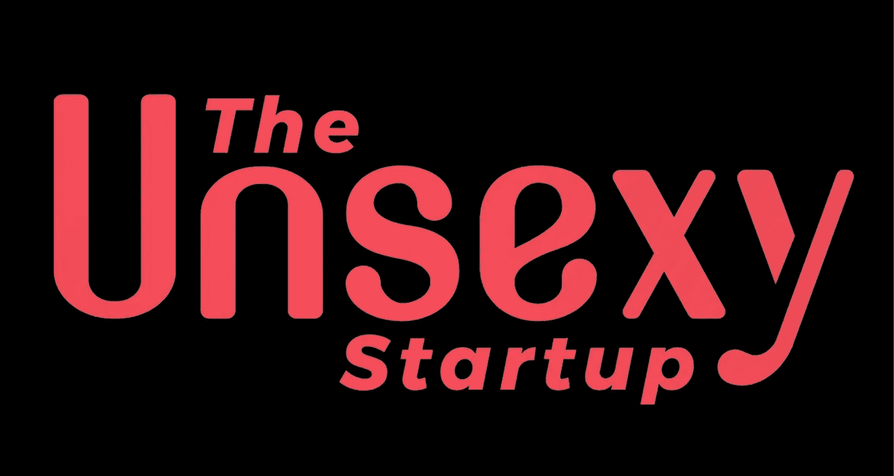

# 创始人播客，由创始人制作

> 原文：<https://medium.com/swlh/a-podcast-for-founders-by-founders-df5c73fc775a>

## 见见 Sumay Parikh，Quake 的负责人和 Unsexy 创业公司的联合创始人。

“我非常重视谷底，因为我在那里度过了很长时间，”Sumay Parikh 坦率地承认自己的职业生涯经历了许多起伏、艰辛和教训。

认识一下 Sumay Parikh，他是地震资本[的负责人](https://www.quakecapital.com/team/sumay-parikh)，也是一位连续创业者，他的最新创业项目 [*《不性感的创业公司*](https://www.theunsexystartup.com/) 》是一个独特的播客，揭示了创业者在刚刚起步时所面临的挑战的强度。该播客的目标受众包括早期创始人，他们正在从头开始建立一家企业——他们每天工作 18 小时，面临着将企业带入生活的独特而不可思议的挑战。为了达到这一时刻，帕里克亲自穿越了创业和风险投资的艰难世界，从在一个企业家家庭长大并创办了几家自己的企业，到最终在地震资本找到了自己，并成为今天不性感的初创公司的联合创始人。那么，考虑到帕里克的背景，他为什么想要分享勇气和韧性的经验是有道理的，而勇气和韧性是这家不性感的初创公司的标志性品质。为了理解 Parikh 推出这个播客的动机以及它对 seed 创始人的重要性，让我们来看看他复杂而有趣的旅程。

## 童年

帕里克第一次接触创业是在比大多数人更年轻的时候。那是 20 世纪 90 年代初，旅游和酒店行业蓬勃发展，Parikh 刚刚见证了他的父母辞去日常工作，在大西洋城外开设了他们的第一家酒店，他们最终发展到了 10 家酒店。他最早的记忆是在这家酒店的生活，当时他的家人搬进了一个小房间。他记得看着他的父母处理经营企业的每一个方面，并回忆说“我的童年是看着许多事情变得生动，看着许多事情以极快的速度发展。但我从无到有地看到了它，所以我很幸运不是出生在一个平台上，而是真正看到了它的成长。”

帕里克的父母也小心翼翼地向他们的孩子灌输努力工作和坚韧不拔的价值观。帕里克清楚地记得有一天早上 6 点被父母叫醒，然后开车去了他父亲在当地开的一家邓肯甜甜圈店。当时只有 10 岁的帕里克学会了如何扫地和操作收银机，以及其他一切事情。帕里克说，为自己想要的东西而努力的过程“培养了为之努力的技能，它教会我的最重要的东西是努力。我在很小的时候就学会了职业道德和忙碌。”

随着年龄的增长，他与学校建立了一种紧张的关系，发现自己完全脱离了班级和老师。有一次，帕里克回忆说，他坐在高中辅导员的办公室里，他的母亲坐在他旁边，辅导员看着他的母亲，直言不讳地说:“你的儿子永远不会取得成功。”恢复过来后，他很快就产生了一种紧迫感，要证明别人是错的，“当他们开始对我关上大门的时候”，这是他多年来一直保持的一种特质。

## 第一回合

然后，2008 年经济衰退来袭，帕里克的世界发生了巨大变化。他刚刚高中毕业，看到他的“父亲”失去了一切。“看到一切都在上升，然后在一瞬间[看到]一切都在下降”给帕里克留下了持久的印象，他形容“18 岁以后的生活就是一直看到很多火。”尽管面临着家族企业的挑战，或者正因为如此，帕里克进入大学后一直忙于学业(他现在在这方面做得很好)，同时每周工作 50 个小时。

帕里克大学一毕业，就去找他的父亲，告诉他计划搬到德克萨斯州，因为用帕里克的话说，他们家的很多酒店都在那里，因为他们的房产“一切都在失败”。尽管帕里克的意图很好，但他的父亲“非常反对”帕里克搬到奥斯汀的计划，“因为他认为我没有能力扭转局面”。所以大学毕业后的第二周，我收拾行李，买了张票，未经他允许就搬到了那里，他只说了一句祝我好运。我一个人也不认识，而且我从来没有去过得克萨斯州。”

帕里克的雄心，加上他多年参与家族企业所形成的职业道德，意味着他能够带来急需的变化。帕里克做了所有能想到的事情，从再融资和翻新到人力资源和管理董事会——所有这些都得到了回报。他能够大幅增加这些酒店的收入，并领导管理方面的重大变革，这有助于酒店取得长期成功，这一切都是因为帕里克“对运营了如指掌”。他回忆道，“从我童年到现在的一切都让我为那两年做好了准备。”

然后一切都变了。

帕里克回忆道:“两年后，我被那家公司扫地出门，我记得当时只是坐在沙发上思考:我现在该怎么办？”

## 第二轮

大约一个月后，帕里克开车去了圣安东尼奥，整理了一份商业计划和推介材料。此时，他已经注意到房地产市场中的一个“缺口”，某些酒店品牌没有成功迎合当地市场，这就是为什么他能够在圣安东尼奥之行期间说服两位成功的商人与他合作。在这个过程中，他被挤出了自己的舒适区，学会了如何与各种各样的人共事，从建筑师和工程师到市长和开发商。然后，“23 岁时，我筹集了 1000 万美元来建造万豪酒店，并意识到我有能力做到这一点。这可能是最能改变生活的事情——我和另外两个人一起启动了这个项目，这太疯狂了。在接下来的几年里，我建了一家凯悦酒店和一家希尔顿酒店，目前仍在建设中，总共筹集了 5000 万美元。”

然后，大约两年后，“我又一次被排挤了。”

## 纽约，纽约

在他人生的那个阶段，帕里克感到完全绝望，没有了一直指引他前进的雄心和目标感。他陷入了一段深度抑郁的时期，直到他的哥哥为他“理清头绪”，并在多次说服后，让帕里克搬到了纽约。即使多年后，帕里克仍然认为是他的哥哥帮助他改变了人生观，“如果不是我哥哥”，他就不会有今天。

这是 Parikh 人生中第二次发现自己来到了一个新的城市，并再次从头开始。他在纽约科技界没有熟人，因此他将多年的经验用于与人交谈和不懈地建立关系网，为企业家和创始人提供价值。很快，他发现自己在做小型咨询项目，在一家由 GV 支持的初创公司运营产品，并在科技界发展关键关系，这为他带来了下一件事，即 Vetty。

Vetty 是一个背景验证平台，利用区块链和深度学习机器人——“一个非常不性感的业务，”帕里克说，这是对他的播客的认可。他通过一个共同的朋友认识了这位联合创始人，并在意识到这个想法的潜力后决定与他共同创建公司，让帕里克成为那里的创始员工，两人在第一年后就将公司发展到了 90 万美元。就在最近，Vetty 成功筹集了 200 万美元，Parikh 继续密切参与董事会。

## 地震之都

Vetty 还加入了 Quake Capital 的第一批加速器公司(Quake 是在 6 个月前由我们的普通合伙人 Glenn、Adam、Brandon 和 Chad 创建的！)，这导致了一系列事件，让帕里克成为这里的第一任校长。在这一点上，帕里克是“全职经营 Vetty，全职建立某些地震基础设施，并在一旁建立*不性感的创业公司*”他很快就过渡到了 Quake 的全职角色，并更加专注于这个播客，这是 Parikh 旅程中的最新里程碑。此外，Parikh 继续与 seed 创始人密切合作，为 A 轮和 B 轮创业者提供产品开发和上市策略方面的建议。

## 不性感的创业

帕里克与世界上最大的人工智能聊天机器人 Go Moment 的创始人拉吉·辛格(Raj Singh)共同创立了*这家不性感的初创公司*(最近由谷歌出资)。对于任何刚刚起步或处于种子期的企业家来说，他们的播客是一个非常宝贵的资源，其中包含了对许多人经常回避讨论的挑战的诚实讨论——本播客旨在彻底消除长期以来关于创业的神话。它最近的一些客人包括 Modsy、Heartbeat 和 Greenhouse.io. *这个不性感的播客*已经完成了第一季，正在筹备第二季(他们将在下个月开始)，每月的听众已经达到 3000 到 4000 人。

帕里克白手起家建立了几家企业，还见证了他的父母创办自己的酒店，这种背景使他特别了解种子期创业者的挣扎，也使他特别倾向于帮助早期创业者建立适应能力。“没有脆弱的平台，也没有其他平台让(创始人)分享他们经历的痛苦，”他说。从*这家不性感的初创公司*中得出的教训对《雷神之锤》的投资组合公司来说尤其有意义，这些公司目前正在经历该节目嘉宾提供的需要克服的挑战。

在涉足科技领域一段时间后，帕里克对创始人有一条重要的建议。“这是一场马拉松，期待每一次胜利都会带来挑战，”在这里，就像在许多其他情况下一样，帕里克给别人的建议似乎最终也同样适用于他自己。“庆祝很好，但最好脚踏实地，因为我意识到，当你达到某个里程碑时，你会放松下来，把脚从踏板上拿开，停止工作，然后事情开始分崩离析。不管你赢了还是输了，你都必须继续努力。”

感谢阅读！在 Medium ( [Quake Capital](https://medium.com/u/4cf2616dc412?source=post_page-----df5c73fc775a--------------------------------) )上关注我们，查看我们关于种子期融资、创业失败的十大原因以及创业创始人刻板印象的热门文章！

*   [可转换票据如何运作](/quakecap/how-convertible-notes-work-54a7b297cc1f)
*   [创业失败的十大原因](/p/ab3196d70568?source=user_profile---------3-------------------)
*   [创业创始人刻板印象](/swlh/the-startup-founder-stereotype-9c03cd6ce48e)

*作者 Anjali Agarwal，雷神之锤资本的初级合伙人*

## 这篇文章发表在 [The Startup](https://medium.com/swlh) 上，这是 Medium 最大的创业刊物，拥有 343，876+人关注。

## 在此订阅接收[我们的头条新闻](http://growthsupply.com/the-startup-newsletter/)。

