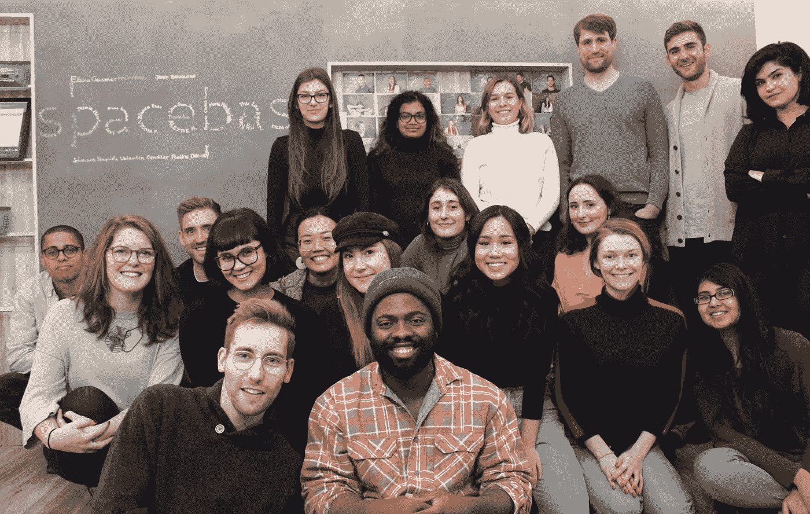

# 2019 年数字游牧的实用替代方案

> 原文：<https://medium.com/swlh/a-practical-alternative-to-digital-nomadism-in-2019-103eb094a1c8>

## 又一年即将结束，而你仍然没有投入到数字游牧生活中。

[Source](https://www.urbanlinker.com/webzine/are-%22digital-nomads%22-the-future-of-work-88)

柏林——对于数字游牧来说，“找工作就是全职工作”这句话再正确不过了。有抱负的数字游牧者不仅经常需要平衡几份工作，还需要健康保险、签证、住房、税收、银行、货币、航班，然后是更多的工作。最初的过程可能会令人生畏，但回报肯定是值得努力的。

大多数关于数字游牧的文章都有两种结构:第一种是“如何做”的文章，这些文章提供了足够具体的建议，既有帮助，又足够普遍，适用于任何国家；第二种是轶事文章，描绘了一种完美的工作生活平衡的理想化生活方式，以及最佳的身体、精神和情感健康。

[Source](https://blog.hubspot.com/marketing/digital-nomad)

这两种类型的文章携手创造了一种自由轻松的生活方式，这种生活方式对那些在公司办公室工作的人来说是鼓舞人心的，对那些认真考虑去偏远地区的人来说是令人沮丧的。搬到加拿大时，我不会向住在法国的朋友寻求帮助。她最初的建议可能是有帮助的，但最终，她不知道加拿大具体情况的来龙去脉。真相在细节中，这两种类型的文章对你都不诚实。

[最近的一项研究](https://open.buffer.com/state-remote-work-2018/)预测，到 2020 年，50%的劳动力将在远程工作，在同一份 2018 年的报告中，78%的远程员工目前在家工作。一直以来，对于远程工作者来说，最大的职业挑战就是与他们的团队进行有效的私下沟通？孤独。

如果远程工作人员在自己的社区和家中感到孤独，想象一下在国外时文化和语言障碍可能产生的潜在孤立。[最近的一篇文章](/swlh/why-people-fail-in-the-digital-nomad-lifestyle-abef959d4dc9)很好地强调了数字游牧的潜在陷阱，首先概述了社会挣扎的状况——抑郁、焦虑、失眠——以及游牧生活方式如何“加剧现有的挑战”不断的变化和后勤需求使数字游牧民的生活既令人兴奋又令人畏惧，加上数字游牧民过着孤独的生活，这些挑战成倍增加。

## 创业是一个很好的妥协

数字游牧提供的旅行和无拘无束的生活方式也可以在创业场景中找到。创业公司是数字游牧生活的绝佳替代品，因为它们通常提供一种介于传统行业工作和远程工作之间的生活方式。此外，初创公司提供了解决数字游牧中出现的许多问题的空间，从在国外立足的最初步骤到成为一名经验丰富的外籍人士。

**1。** **协助法律物流。**可以说，移居海外最令人生畏的任务是物流和外国官僚主义。创业公司在国际上更友好，因为他们经常瞄准国际市场。总部位于巴黎的 startup Station F Roxanne Varza [的主管 F Roxanne Varza](/station-f/the-incredible-truth-about-international-startups-at-station-f-c113e5bf02be)认为【当今成功的初创公司从定义上来说都是国际化的】并强调了专门为初创企业家和员工提供的新机会，如[法国技术签证](https://visa.lafrenchtech.com/)，这为国际流动开辟了新的途径。

法律援助也是至关重要的，因为你的签证会影响你在一个国家能呆多久，你能工作多少小时，你的健康保险以及你如何纳税。由于创业团队通常都是国际性的，你遇到的许多问题都可以由一位外籍同事来回答。另一方面，如果你需要找一个好医生，打电话给一个机构或找一个电话计划，你身边的当地人是一个信息的财富。

**2。** **融入当地社会。**除了法律问题，创业公司提供了一个促进融入你所在社区的工作家庭。当你与那些同情你的处境或提供新朋友网络的人一起工作时，常常伴随着数字游牧生活的孤独、文化冲击和思乡之情就不太可能出现了。

A [Berlin Startup](https://www.spacebase.com/en/) that is home to an international cohort from six continents.

**3。** **促成真正的跨文化体验。**类似地，创业团队促进了数字游牧者的一个关键动机——分享和比较文化、食物、生活经历和语言。此外，学习如何与来自不同背景和工作文化的人一起工作和沟通是学习如何管理自己的工作生活平衡和沟通技巧的好方法。

**4。** **为未来的机会建立关系网。**初创公司的合作方式和拓展也经常为未来的合作和自由职业机会奠定基础。此外，由于初创公司的人员流动率通常比老牌公司要快，因此抓住新机会的能力在初创公司群体中被更广泛地接受。

最终，初创公司不仅为国际旅行提供了更实用的途径，还提供了更丰富的海外体验。数字游牧可能是梦想，但创业公司实际上可以实现它。

## 这篇文章发表在[《创业](https://medium.com/swlh)》上，这是 Medium 最大的创业刊物，有+400，714 人关注。

## 在这里订阅接收[我们的头条新闻](http://growthsupply.com/the-startup-newsletter/)。

