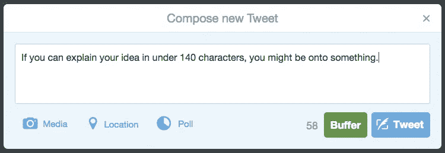

# 检验一个想法的快速方法

> 原文：<https://medium.com/swlh/a-quick-way-to-test-out-an-idea-fd01ac10f4d>

## 就像写推文一样简单。

我们都有想法。大多数时候，我们认为这些想法棒极了。但是剧透一下:很多想法实际上都很烂。

通常，向朋友或同事征求意见是检验想法是否站得住脚的好方法。例子:我喜欢头脑风暴创业想法，但只有在和我非常理性的兄弟讨论之后，我才意识到这些想法是多么糟糕和有缺陷。(还好我从未坐过鲨鱼池。)

但是，如果你独自坐在咖啡店里，想要一种快速、非正式的方式来对你的想法进行压力测试，该怎么办呢？

# 给某人写信。

我发现，在一条假设的推文、电子邮件或短信中写下你的想法(你不必*实际上*发送这些信息)可以做几件事:

1.  **它将你大脑中的想法**转化为电子纸**。**
2.  它迫使你在相对较小的数字空间内简洁地解释你的想法。
3.  这也迫使你用一种读者可能理解的清晰方式来解释你的想法。通常一个想法在我们头脑中看起来很简单，但只有在为假设的读者分解之后，我们才意识到它有多复杂。
4.  这让你不禁会问自己，“我发送这封邮件的人会真正关心他们读到的这个想法吗？”尽管这封邮件永远不会被发送出去，我还是会把一个朋友的电子邮件地址放在“收件人:”框中，以此提醒自己，确保这个想法是这个人会在乎的。

这真的适用于任何事情:一个故事的想法，一个中型职位，提出一个单身周末的计划，一个潜在的商业想法，等等。

例如，作为一个[产品搜索](http://producthunt.com)的粉丝，我喜欢这个网站将产品描述保持在一行简洁的文字中。你在那里得到了这个想法的要点，并且一旦你点击了这个项目，很明显可以找到更详细的信息。

不要说你的想法*必须*像一行程序一样简短，但是它确实支持“保持简单，笨蛋”的论点

via ProductHunt.

# 现在开始思考！

希望在测试你的想法在现实中是否和你想象中一样棒时，你会发现这个技巧很有帮助。快乐构思！

## *嗨中等！如果你喜欢你读到的，点击下面的* ***【心灵】按钮*** *和/或* ***分享这篇文章*** *。在 Medium 上关注我，或者在 Twitter 上关注我。*