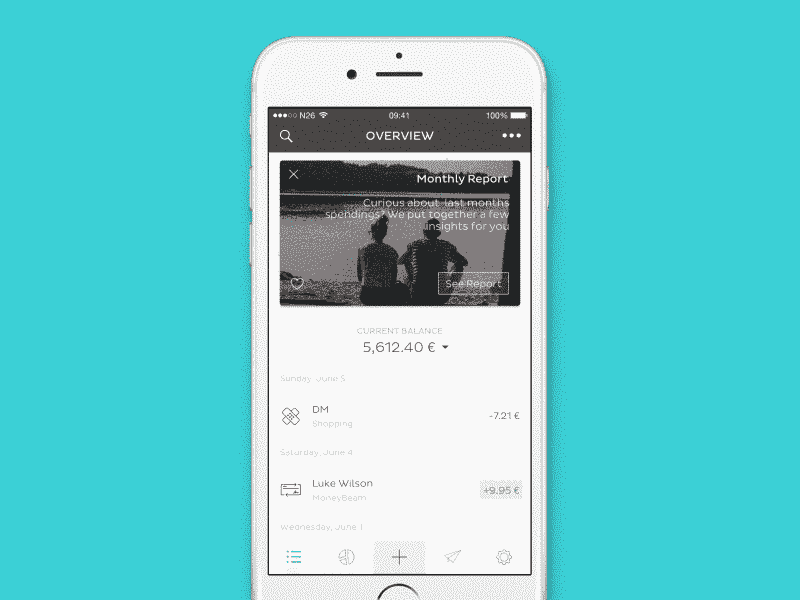
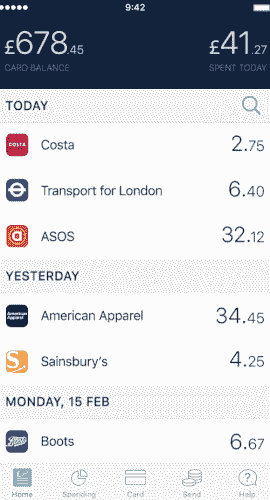

# 2017 年支付行业回顾

> 原文：<https://medium.com/swlh/a-retrospective-look-at-the-payments-industry-in-2017-7a1bb7e5dc70>

支付行业又经历了令人惊奇的一年，如此令人惊奇，以至于概括每件事可能会提供足够写一本书的内容。这就是为什么我决定打破一些最大的趋势，球员，收购和合并，给你一个 2017 年的回顾。

## **新银行正在挑战现状**

我首先想到的是，2017 年是“新银行”的决定性突破。 [Revolut](https://www.revolut.com/) 、 [N26](https://next.n26.com) 甚至 [Monzo](https://monzo.com/) 都经历了惊人的一年，我看到越来越多的挑战者银行崛起，真正颠覆了支付领域。

[Revolut](https://www.revolut.com/) 是一家成立于 2013 年的英国初创公司，今年已经实现了许多里程碑，并有望真正彻底变革信用卡发行业务。他们推出了一长串新功能和服务，包括:账单分割、往来账户、聊天机器人、信用卡、商业账户和手机保险。但他们也能够申请银行牌照，从风投和用户那里筹集资金，并达到 100 万客户的里程碑。

紧随其后的是德国的初创公司 [N26](https://next.n26.com/en-eu/) ，它不那么耀眼，但也能在欧洲产生重大影响。去年年底，他们在 6 个新国家推出了新功能，并通过专注于与其他金融科技公司的合作来增加功能。他们现在提供的产品包括 [Maestro](http://www.mastercard.com/sea/consumer/maestro.html) 的非接触式卡、 [Transferwise](https://transferwise.com) 的国际转账、 [Vaamo](https://www.vaamo.de/) 的投资、[安联](https://n26.com/black/)的保险、 [Raisin](https://www.raisin.com/) 的储蓄和 [Auxmoney](https://www.auxmoney.com/) 和[you United](https://n26.com/credit-france/)的信用。通过每天增加约 1000 名用户，他们的客户从 3 月份的 30 万增加到 8 月份的 50 万，他们将于 2018 年在英国和 2018 年年中在美国推出，这只会进一步推动他们的增长。

N26 App

规模较小但同样有趣的是 Monzo，这是一家主要集中在英国的挑战者银行，它已经筹集了超过 7000 万€，与包括 Revolut 和 T21 在内的老牌和其他挑战者银行竞争。我预计 2018 年将是 [Monzo](https://monzo.com/) 的突破之年，但随着 [Revolut](https://www.revolut.com/) 和 [N26](https://next.n26.com/en-eu/) 的快速增长，这将是一个挑战。

Monzo App

## Vantiv 和 Ingenico 收购了竞争对手

2017 年也是有影响力的收购和整合之年。最引人注目的两个是 [**Vantiv**](https://www.vantiv.com/) 和 [**JP 摩根**](https://www.jpmorgan.com/country/NL/en/jpmorgan) 收购 [**Worldpay**](http://www.worldpay.com/) 和 [**Ingenico**](https://www.ingenico.com/) 收购 [**Bambora**](https://www.bambora.com/en/en/) 。

在 2015 年不太引人注目的首次公开募股之后，日处理交易量超过 3100 万笔的世界支付(Worldpay)仍然面临着 PayPal、Stripe 和 Square 的激烈竞争。在处理了对其服务的恶意黑客攻击后， [Worldpay](http://www.worldpay.com/) 拼命试图通过专注于智能手机支付和虚拟现实支付等创新来寻找新的竞争方式。被 [Vantiv](https://www.vantiv.com/) 和 [JPMorgan](https://www.jpmorgan.com/country/NL/en/jpmorgan) 收购后， [Worldpay](http://www.worldpay.com/) 会有什么变化，拭目以待。[摩根大通](https://www.jpmorgan.com/country/NL/en/jpmorgan)一直专注于成为一家收单银行，而不是能够帮助他们脱颖而出的支付服务，而 Vantiv 正在寻求 [Worldpay](http://www.worldpay.com/) 帮助他们扩大全球覆盖范围。

另一项引起我们注意的收购是 [Ingenico](https://www.ingenico.com/) 收购 [Bambora](https://www.bambora.com/en/en/) 。 [Ingenico](https://www.ingenico.com/) 最初专注于向银行和收购者出售终端，在过去十年里，他们已经转变了业务模式，更多地成为支付服务提供商。通过收购 [Bambora](https://www.bambora.com/en/en/) ，Ingenico 收购了一家在北欧市场拥有强大影响力的公司，并将很有可能成为全渠道领域进一步全球扩张的模板。

## 对技术颠覆者的投资增加

与许多消息来源希望你相信的不同，对金融科技的投资仍在发生。我们认为最有趣的四个是:Visa 领投了 Marqeta 的投资回合，Dimebox 获得了 BillPro 的战略投资。

支付处理技术开发商和提供商 Marqeta 在新一轮融资中筹集了 2500 万美元，用于资助美国和海外支付的扩张和民主化。专注于开发技术，使 [Affirm](https://www.affirm.com/) 、 [Square](https://squareup.com/) 、 [Kabbage](https://www.kabbage.com/) 、 [Instacart](https://www.instacart.com/) 和 [Doordash](https://www.doordash.com/) 等公司能够发行和管理“即时”支付以及虚拟卡号，以促进在线供应商销售点的支付。一个有趣的举动是，Visa 决定领导这轮投资，随着对 [Chain](https://chain.com/) 、 [DocuSign](https://www.docusign.com/) 、 [Klarna](https://www.klarna.com/) 、 [Square](https://squareup.com/) 和 [Stripe](https://stripe.com/) 的投资，Marqeta 的未来看起来一片光明。

另一个推动支付处理技术民主化的人是 Dimebox，他为€筹集了 500 万英镑来发展卡收单处理能力。尽管一些 PSP 已经转型成为全栈收购者，但 80%的市场仍由不太知名的银行和收购者拥有，他们大多依赖过时的技术。为了解决技术问题， [Dimebox](https://dimebox.com/) 为这些银行和收单机构提供了白标全栈收单解决方案，该解决方案采用了最新的技术和数据分析功能。

最后， [**iZettle**](https://www.izettle.com/) 这家总部位于斯德哥尔摩的商务平台，在€8.06 亿/9.5 亿美元的估值基础上，又筹集了 4000 万€，其中大部分增长来自竞争激烈的英国市场，他们希望通过扩大发票和现金预付款来进一步增长。尽管 [iZettle 的](https://www.izettle.com/)主要竞争对手 Square 仍专注于美国和英国市场，但 [iZettle](https://www.izettle.com/) 已经在整个欧洲扩张，并希望继续增长。

## 2017 年很棒，但这只是未来的开始

当然，支付行业在 2017 年发生了很多事情，这使得成为其中的一部分变得非常有趣和令人兴奋。随着新技术和新参与者的出现，整合将继续，投资将达到新的高度，我将跟踪他们，并在他们发生时提供见解和反馈。

## 感谢阅读；)，如果你喜欢它，请点击下面的掌声按钮，这对我意义重大，也有助于其他人了解这个故事。

## 这篇文章发表在 [The Startup](https://medium.com/swlh) 上，这是 Medium 最大的创业刊物，拥有 277，994+读者。

## 在这里订阅接收[我们的头条新闻](http://growthsupply.com/the-startup-newsletter/)。

