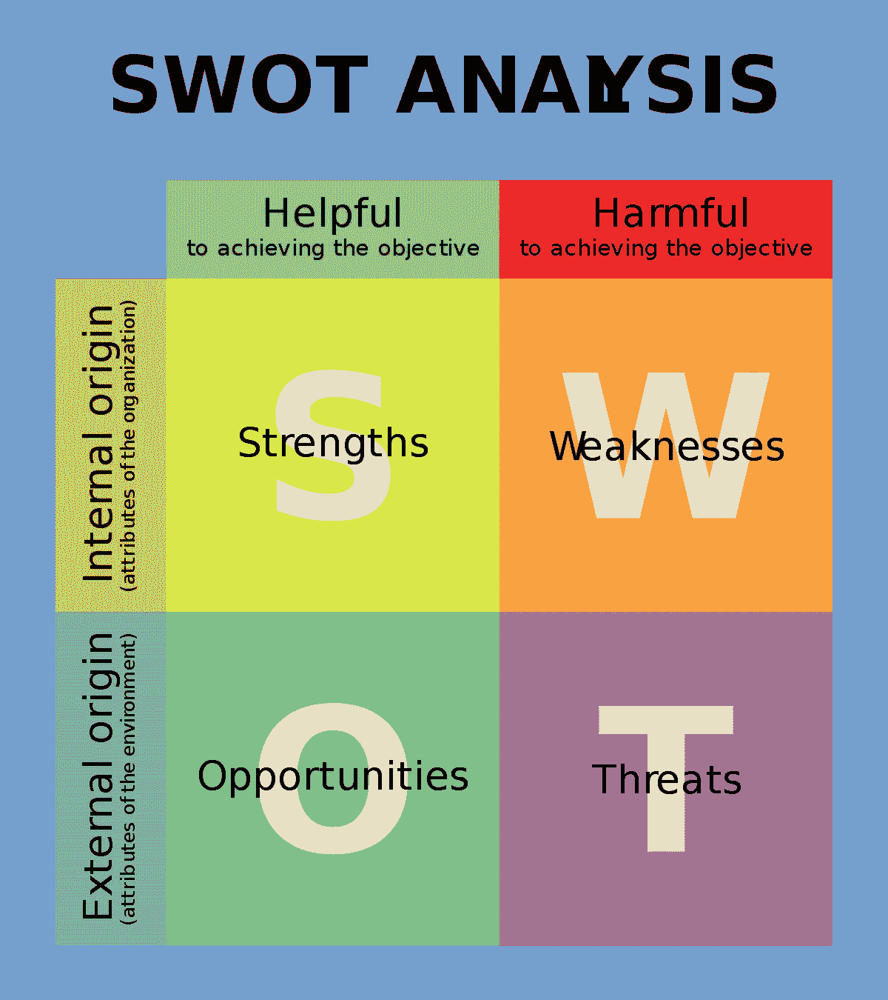

# 通过漏洞挽救失败创业的路线图

> 原文：<https://medium.com/swlh/a-roadmap-for-saving-a-failing-startup-through-vulnerability-69cbf3aff132>

以正确的方式，真实地集结部队并保持每个人的积极性。

Source: [Pexels](https://www.pexels.com/photo/woman-standing-in-front-of-sitting-people-1157859/)

"真相会让你自由"

当客户面临高风险的决定时，我会对他们说这些话——对员工诚实还是粉饰事实——因为他们决定在传达困难消息时要有多透明。

对于一家初创公司来说，这是迫在眉睫的裁员威胁。

另一个原因是，他们的跑道正在耗尽，所以有可能被收购。

还有一个原因是关于解散公司的谈判，因为创始人之间争吵不休。

在商业中，就像在生活中一样，人们不认为脆弱是可以公开分享的。很弱。会让你被操纵。或者，更糟的是，有人用它来对付你。

这与事实相去甚远。

# 脆弱的力量

杰夫·波尔泽是哈佛大学的组织行为学教授，他研究了脆弱性对群体社会交流的影响:

> “人们倾向于以一种感性的方式看待脆弱，但事实并非如此。这是一个非常明确的信号，表明你有弱点，你可以寻求帮助。如果这种行为成为其他人的榜样，那么你就可以把不安全感放在一边，开始工作，开始互相信任，互相帮助。另一方面，如果你从未有过那种脆弱的时刻，那么人们会试图掩盖自己的弱点，每一个微小的任务都会成为不安全感的体现。”

脆弱性创造了一个高度信任、高目标的环境，在这个环境中，每个人都可以放下伪装，变得真实，并开始一起解决手头的问题。

但是为了做到这一点，消息的接收者也需要是开放的:

> “第二个人是关键，”波尔泽说。“他们是捡起来暴露自己的弱点，还是掩饰并假装自己没有弱点？结果会有很大的不同。”

初创企业的领导者将这种行为作为他人的榜样。

员工将开始公开他们自己的恐惧，这将在团结团队和确保每个人在前进的道路上保持一致方面产生巨大的影响。

# 拥抱脆弱

> *“脆弱听起来像真理，感觉起来像勇气。真理和勇气并不总是令人舒服的，但它们从来都不是弱点。”—布伦·布朗*

让团队走到一起是从高层开始的。为了让这一策略奏效，创始人需要接受脆弱性。

我最近合作的一家初创公司担心裁员，但他们不想告诉员工，因为害怕很多人会在最需要他们的时候离开。

"如果我们没有任何员工，我们怎么能指望生存下去呢？"当我们开始研究他们的战略时，我问首席执行官。

对此，我回答道:“站在他们的角度想想，如果你的雇主将要解雇一群人，你难道不想知道吗？

四人创始人团队都同意他们会。

在让他们感到害怕的同时，这也成为了创始人团队的一个重大转折点。通过拥抱脆弱性，他们全力以赴，并决定将这种情况作为一个学习机会，在经历了路上的挫折后，现在让他们感觉与团队中的每个人更亲近。

"这就像我们一起穿过风暴眼，毫发无伤地从另一端出来，变得更强，更紧密地团结在一起，"这位首席执行官说。

他是对的。这就是脆弱性对创造强大团队凝聚力的强大影响，尤其是在经历了激烈的事情之后。

如果你的初创公司正在经历一些困难，请遵循以下步骤，确保你将适当的漏洞数量与你想要传达的整体信息相匹配:

# 第一步。做一个特殊情况分析

简单地说:你的员工不傻。

即使一个问题没有被公开承认，他们也能感觉到。

在开始时做一个 S.W.OT .分析可以让你清楚地了解信息中对你有利的方面，同时指出可能使事情变得更糟的问题。问自己以下问题:

*   你的员工可能有哪些信息缺口？
*   交流困难主题的目的是什么？
*   公司的正式职位是什么？
*   你需要分享的最迫切的信息是什么？

这些问题将会框定你要写出来的信息。

# 第二步。写出信息(并练习背诵)

先回答大家脑子里的问题:我们的创业公司是不是注定要失败？

以事实公开透明，坦率地分享这件事对作为创始人的你个人产生了怎样的影响，以及有什么期望。

根据你的员工需要什么信息来组织信息，以便专注于他们的工作。弄清楚什么是合适的，并制定一个传达信息的策略。

对于担心裁员的初创公司，他们决定使用“倾听之旅”的主题来传达信息。

他们给公司的每个人都发了电子邮件，说创始人想要分享一些棘手的消息，他们将开始一次“倾听之旅”，以获得每个人的反馈，了解这些消息对他们个人和集体的影响。

# 第三步。利用市政厅、1:1 和调查来建立信任

要让这个策略奏效，你的员工需要信任你。如果他们对将要发生的事情感到紧张或焦虑，你需要公开地、战略性地谈论这件事。

通过市政厅或其他大型团体的形式向公司传达信息，这样每个人都能同时获得相同的信息。为你的员工提供向你反馈他们所关心的问题的机会，并花足够的时间来做这件事。

然后，通过秘密调查和/或与直接经理的分离反馈会议提供跟进机会，给员工更多私人空间来分享他们的担忧。

# 第四步。通过明确、持续的努力，利用意识和希望

最重要的是，你需要为后续步骤和行动提供路线图。

这家初创公司的首席执行官担心裁员，他说:“即使我们失败了，我们也需要提供清晰的指引，告诉我们如何实现目标。”。

如果这艘船要沉了，每个人都会拼命地沉下去。当你通过脆弱的分享创造一个机会时，这种心态就会出现。

他们的行动计划包括如何扩展预算，是否以及何时裁员，以及如何选择裁员。

透明度确保了每个人都有保持积极性所需的信息。而且成功了！

团队凝聚力起作用了。人们开始投入更长的时间，努力确保初创公司存活下来。对于这家初创公司，最后一分钟的投资者挽救了局面。

包括创始人团队在内的每个人都认为，重新燃起的希望和高目标的团队氛围挽救了他们的初创企业，使其走过了这条艰难的道路。

**底线:**在拯救初创公司的战斗中，漏洞可能是你最好的武器。但这一切都始于高层领导。他们需要走出自己的方式，承认一些残酷的事实，并相应地与员工沟通。相信我，你的创业公司会感谢你的。

## 这个故事发表在[的创业](https://medium.com/swlh)上，这是 Medium 最大的创业刊物，有 338，320 多人关注。

## 订阅接收[我们的头条新闻](http://growthsupply.com/the-startup-newsletter/)。

